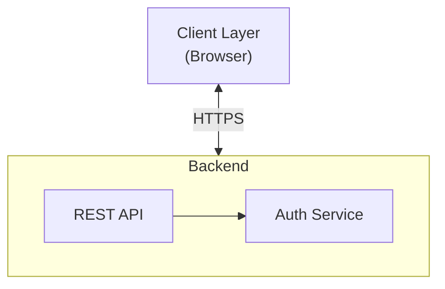
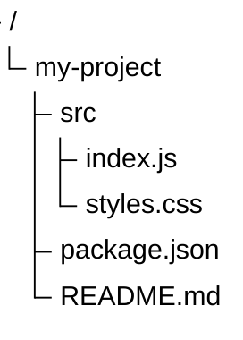
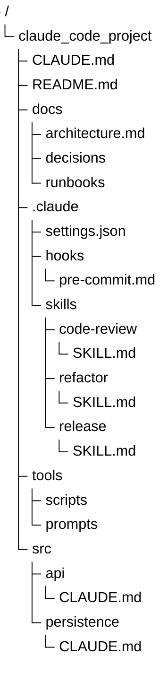
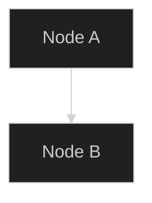

# Mermaid.js Diagram Skill

Create and maintain Mermaid diagrams for The Golden Forest digital garden. This skill covers diagram syntax, TreeView file trees, and the nature-themed window styling applied to all mermaid diagrams in this project.

## When to Use This Skill

- Writing a new `mermaid` code block in any MDX article
- Editing or refactoring an existing diagram
- Converting a `bash` file tree to a Mermaid TreeView diagram
- Styling mermaid diagrams to match the project's nature theme

## Diagram Types Reference

| Type | Keyword | Use Case |
|------|---------|----------|
| Flowchart | `flowchart TB` / `flowchart LR` | Architecture, workflows, decision trees |
| Sequence | `sequenceDiagram` | API interactions, auth flows |
| Class | `classDiagram` | OOP structures, data models |
| State | `stateDiagram-v2` | Lifecycle, status machines |
| Gantt | `gantt` | Timelines, project plans |
| Pie | `pie` | Data distribution |
| Mindmap | `mindmap` | Brainstorming, knowledge maps |
| GitGraph | `gitGraph` | Branching strategies |
| TreeView | `treeView-beta` | File trees, directory structures |
| Architecture | `architecture-beta` | System architecture diagrams |

### Standard Flowchart Pattern

````md

````

## TreeView (Deep Dive)

TreeView renders hierarchical directory structures with file/folder icons. The diagram keyword is **`treeView-beta`** (beta status in Mermaid v11.16.0).

### Basic Syntax

Indentation-based. Trailing `/` on a label marks it as a **directory** (rendered in bold).

````md

````

### Box-Drawing Syntax

Alternative using `├──`, `└──`, `│` characters. Auto-detected by the parser:

````md

````

Both standard (`├──`, `└──`, `│`) and heavy (`┣━━`, `┗━━`, `┃`) Unicode variants are supported.

### Icons

#### Built-in Icons

TreeView ships with exactly **two** built-in icons under the prefix `mermaid-treeview`:

| Icon | Name | Description |
|------|------|-------------|
| 📁 | `folder` | Default for directories (trailing `/`) |
| 📄 | `file` | Default for files |

Icons are **hidden by default**. Enable them with:

````md
%%{ init: { "showIcons": true } }%%
````

Or via YAML front matter (see below).

#### Per-Node Icon Override

Set an explicit icon on any node with `icon(name)`:

````md

````

- `icon(folder)` — use the built-in folder icon
- `icon(file)` — use the built-in file icon
- `icon(none)` — hide the icon for this node

When `defaultIconPack` is set, unprefixed names resolve in that pack. Otherwise, only the built-in `folder`/`file` icons work without a prefix.

#### Custom File-Type Icons (Advanced)

Custom icons (e.g., `.md` → markdown icon, `.js` → JavaScript icon) require an **external Iconify pack** registered via `mermaid.registerIconPacks()`. This is a runtime API — not available through config alone. In this project, only the built-in `folder`/`file` icons are available without a component override.

### Inline Descriptions

Add a visible description after `##`, rendered in italic next to the label:

````md

````

### Highlighting with `:::className`

Annotate nodes with CSS classes:

````md

````

A built-in `highlight` class is provided (yellow background).

### YAML Front Mermaid Config

Mermaid supports YAML front matter in code blocks for per-diagram configuration:

````md

````

The `config` object is merged into mermaid's runtime configuration for that diagram only.

### TreeView Config Variables

| Property | Type | Default | Description |
|----------|------|---------|-------------|
| `showIcons` | boolean | `false` | Show built-in file/folder icons |
| `rowIndent` | number | `10` | Indentation per depth level (px) |
| `paddingX` | number | `5` | Horizontal padding (px) |
| `paddingY` | number | `5` | Vertical padding (px) |
| `lineThickness` | number | `1` | Connector line thickness |
| `defaultIconPack` | string | `""` | Iconify pack for unprefixed icon names |
| `filenameIcons` | object | `{}` | Filename → icon map |
| `extensionIcons` | object | `{}` | Extension → icon map |

### TreeView Example: Claude Code Project Structure

````md

````

## Window Styling

A nature-themed "window" container can be applied to specific mermaid diagrams, matching the code block style from `codeblock.css`. The CSS class is `.terminal-window` — wrap the mermaid block in a div to activate:

```mdx
<div className="terminal-window">


</div>
```

### CSS (in `custom.css`)

```css
/* ============================================
   Mermaid Window Styling — Nature Theme
   Scoped to .terminal-window class only
   ============================================ */
.terminal-window {
  border-radius: 28px 12px 35px 15px;
  overflow: hidden;
  margin: 1.5rem 0;
  position: relative;
  padding: calc(32px + 0.25rem) 1rem 1rem 1rem;
  background-color: #2b2b2b;
  border: 2px solid var(--ifm-color-primary-darkest);
}

/* Header/Wood Plaque Bar */
.terminal-window::before {
  content: '';
  position: absolute;
  top: 0;
  left: 0;
  right: 0;
  height: 28px;
  background: linear-gradient(to bottom, var(--ifm-color-primary-darker), var(--ifm-color-primary-darkest));
  display: block;
  z-index: 1;
  border-bottom: 2px solid var(--ifm-color-primary-darker);
}

/* Leaf Controls (Trio of Wide Leaf SVGs) */
.terminal-window::after {
  content: '';
  position: absolute;
  top: 4px;
  left: 14px;
  width: 85px;
  height: 20px;
  z-index: 2;
  background-repeat: no-repeat;
  background-image:
    url("data:image/svg+xml,%3Csvg xmlns='http://www.w3.org/2000/svg' viewBox='0 0 24 24'%3E%3Cpath fill='%23d32f2f' d='M21,11C21,11 15,7 12,2C9,7 3,11 3,11C3,11 5,16 12,22C19,16 21,11 21,11Z'/%3E%3C/svg%3E"),
    url("data:image/svg+xml,%3Csvg xmlns='http://www.w3.org/2000/svg' viewBox='0 0 24 24'%3E%3Cpath fill='%23e99700' d='M21,11C21,11 15,7 12,2C9,7 3,11 3,11C3,11 5,16 12,22C19,16 21,11 21,11Z'/%3E%3C/svg%3E"),
    url("data:image/svg+xml,%3Csvg xmlns='http://www.w3.org/2000/svg' viewBox='0 0 24 24'%3E%3Cpath fill='%23388e3c' d='M21,11C21,11 15,7 12,2C9,7 3,11 3,11C3,11 5,16 12,22C19,16 21,11 21,11Z'/%3E%3C/svg%3E");
  background-size: 18px 18px, 18px 18px, 18px 18px;
  background-position: 0px 0px, 20px 0px, 40px 0px;
}

/* Light Mode Overrides */
html[data-theme='light'] .terminal-window {
  background-color: var(--ifm-card-background-color);
}

html[data-theme='light'] .terminal-window::before {
  background: linear-gradient(to bottom, var(--HB_Color_HeaderUnderline), var(--HB_Color_HeaderText));
  border-bottom-color: var(--HB_Color_HorizontalRule);
}

/* SVG Responsive */
.terminal-window .docusaurus-mermaid-container > svg {
  max-width: 100%;
  height: auto;
}
```

## YAML Front Matter Reference

Mermaid diagrams support a `---` YAML config block at the start of the code block. The `config` key merges into mermaid's runtime config for that diagram:

````

````

Supported top-level keys: `title`, `displayMode`, `config`.

## Execution Steps

When this skill is invoked:

1. **Identify diagram type** — determine if the task is a new diagram, edit, or TreeView conversion.
2. **Check existing patterns** — look at neighboring files for diagram conventions already in use.
3. **Write the diagram** — use the correct keyword (`flowchart TB`, `treeView-beta`, etc.) and follow the syntax patterns above.
4. **Apply window styling** — verify `custom.css` contains the `.terminal-window` styles. If not, add them.
5. **Verify** — run `make check` for MDX syntax. For visual verification, suggest `yarn start` and navigating to the page.

## References

- [Mermaid Official Docs](https://mermaid.js.org/) — Full syntax reference.
- [Mermaid TreeView Docs](https://mermaid.js.org/syntax/treeView.html) — TreeView-specific syntax and config.
- [Mermaid Live Editor](https://mermaid.live) — Test diagrams before committing.
- [Iconify Icon Sets](https://icon-sets.iconify.design/) — Browse available icon packs for custom file-type icons.
- [codeblock.css](src/css/codeblock.css) — Nature-themed code block styling that the mermaid window matches.
