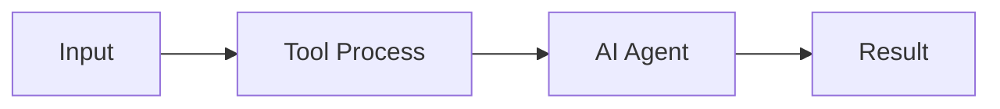

{/*
  IMPORT CHECKLIST — uncomment ONLY the imports for components actually used in the article body.
  Leaving unused imports active will cause MDX compilation errors.
  Each section below is annotated with which import it requires.
*/}
{/* import Tabs from '@theme/Tabs'; */}          {/* Required by: <Tabs>, <TabItem> */}
{/* import TabItem from '@theme/TabItem'; */}      {/* Required by: <TabItem> inside <Tabs> */}
{/* import Card from '@site/src/components/Card/Card'; */}              {/* Required by: <Card> */}
{/* import CardGroup from '@site/src/components/Card/CardGroup'; */}    {/* Required by: <CardGroup> */}
{/* import Accordion from '@site/src/components/Accordion/Accordion'; */}          {/* Required by: <Accordion> */}
{/* import AccordionGroup from '@site/src/components/Accordion/AccordionGroup'; */}{/* Required by: <AccordionGroup> */}
{/* import Steps from '@site/src/components/Steps/Steps'; */}           {/* Required by: <Steps>, <Step> */}
{/* import CodeGroup from '@site/src/components/CodeGroup/CodeGroup'; */}{/* Required by: <CodeGroup> */}

# [AI Tool Name]: [Subtitle]

[Provide a 1-2 paragraph summary of the AI tool and how it enhances the AI development workflow.]

## Core Advantages & Efficiency

[Explain the primary benefit, e.g., context window reduction, improved reasoning, or cost savings.]

:::info
[Highlight a key metric, e.g., 'Reduces token consumption by up to 90%'.]
:::

- **Feature A**: [Description]
- **Feature B**: [Description]

## Advanced Capabilities (Optional)

{/* Requires: Card, CardGroup imports */}
<CardGroup cols={2}>
  <Card title="Feature X" icon="mdi:rocket" href="#existing-section-id">
    [Short description of a powerful feature]
  </Card>
  <Card title="Feature Y" icon="mdi:connection" href="#another-existing-section-id">
    [Short description of another feature]
  </Card>
</CardGroup>

## Architecture & Workflow (Optional)



## Integration with AI Agents (Optional)

[Describe how to use this tool with Claude Code, Cursor, or other agents.]

{/* Requires: Tabs, TabItem imports */}
<Tabs groupId="agent-integration">
  <TabItem value="claude" label="Claude Code" default>
    ```bash
    [tool-command] init --claude
    ```
  </TabItem>
  <TabItem value="cursor" label="Cursor">
    [Instructions for adding as a .cursorrules or MCP tool]
  </TabItem>
</Tabs>

## Comparison & Benchmarks (Optional)

[Show how it compares to standard alternatives.]

{/* Requires: Tabs, TabItem imports */}
<Tabs groupId="comparison">
  <TabItem value="standard" label="Standard (JSON/YAML)">
    ```json
    {
      "verbose": "noise"
    }
    ```
  </TabItem>
  <TabItem value="tool" label="With [Tool Name]" default>
    ```toon
    v: noise
    ```
  </TabItem>
</Tabs>

## Setup & Configuration (Optional)

{/* Requires: Accordion, AccordionGroup imports */}
<AccordionGroup>
  <Accordion title="Install" icon="download">
    ```bash
    npm install -g [tool-name]
    ```
  </Accordion>
  <Accordion title="Configure" icon="settings">
    [Instructions]
  </Accordion>
</AccordionGroup>

## Step-by-Step Usage (Optional)

{/* Requires: Steps import */}
<Steps>
  <Step title="Initialize">
    [Description]
    ```bash
    [tool-name] init
    ```
  </Step>
  <Step title="Execute">
    [Description]
    ```bash
    [tool-name] run
    ```
  </Step>
</Steps>

## References
- [Official Documentation](https://example.com)
- [GitHub Repository](https://github.com/example/tool)
