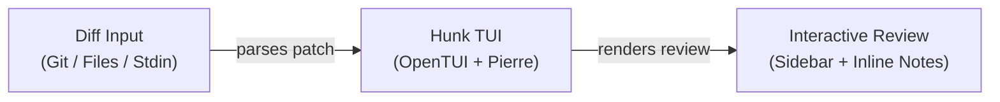

# Hunk

[Hunk](https://www.hunk.dev) is a terminal diff viewer built for reviewing code changes interactively. Unlike plain `git diff` output, hunk opens changesets in a full review UI with sidebar navigation, inline AI/agent annotations, split and stack layouts, and watch mode for live reloading.

Built on [OpenTUI](https://github.com/anomalyco/opentui) and [Pierre diffs](https://www.npmjs.com/package/@pierre/diffs).

## How It Works

Hunk takes a diff — from Git, Jujutsu, Sapling, or raw file comparisons — and renders it in an interactive TUI. You navigate between files in a sidebar, see changes side-by-side or stacked, and can annotate lines with AI notes directly in the viewer.



:::info
Hunk is optimized for reviewing **full changesets** interactively — not just viewing raw diff output.
:::

## Where It's Useful

- **AI agent workflows**: Review changes made by coding agents with inline annotations
- **Git difftool**: Replace `git diff` / `git show` with an interactive viewer
- **Multi-file reviews**: Navigate large changesets with sidebar file list
- **Watch mode**: Auto-reload as files change during active development
- **Patch reviews**: Pipe any diff from stdin for review (`git diff | hunk patch -`)

## Installation

<Steps>
  <Step title="Install via npm">
    ```bash
    npm i -g hunkdiff
    ```
  </Step>
  <Step title="Or install via Homebrew">
    ```bash
    brew install hunk
    ```
  </Step>
  <Step title="Verify installation">
    ```bash
    hunk --version
    ```
  </Step>
</Steps>

:::tip
Requires Node.js 18+. Git is recommended for most workflows.
:::

## Quick Start

<Steps>
  <Step title="Review current repo changes">
    ```bash
    hunk diff
    ```
    Opens all current changes (including untracked files) in the review UI.
  </Step>
  <Step title="Review the latest commit">
    ```bash
    hunk show
    ```
  </Step>
  <Step title="Compare two files directly">
    ```bash
    hunk diff before.ts after.ts
    ```
  </Step>
</Steps>

### Watch Mode

Add `--watch` to any command for live reloading as the working tree changes:

```bash
hunk diff --watch
```

### Pipe a Patch from Stdin

```bash
git diff --no-color | hunk patch -
```

## Keybindings

| Action | Key |
| :--- | :--- |
| Toggle split/stack layout | `l` |
| Open theme selector | `t` |
| Quit | `q` |

Hunk also supports mouse navigation and pager-compatible mode.

:::note
Keybindings apply when running `hunk diff` or `hunk show` directly. They may not work when hunk is used as a Git pager (`core.pager`).
:::

## Git Integration

Set hunk as your global Git pager so `git diff` and `git show` open in hunk automatically:

```bash
git config --global core.pager "hunk pager"
```

Or add opt-in aliases instead:

```bash
git config --global alias.hdiff "-c core.pager=\"hunk pager\" diff"
git config --global alias.hshow "-c core.pager=\"hunk pager\" show"
```

:::warning
Untracked files are auto-included only for hunk's own `hunk diff`. If you open `git diff` through `hunk pager`, Git controls the patch contents — untracked files won't appear.
:::

## Configuration

Persist preferences to `~/.config/hunk/config.toml` or `.hunk/config.toml`:

```toml
theme = "auto"          # auto, github-dark-default, github-light-default, custom
mode = "auto"           # auto, split, stack
vcs = "git"             # git, jj, sl
watch = false
exclude_untracked = false  # hide untracked files from Git/Sapling hunk diff
line_numbers = true
tab_width = 4
wrap_lines = false
```

<Accordion title="Custom Themes">
Custom themes inherit from any built-in theme and override specific colors:

```toml
theme = "custom"

[custom_theme]
base = "catppuccin-mocha"
label = "My Theme"
accent = "#7fd1ff"
panel = "#10161d"

[custom_theme.syntax_scopes]
"comment" = "#6e85a7"
"keyword.operator" = "#7fd1ff"
```

Syntax scopes use [Shiki/TextMate scope selectors](https://shiki.style/guide/theme-colors).
</Accordion>

<Accordion title="Agent Integration">
Hunk supports inline AI annotations for agent workflows:

1. Open hunk in a terminal: `hunk diff`
2. Get the skill path: `hunk skill path`
3. Tell your agent to load the skill and annotate the live session

A good generic prompt:

```
Load the Hunk skill and use it for this review. Run `hunk skill path` to get the skill path.
```
</Accordion>

## References

- [Official Website](https://www.hunk.dev)
- [GitHub Repository](https://github.com/modem-dev/hunk)
- [Agent Workflow Guide](https://github.com/modem-dev/hunk/blob/main/docs/agent-workflows.md)
- [OpenTUI Component Docs](https://github.com/modem-dev/hunk/blob/main/docs/opentui-component.md)
