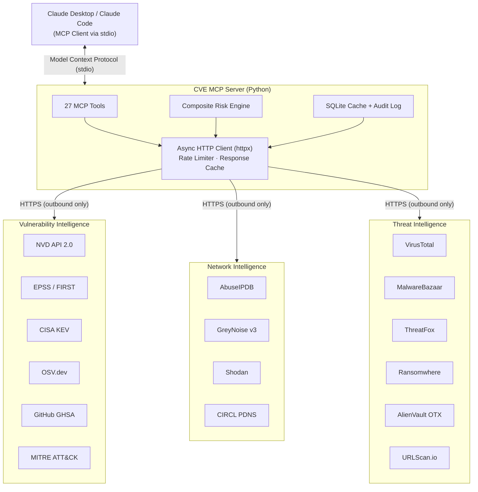

import Tabs from '@theme/Tabs';
import TabItem from '@theme/TabItem';
import Card from '@site/src/components/Card/Card';
import CardGroup from '@site/src/components/Card/CardGroup';
import Accordion from '@site/src/components/Accordion/Accordion';
import AccordionGroup from '@site/src/components/Accordion/AccordionGroup';
import Steps from '@site/src/components/Steps/Steps';
import Step from '@site/src/components/Steps/Step';
import CodeGroup from '@site/src/components/CodeGroup/CodeGroup';

# CVE MCP Server

A **production-grade MCP server** by [Mahipal Jangra](https://www.mahipal.engineer) that gives Claude 27 security intelligence tools across 21 APIs. Instead of juggling 15+ browser tabs across NVD, EPSS, CISA KEV, Shodan, and VirusTotal, ask Claude one question and get correlated intelligence in seconds. Built with Python, FastMCP, httpx, aiosqlite, and Pydantic v2.

:::info
The server provides **27 tools** across **21 data sources** — CVE lookup, EPSS exploitation probability, CISA KEV active threats, MITRE ATT&CK mapping, Shodan host recon, VirusTotal malware scanning, and more.
:::

## Architecture



## Tool Categories

<CardGroup cols={2}>
  <Card title="Vulnerability Intel" icon="mdi:shield-search" href="https://github.com/mukul975/cve-mcp-server#core-vulnerability-intelligence-8-tools">
    8 tools — CVE lookup, CVSS scoring, EPSS probability, CISA KEV status, CWE info, bulk lookup.
  </Card>
  <Card title="Exploit &amp; ATT&CK" icon="mdi:skull-crossbones" href="https://github.com/mukul975/cve-mcp-server#exploit--attack-intelligence-4-tools">
    4 tools — PoC search, MITRE ATT&CK mapping, CAPEC attack patterns, exploit availability.
  </Card>
  <Card title="Risk Scoring" icon="mdi:chart-bell-curve" href="https://github.com/mukul975/cve-mcp-server#phase-3-advanced-risk--reporting-4-tools">
    4 tools — Composite 0-100 risk score, executive reports, CVE prioritization, trending CVEs.
  </Card>
  <Card title="Network Intel" icon="mdi:ip-network" href="https://github.com/mukul975/cve-mcp-server#network-intelligence-4-tools">
    4 tools — IP reputation, GreyNoise noise analysis, Shodan host recon, passive DNS.
  </Card>
  <Card title="Threat Intel" icon="mdi:alert-octagram" href="https://github.com/mukul975/cve-mcp-server#threat-intelligence-4-tools">
    4 tools — VirusTotal scanning, MalwareBazaar samples, ThreatFox IOCs, ransomware tracking.
  </Card>
  <Card title="DevSecOps" icon="mdi:shield-cog" href="https://github.com/mukul975/cve-mcp-server#devsecops-3-tools">
    3 tools — Dependency scanning, GitHub advisories, URL scanning.
  </Card>
</CardGroup>

## Installation & Setup

<Steps>
  <Step title="Clone the repository">
    ```bash
    git clone https://github.com/mukul975/cve-mcp-server.git
    cd cve-mcp-server
    ```
  </Step>
  <Step title="Create and activate virtual environment">
    ```bash
    python -m venv venv
    source venv/bin/activate
    ```
  </Step>
  <Step title="Install dependencies">
    ```bash
    pip install -e .
    ```
  </Step>
  <Step title="Configure environment variables">
    ```bash
    cp .env.example .env
    # Edit .env with your API keys
    ```
  </Step>
  <Step title="Verify the server starts">
    ```bash
    python -m cve_mcp.server
    ```
  </Step>
</Steps>

:::tip
**Zero-key start** — 8 tools work without any API key (EPSS, CISA KEV, OSV.dev, MITRE ATT&CK, CWE lookups, CVSS parsing, Ransomwhere, and NVD at reduced rate). Add keys progressively.
:::

## Configuration

<Tabs groupId="client-config">
  <TabItem value="claude-desktop" label="Claude Desktop">
    **macOS:** `~/Library/Application Support/Claude/claude_desktop_config.json`
    **Windows:** `%APPDATA%\Claude\claude_desktop_config.json`

    ```json
    {
      "mcpServers": {
        "cve-mcp": {
          "command": "python",
          "args": ["-m", "cve_mcp.server"],
          "cwd": "/absolute/path/to/cve-mcp-server",
          "env": {
            "NVD_API_KEY": "your-key-here",
            "GITHUB_TOKEN": "ghp_xxxxxxxxxxxxxxxxxxxx",
            "ABUSEIPDB_KEY": "your-abuseipdb-key"
          }
        }
      }
    }
    ```

    :::warning
    Always use **absolute paths**. Fully quit Claude Desktop (Cmd+Q) after changing config — reloading is not enough.
    :::
  </TabItem>
  <TabItem value="claude-code" label="Claude Code">
    ```bash
    # Basic setup
    claude mcp add cve-mcp -- python -m cve_mcp.server

    # With environment variables
    claude mcp add cve-mcp -e NVD_API_KEY=your_key -e GITHUB_TOKEN=your_token -- python -m cve_mcp.server
    ```
  </TabItem>
</Tabs>

## Quick Start

Once configured, try these prompts with Claude:

> **"What is CVE-2021-44228? Is it actively exploited?"**

Claude queries `lookup_cve` (NVD), `get_epss_score` (EPSS), and `check_kev_status` (CISA KEV) — all free, no keys required.

> **"Scan these Python packages for vulnerabilities: requests 2.28.0, flask 2.2.0, django 3.2.0"**

Claude uses `scan_dependencies` against OSV.dev to find known vulnerabilities.

> **"Calculate the risk score for CVE-2024-3400 and tell me if we should patch immediately."**

Claude correlates CVSS, EPSS, KEV status, and PoC availability into a composite risk score with a patching recommendation.

## Usage Examples

### Log4Shell Analysis

> **You:** Analyze if CVE-2021-44228 (Log4Shell) needs immediate patching.

```
→ lookup_cve("CVE-2021-44228")
  CVSS 3.1: 10.0 (CRITICAL)

→ get_epss_score("CVE-2021-44228")
  EPSS: 0.97531 (97.5%) | Percentile: 99.99%

→ check_kev("CVE-2021-44228")
  ✅ IN CISA KEV — Added 2021-12-10

→ calculate_risk_score("CVE-2021-44228")
  Risk Score: 97/100 (CRITICAL)
```

### Suspicious IP Investigation

> **You:** Investigate suspicious IP 185.220.101.34.

```
→ check_ip_reputation("185.220.101.34")
  AbuseIPDB Confidence: 100% | Reports: 4,832

→ check_ip_noise("185.220.101.34")
  GreyNoise: MALICIOUS | Tags: [Tor Exit Node]

→ shodan_host_lookup("185.220.101.34")
  Open ports: 22, 80, 443, 9001
```

## Risk Score Model

The `calculate_risk_score` tool produces a **composite risk score from 0 to 100** by weighting four independent signals:

| Component | Weight | What It Captures |
|-----------|--------|-----------------|
| CVSS v3.1 Base Score | 20% | Theoretical worst-case severity |
| EPSS Probability | 35% | Likelihood of exploitation in next 30 days |
| CISA KEV Status | 30% | Confirmed active exploitation in the wild |
| PoC Availability | 15% | Public exploit code availability |

**Risk labels:**

- **0–25:** LOW — Schedule for next maintenance window
- **26–50:** MEDIUM — Patch within 30 days
- **51–75:** HIGH — Patch within 7 days
- **76–100:** CRITICAL — Patch within 24-48 hours

## References

- [GitHub Repository](https://github.com/mukul975/cve-mcp-server)
- [Author's Site — CVE MCP Server](https://www.mahipal.engineer/CVE-MCP-Server/)
- [NVD API 2.0](https://nvd.nist.gov/developers)
- [FIRST EPSS](https://www.first.org/epss)
- [CISA Known Exploited Vulnerabilities](https://www.cisa.gov/known-exploited-vulnerabilities-catalog)
- [Model Context Protocol](https://modelcontextprotocol.io)
