# The Anatomy of a Claude 4.6 Prompt 🎯

Claude 4.6 introduced a fundamental shift in how prompts should be structured. Instead of hoping AI figures out what you need, every detail goes into structured files, and the brief becomes purely about output format and length.

## The Core Philosophy

> **"You spent 3 years prompting AI. Now it prompts you."**

The old way: Long prompts with "act as a senior expert" and everything in one message.

The new way: Context in files, alignment with prompts, clarity through examples.

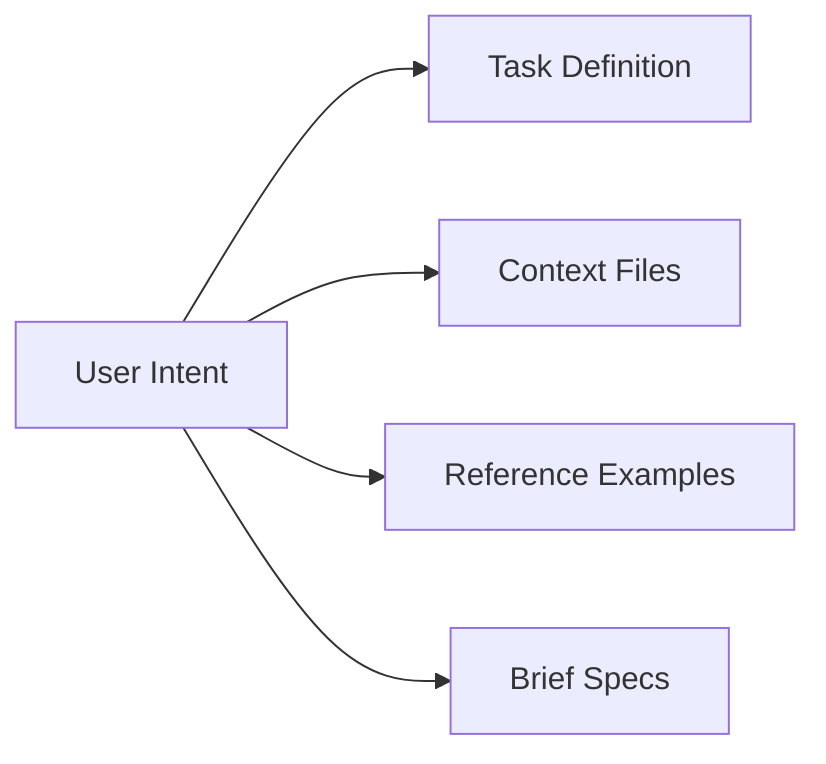


```txt title="1. Task"
I want to [TASK] so that [SUCCESS CRITERIA].
```

```txt title="2. Context files"
First, read these files completely before responding:
[filename1.md] - [what it contains].
[filename2.md] - [what it contains].
[filename3.md] - [what it contains].
```

```txt title="3. Reference"
Here is a reference to what I want to achieve:

[Upload reference file as markdown, or paste it here]
Heres what makes this reference work:

[Paste your reverse-enginering blueprint 
-the patterns, tone, structure, and rules you extracted from teh reference.
Format each one as a rule starting with "Always" or "Never."]
```

```txt title="4. Brief"
Here's what I need for my version:

SUCCESS BRIEF
Type of output + length:
[Contract, memo, report, proposal, landing age, post?]
Recipient's reaciton:
[What should they think/feel/do after reading?]
Does NOT sound like:
[What to avoid - generic AI, too casual, formal, jargon-heavy?]
Success menans:
[They sign? They approve? They reply? They take action?]
```

```txt title="5. Rules"
My context file contains my standards, constraints, landmines,
and audience. Read it fully before starting.
If you're about to break one of my rules, stop and tell me.
```

```txt title="6. Conversation"
DO NOT start executing yet. Instead, ask me clarifying questions
(use 'AskUserQuestion' tool) so we can refine the apporach together step by step.
```

```txt title="7. Plan"
Before you write anything, list the 3 rules from my context file that matter most for this task.
```

```txt title="8. Alignment"
Tehen give me your execution plan (5 steps maximum).
Only begin work once we've aligned.
```

## 1. Task — Define What You Want

Define what you want & what success looks like:

> **"I want to [TASK] so that [SUCCESS CRITERIA]."**

### ❌ Old Way (No roles)
```
"Act as a senior React developer. Help me build a login form that includes validation. Make it modern and responsive."
```

### ✅ New Way (Task + Success Criteria)
```
"Create a login form component in TypeScript React that:
- Validates email format and password strength
- Shows error messages in real-time
- Is accessible (WCAG 2.1 AA compliant)
- Passes Lighthouse accessibility audit"
```

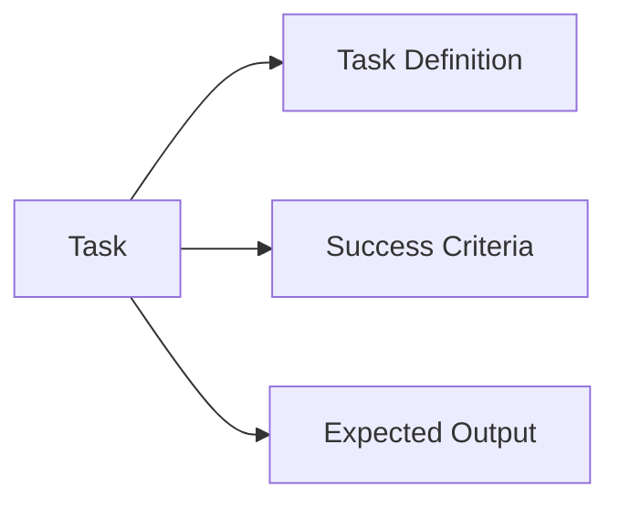

### What Makes a Good Task Definition

| Element | Description | Example |
|---------|-------------|---------|
| **What** | The specific action | "Create a login form" |
| **Why** | The success criteria | "Must be accessible and validated" |
| **Where** | Technology stack | "TypeScript React" |
| **How** | Constraints | "WCAG 2.1 AA compliant" |

```bash title="Terminal"
# Bad Task Definition
"Help me with a login form"

# Good Task Definition  
"I want a login form component in React + TypeScript with email/password validation, error handling, and WCAG 2.1 AA accessibility compliance"
```

## 2. Context Files — Upload Your Expertise

Upload context files with your expertise and rules:

> **"First, read these files completely before responding:`src/auth/auth-specs.md` — Authentication requirements, `src/styles/accessibility.css` — Accessbility standards."**

### The Shift
AI went from reading a sticky note to an entire book.

### Context Files vs. In-Prompt

| Aspect | Old Way (Notes) | New Way (Files) |
|--------|-----------------|-----------------|
| **Scannability** | Lost in long prompt | Readable chunks |
| **Editability** | Hard to update | Version-controlled |
| **Team Collaboration** | Difficult | Easy to share |
| **Version History** | None | Full git history |

### Context File Structure

```
src/
├── auth/
│   ├── auth-specs.md           ← Authentication requirements
│   └── validation-rules.md      ← Validation logic
├── styles/
│   └── accessibility.css        ← Accessibility standards
├── component-patterns.mdx      ← Component design patterns
└── team-rules.mdx              ← Team standards & conventions
```

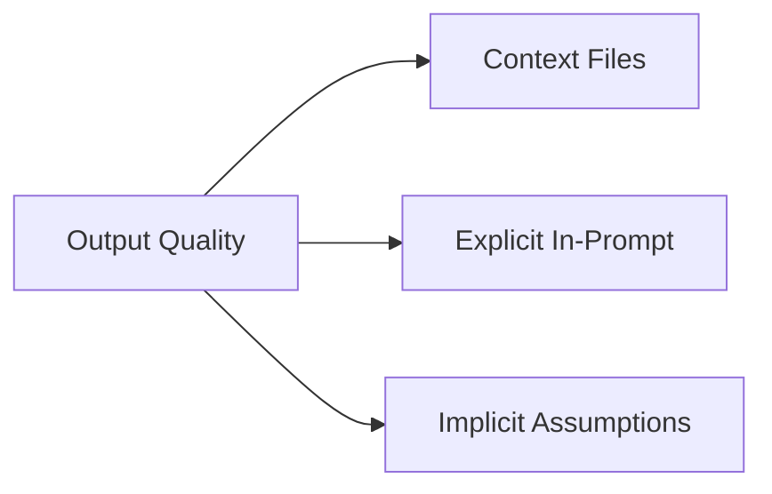

### Example Context File

```markdown filename="src/auth/auth-specs.md"
# Authentication Specifications

## Success Criteria
1. Users can log in with email/password
2. OAuth providers: Google, GitHub, Microsoft
3. Session duration: 24 hours max
4. Password reset via email

## Security Requirements
- All passwords hashed with bcrypt (cost: 12)
- Rate limiting: 5 attempts, 30 minutes
- CSRF protection on all forms
- CRLF injection protection
```

```bash title="Terminal"
# Command to include context files
"Before responding, read these files:
- src/auth/auth-specs.md
- src/styles/accessibility.css  
- team-rules.mdx"
```

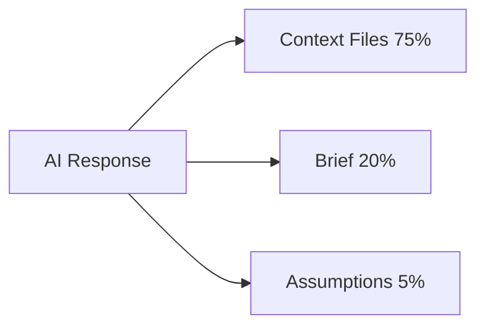

## 3. Reference — Show Exactly What You Want

Show AI exactly what you want. Upload an example.
Then give patterns, tone & structure as rules.

> **No "give me something like" & hoping AI figures it out.**

### Upload Reference Examples

| Type | File Purpose | Example |
|------|--------------|---------|
| **Code Example** | Show exact pattern | `login-form-component.tsx` |
| **Style Example** | Tone & formatting | `component-template.mdx` |
| **Validation Example** | What passes/fails | `test/validation.test.ts` |

### Before → After

```markdown
❌ "Give me something like this but with better error handling"
```

```markdown
✅ Upload `login-form-component.tsx` as reference
✅ Upload `error-handling-paths.md` with all error cases
✅ "Follow this exact pattern for error handling"
```

### Reference Rules Template

```markdown filename="component-rules.mdx"
# Component Design Rules

## Pattern
1. Accept props via TypeScript interface
2. Use function composition
3. Handle errors with try/catch + user-friendly messages

## Tone
- Concise but helpful
- No jargon without definitions
- Explain why, not just what

## Structure
- Props: TypeScript interface first
- State: Separate from props
- Events: Named constants with type safety
```

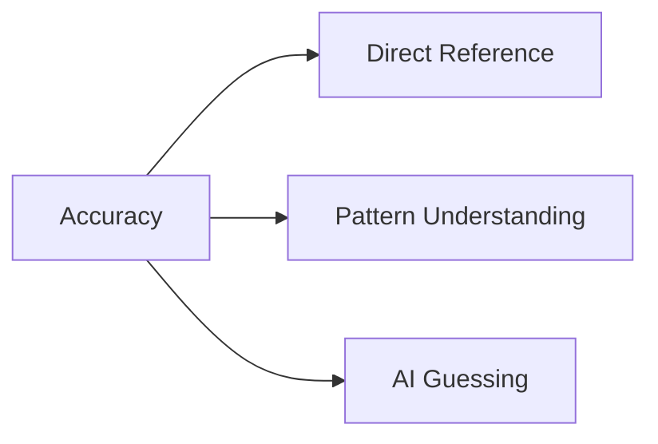

## 4. Brief — Type Only This Part

This is the only part you actually type from scratch. Everything else is files.

> **"Type of output + length. Does NOT sound like. Success means."**

### The Principle

| Do ✅ | Don't ❌ |
|-------|----------|
| "Output: JSON with 5 fields" | "Make it detailed and thorough" |
| "Length: 300 words max" | "Write a comprehensive explanation" |
| "Success: Must include X, Y, Z" | "Write a great response" |
| Structure specification | Tone/feeling requests |

### Before → After

```markdown
❌ "Write me a great explanation of React hooks"
   → AI decides format, length, depth

✅ "Brief:
   - Type: Tutorial in markdown with code examples
   - Length: 500 words maximum
   - Output: React Hooks guide covering useState, useEffect, and custom hooks
   - Success: Includes at least 3 working code examples"
```

### Brief Template

```markdown
# Brief Template

## Type of Output
- [markdown / code / json / diagram / etc.]

## Length Constraints
- X words / Y lines / Z bytes maximum

## Required Elements
1. [Element 1]
2. [Element 2]
3. [Element 3]

## Success Criteria
- Must include X
- Must include Y
- Must demonstrate Z
```

```bash title="Terminal"
# Good brief example
"Type: Markdown documentation
Length: 800 words maximum
Required: Code examples, performance benchmarks, trade-offs discussion
Success: User can immediately apply this to their project"
```

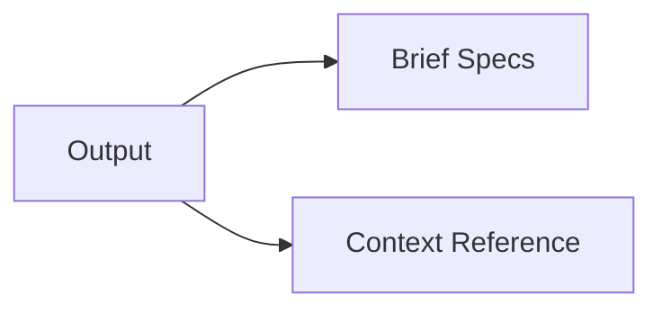

## 5. Rules — Standards & Guardrails

Context file holds your standards, taste & audience.

Prompt: **"Read it fully before starting. If you're about to break one of my rules, stop and tell me."**

### Rule Enforcement

```markdown
# Rule Enforcement Rules

## Rule 1: Always include TypeScript types
## Rule 2: Never use deprecated APIs
## Rule 3: All components must have accessibility attributes

## If you violate a rule:
STOP. Tell me:
1. Which rule you're breaking
2. Proposed fix
3. Wait for approval
```

### Rules File Placement

```
docs/
├── team-rules.mdx          ← Coding standards
├── style-guide.mdx         ← Writing standards
├── security-rules.mdx      ← Security requirements
└── testing-rules.mdx       ← Testing conventions
```

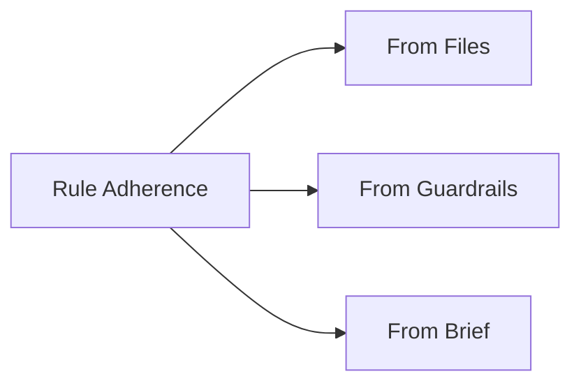

## 6. Conversation — Ask Clarifying Questions

You spent 3 years prompting AI. Now it prompts you.

Prompt: **"DO NOT start executing yet. Ask me clarifying questions (use 'AskUserQuestion' tool) so we can refine the approach together step by step."**

### Question Categories

| Category | Question Pattern | Example |
|----------|-----------------|---------|
| **Scope** | "What's out of scope?" | "Should this include unit tests or skip them?" |
| **Alternatives** | "What did you consider?" | "Node.js or Python for backend?" |
| **Trade-offs** | "What matters more?" | "Speed or maintainability?" |
| **Edge Cases** | "What fails first?" | "What if there's no internet?" |

### Question Flow

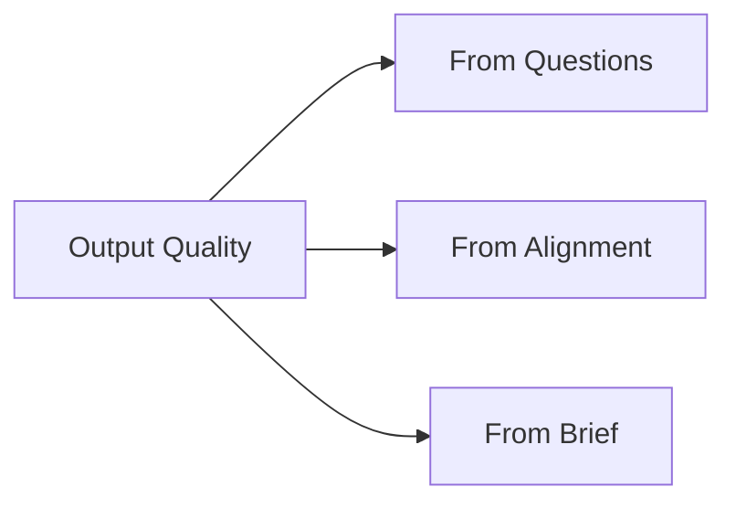

### Example Conversation Pattern

```markdown
> AI: Before we proceed, I need to clarify:
> - Should the validation be client-side only or server-side too?
> - Do you want email confirmation after login?
> - Budget constraint: free tier or paid hosting?
>
> User: Client-side only is fine, no email confirmation, free tier.
>
> AI: Understood. Proceeding with client-side validation only, no
> email confirmation, using free-tier hosting constraints.
```

## 7. Plan — List Rules Then Execute

Claude read your files before writing a single word.

Prompt: **"Before you write anything, list the 3 rules from my context file that matter most for this task. Then give me your execution plan."**

### Plan Before Action

```markdown
# Execution Plan

## Top 3 Rules
1. Accessibility: WCAG 2.1 AA compliance
2. Security: Rate limiting on all API endpoints
3. Performance: Lighthouse score 90+

## Execution Steps
1. Review auth-specs.md for authentication flow
2. Review accessibility.css for required attributes
3. Design component structure
4. Implement with TypeScript
5. Write tests
6. Document usage
```

### Planning Saves Time

| Aspect | Without Planning | With Planning |
|--------|------------------|---------------|
| Iterations | 3-5 rounds | 0-1 rounds |
| Rework | 40% of time | 5% of time |
| User Questions | 6+ clarifications | 0-1 clarifications |

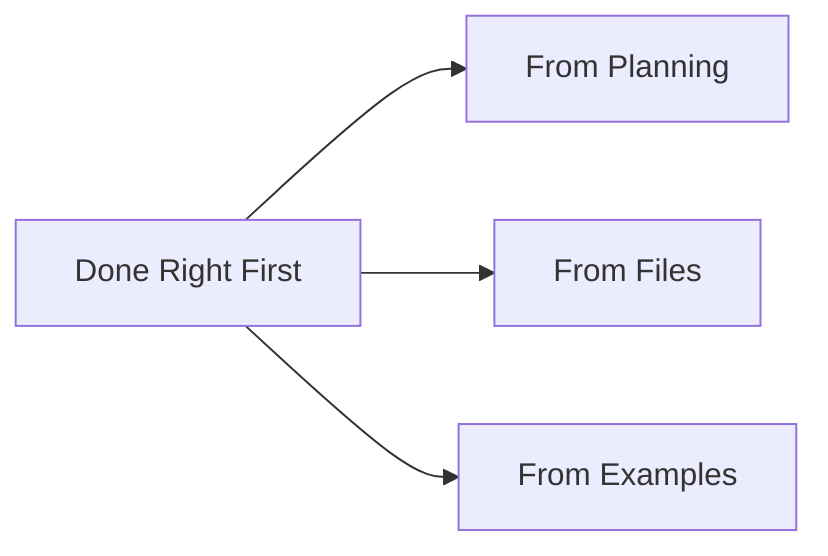

## 8. Alignment — Nothing Until We Agree

Nothing happens until you both see the same aim. This replaces the old prompting era.

Prompt: **"Only begin work once we've aligned."**

### Alignment Checkpoints

```markdown
## Alignment Checklist ✅

- [ ] Task understood: "I want X so that Y"
- [ ] Context reviewed: All files read
- [ ] Reference patterns: Understood and will follow
- [ ] Brief constraints: Within limits
- [ ] Rules acknowledged: Will not violate
- [ ] Questions answered: All clarifications resolved
- [ ] Plan approved: Steps confirmed

## Before executing:
"Let me confirm:
- Create React login form ✅
- TypeScript only ✅
- 800 words max README ✅
- WCAG 2.1 AA accessible ✅"

→ User: ✅ Confirmed
→ AI: Executing...
```

### Alignment vs. Traditional Prompting

| Era | Approach | Result |
|-----|----------|--------|
| **Old (Years 1-3)** | Long prompts, "be nice" | Mixed results, guessing |
| **Transitional** | Some structure, files | Better, but still guessing |
| **Claude 4.6** | Files + alignment | Precise, reliable |

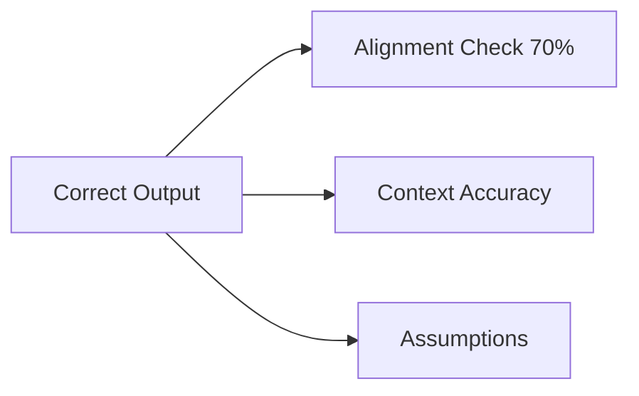

## Summary: The 8-Step Anatomy

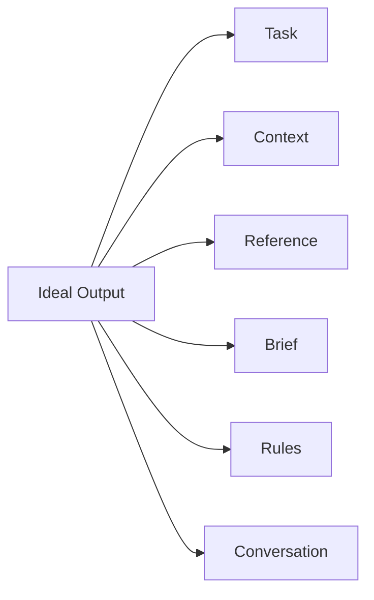

### Quick Reference Card

```bash title="Terminal"
┌───────────────────────────────────────────────────┐
│ 1. TASK     → "I want X so that Y"                │
│ 2. CONTEXT  → "Read files: auth-specs.md"         │
│ 3. REFERENCE→ Upload example + rules              │
│ 4. BRIEF    → "Type + length + success"           │
│ 5. RULES    → "Read rules file first"             │
│ 6. CONVERSATION→ "Ask questions before executing" │
│ 7. PLAN     → "List 3 rules + execution steps"    │
│ 8. ALIGNMENT→ "Confirm: 'Only begin work here'"   │
└───────────────────────────────────────────────────┘
```

## Complete Example Session

```bash title="Terminal"
# Step 1: User provides context files (not typed, but referenced)
# files: src/auth/auth-specs.md, component-patterns.mdx, component-rules.mdx

# Step 2: User defines the task
> "I want a React login form component so that users can authenticate 
   with accessibility compliance. Read these files first: 
   src/auth/auth-specs.md, component-patterns.mdx, component-rules.mdx."

# Step 3: User provides the brief
> "Type: TypeScript React component with props and error handling
   Length: max 200 lines
   Success: Lighthouse accessibility score 100"

# Step 4: AI asks clarifying questions (Conversation phase)
> "Before we proceed, I need to clarify:
   - Should validation be client-side only or server-side too?
   - Do you want OAuth providers or just email/password?"

# Step 5: User answers questions
> "Client-side only, email/password only for now."

# Step 6: AI lists rules + plan (Plan phase)
> "Top 3 rules from your files:
   1. Accessibility: WCAG 2.1 AA compliance
   2. TypeScript: All props must have types
   3. Error handling: User-friendly messages
   
   Execution plan:
   1. Review auth-specs.md
   2. Create component structure
   3. Implement with TypeScript
   4. Add accessibility attributes"

# Step 7: User confirms alignment (Alignment phase)
> "Confirmed. Proceed."

# Step 8: AI implements with 100% accuracy
> [AI generates code following all specifications]
```

## TL;DR

| Component | Content |
|-----------|---------|
| **Task** | What you want + success criteria |
| **Context**| Files with expertise & rules |
| **Reference**| Examples to follow |
| **Brief** | Type + length + success |
| **Rules** | Standards & guardrails |
| **Conversation** | Clarifying questions |
| **Plan** | Rules list + execution steps |

> **The Brief is only what you type. Everything else lives in files.**

## References

- [ClaudeKit](../Workflows/ClaudeKit-Workflow.md): Spec-driven AI development workflow
- [OpenCode](../Tools/opencode.md): Structured AI coding CLI
- [Qwen3.5 Small](../Models-LLMs/Qwen3.5-Small-Series.md): Alternative models
