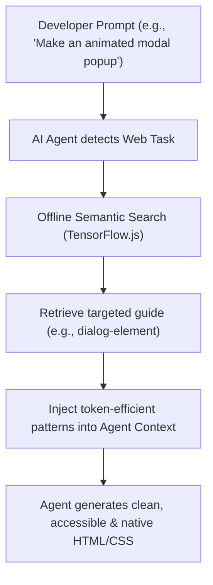

import Tabs from '@theme/Tabs';
import TabItem from '@theme/TabItem';
import Card from '@site/src/components/Card/Card';
import CardGroup from '@site/src/components/Card/CardGroup';
import Accordion from '@site/src/components/Accordion/Accordion';
import AccordionGroup from '@site/src/components/Accordion/AccordionGroup';
import Steps from '@site/src/components/Steps/Steps';
import Step from '@site/src/components/Steps/Step';

# Modern Web Guidance: Aligning AI Agents with Modern Web Standards

Modern Web Guidance is an expert-curated repository of web development best practices and coding skills developed by the Google Chrome team, the Microsoft Edge team, and the web development community. Its primary goal is to prevent AI coding agents (such as Claude Code, Cursor, GitHub Copilot, and Antigravity) from defaulting to outdated patterns, legacy workarounds, and bloated JavaScript when native, high-performance, accessible, and secure web APIs are available.

By injecting targeted, token-efficient guidelines directly into the AI's context window, Modern Web Guidance ensures that your agent stops programming "like it was five years ago." Instead, it produces clean, modern, and production-ready code.

## Core Advantages & Efficiency

Modern Web Guidance operates locally and dynamically, ensuring that the AI has the context it needs without cluttering the prompt or exceeding token limits.

:::info
**Empirically Proven Uplift:** Automated evaluations show that providing agents with Modern Web Guidance increases task completion accuracy with modern APIs, reducing both code bloat and token consumption.
:::

*   **Expert-Reviewed Guidelines:** Written and calibrated by browser engineers and modern web developers.
*   **Accessibility & Performance by Default:** Hardened security, performance, and accessibility practices are automatically woven into every generated component.
*   **Legacy Code Modernization:** Prompts agents to refactor outdated patterns (like custom JS tooltips) into modern, lightweight platform APIs (like the Popover and Anchor Positioning APIs).
*   **Flexible Fallbacks:** Replaces massive polyfill bundles with targeted, progressive enhancements or lightweight fallbacks (under 50 lines of code).

## Capabilites & Core Disciplines

Modern Web Guidance provides comprehensive templates, gotchas, and references for cutting-edge web features:

<CardGroup cols={2}>
  <Card title="User Experience (UX)" icon="mdi:gesture-tap">
    Covers smooth visual state changes, native entry/exit animations, the View Transitions API, and modern scrollbars via `scrollbar-color`.
  </Card>
  <Card title="Modern CSS Layouts" icon="mdi:view-dashboard">
    Leverages Container Queries, CSS Subgrid, modern color spaces (like OKLCH), line-height trimming, and text-wrap tuning.
  </Card>
  <Card title="Performance Optimizations" icon="mdi:lightning-bolt">
    Guides agents in setting up speculative preloading/prerendering, diagnosing Interaction to Next Paint (INP), and scheduling long tasks via `scheduler.yield`.
  </Card>
  <Card title="Forms & Native UI" icon="mdi:form-select">
    Replaces custom heavy libraries with the native Popover API, CSS Anchor Positioning for tooltips, native `<dialog>` controls, and browser-native `:user-invalid` validations.
  </Card>
  <Card title="Accessible Interactions (a11y)" icon="mdi:accessibility">
    Hardens generated code with semantic elements, accessible live region Announcements, and keyboard focus management.
  </Card>
  <Card title="On-Device Client AI" icon="mdi:robot">
    Enables agents to write client-side AI implementations using native browser translation, summarization, and language detection APIs.
  </Card>
</CardGroup>

## Architecture & Integration Workflow

Modern Web Guidance matches your prompt to the best guide using an offline, CPU-efficient TensorFlow.js model—fully private and local with no external network calls or API keys required.



## Agent Integration

Modern Web Guidance is fully compatible with Claude Code, Cursor, Copilot CLI, Antigravity, OpenCode, and other leading agents.

<Tabs groupId="agent-integration">
  <TabItem value="claude" label="Claude Code" default>
    Install Modern Web Guidance as a plugin directly inside Claude Code:
    
    ```bash
    # 1. Add the marketplace
    /plugin marketplace add GoogleChrome/modern-web-guidance
    
    # 2. Install the plugin
    /plugin install modern-web-guidance@googlechrome
    
    # 3. Reload plugins to activate
    /reload-plugins
    ```
  </TabItem>
  <TabItem value="opencode" label="OpenCode">
    Place the `SKILL.md` file in OpenCode's local or global search path:

    ```bash
    # Project-specific installation:
    .opencode/skills/modern-web-guidance/SKILL.md
    
    # Global installation:
    ~/.config/opencode/skills/modern-web-guidance/SKILL.md
    ```

    You can also register it as a plugin within your project-level or global `opencode.json` configuration file.
  </TabItem>
  <TabItem value="copilot" label="Copilot CLI">
    Install as a plugin for the GitHub Copilot CLI:
    
    ```bash
    # 1. Add the marketplace
    /plugin marketplace add GoogleChrome/modern-web-guidance
    
    # 2. Install the plugin
    /plugin install modern-web-guidance@googlechrome
    ```
  </TabItem>
  <TabItem value="antigravity" label="Antigravity CLI">
    Add the plugin in your local Antigravity environment:
    
    ```bash
    agy plugin install https://github.com/GoogleChrome/modern-web-guidance
    ```
  </TabItem>
  <TabItem value="vercel" label="Vercel Skills">
    Add Modern Web Guidance to your project with Vercel's agent skills:
    
    ```bash
    npx skills add GoogleChrome/modern-web-guidance
    ```
  </TabItem>
</Tabs>

## Setup & Configuration

You can install Modern Web Guidance directly into your workspace to allow any compatible agent or IDE extension (such as Cursor or Copilot) to consume it.

<AccordionGroup>
  <Accordion title="CLI Interactive Installation" icon="download">
    The simplest way to install the skill in your project workspace:
    
    ```bash
    npx modern-web-guidance@latest install
    ```
    
    This runs a completely local, self-contained interactive wizard to place the `SKILL.md` file in your repository.
  </Accordion>
  
  <Accordion title="Customizing Skill Packs" icon="tune">
    To minimize token usage and only keep guides relevant to your workspace, use the `--choose` flag:
    
    ```bash
    npx modern-web-guidance@latest install --choose
    ```
    
    Available packs include:
    *   `modern-web-guidance` (~234 tokens): Comprehensive browser APIs, modern layouts, accessibility, and performance.
    *   `chrome-extensions` (~181 tokens): Manifest V3 standards, background workers, extension APIs, and Web Store publishing.
  </Accordion>

  <Accordion title="Local Search & Retrieval" icon="search">
    You can query the modern-web CLI manually to test searches or retrieve specific guides offline:
    
    ```bash
    # Search for relevant guides
    npx modern-web-guidance@latest search "animate a dialog modal backdrop"
    
    # Retrieve a guide by ID
    npx modern-web-guidance@latest retrieve "animate-to-from-top-layer"
    ```
  </Accordion>

  <Accordion title="Telemetry & Privacy" icon="shield-lock">
    Google collects anonymous usage statistics (search queries, guide retrievals, and installation) to improve guide relevance.
    
    To **opt out** completely, set the `DISABLE_TELEMETRY=1` environment variable in your shell:
    
    ```bash
    export DISABLE_TELEMETRY=1
    ```
  </Accordion>
</AccordionGroup>

## Step-by-Step Modernization Example

Here is how Modern Web Guidance helps an agent automatically refactor legacy implementations into high-performance modern web patterns.

<Steps>
  <Step title="Identify Outdated Code">
    The agent detects a legacy modal tooltip implemented using heavy absolute positioning, JavaScript events, and manual z-index hacking.
  </Step>
  
  <Step title="Query modern-web-guidance">
    The agent retrieves the modern guide for floating UI components.
  </Step>
  
  <Step title="Apply Modern Platform Standards">
    The agent replaces the bloated custom code with the native **Popover API** and **CSS Anchor Positioning**:
    
    ```html
    <!-- Native popover target -->
    <button popovertarget="my-tooltip" id="tooltip-trigger">Hover Me</button>
    
    <!-- Native, top-layer popover content -->
    <div popover id="my-tooltip" role="tooltip">
      Modern tooltip in the top layer!
    </div>
    
    <style>
      /* CSS Anchor Positioning */
      #my-tooltip {
        position-anchor: --tooltip-trigger;
        top: anchor(bottom);
        left: anchor(center);
        transform: translateX(-50%);
        margin-top: 8px;
      }
    </style>
    ```
  </Step>
</Steps>

## References

- [Official Documentation](https://developer.chrome.com/docs/modern-web-guidance)
- [GitHub Repository](https://github.com/GoogleChrome/modern-web-guidance-src)
- [Example Guide: Navigation Drawer](https://github.com/GoogleChrome/modern-web-guidance/blob/main/skills/modern-web-guidance/guides/user-experience/navigation-drawer.md)
- [Google Privacy Policy](https://policies.google.com/privacy)
