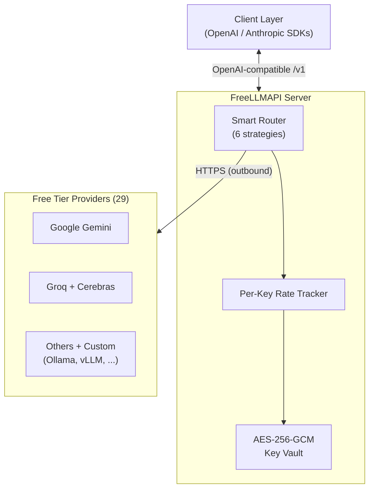

import Tabs from '@theme/Tabs';
import TabItem from '@theme/TabItem';
import Card from '@site/src/components/Card/Card';
import CardGroup from '@site/src/components/Card/CardGroup';
import Accordion from '@site/src/components/Accordion/Accordion';
import AccordionGroup from '@site/src/components/Accordion/AccordionGroup';
import CodeGroup from '@site/src/components/CodeGroup/CodeGroup';

# FreeLLMAPI: One Endpoint, 29 Free LLM Providers

FreeLLMAPI aggregates the free tiers of 29 LLM providers (Google, Groq, Cerebras, Mistral, OpenRouter, Cloudflare, Cohere, NVIDIA, HuggingFace, and more) behind a single OpenAI-compatible `/v1` endpoint. Instead of juggling 29 different SDKs and rate limits, you point any OpenAI client at your local server and it routes transparently across whichever providers you've configured. The router picks the best model, falls over automatically on 429s, and tracks per-key usage so you stay under every free-tier cap.

## Core Advantages & Efficiency

The real power is stacking free tiers that are individually small into a massive combined budget.

:::info
**~4 billion tokens per month** of working inference capacity across 251 model families and 358 free endpoints.
:::

- **Unified OpenAI Endpoint**: `/v1/chat/completions`, `/v1/responses`, `/v1/embeddings`, `/v1/images/generations`, `/v1/audio/speech` - all from one URL.
- **Smart Routing**: Six strategies rank models by speed, capability, and reliability. Automatic fallover retries the next model on 429/5xx with cooldowns and key rotation.
- **Per-Key Rate Tracking**: RPM/RPD/TPM/TPD counters per `(platform, model, key)` so routing always stays under every provider's cap.
- **Encrypted Key Storage**: Provider keys are AES-256-GCM encrypted in SQLite. Your apps only see a single `freellmapi-...` bearer token.
- **Self-Updating Catalog**: The router syncs a signed model catalog from freellmapi.co twice a day. New models and quota changes land without a `git pull`.
- **Anthropic Messages API**: `/v1/messages` speaks Anthropic's wire format, so Claude Code and official Anthropic SDKs run against your free pool.
- **Fusion Mode**: Request the virtual `fusion` model to fan your prompt to multiple free models in parallel, then a judge synthesizes one answer from the drafts.

## Architecture



## Setup & Installation

<Tabs groupId="install-method">
  <TabItem value="docker" label="Docker One-Liner" default>
    Docker required. Sets up `~/freellmapi`, generates an encryption key, pulls the image, and starts the container.
    ```bash
    curl -fsSL https://freellmapi.co/install.sh | bash
    ```
    Open [http://localhost:3001](http://localhost:3001), add provider keys on the **Keys** page, and grab your unified API key from the page header.
  </TabItem>
  <TabItem value="compose" label="Docker Compose">
    Clone the repo and start with Docker Compose. Persists SQLite in a named volume.
    ```bash
    git clone https://github.com/tashfeenahmed/freellmapi.git
    cd freellmapi

    ENCRYPTION_KEY="$(openssl rand -hex 32)"
    printf "ENCRYPTION_KEY=%s\nPORT=3001\n" "$ENCRYPTION_KEY" > .env

    docker compose up -d
    ```
    To reach it from another machine on your LAN:
    ```bash
    HOST_BIND=0.0.0.0 docker compose up -d
    ```
    :::warning
    Only expose on a trusted network. The proxy is single-user and guarded only by the unified API key.
    :::
  </TabItem>
  <TabItem value="local" label="Local Dev (Node.js)">
    For contributors or custom builds. Requires Node.js 20+.
    ```bash
    git clone https://github.com/tashfeenahmed/freellmapi.git
    cd freellmapi
    npm install
    ENCRYPTION_KEY="$(node -e 'console.log(require("crypto").randomBytes(32).toString("hex"))')"
    printf "ENCRYPTION_KEY=%s\nPORT=3001\n" "$ENCRYPTION_KEY" > .env
    npm run dev
    ```
    Dev UI runs at [http://localhost:5173](http://localhost:5173). For LAN access: `npm run dev:lan`.
  </TabItem>
  <TabItem value="production" label="Production Build">
    ```bash
    npm run build
    node server/dist/index.js
    ```
    Serves both the API and dashboard on `:3001`.
  </TabItem>
</Tabs>

### Docker Compose Reference

The included `docker-compose.yml` handles everything:

```yaml
services:
  freellmapi:
    image: ghcr.io/tashfeenahmed/freellmapi:latest
    env_file:
      - .env
    environment:
      NODE_ENV: production
      PORT: 3001
    ports:
      - "${HOST_BIND:-127.0.0.1}:${PORT:-3001}:3001"
    volumes:
      - freellmapi-data:/app/server/data
    extra_hosts:
      - "host.docker.internal:host-gateway"
    restart: unless-stopped
    healthcheck:
      test: ["CMD", "node", "-e", "fetch('http://127.0.0.1:3001/api/ping').then(r=>{if(!r.ok)process.exit(1)}).catch(()=>process.exit(1))"]
      interval: 30s
      timeout: 5s
      retries: 3

volumes:
  freellmapi-data:
```

### Declarative Startup Config

For repeatable installs, provide a JSON config on every boot:

```bash
FREEAPI_CONFIG_PATH=/path/to/freellmapi.config.json docker compose up -d
```

```json
{
  "keys": [
    { "platform": "groq", "key": "gsk_...", "label": "main" },
    { "platform": "google", "key": "AIza...", "enabled": true }
  ],
  "customProviders": [
    {
      "baseUrl": "http://host.docker.internal:11434/v1",
      "label": "Ollama",
      "models": [
        { "model": "llama3.1:8b", "displayName": "Local Llama", "supportsTools": true }
      ]
    }
  ],
  "routing": { "strategy": "balanced" }
}
```

## Integration with AI Agents

FreeLLMAPI works with any OpenAI-compatible client. Each agent has a one-command setup that generates config, backs up existing files, and never clobbers what's already there.

<Tabs groupId="agent-integration">
  <TabItem value="claude" label="Claude Code" default>
    ```bash
    npx freellmapi setup-claude --url http://localhost:3001 --api-key <unified-key>
    ```
    Zero-persistence launcher (keeps credentials out of config):
    ```bash
    npx freellmapi launch
    ```
  </TabItem>
  <TabItem value="opencode" label="OpenCode">
    ```bash
    npx freellmapi setup-opencode --url http://localhost:3001 --api-key <unified-key>
    ```
  </TabItem>
  <TabItem value="codex" label="Codex CLI">
    ```bash
    npx freellmapi setup-codex --url http://localhost:3001 --api-key <unified-key>
    ```
    Launcher: `npx freellmapi launch-codex`
  </TabItem>
  <TabItem value="cursor" label="Cursor">
    Set the OpenAI base URL to `http://localhost:3001/v1` in Cursor settings.
  </TabItem>
  <TabItem value="aider" label="Aider">
    ```bash
    npx freellmapi setup-aider --url http://localhost:3001 --api-key <unified-key>
    ```
  </TabItem>
  <TabItem value="cline" label="Cline / Roo Code">
    ```bash
    npx freellmapi setup-cline --url http://localhost:3001 --api-key <unified-key>
    ```
  </TabItem>
</Tabs>

All generators support `--dry-run` and create timestamped backups before modifying any config file.

## Provider Setup

After installation, open the dashboard at [http://localhost:3001](http://localhost:3001):

1. Go to the **Keys** page
2. Add API keys for the free-tier providers you want (Google, Groq, Mistral, etc.)
3. Reorder the **Fallback Chain** to prefer faster or more capable providers
4. Copy your unified `freellmapi-...` API key from the page header
5. Point your OpenAI SDK at `http://localhost:3001/v1` with that key

<CardGroup cols={2}>
  <Card title="Full Model Catalog" icon="mdi:list-box" href="https://freellmapi.co/models.html">
    Browse all 358 free endpoints with per-model rate limits, context windows, and token budgets.
  </Card>
  <Card title="GitHub Repository" icon="mdi:github" href="https://github.com/tashfeenahmed/freellmapi">
    Source code, issues, and contributing guide.
  </Card>
</CardGroup>

## References

- [Official Website](https://freellmapi.co)
- [GitHub Repository](https://github.com/tashfeenahmed/freellmapi)
- [Install & Deploy Guide](https://github.com/tashfeenahmed/freellmapi/blob/main/docs/install.md)
- [API Reference](https://github.com/tashfeenahmed/freellmapi/blob/main/docs/api.md)
- [Clients & Coding Agents Guide](https://github.com/tashfeenahmed/freellmapi/blob/main/docs/clients.md)
- [YouTube Walkthrough](https://www.youtube.com/watch?v=sHOwbyMbun0)
- [OmniRoute vs FreeLLMAPI - Comparative](../comparatives/ai-proxy.md)
