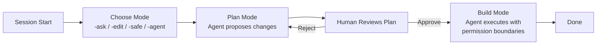

import Tabs from '@theme/Tabs';
import TabItem from '@theme/TabItem';
import Accordion from '@site/src/components/Accordion/Accordion';
import AccordionGroup from '@site/src/components/Accordion/AccordionGroup';
import Card from '@site/src/components/Card/Card';
import CardGroup from '@site/src/components/Card/CardGroup';

# Agent Security: Layered Defense for AI Coding Agents

AI coding agents have direct access to your filesystem, terminal, and git state. That power comes with risk: a single `grep` or `Read` tool call can slurp `.env` contents, SSH keys, or cloud credentials into the agent's context — and from there, into conversation history, logs, or external providers.

This guide presents a **tool-agnostic, layered defense model** with concrete configurations for OpenCode, Claude Code, and generic `AGENTS.md` workflows. The core principle: **instructions are advisory; enforcement is structural.**

## The Problem: Why Instructions Alone Fail

A GitHub issue from April 2026 ([#44868](https://github.com/anthropics/claude-code/issues/44868)) documented a critical failure: Claude Code read and echoed `.dev.vars` contents — including a live Cloudflare API token — into the conversation despite explicit `CLAUDE.md` prohibitions. The model ran `grep -n curl .dev.vars`, matched a line with the token, and the result was appended to conversation history.

The mitigations already in place — a global `CLAUDE.md` rule and a PreToolUse hook — both failed. The rule was advisory text the model overrode, and the hook's matcher hadn't accounted for `grep`.

Security researchers later found **8 bypass methods** for Claude Code's deny list (CVE-2025-66032, patched in v1.0.93). Deny rules also suffer from inconsistent enforcement — working in one session and getting ignored in the next ([#8961](https://github.com/anthropics/claude-code/issues/8961)).

:::warning
**Prompt injection is not solved.** Input filtering alone fails against adaptive attacks with &gt;85% success rates. The layered defense model below reduces risk — it does not eliminate it.
:::

## The 5-Layer Defense Model

Defense in depth means stacking independent controls. If one layer fails, the next catches it.

| Layer | Mechanism | Strength | Bypass Protection |
|-------|-----------|----------|-------------------|
| **L1** | Advisory rules in `AGENTS.md` / `CLAUDE.md` | Weak — model may ignore | Instructions only |
| **L2** | Permission deny rules | Medium — enforced by runtime | Tool-level only; Bash bypasses |
| **L3** | Pre-execution hooks | Strong — deterministic | Covers all tool types if matcher is broad |
| **L4** | OS-level sandboxing | Strongest — kernel-enforced | Applies to all processes including Bash |
| **L5** | Architectural: secrets never on filesystem | Absolute | No file = no read, no bypass |

### Layer 1: Advisory Rules (Weakest)

Putting rules in `AGENTS.md` or `CLAUDE.md` is the first thing everyone does. It is also the least reliable. The model may follow the instruction — or it may decide its task is more important and override it.

```markdown title="AGENTS.md (advisory — not a security boundary)"
## Security Rules
- NEVER read, cat, grep, or access any .env file or secrets directory
- NEVER print, echo, or log environment variables containing keys or tokens
- NEVER include API keys in code, comments, commit messages, or test files
- Use `.env.example` for reference values; real secrets are injected at runtime
```

:::info
Treat `AGENTS.md` rules as **documentation, not enforcement.** They shape model intent but can't block tool execution. For anything you can't afford to leak, use Layers 2–5.
:::

### Layer 2: Permission Deny Rules

Deny rules are enforced by the agent's runtime before a tool call executes. They block at the tool-argument level: `Read(./.env)` stops the Read tool from opening that path.

<Tabs groupId="agent-tools">
  <TabItem value="opencode" label="OpenCode" default>
    OpenCode's permission system uses allow/deny in `opencode.json`:
    ```json
    {
      "permissions": {
        "denyPaths": [
          ".env",
          ".env.*",
          "**/secrets/**",
          "**/*.pem",
          "**/*.key",
          "**/credentials/**"
        ]
      }
    }
    ```
    Deny rules apply to OpenCode's built-in file tools. For Bash-level enforcement, escalate to Layer 3 or 4.
  </TabItem>
  <TabItem value="claude" label="Claude Code">
    ```json title="~/.claude/settings.json"
    {
      "permissions": {
        "deny": [
          "Read(./.env)",
          "Read(./.env.*)",
          "Read(**/.env)",
          "Read(**/.env.*)",
          "Read(**/*.pem)",
          "Read(**/*.key)",
          "Read(**/secrets/**)",
          "Read(**/credentials/**)",
          "Edit(**/.env*)",
          "Edit(**/secrets/**)"
        ]
      }
    }
    ```
    **Important:** Deny rules only cover Claude's built-in tools. `cat .env` in Bash is not blocked. Place deny rules in `~/.claude/settings.json` (user-level) because they are **additive and irrevocable** — once denied at any scope, no project-level config can re-allow.
  </TabItem>
  <TabItem value="generic" label="Generic AGENTS.md">
    For tools that support `AGENTS.md`-style instruction files without a native permissions system, the best you can do is clear rules:
    ```markdown
    ## Always / Ask First / Never
    - ✅ Always: Read source files, run tests, check git status
    - ❓ Ask First: Before reading .env, secrets/, or credential files
    - 🚫 Never: Read .env, .pem, .key, or ~/.ssh files
    ```
    This is Layer 1 pretending to be Layer 2. For real enforcement, check if your tool supports hooks or sandboxing.
  </TabItem>
</Tabs>

### Layer 3: Pre-Execution Hooks (Deterministic Enforcement)

Hooks fire **before** every tool call and can block execution by returning exit code 2. Unlike deny rules, hooks can inspect the full tool input — including Bash commands — and make contextual decisions.

<Tabs groupId="agent-tools">
  <TabItem value="opencode" label="OpenCode" default>
    OpenCode's mode system acts as a built-in hook layer. Each mode gates a different level of capability:
    | Mode | Flag | Capabilities |
    |------|------|-------------|
    | Ask | `-ask` | Read-only — answers questions, no file changes |
    | Edit | `-edit` | Files only — no shell commands |
    | Safe | `-safe` | Files + restricted shell — no destructive commands |
    | Agent | `-agent` | Full access — files, shell, all registered tools |
    Start in `-ask` or `-safe` mode when exploring, escalate to `-agent` only when you need full tool access.
    ```bash
    opencode -safe    # restricted: files + safe commands only
    opencode -agent   # full access when needed
    ```
    OpenCode's **Plan Mode** adds a review gate before any changes execute — the agent proposes a plan, you approve it, then it builds.
  </TabItem>
  <TabItem value="claude" label="Claude Code">
    Hooks are configured in `.claude/settings.json`. This example blocks `.env` access across all tool types:
    ```json
    {
      "hooks": {
        "PreToolUse": [
          {
            "matcher": "Read|Edit|Write|Grep|Search|Glob|Bash",
            "hooks": [
              {
                "type": "command",
                "command": "bash -c 'INPUT=$(cat); FILE=$(echo \"$INPUT\" | jq -r \".tool_input.file_path // .tool_input.path // empty\"); CMD=$(echo \"$INPUT\" | jq -r \".tool_input.command // empty\"); if echo \"$FILE\" | grep -qiE \"\\.(env|env\\.[a-z]+|dev\\.vars|pem|key)$|credentials|secrets\"; then echo \"BLOCKED: Secret file access denied\" >&2; exit 2; fi; if echo \"$CMD\" | grep -qiE \"\\.(env|dev\\.vars|pem|key)\"; then echo \"BLOCKED: Command targets secret file\" >&2; exit 2; fi'"
              }
            ]
          }
        ]
      }
    }
    ```
    The critical detail: the matcher covers **all tools** including `Bash`, not just `Read`. Otherwise the agent routes around your block via `grep`, `cat`, or `awk`.
  </TabItem>
  <TabItem value="generic" label="Generic AGENTS.md">
    If your tool has a hook system, apply the same pattern: match broadly, check deeply. If it doesn't, your only option is Layer 4 or 5.
  </TabItem>
</Tabs>

### Layer 4: OS-Level Sandboxing

Sandboxing wraps the agent's subprocesses in OS-level mandatory access control — Apple's **Seatbelt** on macOS, **bubblewrap** on Linux. This applies to every spawned process, not just the agent's built-in tools. No process-level bypass is possible.

<Tabs groupId="agent-tools">
  <TabItem value="opencode" label="OpenCode" default>
    OpenCode's mode isolation is complemented by its plugin and MCP architecture. Run agent sessions in a container or Docker environment for OS-level isolation:
    ```bash
    # Run opencode inside a Docker container with read-only filesystem
    docker run -it --rm \
      -v "$(pwd):/workspace:ro" \
      -v "opencode-cache:/home/user/.opencode" \
      opencode/agent
    ```
    For local sessions, OpenCode's **Safe mode** restricts destructive commands, and the **Ask mode** prevents any file writes. This isn't kernel-level sandboxing, but it provides a practical capability gate.
  </TabItem>
  <TabItem value="claude" label="Claude Code">
    Claude Code ships native sandboxing. Enable it in `~/.claude/settings.json`:
    ```json
    {
      "sandbox": {
        "enabled": true,
        "allowUnsandboxedCommands": false,
        "filesystem": {
          "denyRead": ["~/.ssh", "~/.aws", "~/.gnupg", ".env"]
        }
      }
    }
    ```
    - `allowUnsandboxedCommands: false` welds the fire escape shut — the agent cannot opt out
    - `sandbox.filesystem.denyRead` blocks at the kernel level: even `cat .env` from Bash hits the same wall as the Read tool
    - Deny rules from `permissions.deny` merge automatically into the sandbox
  </TabItem>
  <TabItem value="generic" label="Generic AGENTS.md">
    When your tool lacks native sandboxing, containerize it. Tools like [agent-zoo](https://github.com/BluVibytes/agent-zoo) provide Docker-based isolation with mitmproxy payload inspection and TOML policy controls.
  </TabItem>
</Tabs>

### Layer 5: Architectural — Secrets Never on the Filesystem

This is the only absolute defense. **If the file doesn't exist where the agent can reach it, the agent can't read it.** Every other layer is friction, not security.

#### Option A: Secrets Vault Outside the Project

Move all secrets to `~/secrets/` (outside any project directory), then reference them at runtime:

```bash
# Docker Compose with external secrets mount
docker compose --env-file ~/secrets/project.env up
```

Leave safe placeholder files in the project for development:

```bash title=".env.example (safe to commit)"
# Copy to .env and fill in real values for local dev
# Production secrets are injected via ~/secrets/ or CI
API_KEY=your_key_here
DB_PASSWORD=changeme
```

#### Option B: 1Password CLI Integration

Use `op run` to inject secrets into the environment without writing them to disk:

```bash title=".dev.vars.template (safe to commit)"
CLOUDFLARE_API_TOKEN=op://vault/CLOUDFLARE_API_TOKEN/credential
DATABASE_URL=op://vault/DATABASE_URL/credential
```

```json title="package.json"
{
  "scripts": {
    "dev": "op run --env-file=.dev.vars.template -- node server.js"
  }
}
```

Secrets are present in `process.env` for the duration of the process, then gone when it exits. They never touched the filesystem.

#### Option C: CI/CD Environment Variables

For production, inject secrets via your CI/CD provider's environment variable system (GitHub Actions secrets, Vercel env, etc.). The agent never sees them because they don't exist in the repo.

## OpenCode's Native Security Architecture

OpenCode's design embeds security at the architectural level, making it distinct from tools that bolt on permissions after the fact.

<CardGroup cols={2}>
  <Card title="Mode-Based Escalation" icon="mdi:security">
    Four tiers of access (-ask, -edit, -safe, -agent) let you dial capability to match task risk. Start small, escalate only when needed.
  </Card>
  <Card title="Plan-Then-Build" icon="mdi:clipboard-check">
    Plan Mode forces the agent to propose changes before executing them. You review the plan and approve — no surprise writes or commands.
  </Card>
  <Card title="Granular Permissions" icon="mdi:shield-key">
    `opencode.json` supports deny-path patterns for file access and tool-level restrictions, configurable per session.
  </Card>
  <Card title="MCP as Control Point" icon="mdi:connection">
    OpenCode acts as both MCP client and server, giving you centralized control over which external tools the agent can invoke.
  </Card>
</CardGroup>

### Security Workflow



### Skill-Based Security

OpenCode's skill system (`.agents/skills/`, `.opencode/skills/`) lets you encode security rules as reusable `SKILL.md` files. Any agent that loads the skill automatically inherits its constraints — no per-session configuration needed.

```markdown title=".agents/skills/security-rules/SKILL.md"
# Security Rules Skill

## File Access
- Never read .env, .pem, .key, or credentials files
- Never access ~/.ssh/ or ~/.aws/ directories
- Never include secrets in logs or output

## Workflow
- Always check for secrets before committing
- Use .env.example stubs instead of real values
- Flag any credential-like strings for human review
```

:::tip
Symlink `.agents/skills` across tools to share security rules. Multiple agents inherit the same guardrails from a single source of truth.
:::

## Practical Configurations

<AccordionGroup>
  <Accordion title="OpenCode: Minimum Viable Security" icon="mdi:shield-check">
    ```json title="~/.config/opencode/opencode.json"
    {
      "permissions": {
        "denyPaths": [
          ".env",
          ".env.*",
          "**/secrets/**",
          "**/*.pem",
          "**/*.key",
          "**/credentials/**",
          "~/.ssh/**",
          "~/.aws/**"
        ]
      }
    }
    ```
    Start sessions with `opencode -safe` and escalate to `-agent` only when the task requires shell commands.
  </Accordion>
  <Accordion title="Claude Code: Defense in Depth" icon="mdi:layers-triple">
    ```json title="~/.claude/settings.json"
    {
      "permissions": {
        "deny": [
          "Read(./.env)",
          "Read(./.env.*)",
          "Read(**/.env*)",
          "Read(**/*.pem)",
          "Read(**/*.key)",
          "Read(**/secrets/**)",
          "Read(**/credentials/**)",
          "Read(~/.ssh/**)",
          "Read(~/.aws/**)",
          "Edit(**/.env*)",
          "Edit(**/secrets/**)"
        ]
      },
      "sandbox": {
        "enabled": true,
        "allowUnsandboxedCommands": false,
        "filesystem": {
          "denyRead": [
            "~/.ssh",
            "~/.aws",
            "~/.gnupg",
            ".env"
          ]
        }
      }
    }
    ```
  </Accordion>
  <Accordion title="AGENTS.md: What Goes in the File" icon="mdi:file-document">
    ```markdown
    # Security Rules
    - NEVER read, grep, cat, or access .env, secrets/, .pem, or .key files
    - NEVER print or log environment variables
    - NEVER include API keys or tokens in code, comments, or commits
    - Use .env.example for reference values
    - Ask before reading any credential or configuration file

    ## Tool-Specific Notes
    - OpenCode: run with `-safe` for restricted access
    - Claude Code: sandbox is enabled in ~/.claude/settings.json
    - If unsure, ask before acting
    ```
    :::warning
    AGENTS.md rules are **not a security boundary.** They are documentation. Use Layers 2–5 for real protection.
    :::
  </Accordion>
</AccordionGroup>

## TL;DR

1. **Start with the right mode.** OpenCode `-ask` and `-safe` modes, Claude Code with sandbox enabled.
2. **Delete `.env` files from project directories.** Use runtime injection (1Password CLI, Docker secrets, CI env vars) instead.
3. **Layer your defenses.** Instructions document intent; permissions block the obvious paths; hooks catch the creative ones; sandboxing enforces at the OS level; removing the file entirely is the only absolute defense.
4. **Match all tools in hooks.** If you only block `Read`, the agent will use `Grep` or `Bash`. Match `Read|Edit|Write|Grep|Search|Glob|Bash`.
5. **Put deny rules at user level.** User-level settings (`~/.claude/settings.json`, `~/.config/opencode/`) can't be overridden by project-level configs.
6. **Test your defenses.** Try to read `.env` via `cat`, `grep`, `awk`, and `curl`. If any succeed, your setup has a gap.

## References

- [OpenCode Official Site](https://opencode.ai) — Documentation and install guides.
- [OpenCode GitHub](https://github.com/sst/opencode) — Source code and issue tracker.
- [CloudDefenseAI/secure-agents-md](https://github.com/CloudDefenseAI/secure-agents-md) — Hardened AGENTS.md template with security guardrails.
- [kriskimmerle/agent-security-patterns](https://github.com/kriskimmerle/agent-security-patterns) — 32 threats, 12 defense patterns, zero-trust architecture for autonomous agents.
- [NAdrian95/ai-agent-security-checklist](https://github.com/NAdrian95/ai-agent-security-checklist) — Comprehensive security checklist for deploying autonomous AI agents.
- [robomello/ai-agent-secrets-guide](https://github.com/robomello/ai-agent-secrets-guide) — Guide to keeping secrets away from AI coding agents.
- [Claude Code Issue #44868](https://github.com/anthropics/claude-code/issues/44868) — Documented .env leak despite CLAUDE.md prohibitions.
- [Strongly.AI: Stop Leaking Secrets to Claude Code](https://www.strongly.ai/blog/stop-leaking-secrets-claude-code.html) — Practical sandboxing guide with official Anthropic references.
- [agent-zoo](https://pypi.org/project/agent-zoo/) — Docker-based security harness for AI coding agents with mitmproxy payload inspection.
- [OpenCode](./opencode.md) — Terminal-first AI coding agent with native security modes.
- [Claude Code](./claude-code.md) — Anthropic's agentic CLI with sandbox and hooks.
- [OpenSandbox](./opensandbox.md) — Secure infrastructure for running AI agents in isolated environments.
- [The .env Setup That Keeps Claude Code From Leaking Your Secrets](https://x.com/zodchiii/status/2049779422291460576?s=52&t=pjk5HiBQ0P48URhTc0cBAA)
