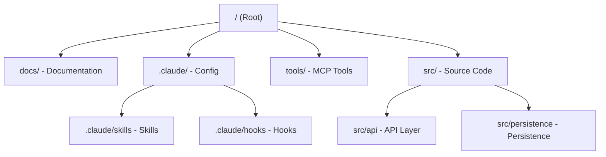
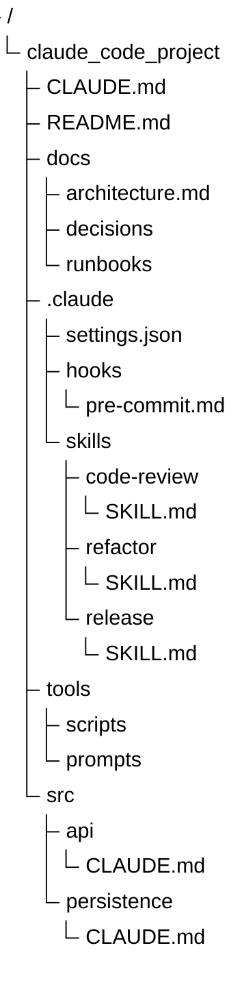

import Accordion from '@site/src/components/Accordion/Accordion';
import AccordionGroup from '@site/src/components/Accordion/AccordionGroup';
import Steps from '@site/src/components/Steps/Steps';
import FreshnessBadge from '@site/src/components/FreshnessBadge/FreshnessBadge';

# Claude Code: Anthropic's Agentic CLI

<FreshnessBadge lastUpdated={frontMatter.last_updated} />

Claude Code is a command-line interface (CLI) and terminal agent developed by Anthropic. It allows you to interact with Claude directly from your terminal, enabling agentic coding workflows, system-level interactions, and seamless integration with your development environment.

Unlike traditional chat interfaces, Claude Code has direct access to your local files, terminal, and git state, allowing it to perform complex tasks like refactoring, debugging, and running tests autonomously.

## Core Advantages & Efficiency

Claude Code transforms the terminal into a collaborative environment where the AI isn't just a chatbot, but an active participant in the development lifecycle.

:::info
By accessing the local filesystem and terminal directly, Claude Code eliminates the need for manual copy-pasting, reducing "context drift" and significantly accelerating the dev-test-debug loop.
:::

- **Terminal Integration**: Run commands, interpret output, and fix errors directly in your shell.
- **File System Access**: Read from and write to your codebase with full context of the project structure.
- **Git Awareness**: Understand branch state, commit history, and staged changes.
- **Skill Discovery**: Automatically detects and utilizes skills defined in the `.claude/skills` directory.
- **MCP Compatibility**: Supports Model Context Protocol for easy integration of third-party tools.

## Project Architecture

When working with Claude Code, it is recommended to follow a structured approach to organize your documentation, reusable skills, automated development workflows, and tools.



### Folder Structure Example

<div className="terminal-window">



</div>

## Key Components

<AccordionGroup>
  <Accordion title="CLAUDE.md: Project Memory" icon="mdi:brain">
    Project memory and instructions for Claude. This file is the "north star" for Claude. Keep it short and focused on:
    - **Purpose**: Why the system exists.
    - **Repo map**: How the project is structured.
    - **Rules + commands**: How Claude should operate.

    :::warning
    If `CLAUDE.md` becomes too long, the model starts missing critical signals.
    :::
  </Accordion>

  <Accordion title=".claude/skills: AI Workflows" icon="mdi:auto-fix">
    Directory for defining reusable skills. Turn common workflows into reusable skills to stop repeating instructions in prompts.

    Examples:
    - Code review checklist
    - Refactoring playbook
    - Debugging workflow
    - Release procedures
  </Accordion>

  <Accordion title=".claude/hooks: Guardrails" icon="mdi:hook">
    Lifecycle hooks that Claude can trigger at specific points (e.g., before or after a command) to automate repetitive tasks or enforce project rules.

    Examples:
    - Run formatters after edits.
    - Trigger tests after core changes.
    - Block sensitive directories (auth, billing, migrations).
  </Accordion>

  <Accordion title="docs/: External Context" icon="mdi:book-open-page-variant">
    Contains project documentation, architectural decisions, and runbooks. Instead of overloading prompts, let Claude navigate your documentation to find the "truth."
  </Accordion>

  <Accordion title="tools/: Custom MCP Tools" icon="mdi:tools">
    A dedicated space for custom tools, often implemented using the **Model Context Protocol (MCP)**, allowing Claude to interact with external APIs or local services.
  </Accordion>
</AccordionGroup>

## Source Code Organization

Some areas of your system have hidden complexity. Adding local `CLAUDE.md` files in specific directories helps Claude understand "danger zones" exactly when it works in them, dramatically reducing mistakes.

- **`src/api/CLAUDE.md`**: Logic for interacting with external services and API clients.
- **`src/auth/CLAUDE.md`**: Logic for authentication and authorization.
- **`src/persistence/CLAUDE.md`**: Data storage, database interactions, and state management.

## Setup & Configuration

<Steps>
  <Step title="Install Claude Code">
    Install the CLI globally via npm:
    ```bash
    npm install -g @anthropic-ai/claude-code
    ```
  </Step>
  <Step title="Authenticate">
    Run the tool for the first time to authenticate with your Anthropic account:
    ```bash
    claude
    ```
  </Step>
  <Step title="Initialize Project">
    Create a `CLAUDE.md` file in your root directory to give Claude the necessary context.
  </Step>
</Steps>

## Tips & Tricks

:::tip
32 power-user tricks organized by skill level. Start with beginner, graduate to advanced for maximum ROI.
:::

### Beginner: First-Week Essentials

<AccordionGroup>
  <Accordion title="1. Run `/init` before writing a single message" icon="mdi:rocket-launch">
    The first thing to do in any new repository. It scans the codebase, identifies the stack, and writes a `CLAUDE.md` capturing conventions, file structure, and build commands. Skip it and Claude starts every conversation cold, asking questions you've already answered. The generated file is usually good enough that you only need to trim, not rewrite.
  </Accordion>

  <Accordion title="2. Set up `/statusline` for live monitoring" icon="mdi:monitor-dashboard">
    Run `/statusline` and Claude configures a panel at the bottom of your terminal showing the current model, working directory, remaining context window, session cost, and git branch. Without it, you only realize you've burned 80% of context when responses start degrading. With it, you can `/compact` before it bites.
  </Accordion>

  <Accordion title="3. Use voice input for long prompts" icon="mdi:microphone">
    Use Apple dictation, Whisper Flow, or SuperWhisper to dictate plans, bug reports, and feature summaries. Spoken prompts are denser — they include half-formed thoughts and edge cases you'd skip when typing on a busy afternoon. The quality change is real.
  </Accordion>

  <Accordion title="4. Keep your context window small by default" icon="mdi:file-tree">
    Every file read, tool result, and conversation turn lives in the finite context window. Don't load a file unless you have a specific reason. Let Claude extract what it needs through grep and read tools instead of pasting code preemptively. Small context, sharper results — always.
  </Accordion>

  <Accordion title="5. Run `/context` when things go wrong" icon="mdi:magnify">
    `/context` shows exactly what's consuming your token budget: conversation history, tool results, CLAUDE.md content, system notices, MCP server output. Eight out of ten times when Claude does something inexplicably dumb, the problem is context contamination, not the model.
  </Accordion>

  <Accordion title="6. `/compact` at 60-70%, `/clear` between tasks" icon="mdi:minimize">
    Popular wisdom says "compact at 80%". That's too late — at 80%, Claude is already getting sloppy. `/compact` at 60-70% with a focused argument like `/compact retain the schema and the failing test cases`. When switching to a completely new task, use `/clear` for a full reset. Mixing unrelated tasks in one session is one of the fastest ways to make Claude hallucinate APIs that don't exist.
  </Accordion>

  <Accordion title="7. Planning mode (`Shift+Tab`) for multi-file changes" icon="mdi:map">
    `Shift+Tab` toggles plan mode. Claude analyzes the codebase and produces an implementation plan without writing any code. You review, edit, approve, then execute. Make this non-negotiable for any change touching more than one file. The ten seconds spent reviewing the plan saves hours of debugging when Claude adds rate limiting in the wrong middleware.
  </Accordion>

  <Accordion title="8. Treat Claude like a smart junior developer" icon="mdi:school">
    Junior devs are brilliant but need structure — clear specs, code reviews, and architectural decisions made before they become tech debt. Treat Claude the same way. Brief like a junior. Review output like a junior. Don't trust architecture without checking it. Developers who burn out with Claude Code treat it like a senior; those who ship write strict specifications and review diffs.
  </Accordion>

  <Accordion title="9. Force clarifying questions until 95% confidence" icon="mdi:comment-question-outline">
    Add one line to your `CLAUDE.md`: *"Before writing code, ask clarifying questions until you have 95% confidence in requirements. Don't guess. Don't assume."* The behavior change is dramatic. Instead of generating a half-correct implementation that takes thirty minutes to fix, Claude asks the four questions that define the spec before writing anything.
  </Accordion>

  <Accordion title="10. Self-check lists with visual verification" icon="mdi:clipboard-check">
    When assigning a multi-step task, tell Claude to maintain a checklist and verify each step before marking it done. For UI work, that means a screenshot. For backend, hit the endpoint and show the response. For databases, run a query and paste the result. Without verification, Claude marks things "done" because it wrote the code. With verification, "done" means it actually works.
  </Accordion>
</AccordionGroup>

### Intermediate: From Casual to Serious

<AccordionGroup>
  <Accordion title="11. Implement parallel sub-agents for multi-component work" icon="mdi:account-multiple">
    Sub-agents are Claude instances with their own context window, tool access, and model assignment. Define them in `~/.claude/agents/[name].md` or `.claude/agents/[name].md`. When building something with three or more independent components, delegate each to a sub-agent. While you review the auth implementation, the database agent finalizes migrations and the UI agent wires components. Three things happening in parallel where you used to have one.
  </Accordion>

  <Accordion title="12. Create custom skills in `~/.claude/skills/`" icon="mdi:puzzle">
    Skills are reusable instruction packages that Claude loads automatically when their description matches the task. Each skill is a directory with a `SKILL.md` file. The frontmatter tells Claude when to use it; the body tells it what to do. Skills don't pollute context like a giant CLAUDE.md — they load on demand and unload when done. This is the proper way to handle specialized knowledge.
  </Accordion>

  <Accordion title="13. Route sub-agents to Haiku to halve costs" icon="mdi:piggy-bank">
    The biggest cost optimization in Claude Code. Sub-agents inherit the main model unless you specify otherwise. Set `model: haiku` in the sub-agent frontmatter and that agent runs on Haiku instead of Opus — roughly 15x cheaper per token with negligible quality loss on file searches, log analysis, codebase exploration, and JSON formatting. Route planning/architecture to Opus, implementation to Sonnet, and routine exploration to Haiku.
  </Accordion>

  <Accordion title="14. Keep `CLAUDE.md` under 200 lines" icon="mdi:text-box-edit">
    Every line loads into every conversation. A 500-line file silently consumes context before you've written a message. Limit to 150-200 lines. Keep: project description, key file paths, build/test commands, coding conventions, strict rules. Remove: code examples (Claude can read your code), historical context, anything duplicating the README. Update it every Friday on active projects — five minutes of pruning, ten minutes of adding new lessons learned.
  </Accordion>

  <Accordion title="15. Route `CLAUDE.md` to linked subdirectory files" icon="mdi:link">
    For larger projects, keep the root `CLAUDE.md` as a router, not a manual. The root file says "see `docs/conventions.md` for code style, see `docs/architecture.md` for system design." Claude reads the router and pulls only the linked file relevant to the current task. This pattern keeps a monorepo root at 120 lines while maintaining deep, specific guidance on demand.
  </Accordion>

  <Accordion title="16. Exit early and re-prompt in a new session" icon="mdi:exit-to-app">
    If a session goes sideways (wrong direction, hallucinated APIs, repeated errors), don't try to fix it within the same session. Exit. Open a new session. Re-prompt with a clearer message and lessons learned from the bad streak. Once a session has deviated, bad context poisons every subsequent turn. A new session with a stricter prompt is almost always faster than five rounds of "no, like this."
  </Accordion>

  <Accordion title="17. Aggressively challenge Claude's output" icon="mdi:shield-search">
    When Claude returns something that "looks right," ask it to find three problems with what it just wrote. Or say: *"Critique this implementation as if you were a senior engineer in code review. What would you reject?"* Claude is excellent at finding flaws when framed as critique rather than generation. This catches race conditions, missing edge cases, and subtle bugs that pass normal review.
  </Accordion>

  <Accordion title="18. `/rewind` is your quick undo button" icon="mdi:rewind">
    Press `Esc` twice or run `/rewind` to get a checkpoint menu showing every previous conversation state. Pick a checkpoint, restore it. You can restore just the conversation or just the code, meaning you can revert messages while keeping file changes, or vice versa. Use this when Claude took the wrong path five turns ago — rewind to before the wrong turn and retry with a better message.
  </Accordion>

  <Accordion title="19. Hooks for auto-formatting and notifications" icon="mdi:hook">
    Hooks are deterministic shell commands that run at specific lifecycle points. Use pre-tool-use and post-tool-use hooks. Example stack: a post-tool-use hook that runs `prettier` on every TS file Claude edits, a stop hook that triggers a macOS notification when a long task completes, and a pre-tool-use hook that blocks `rm -rf` outside specific directories. The auto-format hook alone saves ten minutes of cleanup per session.
  </Accordion>

  <Accordion title="20. Screenshots for visual self-verification" icon="mdi:camera">
    When Claude edits UI, ask it to take a screenshot of the running page and verify the change matches specs. With Playwright MCP installed, this is one command. Instead of "I added the gradient" with no proof, you get "here's the gradient, here's the screenshot, this is what I see." Catches alignment errors, color shifts, and dozens of small visual issues that text-only verification always misses.
  </Accordion>

  <Accordion title="21. Chrome DevTools integration for live debugging" icon="mdi:google-chrome">
    Connect Claude to Chrome via Playwright or DevTools MCP and it can open a browser, navigate to the dev server, inspect the DOM, read console errors, and verify behavior end-to-end. Use this for any UI bug that doesn't reproduce on the first message. The session feels like pair programming with someone who has a browser open at all times.
  </Accordion>

  <Accordion title="22. Clone inspiration sites via screenshot" icon="mdi:content-copy">
    Take a screenshot of a site you want to emulate, hand it to Claude, and ask it to reproduce the design in your stack. With a vision-capable model and good design tokens, you get a functional clone in fifteen minutes that would have taken a frontend developer half a day. Not pixel-perfect, but close enough that manual polish takes fifteen minutes instead of three hours.
  </Accordion>
</AccordionGroup>

### Advanced: Infrastructure Level

<AccordionGroup>
  <Accordion title="23. Parallel sessions with Git Worktrees" icon="mdi:source-branch">
    `git worktree add ../feature-payments feature/payments` creates an isolated working directory linked to a branch. Start a separate Claude Code session in that worktree — completely isolated from your main session: different files, different state, no conflicts. Run four worktrees in parallel: auth in worktree A, payments in worktree B, dashboard redesign in worktree C, Stripe webhook in worktree D. A full week of work compressed into an afternoon.
  </Accordion>

  <Accordion title="24. Direct API calls instead of heavy MCP servers" icon="mdi:api">
    MCP servers are great. They're also expensive in tokens. Every MCP server registers tools loaded into Claude's context whether used or not — a heavy MCP can consume 5-10% of context budget on tool definitions alone. For one-off API interactions, skip MCP and have Claude call the endpoint directly with `curl` or a simple HTTP client. Keep MCP servers for tools used in more than 50% of sessions; everything else goes through direct API calls.
  </Accordion>

  <Accordion title="25. `/loop` for recurring background tasks" icon="mdi:repeat">
    `/loop` lets you run a command or slash command on a recurring interval. `"/loop 30m check deploy logs and ping me if there's an error"` runs every thirty minutes. The harness can keep loops alive for up to three days. Run loops for SEO checks, content publishing pings, security scans, and build status monitors. Keep loop prompts narrow — a vague loop prompt gets expensive fast.
  </Accordion>

  <Accordion title="26. Host Claude Code on a VPS for always-on agents" icon="mdi:server">
    For loops that run 24/7 without your laptop open, deploy Claude Code on a VPS. A cheap DigitalOcean droplet or Hetzner box runs a `tmux` session with Claude Code, loops activated on schedule, and you SSH in to check status from anywhere. The VPS becomes a persistent agent runner instead of a disposable session.
  </Accordion>

  <Accordion title="27. Remote control Claude from your phone" icon="mdi:cellphone-link">
    Tunnel your VPS Claude session through `ttyd`, `gotty`, or a similar browser-based terminal tool, lock it behind HTTPS and basic auth, and you can manage Claude Code from your phone. Send fixes from a café, a library, or while commuting. Not for heavy work — perfect for quick "hey, restart that loop" or "check deploy status" interactions away from the laptop.
  </Accordion>

  <Accordion title="28. NoSQL and BigQuery in plain English" icon="mdi:database">
    Install a database MCP server (Firebase, Supabase, BigQuery, MongoDB) and ask Claude things like "how many records in the last 24 hours from US users on the pro plan?" It writes the query, executes it, analyzes the result, and gives you a one-liner answer. For exploratory questions during a meeting, plain English through Claude is ten times faster than opening the BigQuery console.
  </Accordion>

  <Accordion title="29. `ultrathink` for the hardest problems" icon="mdi:brain">
    Anthropic recommends magic words that expand Claude's thinking budget. The hierarchy: `think` → `think hard` → `think harder` → `ultrathink`. Each step allocates more thinking tokens. `ultrathink` activates roughly 32,000 thinking tokens — the maximum reasoning Claude will deploy in a single response. Use sparingly (maybe twice per session) for architectural decisions, gnarly bugs, and security analysis on complex auth flows where the wrong answer costs more than the extra tokens.
  </Accordion>

  <Accordion title="30. Edit `settings.json` permissions (allow/deny/ask)" icon="mdi:shield-lock">
    Stop saying yes to every prompt. Open `~/.claude/settings.json` and add permission rules. Allow safe commands (`npm run *`, `git status`, `git diff *`, `pytest *`, `prettier *`) so Claude executes them autonomously. Deny destructive commands (`rm -rf *`, `git push --force *`, `curl * | sh`) — deny always wins over allow. Ask for sensitive operations (`git push *`, `npm publish *`). With good permission files, agent loops run autonomously for hours without you clicking "approve" twenty times.
  </Accordion>

  <Accordion title="31. Agent teams with shared context" icon="mdi:account-group">
    An "agent team" is a collection of specialized sub-agents (planner, coder, evaluator, reviewer), each with its own role, model, and tool access. They communicate through a shared file (`team-state.md`) that each agent reads at the start of its turn and writes at the end. The planner writes the plan, the coder implements it, the evaluator runs tests, the reviewer approves or returns. Four agents on appropriate models: Opus for planning, Sonnet for coding, Haiku for evaluation. The architectural pattern that scales.
  </Accordion>

  <Accordion title="32. Context7 MCP for version-specific documentation" icon="mdi:book-open-page-variant">
    The Upstash Context7 MCP server injects up-to-date, version-specific library documentation directly into Claude's context. Without it, Claude generates code based on training data — meaning deprecated APIs, wrong import paths, and functions that don't exist in your version. With Context7, Claude pulls current docs for the exact package version in your `package.json` and writes code that works on the first try. Install once:
    ```bash
    claude mcp add context7 -- npx -y @upstash/context7-mcp
    ```
    The hallucinated API problem essentially disappears for any library that supports Context7. This is the single trick to implement first if you only have time for one.
  </Accordion>
</AccordionGroup>

## References

- [ClaudeKit Workflow](../Workflows/ClaudeKit-Workflow.md) - Spec-driven AI development methodology.
- [OpenCode](./opencode.md) - A structured AI coding CLI with plugin support.
- [OpenSandbox](./opensandbox.md) - Secure infrastructure for running AI agents.
- [Model Context Protocol](https://modelcontextprotocol.io) - Official MCP site.
- [Anatomy of the .claude/ folder](https://x.com/akshay_pachaar/status/2035341800739877091) - Guide to commands and skills.
- [Claude Code Best Practices](https://github.com/shanraisshan/claude-code-best-practice) - Community collection of tips.
- [Claude Code Tutorial Video](https://x.com/marcusyul/status/2054897177034367055?s=20)
- [32 Tricks to Level Up Claude Code](https://www.youtube.com/watch?v=SkMuVhScLRQ) - Video covering all tips in this section.
- [32 Claude Code Hacks - Full Writeup](https://www.mejba.me/es/blog/claude-code-32-power-user-hacks) - Detailed breakdown with examples.
