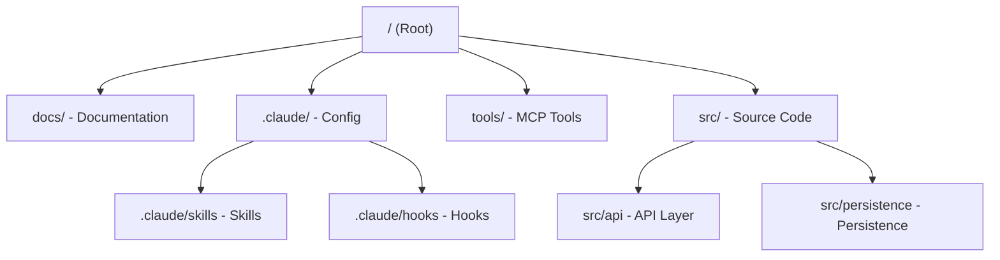

import Accordion from '@site/src/components/Accordion/Accordion';
import AccordionGroup from '@site/src/components/Accordion/AccordionGroup';
import Steps from '@site/src/components/Steps/Steps';

# Claude Code: Anthropic's Agentic CLI

Claude Code is a command-line interface (CLI) and terminal agent developed by Anthropic. It allows you to interact with Claude directly from your terminal, enabling agentic coding workflows, system-level interactions, and seamless integration with your development environment.

Unlike traditional chat interfaces, Claude Code has direct access to your local files, terminal, and git state, allowing it to perform complex tasks like refactoring, debugging, and running tests autonomously.

## Core Advantages & Efficiency

Claude Code transforms the terminal into a collaborative environment where the AI isn't just a chatbot, but an active participant in the development lifecycle.

:::info
By accessing the local filesystem and terminal directly, Claude Code eliminates the need for manual copy-pasting, reducing "context drift" and significantly accelerating the dev-test-debug loop.
:::

- **Terminal Integration**: Run commands, interpret output, and fix errors directly in your shell.
- **File System Access**: Read from and write to your codebase with full context of the project structure.
- **Git Awareness**: Understand branch state, commit history, and staged changes.
- **Skill Discovery**: Automatically detects and utilizes skills defined in the `.claude/skills` directory.
- **MCP Compatibility**: Supports Model Context Protocol for easy integration of third-party tools.

## Project Architecture

When working with Claude Code, it is recommended to follow a structured approach to organize your documentation, reusable skills, automated development workflows, and tools.



### Folder Structure Example

```bash
claude_code_project/
├── CLAUDE.md
├── README.md
├── docs/
│   ├── architecture.md
│   ├── decisions/
│   └── runbooks/
├── .claude/
│   ├── settings.json
│   ├── hooks/
│   │   ├── pre-commit.md
│   │   └── ...
│   └── skills/
│       ├── code-review/
│       │   └── SKILL.md
│       ├── refactor/
│       │   └── SKILL.md
│       ├── release/
│       │   └── SKILL.md
│       └── ...
├── tools/
│   ├── scripts/
│   └── prompts/
├── src/
    ├── api/
    │   └── CLAUDE.md
    └── persistence/
        └── CLAUDE.md
```

## Key Components

<AccordionGroup>
  <Accordion title="CLAUDE.md: Project Memory" icon="mdi:brain">
    Project memory and instructions for Claude. This file is the "north star" for Claude. Keep it short and focused on:
    - **Purpose**: Why the system exists.
    - **Repo map**: How the project is structured.
    - **Rules + commands**: How Claude should operate.

    :::warning
    If `CLAUDE.md` becomes too long, the model starts missing critical signals.
    :::
  </Accordion>

  <Accordion title=".claude/skills: AI Workflows" icon="mdi:auto-fix">
    Directory for defining reusable skills. Turn common workflows into reusable skills to stop repeating instructions in prompts.

    Examples:
    - Code review checklist
    - Refactoring playbook
    - Debugging workflow
    - Release procedures
  </Accordion>

  <Accordion title=".claude/hooks: Guardrails" icon="mdi:hook">
    Lifecycle hooks that Claude can trigger at specific points (e.g., before or after a command) to automate repetitive tasks or enforce project rules.

    Examples:
    - Run formatters after edits.
    - Trigger tests after core changes.
    - Block sensitive directories (auth, billing, migrations).
  </Accordion>

  <Accordion title="docs/: External Context" icon="mdi:book-open-page-variant">
    Contains project documentation, architectural decisions, and runbooks. Instead of overloading prompts, let Claude navigate your documentation to find the "truth."
  </Accordion>

  <Accordion title="tools/: Custom MCP Tools" icon="mdi:tools">
    A dedicated space for custom tools, often implemented using the **Model Context Protocol (MCP)**, allowing Claude to interact with external APIs or local services.
  </Accordion>
</AccordionGroup>

## Source Code Organization

Some areas of your system have hidden complexity. Adding local `CLAUDE.md` files in specific directories helps Claude understand "danger zones" exactly when it works in them, dramatically reducing mistakes.

- **`src/api/CLAUDE.md`**: Logic for interacting with external services and API clients.
- **`src/auth/CLAUDE.md`**: Logic for authentication and authorization.
- **`src/persistence/CLAUDE.md`**: Data storage, database interactions, and state management.

## Setup & Configuration

<Steps>
  <Step title="Install Claude Code">
    Install the CLI globally via npm:
    ```bash
    npm install -g @anthropic-ai/claude-code
    ```
  </Step>
  <Step title="Authenticate">
    Run the tool for the first time to authenticate with your Anthropic account:
    ```bash
    claude
    ```
  </Step>
  <Step title="Initialize Project">
    Create a `CLAUDE.md` file in your root directory to give Claude the necessary context.
  </Step>
</Steps>

## References

- [ClaudeKit Workflow](../Workflows/ClaudeKit-Workflow.md) - Spec-driven AI development methodology.
- [OpenCode](./opencode.md) - A structured AI coding CLI with plugin support.
- [OpenSandbox](./opensandbox.md) - Secure infrastructure for running AI agents.
- [Model Context Protocol](https://modelcontextprotocol.io) - Official MCP site.
- [Anatomy of the .claude/ folder](https://x.com/akshay_pachaar/status/2035341800739877091) - Guide to commands and skills.
- [Claude Code Best Practices](https://github.com/shanraisshan/claude-code-best-practice) - Community collection of tips.
