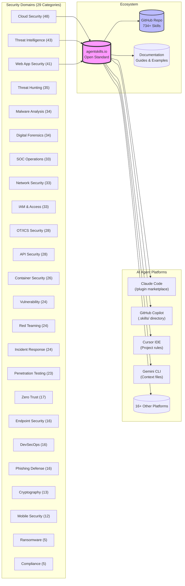

# Anthropic Cybersecurity Skills for AI Agents

**734+ structured cybersecurity skills** covering 29 domains, compatible with Claude Code, GitHub Copilot, Cursor, Gemini CLI, and 20+ platforms.

### Merged Content Sources
- 📚 **GitHub Repo**: [mukul975/Anthropic-Cybersecurity-Skills](https://github.com/mukul975/Anthropic-Cybersecurity-Skills) (734+ skills)
- 📖 **Documentation**: [Mahipal Engineer](https://www.mahipal.engineer/Anthropic-Cybersecurity-Skills/) (formatted guide)

## Quick Navigation

- [How It Works](#how-it-works)
- [Skill Installation Methods](#skill-installation-methods)
- [Complete Skill Categories (29 Domains)](#complete-skill-categories-29-domains)
- [MITRE ATT&CK Integration](#mitre-attack-integration)
- [Skill Anatomy](#skill-anatomy)
- [References](#references)
- [Contributing](#contributing)

## High-Level Architecture

The following diagram illustrates how the Anthropic Cybersecurity Skills ecosystem connects security capabilities with AI agent platforms.



## How It Works: Progressive Disclosure

An AI agent follows a **progressive disclosure** pattern to efficiently discover and execute skills:

### Step 1: Discovery (~30-40 tokens)
Agent reads only the YAML frontmatter to assess relevance.

```yaml
---
name: performing-memory-forensics-with-volatility3
description: Analyze memory dumps to extract processes and network connections.
domain: cybersecurity
subdomain: digital-forensics
tags: [forensics, memory-analysis, volatility3, incident-response]
---
```

### Step 2: Relevance Check
Agent determines if the skill matches the task intent before loading full content.

### Step 3: Execution
Only matched skills load the full body with workflow steps, prerequisites, and tool commands.

### Step 4: Verification
Agent validates outcomes against success criteria to ensure correctness.

This pattern minimizes token waste while maintaining accuracy for complex security tasks.

## Skill Installation Methods

Choose the method that best fits your workflow:

| Method | Command | Platform |
|--------|---------|----------|
| **npx skills** | `npx skills add mukul975/Anthropic-Cybersecurity-Skills` | Universal |
| **Plugin marketplace** | `/plugin marketplace add mukul975/Anthropic-Cybersecurity-Skills` | Claude Code |
| **Git clone** | `git clone https://github.com/mukul975/Anthropic-Cybersecurity-Skills.git` | Any tool |
| **Manual copy** | Copy skills to `.skills/` or project root | Context-aware agents |

## Complete Skill Categories (29 Domains)

### Cloud Security (48 skills)
AWS S3 Bucket Audit, Azure AD Configuration, GCP Security Assessment, Kubernetes Security, Terraform Hardening, IAM Least Privilege Review, CloudTrail Analysis, Security Group Audit, VPC Flow Log Analysis, Multi-Cloud Encryption.

### Threat Intelligence (43 skills)
APT Group Analysis with MITRE Navigator, Campaign Attribution, Dark Web Monitoring, Threat Feed Integration, IOC Extraction, TTP Mapping, ThreatActor Profiling, Intel Normalization, Indicator Enrichment, Adversary Behavior Analysis.

### Web Application Security (41 skills)
HTTP Request Smuggling, XSS with Burp Suite, Web Cache Poisoning, SSRF Exploitation, SQL Injection variants, CSRF Token Bypass, JWT Tampering, GraphQL Injection, Deserialization Flaws, Path Traversal, Business Logic Abuse, IDOR Testing.

### Threat Hunting (35 skills)
Credential Dumping Detection, DNS Tunneling with Zeek, Living-off-the-Land Binaries, User Behavior Analytics, Log Correlation, Anomaly Detection, Persistence Identification, Lateral Movement Detection, Data Exfiltration Signs, Command & Control Discovery.

### Malware Analysis (34 skills)
Cobalt Strike Beacon Config, Ghidra Reverse Engineering, YARA Rule Development, Static Analysis with Falcon, Behavioral Sandboxing, String Extraction, Import Analysis, PE Header Inspection, Obfuscation Detection, Anti-Analysis Evasion Detection.

### Digital Forensics (34 skills)
Disk Imaging with dd/dcfldd, Memory Forensics with Volatility3, Browser Forensics, Artifact Collection, Timeline Analysis, Registry Analysis, Windows Event Logging, Linux Audit Logs, macOS Artifact Review, Network Forensics, Email Forensics.

### SOC Operations (33 skills)
Windows Event Log Analysis, Splunk Detection Rules, SIEM Use Case Implementation, Alert Triage, False Positive Reduction, SOAR Workflow, Correlation Rules, KQL Queries, Log Parsing, Incident Triage Workflow.

### Network Security (33 skills)
Wireshark Traffic Analysis, VLAN Segmentation, Suricata IDS Configuration, NAC Policy Validation, Port Scanner Analysis, Protocol Decryption, Network Baseline, Intrusion Detection, FirewalD Configuration, Zero Trust Network Access.

### Identity & Access Management (33 skills)
SAML SSO with Okta, Privileged Access Management, RBAC for Kubernetes, Azure AD Conditional Access, MFA Implementation, Password Policy Optimization, Session Management, Certificate Management, Service Account Security, PAM Integration.

### OT/ICS Security (28 skills)
SCADA System Attack Detection, Modbus Anomaly Detection, Purdue Model Segmentation, Protocol Security, Asset Identification, Network Access Control, Configuration Management, Vulnerability Assessment, Change Management, Incident Response.

### API Security (28 skills)
API Enumeration Detection, BOLA Exploitation, GraphQL Security Assessment, Rate Limit Abuse, Authentication Bypass, JWT Flaw Detection, Schema Validation, Endpoint Discovery, Parameter Tampering, CORS Misconfiguration.

### Container Security (26 skills)
Trivy Image Scanning, Falco Runtime Detection, Kubernetes Pod Security, Dockerfile Hardening, Image Vulnerability Scans, Secret Detection, Permission Analysis, Resource Limits, Network Policies, Supply Chain Security.

### Vulnerability Management (24 skills)
DefectDojo Dashboard, CVSS Scoring, Patch Management Workflow, Asset Discovery, Exposure Analysis, Risk Prioritization, Remediation Tracking, Compliance Mapping, Scan Scheduling, false Positive Management.

### Red Teaming (24 skills)
Sliver C2 Framework, BloodHound AD Analysis, Kerberoasting with Impacket, Post-Exploitation Chains, Lateral Movement, Credential Access, Initial Access, Evasion Techniques, Persistence Methods, Defense Evasion.

### Incident Response (24 skills)
Ransomware Response, Cloud Incident Containment, Volatile Evidence Collection, Incident Documentation, Containment Procedures, Eradication Steps, Recovery Procedures, Post-Incident Analysis, Lessons Learned, Reporting Templates.

### Penetration Testing (23 skills)
External Network Pentest, Kubernetes Pentest, Active Directory Pentest, Reconnaissance Methodologies, Vulnerability Scanning, Exploitation Frameworks, Post-Exploitation Procedures, Reporting Standards, Methodology Documentation, Testing Engagement.

### Zero Trust Architecture (17 skills)
HashiCorp Boundary, Zscaler ZTNA, BeyondCorp Access Model, Identity-Aware Proxy, Service Mesh Security, Workload Identity, Device Trust Assessment, Network Segmentation, Micro-Segmentation, Least Privilege Access.

### Endpoint Security (16 skills)
CIS Benchmark Hardening, Windows Defender Configuration, Host-Based IDS, EDR Deployment, Application Allowlisting, User Account Control, Firewall Rules, Patch Management, Vulnerability Remediation, Configuration Compliance.

### DevSecOps (16 skills)
GitLab CI Pipeline, Semgrep Custom SAST Rules, Secret Scanning with Gitleaks, Container Security Integration, IaC Scanning, Dependency Checking, Shift-Left Security, Secure CI/CD, Pipeline Hardening, Compliance as Code.

### Phishing Defense (16 skills)
Email Header Analysis, GoPhish Simulation, DMARC/DKIM/SPF Configuration, Threat Intelligence Correlation, User Awareness Training, Malicious URL Detection, Attachment Analysis, Spoofing Detection, Reporting Workflows, Response Procedures.

### Cryptography (13 skills)
TLS 1.3 Configuration, HSM Key Storage, Certificate Authority with OpenSSL, Encryption Algorithms, Key Rotation Procedures, Hashing Best Practices, Digital Certificate Management, PKI Administration, Cryptographic Agility, Compliance Validation.

### Mobile Security (12 skills)
iOS App Analysis with Objection, Android Malware Reverse Engineering, Frida Hooking, Jailbreak Detection, Root Detection, App Integrity, Data Protection, Secure Storage Review, Certificate Pinning, Network Inspection.

### Ransomware Defense (5 skills)
Ransomware Precursor Detection, Backup Strategy, Honeypot Detection, File Integrity Monitoring, Recovery Procedures.

### Compliance & Governance (5 skills)
GDPR Data Protection, ISO 27001 ISMS, PCI DSS Controls, Policy Enforcement, Audit Readiness.

## MITRE ATT&CK Integration

All 734+ skills are mapped to the **MITRE ATT&CK framework** for:

- ✅ **Threat modeling** and scenario validation
- ✅ **Capability gap analysis** against known adversary tactics
- ✅ **Detection engineering** with validated detection signatures
- ✅ **Playbook development** for specific attack patterns
- ✅ **Benchmarking** security postures against real threats

This mapping enables AI agents to validate security recommendations against known adversary behaviors and ensure comprehensive coverage.

## Skill Anatomy

Every skill follows a consistent directory structure for reliability and discoverability:

```
skills/{skill-name}/
├── SKILL.md                # Main skill definition with YAML frontmatter
│   ├── Frontmatter         # name, description, domain, subdomain, tags
│   ├── When to Use         # Trigger conditions for AI agents
│   ├── Prerequisites       # Required tools and access
│   ├── Workflow            # Step-by-step execution guide
│   └── Verification        # How to confirm success
├── references/
│   ├── standards.md        # NIST, MITRE ATT&CK, CVE references
│   └── workflows.md        # Deep technical procedure reference
├── scripts/
│   └── process.py          # Practitioner helper scripts (optional)
└── assets/
    └── template.md         # Checklists and report templates
```

### Example Skill Workflow

```yaml
# When to Use
- Detecting unauthorized process execution in memory
- Analyzing live memory dumps from incident response
- Extracting network connections and artifacts
- Identifying malicious indicators in memory

# Prerequisites
- Volatility 3 installed
- Access to memory dump file
- Python 3.8+ environment
- Volatility profiles for target OS

# Workflow
1. Extract memory dump to isolated system
2. Initialize profiler with appropriate OS version
3. List processes with volatility.plugins.windows.pdlist
4. Show network connections with volatility.plugins.windows.handles
5. Extract artifacts with volatility.plugins.windows.artifactparser
6. Cross-reference findings with known IOCs
7. Generate structured report

# Verification
- Processes listed match expected baseline
- Suspicious processes flagged with confidence scores
- Network connections documented with status
- Artifacts extracted and categorized
```

## References

### Primary Sources
- 📚 **[GitHub Repository](https://github.com/mukul975/Anthropic-Cybersecurity-Skills)** - Full collection of 734+ skills
- 📖 **[Mahipal Engineer Documentation](https://www.mahipal.engineer/Anthropic-Cybersecurity-Skills/)** - Formatted guide and examples

### Standards & Frameworks
- **[agentskills.io](https://agentskills.io)** - Open standard for AI agent skills
- **[MITRE ATT&CK](https://attack.mitre.org/)** - Adversary Tactics and Techniques
- **[NIST Cybersecurity Framework](https://www.nist.gov/cyberframework)**
- **[OWASP](https://owasp.org/)** - Web application security standards
- **[CIS Benchmarks](https://www.cisecurity.org/benchmark)**

### Platform Documentation
- **[Claude Code Skills](https://docs.anthropic.com/en/docs/skills)**
- **[GitHub Copilot Context](https://docs.github.com/en/copilot)**
- **[Cursor AI Features](https://docs.cursor.com/)**

## Contributing

This is a **community-driven project**. See the original repository for guidelines:

- **[Contributing Guide](https://github.com/mukul975/Anthropic-Cybersecurity-Skills/blob/main/CONTRIBUTING.md)** - How to add skills, improve documentation
- **[Code of Conduct](https://github.com/mukul975/Anthropic-Cybersecurity-Skills/blob/main/CODE_OF_CONDUCT.md)** - Community standards

## License

This project is licensed under the **Apache License 2.0**.

- **[View License](https://github.com/mukul975/Anthropic-Cybersecurity-Skills/blob/main/LICENSE)**
- **Unlimited use** with attribution recommended
