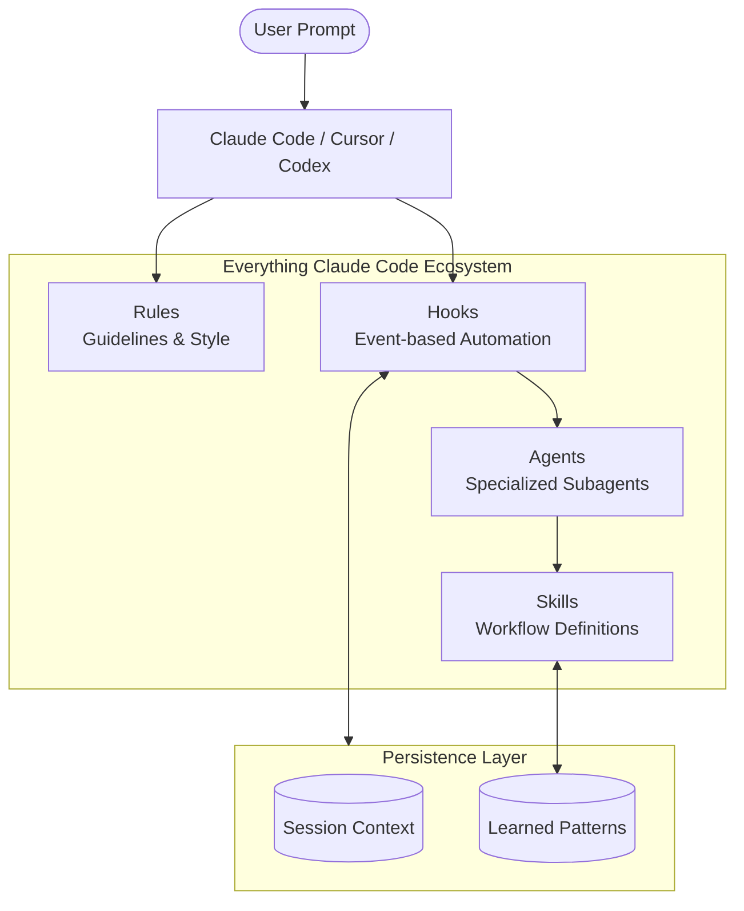

# Everything Claude Code: Advanced Agentic Ecosystem

**Everything Claude Code** is a high-performance framework for Claude Code, Cursor, and Codex. It provides a modular architecture of **agents, skills, hooks, and rules** designed to optimize token usage, enable persistent memory, and automate complex development workflows.

### Merged Content Sources
- 📚 **GitHub Repo**: [affaan-m/everything-claude-code](https://github.com/affaan-m/everything-claude-code)
- 📖 **The Guides**: [Shorthand](https://x.com/affaanmustafa/status/2012378465664745795), [Longform](https://x.com/affaanmustafa/status/2014040193557471352), & [Security](https://x.com/affaanmustafa/status/2033263813387223421)

## Quick Navigation

- [The Core Guides](#the-core-guides)
- [Key Topics & Learning Path](#key-topics--learning-path)
- [High-Level Architecture](#high-level-architecture)
- [Key Concepts (Agents, Skills, Hooks, Rules)](#key-concepts)
- [What's Inside (Ecosystem Structure)](#whats-inside)
- [Common Workflows](#common-workflows)
- [Ecosystem Tools](#ecosystem-tools)

## The Core Guides {#the-core-guides}

The ecosystem is built around three foundational guides that explain the philosophy and implementation of advanced agentic behavior.

| Guide | Focus | Key Takeaways |
|-------|-------|---------------|
| **Shorthand Guide** | Setup & Foundations | Philosophy of agentic tools, rapid setup, and baseline configurations. |
| **Longform Guide** | Optimization & Scale | Token optimization, memory persistence, verification loops, and parallelization. |
| **Security Guide** | Agentic Security | Attack vectors, sandboxing, sanitization, and the AgentShield auditor. |

## Key Topics & Learning Path {#key-topics--learning-path}

| Topic | Description |
|-------|-------------|
| **Token Optimization** | Strategies for model selection, system prompt slimming, and managing background processes. |
| **Memory Persistence** | Implementation of hooks that automatically save and load context across sessions. |
| **Continuous Learning** | Methods to auto-extract patterns from sessions into reusable skills (Longform Guide). |
| **Verification Loops** | Checkpoint vs continuous evals, grader types, and pass@k metrics for reliability. |
| **Parallelization** | Git worktrees, cascade method, and scaling instances for massive tasks. |
| **Subagent Orchestration** | Solving the context problem via iterative retrieval patterns and delegation. |

## High-Level Architecture {#high-level-architecture}

The following diagram illustrates how Everything Claude Code organizes its components to provide a unified experience across different AI platforms.



## Key Concepts {#key-concepts}

### 🤖 Agents
Specialized subagents handle delegated tasks with limited, focused scope. This prevents context bloat in the primary agent.
- **Planner**: Creates implementation blueprints.
- **Architect**: Makes high-level system design decisions.
- **Reviewers**: Language-specific experts (TS, Python, Go, Rust, etc.).

### 🛠️ Skills
Workflow definitions invoked by commands or agents. They represent the "how-to" for specific tasks.
- **TDD Workflow**: Define interfaces -> Fail -> Pass -> Refactor.
- **Strategic Compact**: Manual and automatic context compaction.
- **VideoDB**: Tooling for video/audio ingestion and editing.

### 🪝 Hooks
Triggers that fire on tool events (e.g., PreToolUse, Stop).
- **Session Lifecycle**: Save state on exit, restore context on start.
- **Safety Checks**: Warn about secrets or debug logs before committing.
- **Self-Correction**: Suggest compaction when context window is reaching limits.

### 📝 Rules
Always-follow guidelines organized into `common/` (language-agnostic) and language-specific directories.
- Ensure consistent coding style and testing requirements (80%+ coverage).
- Enforce commit formats and PR processes.

## What's Inside {#whats-inside}

The repository structure reflects its modularity:

```text
everything-claude-code/
├── agents/             # 28+ specialized subagents
├── skills/             # Workflow definitions & domain knowledge
├── commands/           # Slash commands (/tdd, /plan, /verify, etc.)
├── rules/              # Guidelines (typescript, python, golang, etc.)
├── hooks/              # Trigger-based automations
├── scripts/            # Cross-platform Node.js utilities
├── contexts/           # Dynamic system prompt injections
└── mcp-configs/        # MCP server configurations
```

## Common Workflows {#common-workflows}

### Starting a New Feature
1. `/plan` → Planner creates an implementation blueprint.
2. `/tdd` → TDD-guide enforces test-driven development.
3. `/code-review` → Reviewer checks quality and maintainability.

### Fixing a Bug
1. `/tdd` → Write failing test to reproduce the bug.
2. Implement fix → Verify test passes.
3. `/code-review` → Catch potential regressions.

### Preparing for Production
1. `/security-scan` → AgentShield / Security-reviewer audit (OWASP Top 10).
2. `/e2e` → Generate critical user flow tests.
3. `/test-coverage` → Verify 80%+ coverage compliance.

## Ecosystem Tools {#ecosystem-tools}

- **Skill Creator**: Generate new skills directly from git history.
- **AgentShield**: Built-in security auditor to prevent prompt injection and data leaks.
- **Continuous Learning v2**: Instinct-based learning that evolves session patterns into permanent skills.

## References

### Primary Sources
- 📚 **[GitHub Repository](https://github.com/affaan-m/everything-claude-code)** - Core code and components.
- 📺 **[The Shorthand Guide](https://x.com/affaanmustafa/status/2012378465664745795)** - Foundations and setup.
- 📖 **[The Longform Guide](https://x.com/affaanmustafa/status/2014040193557471352)** - Advanced optimization.
- 🛡️ **[The Security Guide](https://x.com/affaanmustafa/status/2033263813387223421)** - Agentic security.

### Related Standards
- **[Claude Code Documentation](https://docs.anthropic.com/en/docs/agents-and-tools/claude-code)**
- **[OpenCode Plugin Standard](https://github.com/affaan-m/opencode)**
- **[AgentSkills.io](https://agentskills.io)** - Open standard for agent capabilities.
