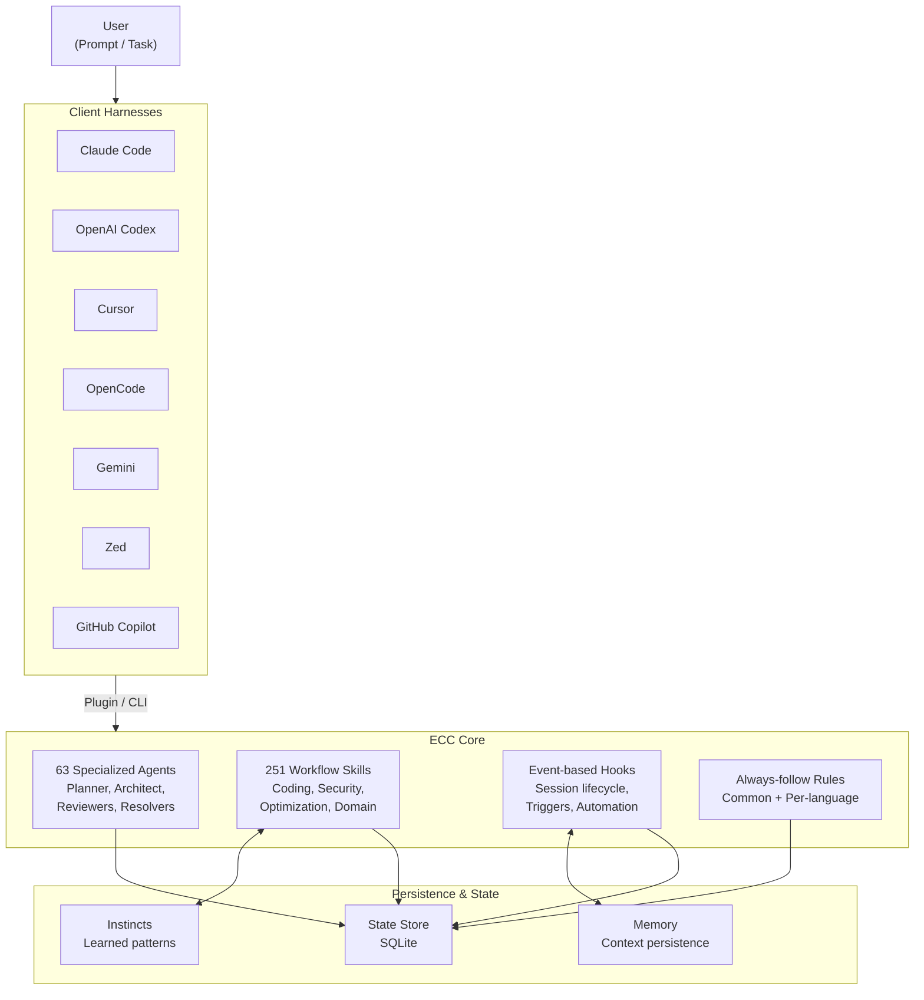

import Card from '@site/src/components/Card/Card';
import CardGroup from '@site/src/components/Card/CardGroup';
import Steps from '@site/src/components/Steps/Steps';
import Step from '@site/src/components/Steps/Step';

# Everything Claude Code (ECC)

**ECC** is the harness-native operator system for agentic work — a complete ecosystem of **63 specialized agents, 251 workflow skills, and 79 legacy command shims** built from 10+ months of intensive daily use building real products. Originally known as "Everything Claude Code," ECC won the Anthropic hackathon and has evolved into a cross-harness performance optimization system.

Works across **Claude Code**, **Codex**, **Cursor**, **OpenCode**, **Gemini**, **Zed**, and **GitHub Copilot** — with a shared architecture of skills, instincts, hooks, rules, memory optimization, continuous learning, security scanning, and research-first development.

:::info
ECC v2.0.0-rc.1 ships 63 agents, 251 skills, a Tkinter dashboard GUI, the Hermes operator story, and an in-tree Rust control-plane alpha (ECC 2.0). The OSS repo is MIT-licensed with 182K+ stars and 170+ contributors.
:::

## What's New in v2.0.0-rc.1

- **Dashboard GUI** — Tkinter desktop app (`npm run dashboard`) with dark/light theme, font customization, and search/filter across all components.
- **63 agents, 251 skills, 79 commands** — Public surface synced to the live repo with full plugin manifests.
- **Hermes operator** — Setup guide and cross-harness architecture for operator-driven workflows.
- **ECC 2.0 alpha** — Rust control-plane prototype (`ecc2/`) with `dashboard`, `start`, `sessions`, `status`, `stop`, and `resume` commands.
- **Operator status snapshots** — `ecc status --markdown --write status.md` for portable handoff state.
- **Skill packs** — Itô prediction-market skills, optimization skill pack (parallel execution, benchmark loops, latency-critical systems), and media/launch tooling (manim-video, remotion-video-creation).
- **AgentShield integration** — `/security-scan` skill runs 1282 tests across 102 rules directly from the harness.
- **Ecosystem hardening** — ECC Tools cost controls, billing portal, and website refreshes.

## Architecture



## Core Components

### Agents (63)

Specialized subagents for delegated tasks, preventing context bloat in the primary harness:

| Agent | Purpose |
|-------|---------|
| `planner` | Implementation blueprints |
| `architect` | System design & scalability |
| `tdd-guide` | Test-driven development |
| `code-reviewer` | Code quality & maintainability |
| `security-reviewer` | Vulnerability detection |
| `build-error-resolver` | Fix build/type errors |
| `python-reviewer` | Python code review |
| `typescript-reviewer` | TypeScript/JavaScript review |
| `go-reviewer` | Go code review |
| `rust-reviewer` | Rust code review |
| `java-reviewer` | Java/Spring Boot review |
| `kotlin-reviewer` | Kotlin/Android/KMP review |
| `database-reviewer` | PostgreSQL/Supabase |
| `mle-reviewer` | Production ML pipeline review |
| `loop-operator` | Autonomous loop execution |
| `harness-optimizer` | Harness config tuning |

### Skills (251)

Workflow definitions and domain knowledge organized into packs:

- **Coding standards** — Language best practices (TS, Python, Go, Rust, Java, Kotlin, C++, PHP, Perl, Swift)
- **Framework patterns** — Django, Laravel, Spring Boot, Quarkus, Next.js, NestJS
- **Security** — Security review, AgentShield scan, OWASP checks
- **Testing** — TDD workflow, E2E testing, verification loops, eval harness
- **Optimization** — Parallel execution, benchmark loops, cost-aware LLM pipeline, latency-critical systems
- **Continuous learning** — Instinct-based pattern extraction with confidence scoring

### Hooks

Trigger-based automations fired on tool events (PreToolUse, PostToolUse, Stop, SessionStart):

- **Session lifecycle** — Save state on exit, restore context on start
- **Safety checks** — Warn about secrets or debug logs before commits
- **Self-correction** — Suggest context compaction when window limits approach
- **Runtime controls** — `ECC_HOOK_PROFILE=minimal|standard|strict`, `ECC_DISABLED_HOOKS`, `ECC_SESSION_START_CONTEXT=off`

### Rules

Always-follow guidelines organized by scope:

- `rules/common/` — Language-agnostic: coding style, git workflow, testing (80%+ coverage), security, hooks architecture
- `rules/typescript/`, `rules/python/`, `rules/golang/`, `rules/swift/`, `rules/php/`, `rules/arkts/` — Per-language specifics

## Quick Start

<Steps>
<Step title="Install the Plugin (Recommended)">

```bash
# Add marketplace
/plugin marketplace add https://github.com/affaan-m/ECC

# Install plugin
/plugin install ecc@ecc
```
</Step>

<Step title="Or Install Selectively">

```bash
git clone https://github.com/affaan-m/ECC.git
cd ECC
npm install

# Minimal profile (no hooks)
./install.sh --profile minimal --target claude

# Core profile without hooks
./install.sh --profile core --without baseline:hooks --target claude
```
</Step>

<Step title="Copy Rules (Plugin Path Only)">

```bash
mkdir -p ~/.claude/rules/ecc
cp -R rules/common ~/.claude/rules/ecc/
cp -R rules/typescript ~/.claude/rules/ecc/
```
</Step>

<Step title="Launch Dashboard">

```bash
npm run dashboard
# or
python3 ./ecc_dashboard.py
```
</Step>

<Step title="Start Using">

```bash
# Plugin install uses canonical namespaced form
/ecc:plan "Add user authentication"

# Manual install uses shorter form
/plan "Add user authentication"
```
</Step>
</Steps>

:::warning
**Use exactly one install path.** Do not stack `/plugin install` with `./install.sh --profile full` or `npx ecc-install`. If things look duplicated, run `node scripts/ecc.js doctor && node scripts/ecc.js repair` before reinstalling.
:::

## Cross-Harness Support

ECC provides native support across all major AI coding harnesses:

<CardGroup cols={3}>
<Card title="Claude Code" href="https://github.com/affaan-m/ECC#step-1-install-the-plugin-recommended">
Primary target. Full plugin support with marketplace install, hooks, and slash commands.
</Card>

<Card title="OpenCode" href="https://github.com/affaan-m/ECC/tree/main/.opencode">
12 agents, 24 commands, 16 skills, 20+ hook event types, 3 custom tools (run-tests, check-coverage, security-audit).
</Card>

<Card title="OpenAI Codex" href="https://github.com/affaan-m/ECC/tree/main/.codex">
Codex app + CLI support with AGENTS.md-based integration and targeted installer.
</Card>

<Card title="Cursor" href="https://github.com/affaan-m/ECC/tree/main/.cursor">
Full rules, agents, and skills integration via Cursor's rule system.
</Card>

<Card title="Gemini" href="https://github.com/affaan-m/ECC/tree/main/.gemini">
Dedicated Gemini harness configuration with compatible agent descriptors.
</Card>

<Card title="Zed" href="https://github.com/affaan-m/ECC/tree/main/.zed">
Zed editor integration with hooks and rule support.
</Card>

<Card title="GitHub Copilot" href="https://github.com/affaan-m/ECC/tree/main/.github">
Coding agent compatibility with firewall and approval boundary patterns.
</Card>
</CardGroup>

### Package Manager Detection

ECC auto-detects your package manager (npm, pnpm, yarn, bun) via environment variable, project config, lock file, or global config:

```bash
# Set preferred package manager
export CLAUDE_PACKAGE_MANAGER=pnpm
node scripts/setup-package-manager.js --global pnpm
```

## Key Features

### Memory Persistence
Hooks automatically save and load context across sessions. `ECC_SESSION_START_MAX_CHARS` caps additional context (default 8000 chars). `ECC_SESSION_START_CONTEXT=off` disables it entirely for low-context setups.

### Continuous Learning v2
Instinct-based learning with confidence scoring, import/export, and evolution. The `/learn-eval` command extracts, evaluates, and saves patterns mid-session. The `/evolve` command clusters instincts into permanent skills.

### Verification Loops
Checkpoint and continuous evaluation modes with multiple grader types and pass@k metrics. `/checkpoint` saves verification state; `/quality-gate` enforces gates before merges.

### Parallelization
Git worktrees, cascade method, and multi-agent orchestration with PM2 integration. Commands like `/multi-plan`, `/multi-execute`, `/multi-backend`, `/multi-frontend`, and `/multi-workflow` manage complex multi-service workflows.

### Subagent Orchestration
Iterative retrieval pattern solving the context problem: progressive context refinement for subagents prevents context window overflow during complex multi-step tasks.

### Hook Runtime Controls

```bash
# Hook strictness profile
export ECC_HOOK_PROFILE=standard

# Disable specific hooks
export ECC_DISABLED_HOOKS="pre:bash:tmux-reminder,post:edit:typecheck"

# Suppress cost estimates
export ECC_CONTEXT_MONITOR_COST_WARNINGS=off
```

## Security & AgentShield

ECC includes **AgentShield**, a built-in security auditor that runs 1282 tests across 102 rules. The `/security-scan` skill scans for:

- Suspicious hooks and hidden prompt injection patterns
- Over-broad permissions in tool configurations
- Risky MCP server configurations and secret exposure
- Supply chain vulnerabilities in skills (inspired by Snyk's ToxicSkills study, which found 36% of public skills contained prompt injection)

The security guide covers CVE-2025-59536 (CVSS 8.7 — pre-trust hook execution) and CVE-2026-21852 (API key exfiltration via `ANTHROPIC_BASE_URL`), with practical guidance on sandboxing, sanitization, least-agency boundaries, and kill switches.

## References

- [GitHub Repository — affaan-m/ECC](https://github.com/affaan-m/ECC)
- [The Shorthand Guide](https://x.com/affaanmustafa/status/2012378465664745795) — Setup, foundations, philosophy
- [The Longform Guide](https://x.com/affaanmustafa/status/2014040193557471352) — Token optimization, memory, evals, parallelization
- [The Security Guide](https://x.com/affaanmustafa/status/2033263813387223421) — Attack vectors, sandboxing, AgentShield
- [npm: ecc-universal](https://www.npmjs.com/package/ecc-universal)
- [npm: ecc-agentshield](https://www.npmjs.com/package/ecc-agentshield)
- [ECC Tools GitHub App](https://github.com/marketplace/ecc-tools)
- [ECC Pro](https://ecc.tools/pricing)
