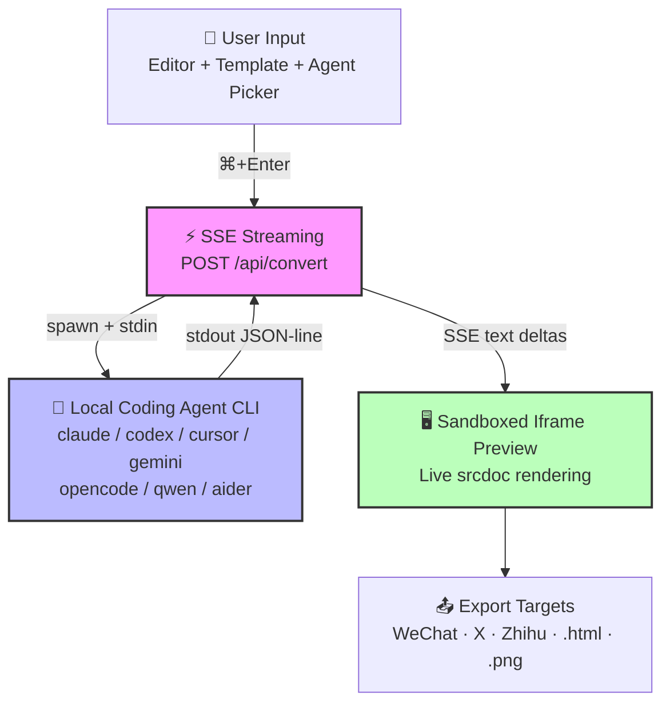

import Card from '@site/src/components/Card/Card';
import CardGroup from '@site/src/components/Card/CardGroup';
import Accordion from '@site/src/components/Accordion/Accordion';
import AccordionGroup from '@site/src/components/Accordion/AccordionGroup';
import Steps from '@site/src/components/Steps/Steps';

# HTML Anything: The Agentic HTML Editor

**HTML Anything** is an agentic HTML editor from the team behind [Open Design](https://github.com/nexu-io/open-design) (40k stars, 200+ contributors). Its philosophy is simple: **Markdown is the draft. HTML is what humans actually read.** Instead of hand-editing docs, your local AI agent writes production-grade HTML directly — local-first, zero API key, reusing the CLI session you already have logged in.

> "This works really well btw, at the end of your query ask your LLM to 'structure your response as HTML', then view the generated file in your browser."
>
> — [Andrei Karpathy](https://x.com/karpathy/status/2053872850101285137)

Karpathy's insight captures the trajectory: we're moving from raw text to markdown to HTML to eventually interactive neural simulations. HTML sits at the sweet spot right now — procedural enough to be precise, flexible enough for real layout, graphics, and interactivity.

## Core Advantages & Efficiency

HTML Anything transforms any input — Markdown, CSV, Excel, JSON, SQL, or raw notes — into a **ship-ready single-file HTML** in seconds. The argument for shipping HTML over Markdown is straightforward:

| | Markdown | HTML |
|---|---|---|
| **Audience** | Good for the writer | Good for the reader |
| **Layout** | Limited to the renderer | Layout is yours |
| **Screenshot** | Looks ugly in a tweet | Already looks designed |
| **Distribution** | Re-flow needed per platform | One-click format conversion |

:::info
Anthropic's Claude Code team [announced](https://x.com/trq212/status/2052809885763747935) they stopped writing internal docs in Markdown — they ship HTML now. **HTML is the final form for humans. Markdown is just an intermediate state during writing.**
:::

- **Zero API Key**: Reuses your existing logged-in session (`claude login`, `cursor login`, `gemini auth`). Marginal cost is **$0**.
- **8 Coding Agent CLIs**: Claude Code, Cursor Agent, OpenAI Codex, Gemini CLI, GitHub Copilot CLI, OpenCode, Qwen Coder, Aider — auto-detected on `PATH`.
- **75 Skill Templates**: Prototype, deck, frame, social, office, doc, mockup, vfx — each with an `example.html` you can preview.
- **9 Surface Modes**: Magazine article, keynote deck, résumé, poster, Xiaohongshu card, tweet card, web prototype, data report, Hyperframes video.

## Architecture & Workflow



## Integration with AI Agents

On startup, HTML Anything scans `PATH` (including `~/.local/bin`, `~/.bun/bin`, `/opt/homebrew/bin`, `~/.npm-global/bin` — directories normally missed by GUI-launched Node) and surfaces every recognized CLI:

<AccordionGroup>
  <Accordion title="Claude Code" icon="mdi:robot">
    Binary: `claude`
    Invocation: `claude -p --output-format stream-json`
  </Accordion>
  <Accordion title="OpenCode" icon="mdi:console">
    Binary: `opencode-cli` / `opencode`
    Invocation: `opencode run --format json --dangerously-skip-permissions -`
  </Accordion>
  <Accordion title="Cursor Agent" icon="mdi:cursor-default-click">
    Binary: `cursor-agent`
    Invocation: `cursor-agent --print --output-format stream-json --force --trust`
  </Accordion>
  <Accordion title="Gemini CLI" icon="mdi:google">
    Binary: `gemini`
    Invocation: `gemini --output-format stream-json --yolo`
  </Accordion>
  <Accordion title="GitHub Copilot CLI" icon="mdi:github">
    Binary: `copilot`
    Invocation: `copilot --allow-all-tools --output-format json`
  </Accordion>
  <Accordion title="OpenAI Codex" icon="mdi:brain">
    Binary: `codex`
    Invocation: `codex exec --json --sandbox workspace-write`
  </Accordion>
  <Accordion title="Qwen Coder" icon="mdi:code-braces">
    Binary: `qwen`
    Invocation: `qwen --yolo -`
  </Accordion>
  <Accordion title="Aider" icon="mdi:tools">
    Binary: `aider`
    Invocation: `aider --no-pretty --no-stream --yes-always --message-file -`
  </Accordion>
</AccordionGroup>

The detection strategy and per-CLI adapter are borrowed from [`nexu-io/open-design`](https://github.com/nexu-io/open-design) and [`multica-ai/multica`](https://github.com/multica-ai/multica): one privileged process spawns CLIs, JSON-line is the wire protocol.

## Skills Catalog

75 skills live under `src/lib/templates/skills/`, each following the Claude Code [`SKILL.md`](https://docs.anthropic.com/en/docs/claude-code/skills) convention with extended frontmatter (`mode`, `scenario`, `surface`, `preview`, `design_system`).

### Featured Skills

<CardGroup cols={2}>
  <Card title="deck-guizang-editorial" icon="mdi:presentation" href="https://github.com/nexu-io/html-anything/tree/main/src/lib/templates/skills/deck-guizang-editorial">
    Magazine × e-ink editorial deck, 10 locked layouts × 5 palettes (Ink, Indigo Porcelain, Forest Ink, Kraft, Dune).
  </Card>
  <Card title="deck-swiss-international" icon="mdi:grid" href="https://github.com/nexu-io/html-anything/tree/main/src/lib/templates/skills/deck-swiss-international">
    Swiss International, 16-column grid + saturated accent across 22 locked layouts.
  </Card>
  <Card title="doc-kami-parchment" icon="mdi:file-document" href="https://github.com/nexu-io/html-anything/tree/main/src/lib/templates/skills/doc-kami-parchment">
    Warm-parchment editorial, `#f5f4ed` ground + ink-blue accent + single serif voice.
  </Card>
  <Card title="magazine-poster" icon="mdi:newspaper" href="https://github.com/nexu-io/html-anything/tree/main/src/lib/templates/skills/magazine-poster">
    Newsprint broadsheet, oversized serif headline, dot-pattern cream ground.
  </Card>
  <Card title="video-hyperframes" icon="mdi:video" href="https://github.com/nexu-io/html-anything/tree/main/src/lib/templates/skills/video-hyperframes">
    6–10 sequential 1920×1080 frames, Remotion-compatible, hand off to render `.mp4`.
  </Card>
  <Card title="frame-glitch-title" icon="mdi:television" href="https://github.com/nexu-io/html-anything/tree/main/src/lib/templates/skills/frame-glitch-title">
    Cyan/magenta chromatic offset, CRT scanlines, corrupted-data subtitle.
  </Card>
</CardGroup>

### Skill Categories

<CardGroup cols={2}>
  <Card title="Web Prototypes" icon="mdi:web" href="https://github.com/nexu-io/html-anything/tree/main#web-prototypes--marketing-pages-prototype-mode">
    SaaS landing, waitlist, pricing, dashboard, docs page, blog post, mobile app, onboarding, gamified app, dating web, brutalist web, soft web, magazine article, e-guide, résumé, email marketing, wireframe sketch.
  </Card>
  <Card title="Decks (20 skills)" icon="mdi:presentation-play" href="https://github.com/nexu-io/html-anything/tree/main#decks-deck-mode-20-skills">
    Swiss International, Guizang Editorial, Open Slide Canvas, Magazine Web, Hermes Cyber, Replit, XHS Pastel/White/Post, tech sharing, product launch, pitch, blueprint, presenter mode, course module, graphify dark, Obsidian/Claude notes, safety alert, simple deck.
  </Card>
  <Card title="Frames &amp; VFX (12 skills)" icon="mdi:video-vintage" href="https://github.com/nexu-io/html-anything/tree/main#hyperframes-video-frames--vfx--device-mockups-frame--vfx--mockup-12-skills">
    Liquid hero, NYT data chart, sticky-note flowchart, glitch title, cinema light-leak, macOS notification, logo outro, motion frames, Hyperframes script, sprite animation, text-cursor VFX, 3D device mockup.
  </Card>
  <Card title="Social Cards" icon="mdi:share-variant" href="https://github.com/nexu-io/html-anything/tree/main#social-share-cards-social-mode">
    X/Twitter post, Spotify Wrapped, Reddit thread, carousel, Xiaohongshu card, Twitter pull-quote, social media dashboard, multi-platform matrix.
  </Card>
  <Card title="Office &amp; Operations" icon="mdi:office-building" href="https://github.com/nexu-io/html-anything/tree/main#office--operations-office--doc-mode">
    Kami parchment doc, PM spec, team OKRs, meeting notes, weekly update, kanban board, eng runbook, finance report, invoice, HR onboarding, data report, live dashboard, team workflow dashboard, keynote deck.
  </Card>
</CardGroup>

:::tip
Adding a skill takes one folder — copy a similar skill, edit its `SKILL.md` frontmatter, restart `pnpm dev`, and the picker shows it. See [CONTRIBUTING.md](https://github.com/nexu-io/html-anything/blob/main/CONTRIBUTING.md) for the bar a skill PR has to clear.
:::

## Six Load-Bearing Ideas

### 1. We Don't Ship an Agent. Yours Is Good Enough.

HTML Anything doesn't bundle its own LLM. It scans your `PATH` for whichever coding-agent CLIs you already have installed and authenticated. Each CLI gets a thin adapter (argv + stdin protocol + stream parser).

### 2. Skills Are Folders, Not Plugins

Following Claude Code's `SKILL.md` convention — `SKILL.md` + `assets/` + `references/` + `example.html`. Drop a folder into `src/lib/templates/skills/`, restart, the picker shows it.

### 3. Hard Constraints Stop the Model from Freestyling

Every template hardcodes design discipline:

- **CJK-first font stack** — `Noto Sans/Serif SC` for Chinese, `Inter` / `Manrope` for Latin
- **8 px baseline grid** — every spacing, line-height, font-size is a multiple of 8
- **No pure black / pure white** — rounded corners, soft shadows, visual de-slop-ification
- **Color contrast ≥ 4.5** — every interactive element has a real `:focus` state
- **Must use real data** — no lorem ipsum

This discipline comes from [`alchaincyf/huashu-design`](https://github.com/alchaincyf/huashu-design)'s Junior-Designer mode and anti-AI-slop checklist.

### 4. Streaming Render = Watch the AI Draw

`POST /api/convert` uses SSE. The agent's stdout is line-delimited JSON; the server extracts text deltas and re-emits them as SSE events; the client appends to the iframe's `srcdoc`. You watch the page render line by line. **Interrupt at any time** — you're not paying for a full generation you don't want.

### 5. One-Click Export = Zero Second-Pass Formatting

- **WeChat MP** — `juice` inlines CSS + `data-tool` markers → paste into the editor, styles survive end to end
- **X / Weibo / Xiaohongshu** — `modern-screenshot` renders the iframe to a 2× PNG → `ClipboardItem` → drop straight into the composer
- **Zhihu** — `<mjx-container>` replaced with `data-eeimg` LaTeX-image placeholders (Zhihu won't render KaTeX live)
- **Download `.html` / `.png`** — self-contained single file, shareable anywhere

Mechanically inspired by [`mdnice/markdown-nice`](https://github.com/mdnice/markdown-nice) and [`gcui-art/markdown-to-image`](https://github.com/gcui-art/markdown-to-image).

### 6. Sandboxed Iframe = Secure &amp; Isolated

User-emitted HTML always renders inside `<iframe sandbox="allow-scripts allow-same-origin">`. Third-party scripts (Tailwind CDN, Google Fonts, custom animations) still execute, but cookies and localStorage stay in the iframe's own origin — the host page is never poisoned.

## Setup &amp; Configuration

<AccordionGroup>
  <Accordion title="Clone Repository" icon="mdi:download">
    ```bash
    git clone https://github.com/nexu-io/html-anything
    cd html-anything
    ```
  </Accordion>
  <Accordion title="Install Dependencies" icon="mdi:cog">
    ```bash
    pnpm install
    ```
  </Accordion>
  <Accordion title="Start Development Server" icon="mdi:play">
    ```bash
    pnpm dev
    # → http://localhost:3000
    ```
  </Accordion>
</AccordionGroup>

Open the browser → the top bar auto-detects your installed coding-agent CLI → pick a template → paste content → ⌘+Enter. **No API key required.**

## Karpathy's Vision: The HTML Trajectory

Karpathy's tweet thread outlines the evolution of AI output formats — from raw text to eventually interactive neural simulations. His key observation: vision is the 10-lane superhighway of information into the brain. Around a third of our brains are a massively parallel processor dedicated to vision.

<Steps>
  <Step title="Raw Text">
    Hard and effortful to read. The baseline output of early LLMs — functional but visually flat.
  </Step>
  <Step title="Markdown">
    Bold, italic, headings, tables — a bit easier on the eyes. **Current default** for most AI outputs.
  </Step>
  <Step title="HTML">
    Still procedural with underlying code, but far more flexibility on graphics, layout, and interactivity. **Early but forming the new good default.**
  </Step>
  <Step title="Intermediate Formats">
    ...5, 6, ... — formats that blend procedural precision with neural generation.
  </Step>
  <Step title="Interactive Neural Videos &amp; Simulations">
    The extrapolation endpoint — interactive videos generated directly by diffusion neural nets, woven with procedural software artifacts.
  </Step>
</Steps>

HTML Anything sits squarely at step 3 — making HTML the practical, accessible default for AI-generated content today.

## References

- [GitHub Repository](https://github.com/nexu-io/html-anything)
- [Open Design (parent project)](https://github.com/nexu-io/open-design)
- [Karpathy's tweet on HTML](https://x.com/karpathy/status/2053872850101285137)
- [Claude Code team announcement](https://x.com/trq212/status/2052809885763747935)
- [Contributing Guide](https://github.com/nexu-io/html-anything/blob/main/CONTRIBUTING.md)
- [html-anything Discord](https://discord.gg/keeVPMrueT)
