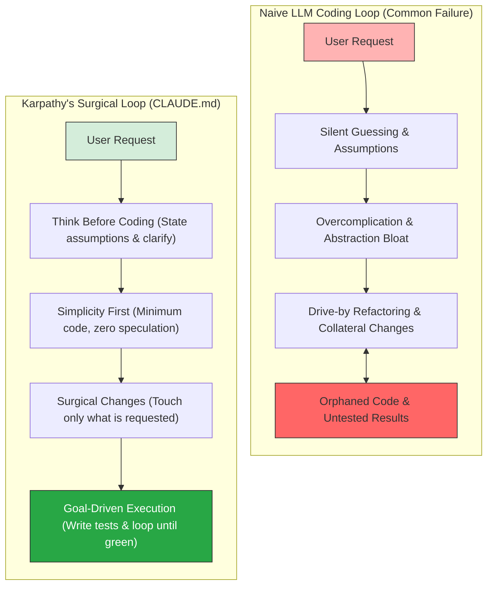

import Card from '@site/src/components/Card/Card';
import CardGroup from '@site/src/components/Card/CardGroup';
import Accordion from '@site/src/components/Accordion/Accordion';
import AccordionGroup from '@site/src/components/Accordion/AccordionGroup';
import Steps from '@site/src/components/Steps/Steps';
import Step from '@site/src/components/Steps/Step';

# Karpathy's LLM Coding Guidelines (CLAUDE.md)

Large Language Models (LLMs) and autonomous coding agents like Claude Code, Cursor, and Copilot are incredibly powerful, yet they exhibit recurring behavioral pitfalls when tasked with software engineering. 

As noted by **Andrej Karpathy** (former Director of AI at Tesla and OpenAI co-founder), modern models often suffer from a set of common failure modes: they make incorrect assumptions without checking, hide confusion, overcomplicate APIs, bloat abstractions, and perform unintended drive-by refactorings of orthogonal code.

To address these limitations, the developer community consolidated a set of behavioral guidelines known as the `CLAUDE.md` specification. These instructions bias coding agents toward caution, simplicity, and goal-driven verification.

---

## The LLM Coding Paradigm Shift

The standard, chat-centric way of interacting with LLMs often leads to overengineered codebases and silent failures. Karpathy's guidelines introduce a rigorous, surgical workflow that transforms coding agents into high-reliability tools.



## The Four Core Principles

The `CLAUDE.md` specification is organized around four pillar principles that address specific LLM cognitive failures.

<CardGroup cols={2}>
  <Card title="1. Think Before Coding" icon="mdi:brain">
    Forces agents to state assumptions explicitly, surface trade-offs, and ask clarifying questions instead of guessing.
  </Card>
  <Card title="2. Simplicity First" icon="mdi:xml">
    Demands the absolute minimum code to solve the problem. Avoids speculative configurability or single-use abstractions.
  </Card>
  <Card title="3. Surgical Changes" icon="mdi:scalpel">
    Ensures agents touch only what they must, match the project's existing style, and never refactor orthogonal code.
  </Card>
  <Card title="4. Goal-Driven Execution" icon="mdi:target">
    Leverages LLM capabilities in looping by transforming vague requests into declarative, verifiable test cases.
  </Card>
</CardGroup>

## Principle Deep Dives

<Steps>
  <Step title="Think Before Coding">
    > **"Don't assume. Don't hide confusion. Surface tradeoffs."**

    LLMs are trained to please and will often pick a random interpretation of an ambiguous prompt rather than admitting confusion. This principle instructs the agent to halt and reason before touching any file.

    *   **State assumptions explicitly:** Before writing any code, state how you understand the requirements. If there is uncertainty, ask the user.
    *   **Present multiple interpretations:** If a prompt has multiple valid implementations, lay them out clearly. Do not make choices silently.
    *   **Push back when warranted:** If a simpler alternative exists that the user might have missed, propose it.
    *   **Stop when confused:** If a dependency, API, or path is unclear, immediately raise a question.

    :::info
    By establishing a "Think-Before-Write" stage, agents save tokens and avoid the destructive pattern of generating incorrect, multi-file code blocks that require subsequent corrections.
    :::
  </Step>

  <Step title="Simplicity First">
    > **"Minimum code that solves the problem. Nothing speculative."**

    A frequent problem with AI-generated code is "abstraction bloat"—introducing interfaces, classes, configurations, and utilities that were not requested under the assumption of "future flexibility."

    *   **No speculative features:** Do not implement features or API options unless explicitly asked.
    *   **No single-use abstractions:** Do not create general wrappers or utility classes for code that is only run in a single location.
    *   **No unnecessary configuration:** Keep settings static until dynamic control is required.
    *   **No overengineered error handling:** Avoid writing extensive try-catch wrappers for highly speculative, impossible scenarios.
    *   **Rewrite to shrink:** If a solution ends up being 200 lines but could be achieved in 50 lines using vanilla constructs, rewrite and simplify.
  </Step>

  <Step title="Surgical Changes">
    > **"Touch only what you must. Clean up only your own mess."**

    LLMs often perform "drive-by refactorings," changing formatting, rewriting comments, or renaming variables in files orthogonal to the task because they believe they are "improving" the codebase. This ruins Git history and introduces side effects.

    *   **Respect boundaries:** Do not touch adjacent code, comments, or styling unless they directly relate to the change.
    *   **Match existing style:** Write code that blends seamlessly with the codebase, even if you prefer a different syntax or architecture.
    *   **Handle orphans precisely:** If your changes render a variable, import, or function unused, delete it. However, do **not** delete pre-existing dead code unless the user explicitly requested a cleanup.

    :::warning
    Drive-by changes are the primary cause of regression bugs in agentic software development. Maintaining a surgical diff is non-negotiable.
    :::
  </Step>

  <Step title="Goal-Driven Execution">
    > **"Define success criteria. Loop until verified."**

    Karpathy's key insight is that LLMs excel when they have a concrete success metric and can loop until it is met. By framing development as a set of verifiable checkpoints, you unlock the agent's full potential.

    | Instead of requesting... | Transform the task to... |
    | :--- | :--- |
    | *"Add input validation to this form"* | *"Write test cases for invalid inputs (empty, overflow, invalid email), then implement the validation until all tests pass."* |
    | *"Fix the database connection bug"* | *"Write a test that reproduces the connection failure, then fix the driver until the test passes."* |
    | *"Refactor this controller component"* | *"Verify that existing integration tests pass, refactor the controller, and ensure tests remain green."* |

    For complex, multi-step tasks, the agent must write out a verification plan:
    ```text
    1. [Step 1: Write reproducing test] → verify: [Run npm test and confirm failure]
    2. [Step 2: Apply the fix]          → verify: [Confirm test passes]
    3. [Step 3: Run full lint & build]   → verify: [Run npm run lint && npm run build]
    ```
  </Step>
</Steps>

## Installation & Setup

You can deploy Karpathy's guidelines to your development workflow in two ways: as a global Claude Code plugin or as a per-project `CLAUDE.md` rule.

<Steps>
  <Step title="Install as a Claude Code Plugin">
    If you use Anthropic's official **Claude Code** CLI, you can install the guidelines globally via the marketplace:

    ```bash
    # Add the marketplace to Claude Code
    /plugin marketplace add forrestchang/andrej-karpathy-skills

    # Install the skill
    /plugin install andrej-karpathy-skills@karpathy-skills
    ```
    This ensures that Claude Code automatically adheres to these guidelines across all your terminal sessions.
  </Step>

  <Step title="Set up Local Rules (CLAUDE.md)">
    For project-specific instructions that work across all agent tools (including Copilot, Windsurf, or Cline), create a `CLAUDE.md` file in the root of your repository:

    ```bash
    # For a new project, download the template
    curl -o CLAUDE.md https://raw.githubusercontent.com/multica-ai/andrej-karpathy-skills/main/CLAUDE.md
    
    # Or append it to an existing project rules file
    echo "" >> CLAUDE.md
    curl https://raw.githubusercontent.com/multica-ai/andrej-karpathy-skills/main/CLAUDE.md >> CLAUDE.md
    ```
  </Step>

  <Step title="Integrate with Cursor Rules">
    To apply these guidelines in **Cursor**, copy the pre-configured project rule to your repository:
    
    1. Create a directory called `.cursor/rules/` in your project root.
    2. Download the `.cursor/rules/karpathy-guidelines.mdc` file:
    
    ```bash
    mkdir -p .cursor/rules
    curl -o .cursor/rules/karpathy-guidelines.mdc https://raw.githubusercontent.com/multica-ai/andrej-karpathy-skills/main/.cursor/rules/karpathy-guidelines.mdc
    ```
    Cursor will now enforce these principles for every inline edit and composer session.
  </Step>
</Steps>

## Operational Impact

Implementing these instructions changes the developer-agent dynamic from passive instruction-following to surgical, high-reliability execution.

<AccordionGroup>
  <Accordion title="How do I know the guidelines are working?">
    You will observe:
    - **Fewer unnecessary changes in Git diffs:** Diffs are clean, focused, and represent exactly the feature requested.
    - **Fewer rewrites:** The agent asks questions *before* spending tokens and writing code, rather than debugging after a wrong assumption.
    - **No drive-by formatting edits:** Orthogonal file sections are left untouched, avoiding regressions.
  </Accordion>
  
  <Accordion title="What is the operational trade-off?">
    These guidelines bias heavily toward **caution and correctness over raw speed**. 
    
    For trivial changes (e.g., correcting a typo in a string or changing an obvious CSS color value), you do not need the full test-driven loop. Developers should exercise common sense and tell the agent to bypass the verification step when performing minor, low-risk updates.
  </Accordion>

  <Accordion title="Can I customize these guidelines?">
    Yes! The `CLAUDE.md` standard is explicitly designed to be modular. You should append project-specific rules at the bottom of the file, such as:
    - Language styling preferences (e.g., *"Use TypeScript strict mode"*).
    - Architecture rules (e.g., *"All business logic must go inside the services folder"*).
    - CI/CD constraints (e.g., *"Do not install new npm dependencies without explicit permission"*).
  </Accordion>
</AccordionGroup>

## References

*   **X (Twitter) Observation:** [Andrej Karpathy's Original LLM Post](https://x.com/karpathy/status/2015883857489522876)
*   **GitHub Repository:** [Andrej Karpathy Skills](https://github.com/multica-ai/andrej-karpathy-skills)
*   **Guideline Document:** [CLAUDE.md Source](https://github.com/multica-ai/andrej-karpathy-skills/blob/main/CLAUDE.md)
*   **Cursor Integration:** [CURSOR.md Source Guide](https://github.com/multica-ai/andrej-karpathy-skills/blob/main/CURSOR.md)
