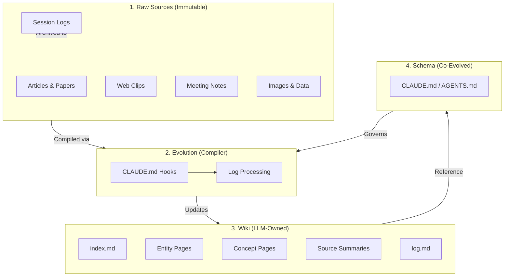

import { Icon } from '@iconify/react';
import Tabs from '@theme/Tabs';
import TabItem from '@theme/TabItem';

# Obsidian Skills & LLM Wiki

<Icon icon="simple-icons:obsidian" width="4em" height="4em" />

## Summary

**Obsidian Skills & LLM Wiki** represents a paradigm shift from traditional human-managed note-taking to an AI-orchestrated Knowledge Base. By leveraging **Claude Code** and the **Karpathy LLM Wiki pattern**, users can build a "self-evolving" digital garden where the AI acts as the primary librarian—ingesting sources, cross-referencing concepts, and maintaining a structured index—while the human remains as the high-level architect and curator.

The **LLM Wiki** approach moves beyond stateless RAG (Retrieval-Augmented Generation). Instead of rediscovering knowledge from scratch on every query, the LLM **incrementally builds a persistent wiki**—a structured codebase of knowledge that compounds over time.

> [!TIP]
> *"You never write the wiki yourself — the LLM writes and maintains all of it. You're in charge of sourcing, exploration, and asking the right questions."*
> — **Andrej Karpathy**

### Three-Layer Architecture



| Layer | Description | Ownership |
|---|---|---|
| **Raw Sources** (`raw/`) | Your curated collection of source documents. Articles, papers, images, and **Immutable Session Logs** (`daily_logs/`). | Human |
| **Evolution** (Compiler) | The logic that processes raw session logs into structured wiki knowledge. Triggered by Claude Code hooks. | System |
| **The Wiki** (`wiki/`) | LLM-generated markdown files: summaries, entity pages, concept pages, synthesis. Updated by the compiler. | LLM |
| **The Schema** (`CLAUDE.md`) | Tells the LLM how to govern the wiki and provides the instructions for the evolution hooks. | Co-evolved |

### Setup Guide

#### 1. Create Your Vault

```bash
mkdir ~/my-knowledge-base
cd ~/my-knowledge-base

# Create the three-layer structure
mkdir -p raw/assets wiki
```

Open this folder as a **Vault** in Obsidian.

#### 2. Initialize Claude Code

```bash
# Navigate to your vault
cd ~/my-knowledge-base

# Initialize Claude Code — this creates CLAUDE.md
claude init
```

#### 3. Configure `CLAUDE.md`

Your `CLAUDE.md` is the brain of the operation. It should define:

```markdown title="CLAUDE.md/AGENTS.md"
# LLM Wiki Schema

## Folder Structure
- `raw/` — Immutable source documents. Never modify these.
- `wiki/` — LLM-maintained knowledge base. You own this layer.
- `wiki/index.md` — Catalog of all wiki pages with one-line summaries.
- `wiki/log.md` — Chronological record of ingests, queries, and lint passes.

## Conventions
- Use YAML frontmatter on every wiki page (title, tags, sources, last_updated).
- Use [[wikilinks]] for cross-references between wiki pages.
- Keep summaries at the top of every page.
- When new data contradicts old claims, flag it explicitly.

## Workflows
### Ingest
When asked to ingest a source:
1. Read the source document in `raw/`.
2. Write a summary page in `wiki/`.
3. Update `wiki/index.md`.
4. Update relevant entity and concept pages.
5. Append an entry to `wiki/log.md`.

### Lint
Periodically health-check the wiki:
- Find contradictions between pages.
- Detect orphan pages with no inbound links.
- Flag stale claims superseded by newer sources.
- Identify important concepts lacking their own page.
```

#### 4. Start Working

```bash
# Open Claude Code in your vault
claude

# Example commands:
# "Ingest the article in raw/new-paper.md"
# "What do we know about X? Cite sources."
# "Lint the wiki — find orphans and contradictions."
# "Update the index."
```

### Key Operations

| <Icon icon="mdi:cogs" /> Operation | What Happens |
|---|---|
| **Ingest** | Drop a source into `raw/`, tell the LLM to process it. It reads, summarizes, updates the index, and touches 10-15 wiki pages per source. |
| **Query** | Ask questions against the wiki. The LLM reads the index first to find relevant pages, then synthesizes an answer with citations. Good answers get filed back as new wiki pages. |
| **Lint** | Health-check: contradictions, stale claims, orphan pages, missing cross-references, data gaps the LLM can suggest investigating. |

### Special Files

:::info Technical Specifications
The LLM Wiki relies on two core file types to maintain state and context across sessions:

- **`wiki/index.md`** — Content-oriented catalog. Each page listed with a link and one-line summary. The LLM reads this first when answering queries.
- **`wiki/log.md`** — Chronological, append-only record. Each entry prefixed with a parseable format:

```markdown title="wiki/log.md"
## [2026-04-12] ingest | Research Paper on Transformers
- Created wiki/transformers.md
- Updated wiki/attention-mechanisms.md
- Added cross-reference to wiki/neural-networks.md
```

```bash
# Quick way to see recent activity via CLI
grep "^## \[" wiki/log.md | tail -5
```
:::

### Recommended Obsidian Plugins

| Plugin | Purpose |
|---|---|
| **Obsidian Web Clipper** | Browser extension that converts web articles to markdown for your `raw/` folder. |
| **Dataview** | Runs queries over page frontmatter. Dynamic tables and lists from YAML metadata. |
| **Marp** | Markdown-based slide decks. Generate presentations directly from wiki content. |
| **Graph View** (built-in) | Visualize the shape of your wiki — what's connected, which pages are hubs, which are orphans. |

### Pro Tips

:::tip Best Practices
- **Download images locally:** In Obsidian Settings → Files and links, set "Attachment folder path" to `raw/assets/`. Then bind a hotkey for "Download attachments for current file" to keep images local for agent visibility.
- **Git version control:** The wiki is just a folder of markdown files. You get version history, branching, and collaboration for free.
- **Search at scale:** At small scale (~100 sources), the `index.md` file is sufficient. As the wiki grows, consider [qmd](https://github.com/tobi/qmd) — a local search engine for markdown with hybrid BM25/vector search.
:::

---

## Evolution: Autonomous Memory (Cole Medin Pattern)

The most valuable data in your wiki is often the context generated during your own research and coding sessions. The **Autonomous Memory** pattern uses Claude Code's lifecycle hooks to automate the ingestion of these sessions, turning your terminal into a "Self-Evolving Code Memory."

### The Compiler Workflow

This pattern treats your session history like **Source Code** and your Wiki like a **Compiled Executable**.

1.  **Record:** Every session with Claude Code is summarized.
2.  **Archive:** Summaries are saved as immutable logs in `raw/daily_logs/`.
3.  **Compile:** A background process (the "Compiler") reads new logs and updates the relevant pages in `wiki/`.
4.  **Reference:** Future sessions load the updated wiki, ensuring the agent "remembers" previous architectural decisions.

### Claude Code Lifecycle Hooks

To implement this, you can configure `CLAUDE.md` to trigger specific actions at key points in the session lifecycle:

| Hook | Purpose | Action |
|---|---|---|
| `session_start` | **Restore Context** | Automatically reads `index.md` and relevant `wiki/` pages to ground the agent. |
| `pre_compact` | **Synthesize** | Summarizes the current conversation before the context window is pruned or the session ends. |
| `session_end` | **Archival** | Appends the synthesized summary to `raw/daily_logs/` and triggers a compilation pass. |

### Bootstrapping with a One-Shot Prompt

You can initialize this entire autonomous system in a new vault by providing a single "Meta-Instruction" prompt to Claude Code that defines the folder structure and sets up the hook logic in `CLAUDE.md`.

:::info Pro Tip
Use the [Claude Agent SDK](https://github.com/anthropics/claude-sdk) to build specialized "Compiler" scripts that handle the multi-file updates required when a single session touches multiple wiki concepts.
:::

---

## Integration: obsidian-skills (Kepano)

Kepano's [obsidian-skills](https://github.com/kepano/obsidian-skills) provide structured skill files that teach AI agents how to work with Obsidian-specific formats and tooling. This integrates seamlessly into the LLM Wiki pattern by providing the "how-to" for specific document types.

### Installation

```bash
npx skills add git@github.com:kepano/obsidian-skills.git
```

### Available Skills

| Skill | Description |
|-------|-------------|
| [obsidian-markdown](skills/obsidian-markdown) | Create and edit [Obsidian Flavored Markdown](https://help.obsidian.md/obsidian-flavored-markdown) (`.md`) with wikilinks, embeds, callouts, properties, and other Obsidian-specific syntax |
| [obsidian-bases](skills/obsidian-bases) | Create and edit [Obsidian Bases](https://help.obsidian.md/bases/syntax) (`.base`) with views, filters, formulas, and summaries |
| [json-canvas](skills/json-canvas) | Create and edit [JSON Canvas](https://jsoncanvas.org/) files (`.canvas`) with nodes, edges, groups, and connections |
| [obsidian-cli](skills/obsidian-cli) | Interact with Obsidian vaults via the [Obsidian CLI](https://help.obsidian.md/cli) including plugin and theme development |
| [defuddle](skills/defuddle) | Extract clean markdown from web pages using [Defuddle](https://github.com/kepano/defuddle-cli), removing clutter to save tokens |

---

## <Icon icon="mdi:account-group" /> Community Implementations

Projects inspired by the LLM Wiki pattern:

| Project | Description |
|---|---|
| [claude-memory-compiler](https://github.com/coleam00/claude-memory-compiler) | **(New)** Cole Medin's automated system for compiling session logs into Obsidian knowledge. |
| [claude-obsidian](https://github.com/AgriciDaniel/claude-obsidian) | Full Claude Code plugin with hot cache and autonomous research loops. |
| [llm-context-base](https://github.com/asakin/llm-context-base) | Git template with a built-in convention training period. |
| [memory-toolkit](https://github.com/IlyaGorsky/memory-toolkit) | structured decision tracking and session lifecycle management. |
| [kb-wiki](https://github.com/samstill/kb-wiki) | MCP-native implementation with local vector search (sqlite-vec). |
| [OmegaWiki](https://github.com/skyllwt/OmegaWiki) | Central hub for the full-lifecycle research platform. |

## <Icon icon="mdi:link-variant" /> References

- [Andrej Karpathy - LLM Wiki (llm-wiki.md gist)](https://gist.github.com/karpathy/442a6bf555914893e9891c11519de94f)
- [Andrej Karpathy - LLM Knowledge Bases - on X](https://x.com/karpathy/status/2039805659525644595?s=61)
- [Video: Karpathy LLM Knowledge Bases Pattern](https://www.youtube.com/watch?v=sboNwYmH3AY)
- [Video: Autonomous Claude Code Memory (Cole Medin)](https://www.youtube.com/watch?v=7huCP6RkcY4)
- [Kepano obsidian-skills](https://github.com/kepano/obsidian-skills)
- [qmd - Local Markdown Search Engine](https://github.com/tobi/qmd)