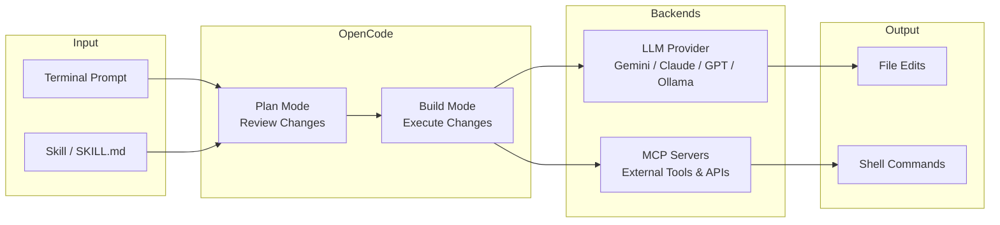

import Card from '@site/src/components/Card/Card';
import CardGroup from '@site/src/components/Card/CardGroup';
import Accordion from '@site/src/components/Accordion/Accordion';
import AccordionGroup from '@site/src/components/Accordion/AccordionGroup';
import Steps from '@site/src/components/Steps/Steps';
import Tabs from '@theme/Tabs';
import TabItem from '@theme/TabItem';

# OpenCode: Terminal-First AI Coding Agent

OpenCode is an open-source command-line interface built for AI-assisted development. It abstracts over 75+ LLM providers—including OpenAI, Anthropic, Google Gemini, and local models—behind a single, uniform `opencode` command. Rather than locking you into one provider's subscription, it lets you bring your own credentials, switch models on demand, and extend behavior through plugins and Agent Skills.

Its terminal-native design (powered by the Bubble Tea TUI framework) means it integrates directly with your shell, files, and git state, making it a capable agentic development environment without a browser tab in sight.

## Core Advantages & Efficiency

OpenCode eliminates the friction of juggling multiple provider SDKs and browser-based AI tools by centralizing everything in the terminal.

:::info
OpenCode supports **75+ models and providers** — use your existing subscriptions across OpenAI, Anthropic, Gemini, Ollama, OpenRouter, and more from a single CLI.
:::

- **Provider-Agnostic**: Swap models without changing your workflow; credentials are managed per-provider.
- **Plan & Build Modes**: The agent proposes a change plan for your review before touching a single file.
- **LSP Integration**: Native Language Server Protocol support for code intelligence directly in the TUI.
- **Security-First**: Granular permission system — control read/write/tool access per session or globally.
- **Skill Discovery**: Automatically scans `.agents/skills` and `.opencode/skills` for reusable `SKILL.md` workflows.
- **MCP Support**: Acts as both MCP client (consuming tools) and MCP server (exposing its own capabilities).

## Agent Modes

OpenCode lets you tune how much autonomy the agent has for any given session:

| Mode | Flag | Behaviour |
|---|---|---|
| Ask | `-ask` | Read-only — no file changes, answers questions only |
| Edit | `-edit` | Can read and write files, no shell commands |
| Safe | `-safe` | Files + restricted shell (no destructive commands) |
| Agent | `-agent` | Full access — files, shell, and all registered tools |

:::tip
Start with `-ask` when exploring an unfamiliar codebase, then escalate to `-agent` once you trust the context.
:::

## Architecture & Workflow



## Advanced Capabilities

<CardGroup cols={2}>
  <Card title="Agent Modes" icon="mdi:layers" href="opencode#agent-modes">
    Toggle between `-ask` (read-only), `-edit` (file modifications), `-safe`, and `-agent` (full access) to match the task's required autonomy level.
  </Card>
  <Card title="Agent Skills" icon="mdi:lightning-bolt" href="opencode#agent-skills">
    Define reusable `SKILL.md` workflows in `.agents/skills/`. OpenCode discovers and loads them dynamically—no restart required for most changes.
  </Card>
  <Card title="MCP Integration" icon="mdi:connection" href="opencode#mcp-integration">
    Add MCP servers to your config and their tools become available to the agent automatically. OpenCode can also act as an MCP server for other tools.
  </Card>
  <Card title="Desktop & IDE" icon="mdi:monitor" href="https://opencode.ai">
    Available as a TUI, desktop app, and IDE extension (VS Code, Cursor, JetBrains) — choose your surface.
  </Card>
</CardGroup>

## Agent Skills

OpenCode provides first-party support for Agent Skills, which allow the agent to discover and load reusable workflow instructions from `SKILL.md` files.

<AccordionGroup>
  <Accordion title="Skill Discovery & Directory Scanning" icon="mdi:folder-search">
    OpenCode automatically scans multiple paths to discover and register skills:
    - `.agents/skills/` — shared across all AI tools in the project
    - `.opencode/skills/` — OpenCode-specific skills

    Its adaptive directory sensing means you are not restricted to a single folder structure. Symbolic links are fully supported, making `.agents/skills` a centralized "source of truth" usable across Claude Code, OpenCode, and other agents simultaneously.
  </Accordion>
  <Accordion title="Symlink Setup for Cross-Agent Skills" icon="mdi:link-variant">
    Using symlinks lets multiple agents share one skill set without duplicating files:

    ```bash
    # Link OpenCode's skill directory to the shared .agents/skills location
    ln -s "$(pwd)/.agents/skills" .opencode/skills
    ```

    This creates a single source of truth in `.agents/skills` that all your AI tools point to, eliminating redundancy.
  </Accordion>
  <Accordion title="Refreshing Skills" icon="mdi:refresh">
    To register a newly installed or manually created skill, restart the OpenCode session. Use `/session` after restart to restore your previous context:

    ```bash
    # After restarting, restore the last session
    /session
    ```
  </Accordion>
</AccordionGroup>

## MCP Integration

OpenCode uses the Model Context Protocol (MCP) as the standard for connecting to external tools and data sources.

:::tip
MCP servers are configured once in `opencode.json` and their tools are automatically available to the agent in every session — no per-session setup needed.
:::

```json title="~/.config/opencode/opencode.json — adding an MCP server"
{
  "$schema": "https://opencode.ai/config.json",
  "mcp": {
    "my-tool": {
      "command": "npx",
      "args": ["-y", "my-mcp-server@latest"]
    }
  }
}
```

## Setup & Configuration

<Steps>
  <Step title="Install OpenCode">
    Run the official install script:
    ```bash
    curl -fsSL https://opencode.ai/install | bash
    ```
  </Step>
  <Step title="Create Configuration File">
    OpenCode reads from `~/.config/opencode/opencode.json`. Start with:
    ```json title="~/.config/opencode/opencode.json"
    {
      "$schema": "https://opencode.ai/config.json"
    }
    ```
  </Step>
  <Step title="Add a Provider">
    Configure your preferred provider credentials. Example for Anthropic:
    ```json
    {
      "$schema": "https://opencode.ai/config.json",
      "providers": {
        "anthropic": {
          "apiKey": "sk-ant-..."
        }
      }
    }
    ```
  </Step>
  <Step title="Launch">
    Run `opencode` in your project directory. The TUI will open with Vim-style keybindings:
    ```bash
    opencode
    ```
  </Step>
</Steps>

## Free Model Access via Google Gemini

You can use OpenCode with Google's free Gemini plan by installing the `opencode-gemini-auth` plugin. This authenticates with your Google account via OAuth, consuming your free Gemini quota without an API key.

:::warning
Using the `opencode-antigravity-auth` plugin to access Claude Opus and Gemini Pro for free [may violate Google's Terms of Service](https://www.reddit.com/r/GoogleAntigravityIDE/comments/1qgx07v/comment/o0fz6os/). Use a test or secondary account if you try it.
:::

<Steps>
  <Step title="Add the Gemini Auth Plugin">
    ```json title="~/.config/opencode/opencode.json"
    {
      "$schema": "https://opencode.ai/config.json",
      "plugin": ["opencode-gemini-auth@latest"]
    }
    ```
  </Step>
  <Step title="Authenticate with Google">
    ```bash
    opencode auth login
    ```
    An OAuth window opens. Choose **Google** → **OAuth with Google (Gemini CLI)**.
  </Step>
  <Step title="Use Free Models">
    Once authenticated, models like the following are available (free tier, quota-limited):

    ```
    Gemini 2.5 Pro
    Gemini 2.5 Flash
    Gemini 3 Pro preview  (1M+ context)
    Gemini 3.1 Pro preview (1M+ context)
    Gemini 3 Flash preview
    Gemini Flash Lite
    ```
  </Step>
</Steps>

## Other Free & Low-Cost Options

<Tabs groupId="free-providers">
  <TabItem value="local" label="Self-Hosted / Local" default>
    Run local LLMs via Ollama or LM Studio — no API costs beyond your hardware:
    ```bash
    # Example: run Mistral locally via Ollama
    ollama pull mistral
    # Then configure opencode to use localhost:11434
    ```
  </TabItem>
  <TabItem value="openai" label="OpenAI Trial">
    New accounts receive $5–$18 in free credits. Configure in `opencode.json`:
    ```json
    {
      "providers": {
        "openai": { "apiKey": "sk-..." }
      }
    }
    ```
  </TabItem>
  <TabItem value="huggingface" label="Hugging Face">
    Use the Hugging Face Inference API free tier with `hf` credentials for many community models.
  </TabItem>
  <TabItem value="other" label="Other Providers">
    Anthropic, Cohere, and others frequently offer free tiers or developer credits. OpenCode's plugin system makes it easy to add support.
  </TabItem>
</Tabs>

## References

- [OpenCode Official Site](https://opencode.ai) — Documentation and install guides.
- [OpenCode GitHub](https://github.com/sst/opencode) — Source code and issue tracker.
- [Claude Code](./claude-code.md) — Anthropic's agentic CLI; shares `.agents/skills` conventions.
- [Graphify](../Tools/graphify.md) — Knowledge graph tool with native OpenCode MCP interoperability.
- [Model Context Protocol](https://modelcontextprotocol.io) — MCP specification and server registry.
