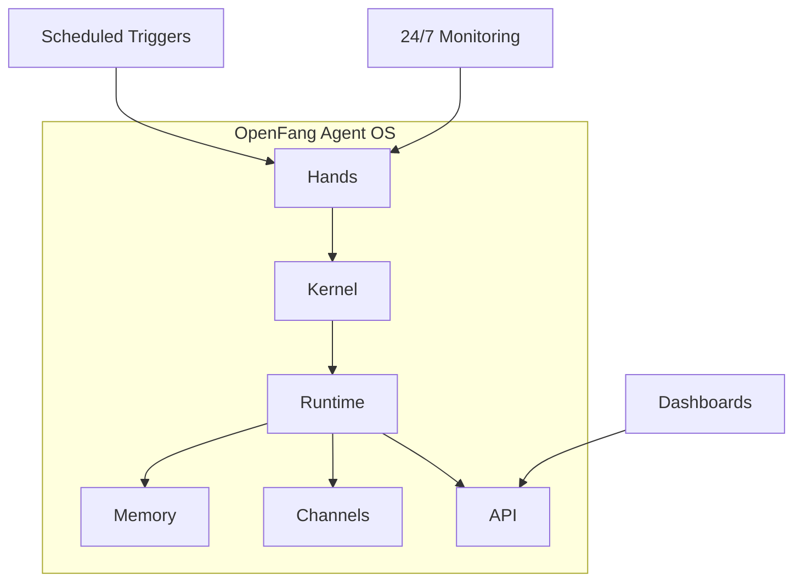
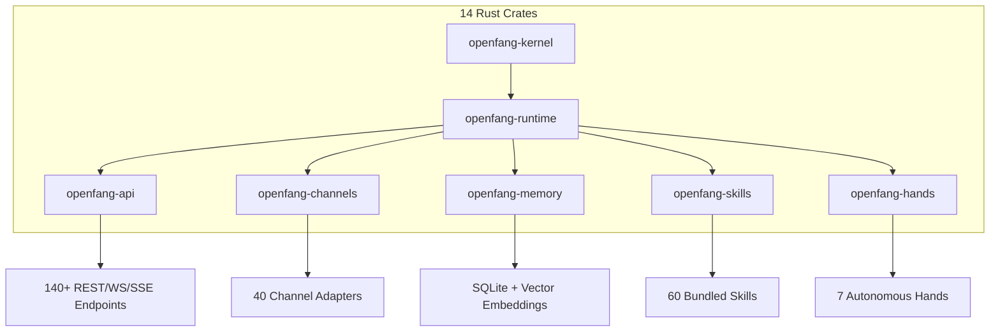

import Tabs from '@theme/Tabs';
import TabItem from '@theme/TabItem';
import Card from '@site/src/components/Card/Card';
import CardGroup from '@site/src/components/Card/CardGroup';
import Accordion from '@site/src/components/Accordion/Accordion';
import AccordionGroup from '@site/src/components/Accordion/AccordionGroup';
import Steps from '@site/src/components/Steps/Steps';
import Step from '@site/src/components/Steps/Step';

# OpenFang - Production-Grade Agent OS in Pure Rust

OpenFang is an **open-source Agent Operating System** — not a chatbot framework, not a Python wrapper around an LLM, not a generic multi-agent orchestrator. It is a full operating system for autonomous agents, built from scratch in Rust.

Traditional agent frameworks wait for you to type something. OpenFang runs **autonomous agents that work for you** — on schedules, 24/7, building knowledge graphs, monitoring targets, generating leads, managing your social media, and reporting results to your dashboard.



## Executive Summary

OpenFang is a **production-grade Agent Operating System** built entirely in Rust — not a Python wrapper, not a chatbot framework, not a generic multi-agent orchestrator. It is a complete operating system for autonomous agents that work for you 24/7.

**Why it matters:** Traditional agent frameworks wait for user input. OpenFang's "Hands" run autonomously on schedules — building knowledge graphs, monitoring targets, generating leads, managing social media, and delivering results to your dashboard.

**Key highlights:**
- **137,728 lines of Rust code** across 14 crates
- **&lt;200ms cold start** — 15-25x faster than Python frameworks
- **40 MB idle memory** — 5-10x more efficient than alternatives
- **Single 32 MB binary** — no Docker, no Python dependencies
- **16 security layers** — defense in depth for production
- **40 channel adapters** — Telegram, Slack, Discord, WhatsApp, and more
- **27 LLM providers** — 123+ models supported

**Best for:** Production deployments requiring low latency, high security, and 24/7 autonomous operation.

## Key Specifications

| Metric | Value |
|--------|-------|
| **Lines of Code** | 137,728 |
| **Rust Crates** | 14 |
| **Test Suite** | 1,767+ passing tests |
| **Code Quality** | Zero clippy warnings |
| **Binary Size** | ~32 MB (single binary) |
| **License** | MIT |

## Architecture



### Core Crates

| Crate | Purpose |
|-------|---------|
| `openfang-kernel` | Orchestration, workflows, metering, RBAC, scheduler |
| `openfang-runtime` | Agent loop, 3 LLM drivers, 53 tools, WASM sandbox |
| `openfang-api` | 140+ REST/WS/SSE endpoints, OpenAI-compatible API |
| `openfang-channels` | 40 messaging adapters with rate limiting |
| `openfang-memory` | SQLite persistence, vector embeddings, canonical sessions |
| `openfang-skills` | 60 bundled skills, SKILL.md parser, FangHub marketplace |
| `openfang-hands` | 7 autonomous Hands, HAND.toml parser |
| `openfang-desktop` | Tauri 2.0 native app (system tray, notifications) |

## Hands: Autonomous Capability Packages

*"Traditional agents wait for you to type. Hands work **for** you."*

**Hands** are OpenFang's core innovation — pre-built autonomous capability packages that run independently, on schedules, without you having to prompt them.

<CardGroup cols={3}>
  <Card title="Clip" icon="mdi:video-cut">
    YouTube URL → download → identify best moments → cut into vertical shorts with captions → publish to Telegram/WhatsApp.
  </Card>
  <Card title="Lead" icon="mdi:account-search">
    Daily discovery of prospects matching ICP, enrichment, scoring 0-100, deduplication, CSV/JSON/Markdown delivery.
  </Card>
  <Card title="Collector" icon="mdi:database-search">
    OSINT-grade intelligence, continuous monitoring, change detection, knowledge graph construction.
  </Card>
  <Card title="Predictor" icon="mdi:chart-timeline-variant">
    Superforecasting engine with calibrated reasoning, Brier score tracking, contrarian mode.
  </Card>
  <Card title="Researcher" icon="mdi:book-open-variant">
    Deep autonomous cross-referencing, CRAAP evaluation, APA-formatted reports, multi-language.
  </Card>
  <Card title="Twitter" icon="mdi:twitter">
    Autonomous account manager, 7 rotating content formats, scheduling, approval queue.
  </Card>
  <Card title="Browser" icon="mdi:web">
    Web automation, multi-step workflows, mandatory purchase approval gate.
  </Card>
</CardGroup>

```bash title="Terminal"
# Activate the Researcher Hand — it starts working immediately
openfang hand activate researcher

# Check its progress
openfang hand status researcher

# Activate lead generation on a daily schedule
openfang hand activate lead

# List all available Hands
openfang hand list
```

## Performance & Efficiency

<Tabs groupId="benchmarks">
  <TabItem value="metrics" label="Performance Metrics" default>
    | Tool | Cold Start | Idle Memory | Install Size |
    |------|------------|-------------|---------------|
    | ZeroClaw | 10 ms | 5 MB | 8.8 MB |
    | **OpenFang** | **180 ms** | **40 MB** | **32 MB** |
    | LangGraph | 2.5 sec | 180 MB | 150 MB |
    | CrewAI | 3.0 sec | 200 MB | 100 MB |
    | AutoGen | 4.0 sec | 250 MB | 200 MB |
    | OpenClaw | 5.98 sec | 394 MB | 500 MB |
  </TabItem>
  <TabItem value="efficiency" label="Efficiency Comparison">
    :::tip Efficiency Gains
    OpenFang provides a **15-25x faster cold start** and **5-10x lower idle memory** compared to Python-based multi-agent frameworks.
    :::
  </TabItem>
</Tabs>

## 16 Security Systems — Defense in Depth

OpenFang implements a multi-layered security architecture to ensure production-grade safety.

<AccordionGroup>
  <Accordion title="Core Execution Security" icon="mdi:shield-check">
    - **WASM Dual-Metered Sandbox**: Tool code runs in WebAssembly with fuel metering + epoch interruption.
    - **Subprocess Sandbox**: Process tree isolation with cross-platform kill.
    - **Loop Guard**: SHA256-based tool call loop detection.
    - **Secret Zeroization**: Auto-wipes API keys from memory instantly.
  </Accordion>
  <Accordion title="Data & Audit Integrity" icon="mdi:history">
    - **Merkle Hash-Chain Audit Trail**: Cryptographically linked audit trail, tamper-evident.
    - **Information Flow Taint Tracking**: Secrets tracked from source to sink.
    - **Session Repair**: 7-phase message history validation.
    - **Ed25519 Signed Agent Manifests**: Cryptographically signed agent identities.
  </Accordion>
  <Accordion title="Network & Infrastructure" icon="mdi:lan-check">
    - **SSRF Protection**: Blocks private IPs, cloud metadata, DNS rebinding.
    - **OFP Mutual Authentication**: HMAC-SHA256 nonce-based P2P verification.
    - **GCRA Rate Limiter**: Token bucket rate limiting per-IP.
    - **Security Headers**: CSP, X-Frame-Options, HSTS on every response.
  </Accordion>
  <Accordion title="Access & Validation" icon="mdi:lock-open-variant">
    - **Capability Gates**: Role-based access control enforcement.
    - **Prompt Injection Scanner**: Detects override attempts and exfiltration patterns.
    - **Path Traversal Prevention**: Canonicalization with symlink escape prevention.
    - **Health Endpoint Redaction**: Minimal public health info, auth required for diagnostics.
  </Accordion>
</AccordionGroup>

## Channel Adapters

OpenFang supports 40 messaging platform integrations out of the box.

<AccordionGroup>
  <Accordion title="Personal & Privacy" icon="mdi:message-text">
    **Core**: Telegram, Discord, Slack, WhatsApp, Signal, Matrix, Email.
    **Privacy**: Threema, Nostr, Rocket.Chat, Ntfy, Gotify.
  </Accordion>
  <Accordion title="Business & Enterprise" icon="mdi:office-building">
    **Enterprise**: Microsoft Teams, Mattermost, Google Chat, Webex, Feishu, Zulip.
    **Workplace**: Pumble, Flock, Twist, DingTalk, Zalo, Webhooks.
  </Accordion>
  <Accordion title="Social & Community" icon="mdi:share-variant">
    **Social**: LINE, Viber, Facebook Messenger, Mastodon, Bluesky, Reddit, LinkedIn.
  </Accordion>
</AccordionGroup>

## LLM Providers

Support for 27 providers and 123+ models.

<Accordion title="View Supported Providers" icon="mdi:brain">
| Provider | Models |
|----------|--------|
| Anthropic | Claude family |
| Gemini | Gemini family |
| OpenAI | GPT family |
| Groq | Llama, Mixtral |
| DeepSeek | DeepSeek family |
| OpenRouter | 200+ models |
| Mistral | Mistral family |
| Fireworks | Llama, Mixtral |
| Cohere | Command family |
| Perplexity | Online models |
| xAI | Grok |
| HuggingFace | 1000s of models |
| Ollama | Local models |
| vLLM | Local serving |
| And more... | |
</Accordion>

## Getting Started

### Installation

<Steps>
  <Step title="Run Install Script">
    ```bash title="Terminal"
    # macOS/Linux
    curl -fsSL https://openfang.sh/install | sh

    # Windows (PowerShell)
    irm https://openfang.sh/install.ps1 | iex
    ```
  </Step>
</Steps>

### Quick Start

<Steps>
  <Step title="Initialize">
    Walk through the provider setup.
    ```bash title="Terminal"
    openfang init
    ```
  </Step>
  <Step title="Start the Daemon">
    ```bash title="Terminal"
    openfang start
    ```
    The dashboard is now live at `http://localhost:4200`.
  </Step>
  <Step title="Activate a Hand">
    Activate a pre-built autonomous package.
    ```bash title="Terminal"
    openfang hand activate researcher
    ```
  </Step>
  <Step title="Chat or Spawn">
    ```bash title="Terminal"
    # Chat with an agent
    openfang chat researcher

    # Spawn a pre-built agent
    openfang agent spawn coder
    ```
  </Step>
</Steps>

### OpenAI-Compatible API

```bash title="Terminal"
curl -X POST localhost:4200/v1/chat/completions \
  -H "Content-Type: application/json" \
  -d '{
    "model": "researcher",
    "messages": [{"role": "user", "content": "Analyze Q4 market trends"}],
    "stream": true
  }'
```

## Migration from OpenClaw

```bash title="Terminal"
# Migrate everything — agents, memory, skills, configs
openfang migrate --from openclaw

# Dry run first
openfang migrate --from openclaw --dry-run
```

## Feature Comparison

<Tabs groupId="feature-compare">
  <TabItem value="capabilities" label="Core Capabilities" default>
| Feature | OpenFang | OpenClaw | ZeroClaw | CrewAI | AutoGen | LangGraph |
|---------|----------|----------|----------|--------|---------|-----------|
| **Language** | Rust | Rust | Rust | Python | Python | Python |
| **Autonomous Hands** | 7 built-in | None | None | None | None | None |
| **Security Layers** | 16 | 3 | 6 | 1 | 1 | 2 |
| **Channel Adapters** | 40 | 13 | 15 | 0 | 0 | 0 |
  </TabItem>
  <TabItem value="footprint" label="Resource Footprint">
| Metric | OpenFang | OpenClaw | ZeroClaw | CrewAI | AutoGen | LangGraph |
|---------|----------|----------|----------|--------|---------|-----------|
| **Cold Start** | `<200ms` | ~6s | ~10ms | ~3s | ~4s | ~2.5s |
| **Idle Memory** | 40 MB | 394 MB | 5 MB | 200 MB | 250 MB | 180 MB |
| **Install Size** | 32 MB | 500 MB | 8.8 MB | 100 MB | 200 MB | 150 MB |
  </TabItem>
</Tabs>

## When to Use

- ✅ Production deployments requiring low latency
- ✅ High-performance agent infrastructure
- ✅ Rust ecosystems
- ✅ Memory-efficient deployments (40 MB idle)
- ✅ 24/7 autonomous agents running on schedules
- ✅ Multi-channel deployments (40+ platforms)
- ✅ Security-sensitive environments (16 security layers)
- ✅ Self-hosted AI agent platforms

## Alternatives (Self-Hosted)

| Project | Stars | Language | Description | Best For |
|---------|-------|----------|-------------|----------|
| [LangGraph](https://github.com/langchain-ai/langgraph) | 6500+ | Python | Graph-based agent orchestration with cycles | Complex workflows |
| [CrewAI](https://github.com/crewAIInc/crewAI) | 32000+ | Python | Multi-agent framework with role-based agents | Multi-agent teams |
| [AutoGen](https://github.com/microsoft/autogen) | 38000+ | Python | Microsoft multi-agent conversation framework | Enterprise deployments |
| [OpenAGI](https://github.com/agiresearch/OpenAGI) | 7000+ | Python | Open-source AGI research platform | Research projects |
| [AgentVerse](https://github.com/agents-ai/agentverse) | 6000+ | Python | Flexible multi-agent framework | Dynamic collaboration |

## Community

| Metric | Value |
|--------|-------|
| **License** | MIT |
| **Repository** | [github.com/RightNow-AI/openfang](https://github.com/RightNow-AI/openfang) |

## Links

- [Website](https://openfang.sh)
- [Documentation](https://openfang.sh/docs)
- [Quick Start](https://openfang.sh/docs/getting-started)
- [GitHub](https://github.com/RightNow-AI/openfang)
- [Discord](https://discord.gg/sSJqgNnq6X)
- [Twitter](https://x.com/openfangg)

## Related Tools

<CardGroup cols={2}>
  <Card title="OpenCode" icon="mdi:code-braces" href="opencode">
    High-performance AI coding CLI tool for terminal-based development.
  </Card>
  <Card title="OpenSandbox" icon="mdi:box-cutter" href="OpenSandbox">
    Production-grade agent sandbox for secure tool execution.
  </Card>
</CardGroup>

## References

- [OpenFang Website](https://openfang.sh)
- [GitHub Repository](https://github.com/RightNow-AI/openfang)
- [ClaudeKit Workflow](../Workflows/ClaudeKit-Workflow.md): Spec-driven AI development.
- [Claude 4.6 Prompts](../Prompt-Library/Claude-4.6-Prompts-Anatomy.md): 8-step prompt structure.
