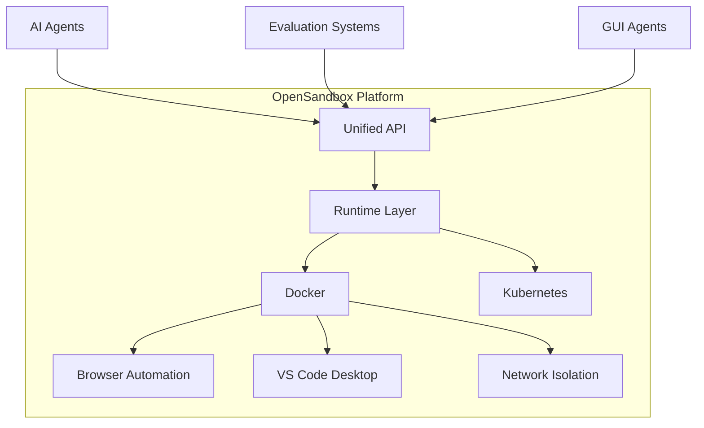
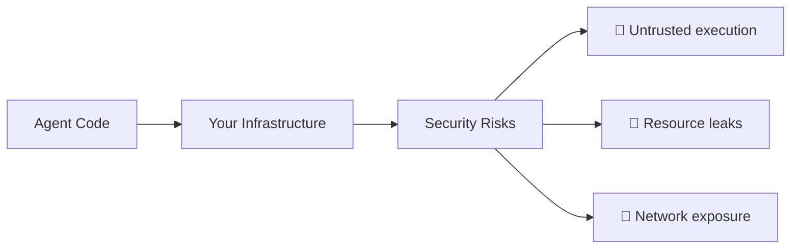
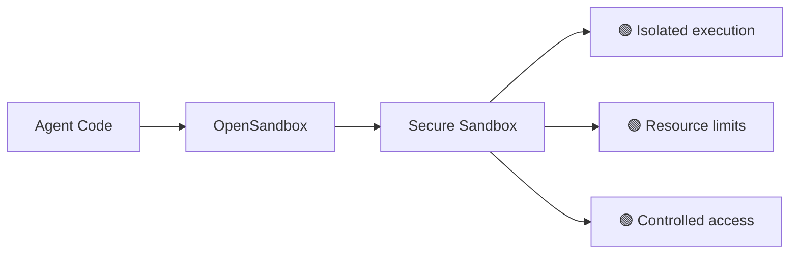
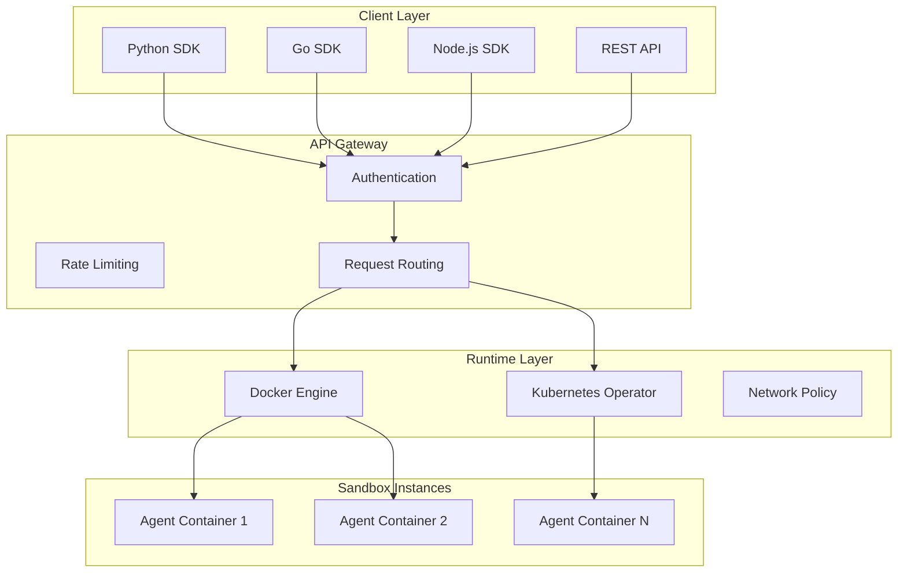
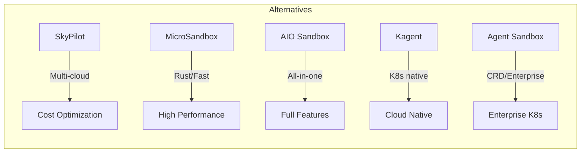

# OpenSandbox - Production-Grade Agent Sandbox 🛡️

Alibaba just handed the AI agent community a production-grade sandbox for free. OpenSandbox is a full-stack platform for running untrusted agent code safely — and it's open source.

## What is OpenSandbox?

OpenSandbox is a **secure execution environment** purpose-built for AI agents. It provides isolation, security, and infrastructure for running untrusted code from coding agents, GUI agents, and evaluation systems.



## Key Features

| Feature | Description |
|---------|-------------|
| **Unified APIs** | Multi-language SDKs with consistent interfaces |
| **Docker Runtime** | Purpose-built container execution for agents |
| **Kubernetes Support** | Scale agent workloads in production |
| **Browser Automation** | Headless browser control for web agents |
| **VS Code Desktop** | Integrated development environment for coding agents |
| **Network Isolation** | Secure sandbox with controlled network access |

## Why It Matters

### Before OpenSandbox



### With OpenSandbox



## Use Cases

### 1. Coding Agents
Run code generation agents in isolated containers with full IDE support.

```bash title="Terminal"
# Launch a coding agent in sandbox
opensandbox run --runtime docker --ide vscode agent.py
```

### 2. GUI Automation
Execute browser-based agents with headless Chrome and controlled network access.

```bash title="Terminal"
# Run browser automation agent
opensandbox run --runtime docker --browser chrome gui-agent.js
```

### 3. Evaluation Pipelines
Safely run untrusted evaluation code without risking your infrastructure.

```bash title="Terminal"
# Execute evaluation in isolated environment
opensandbox eval --timeout 300s benchmark.py
```

### 4. Multi-Agent Orchestration
Deploy agent swarms on Kubernetes with built-in security.

```yaml title="kubernetes-deployment.yaml"
apiVersion: v1
kind: Pod
metadata:
  name: agent-sandbox
spec:
  containers:
  - name: opensandbox
    image: opensandbox/agent-runtime:latest
    resources:
      limits:
        memory: "2Gi"
        cpu: "1000m"
```

## Architecture Overview



## Getting Started

### Installation

```bash title="Terminal"
# Install OpenSandbox CLI
curl -fsSL https://get.opensandbox.io | bash

# Or via Docker
docker pull opensandbox/agent-runtime:latest
```

### Quick Start

```bash title="Terminal"
# Initialize a new sandbox
opensandbox init my-agent

# Run your first agent
opensandbox run --file agent.py

# Check status
opensandbox status
```

### Python Example

```python title="agent.py"
from opensandbox import Sandbox

# Create isolated environment
sandbox = Sandbox(
    runtime="docker",
    network_isolation=True,
    timeout=300
)

# Execute agent code safely
result = sandbox.run("""
def solve_task():
    # Agent logic here
    return "Task completed securely"

print(solve_task())
""")

print(result.output)
print(f"Execution time: {result.duration}s")
```

## Community

| Metric | Value |
|--------|-------|
| **License** | Apache 2.0 |
| **Repository** | [github.com/alibaba/OpenSandbox](https://github.com/alibaba/OpenSandbox) |

## Comparison

| Aspect | Traditional Setup | OpenSandbox |
|--------|-------------------|-------------|
| **Security** | Manual isolation | Built-in sandboxing |
| **Scalability** | Custom K8s config | Native K8s operator |
| **Browser Automation** | Puppeteer/Playwright setup | Included |
| **VS Code Integration** | Manual configuration | Out of the box |
| **Cost** | Build yourself | Free & open source |

## When to Use

- ✅ Running untrusted agent code
- ✅ Building coding agent platforms
- ✅ Evaluation benchmark pipelines
- ✅ GUI automation at scale
- ✅ Multi-agent orchestration
- ✅ Security-sensitive agent deployments

## Alternatives (Self-Hosted, 1000+ Stars)

| Project | Stars | Description | Best For |
|---------|-------|-------------|----------|
| [SkyPilot](https://github.com/skypilot-org/skypilot) | 9400+ | Multi-cloud orchestration and cost optimization. Run AI workloads on any infra (Kubernetes, 20+ clouds, on-prem) | Multi-cloud GPU/ML workloads |
| [MicroSandbox](https://github.com/zerocore-ai/microsandbox) | 4800+ | Rust-based lightweight sandboxes for AI agents. Fast, secure, multi-language support | High-performance execution |
| [AIO Sandbox](https://github.com/agent-infra/sandbox) | 2859+ | All-in-One sandbox combining Browser, Shell, File, MCP and VSCode in single Docker container | Full-featured agents |
| [Kagent](https://github.com/kagent-dev/kagent) | 2300+ | Kubernetes native framework for building AI agents. CNCF project | Cloud-native deployments |
| [Agent Sandbox](https://github.com/kubernetes-sigs/agent-sandbox) | 1100+ | Kubernetes CRD for managing isolated, stateful agent workloads. Supports gVisor, Kata Containers | Enterprise K8s |

### Quick Comparison



## References

- [OpenSandbox GitHub](https://github.com/alibaba/OpenSandbox)
- [ClaudeKit Workflow](../Workflows/ClaudeKit-Workflow.md): Spec-driven AI development
- [Claude 4.6 Prompts](../Prompt-Library/Claude-4.6-Prompts-Anatomy.md): 8-step prompt structure
- [OpenCode](./opencode.md): AI coding CLI tool

