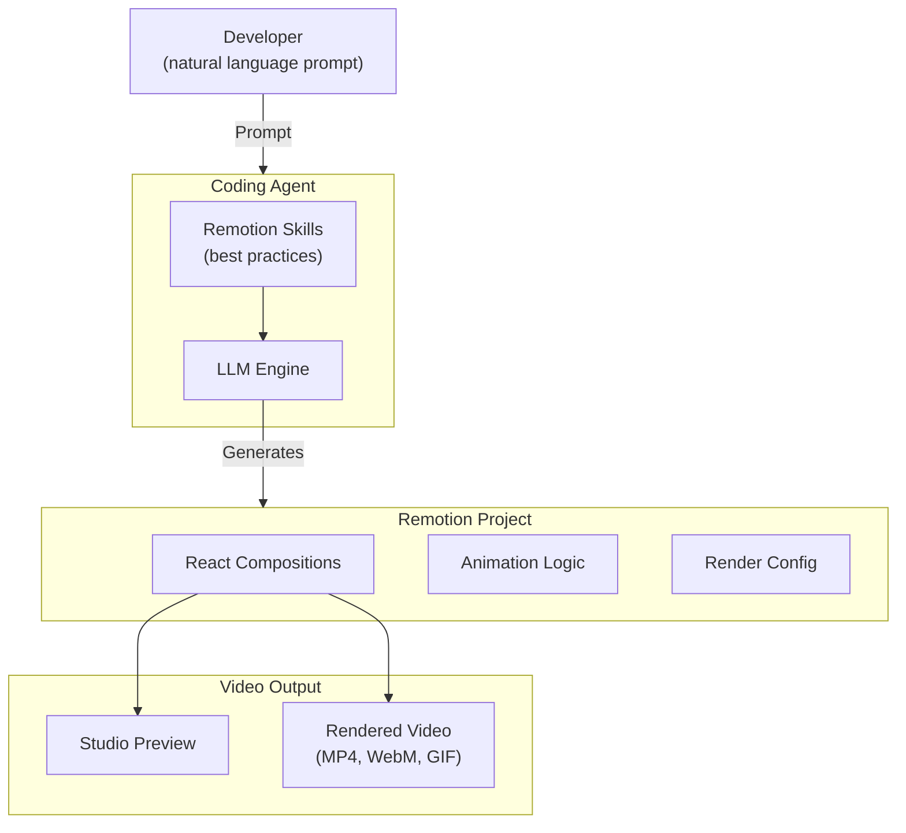

import Card from '@site/src/components/Card/Card';
import CardGroup from '@site/src/components/Card/CardGroup';
import Accordion from '@site/src/components/Accordion/Accordion';
import AccordionGroup from '@site/src/components/Accordion/AccordionGroup';
import Steps from '@site/src/components/Steps/Steps';
import Step from '@site/src/components/Steps/Step';

# Remotion Skills

[Remotion](https://www.remotion.dev) is an independent, open-source framework (53.8k GitHub stars) for creating videos programmatically with React. Instead of using After Effects or keyframe-based tools, you write standard React components that render to video — making animations composable, testable, and version-controllable.

**Remotion Skills** are AI agent integrations that let you describe a video in plain language and have a coding agent generate the full Remotion project for you. The skills encode best practices for animation, rendering, and project structure so the agent produces working code on the first try.

:::info
The skills are **agent-agnostic** — they work with Claude Code, Codex, Cursor, OpenCode, Kimi Code, and any tool that supports the [Agent Skills](https://agentskills.io/home) standard.
:::

## Core Advantages & Efficiency

- **Agent-Driven Creation**: Describe what you want in natural language. The agent generates compositions, animations, and render configs automatically.
- **React as Source of Truth**: No proprietary timeline format. Your video is just React code — diff it, review it, revert it.
- **Instant Iteration**: Chat-based edits update the video in real time. No round-trips to a design tool.
- **Prompt-Driven Workflows**: The [Prompts Showcase](https://remotion.dev/prompts) demonstrates real community builds — maps, charts, product demos, launch videos — all generated from a single prompt.

:::tip
If you already have a Remotion project, you can add skills to any existing codebase. The agent will respect your existing structure and components.
:::

## Architecture & Workflow



The agent reads the skill files, which contain domain-specific instructions for Remotion patterns (compositions, timing, effects, rendering). It then generates or modifies your project code accordingly.

## Available Skills

<CardGroup cols={2}>
  <Card title="remotion-best-practices" icon="mdi:book-open-variant">
    Meta-skill that encompasses all others. Use this when you're not sure which specific skill to load.
  </Card>
  <Card title="remotion-create" icon="mdi:video-plus">
    Scaffold a new Remotion project or add a composition to an existing one.
  </Card>
  <Card title="remotion-markup" icon="mdi:animation">
    Best practices for React markup — compositions, animations, layout, typography, media, effects, timing.
  </Card>
  <Card title="remotion-render" icon="mdi:filmstrip">
    Invoke rendering into video files or still images with the correct CLI flags.
  </Card>
  <Card title="remotion-captions" icon="mdi:subtitles">
    Guidance for adding captions and subtitles to videos.
  </Card>
  <Card title="remotion-saas" icon="mdi:cloud">
    Architecture guidance for building Remotion-powered SaaS apps and product integrations.
  </Card>
  <Card title="remotion-interactivity" icon="mdi:pointer-default">
    Making Remotion elements editable and interactive inside Remotion Studio.
  </Card>
  <Card title="remotion-docs" icon="mdi:magnify">
    Search the Remotion docs and fetch any page as Markdown for API lookups.
  </Card>
  <Card title="remotion-upgrade" icon="mdi:arrow-up-bold">
    Upgrade Remotion, related packages, and installed skills to compatible versions.
  </Card>
  <Card title="mediabunny" icon="mdi:rabbit">
    Browser-based multimedia handling — video and audio metadata extraction.
  </Card>
</CardGroup>

## Prompt Showcase

The [Remotion Prompts page](https://remotion.dev/prompts) is a community gallery of videos generated entirely from text prompts using coding agents. Notable examples:

- **Travel Route on Map** — animated 3D landmarks along a route (319 upvotes)
- **News Article Headline Highlight** — animated text emphasis for journalism (309 upvotes)
- **Product Demo for Presscut** — full product walkthrough video (221 upvotes)
- **Launch Video on X** — social media launch sequence (188 upvotes)

:::tip
Browse the showcase at [remotion.dev/prompts](https://remotion.dev/prompts) to see what's possible and reuse prompts as starting points for your own videos.
:::

## Quick Start

<Steps>
  <Step title="Create a Remotion Project">
    If you don't have an existing project, scaffold one:

    ```bash
    npx create-video@latest
    ```

    This sets up a complete Remotion project with TypeScript, a sample composition, and the Studio preview server.
  </Step>

  <Step title="Install Agent Skills">
    Add the Remotion skills to your project. This creates skill files that your coding agent can read:

    ```bash
    npx skills add remotion-dev/skills
    ```

    The skills are also offered automatically when creating a new project via `bun create video`.
  </Step>

  <Step title="Generate a Video">
    Open your coding agent and describe what you want:

    ```
    /remotion-markup Make an animated bar chart with 5 bars that animate in sequentially
    ```

    The agent will generate the composition, animation logic, and render config. Preview it instantly in Remotion Studio:

    ```bash
    npx remotion studio
    ```
  </Step>
</Steps>

## FAQ

<AccordionGroup>
  <Accordion title="Do I need a license to use Remotion?">
    Remotion has a [special license](https://www.remotion.dev/docs/license/pricing). Individual use and open-source projects are free. Companies need a license if they use Remotion to create videos for commercial purposes. Check the pricing page for current tiers.
  </Accordion>

  <Accordion title="What video formats can Remotion render?">
    Remotion renders to **MP4**, **WebM**, **GIF**, and **image sequences** (PNG, JPEG). You can also render individual frames as still images. The format is configured in the render command or programmatically via the Node.js API.
  </Accordion>

  <Accordion title="Which coding agents support Remotion Skills?">
    Any agent that implements the Agent Skills standard: **Claude Code**, **Codex**, **Cursor**, **OpenCode**, **Kimi Code**, **Windsurf**, and **Cline**. The skills are plain Markdown files — they work anywhere an LLM can read them.
  </Accordion>

  <Accordion title="Can I use Remotion Skills in an existing project?">
    Yes. Run `npx skills add remotion-dev/skills` in any existing Remotion project. The agent will respect your existing component structure, styles, and conventions when generating new code.
  </Accordion>

  <Accordion title="How does batch rendering work?">
    Remotion supports programmatic batch rendering via its Node.js API and [Lambda](https://www.remotion.dev/docs/lambda) integration. You can render millions of videos on your own infrastructure or on AWS Lambda. This is useful for personalized video generation at scale.
  </Accordion>
</AccordionGroup>

## References

- [Remotion Official Documentation](https://www.remotion.dev/docs)
- [Remotion AI Skills Documentation](https://www.remotion.dev/docs/ai/skills)
- [GitHub: remotion-dev/remotion](https://github.com/remotion-dev/remotion)
- [GitHub Skills Package](https://github.com/remotion-dev/remotion/tree/main/packages/skills)
- [Prompt Showcase (Community)](https://remotion.dev/prompts)
- [Remotion License & Pricing](https://www.remotion.dev/docs/license/pricing)
