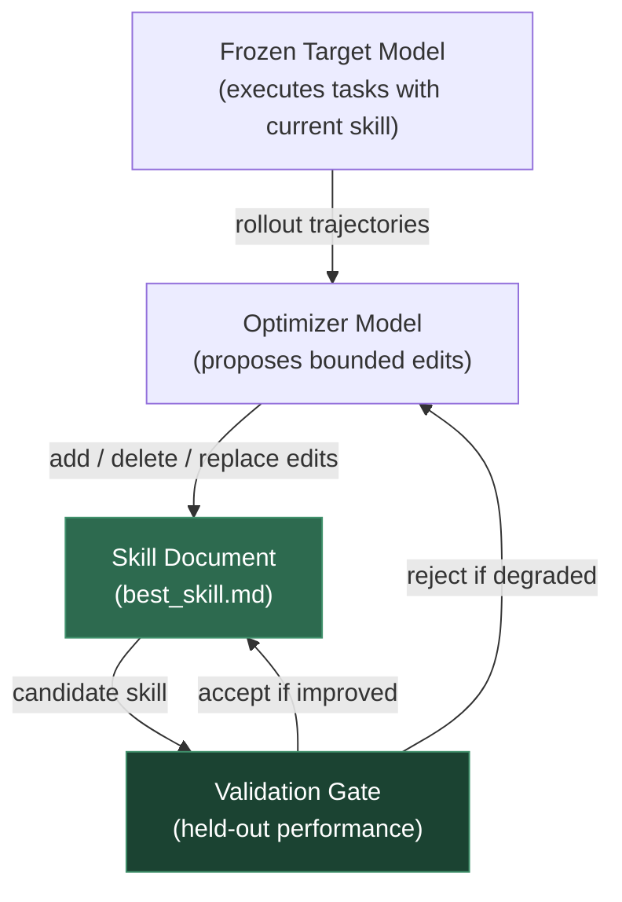
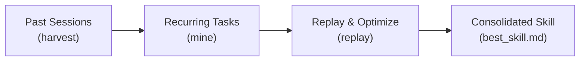

import Card from '@site/src/components/Card/Card';
import CardGroup from '@site/src/components/Card/CardGroup';
import Accordion from '@site/src/components/Accordion/Accordion';
import AccordionGroup from '@site/src/components/Accordion/AccordionGroup';
import Steps from '@site/src/components/Steps/Steps';
import Step from '@site/src/components/Steps/Step';

# SkillOpt: Self-Evolving Agent Skills

SkillOpt is a text-space optimizer from Microsoft Research that treats a natural-language skill document as the trainable state of a frozen language agent. Instead of fine-tuning model weights or hand-crafting prompts, SkillOpt learns the skill itself through rollouts, reflection, bounded edits, and held-out validation gates — producing a compact `best_skill.md` artifact that improves agent performance at zero additional inference cost.

:::info
SkillOpt achieved best or tied-best results on **all 52 evaluated (model, benchmark, harness) cells** across 7 target models, 6 benchmarks, and 3 execution harnesses (direct chat, Codex CLI, Claude Code CLI).
:::

## Core Idea

SkillOpt makes the skill document the optimization target. The target model, backend, and harness stay frozen; only the procedure that guides evidence gathering, tool use, verification, and output formatting evolves.



### How It Differs from Prompt Engineering

Traditional prompt optimization either fine-tunes the model weights or relies on one-shot LLM-generated instructions. SkillOpt instead runs the frozen agent on scored batches, asks a separate optimizer model to propose structured edits, and accepts a candidate only when validation performance improves — mirroring a deep-learning training loop in text space.

## The Training Loop

SkillOpt deliberately mirrors a learning algorithm: rollout evidence acts like a forward pass, reflection acts like a language-level backward pass, and the textual learning rate bounds how far the skill can move.

<Steps>
 <Step title="Rollout">
  The target model executes tasks with the current skill and records scored trajectories — messages, tool calls, verifier feedback, task metadata, and final scores.
 </Step>
 <Step title="Reflect">
  The optimizer analyzes success and failure minibatches separately to find reusable procedures. Failures reveal recurring errors to correct; successes reveal working behavior to preserve.
 </Step>
 <Step title="Edit">
  Candidate add, delete, and replace operations are merged and ranked under an edit budget. The budget functions as a textual learning rate, preventing useful rules from being overwritten by broad rewrites.
 </Step>
 <Step title="Gate">
  The candidate skill is kept only if it improves held-out selection performance. Rejected edits become negative feedback via a buffer, helping the optimizer avoid repeating harmful directions.
 </Step>
</Steps>

## Key Components

The ablation studies confirm that each optimizer component contributes meaningfully to stable skill learning:

| Component | Role | Without It |
| :--- | :--- | :--- |
| **Bounded edits** | Textual learning rate prevents destructive rewrites | Score drops across all benchmarks |
| **Validation gate** | Held-out selection turns reflection into propose-and-test optimization | Unconditional self-editing causes regressions |
| **Rejected buffer** | Rejected edits become negative feedback | Optimizer repeats harmful edit directions |
| **Slow update + meta skill** | Longer-horizon feedback without bloating deployment | Epoch-wise instabilities and score plateaus |

:::tip
The edit budget is the most important hyperparameter. Setting it too high causes catastrophic rewrites; too low prevents useful learning. The paper uses a default of `lr=4` (4 edit operations per epoch).
:::

## Main Results

SkillOpt improves both OpenAI GPT and Qwen target models across diverse benchmarks. Average accuracy gains range from +9.1 to +24.9 points depending on the model and harness combination.

### Transferability

The exported `best_skill.md` artifact transfers across model scales, execution harnesses, and nearby benchmarks without further target-side optimization:

- **Cross-model**: GPT-5.4 LiveMath skill transferred to GPT-5.4-nano with +15.2 improvement
- **Cross-harness**: Codex-trained SpreadsheetBench skill transferred into Claude Code with +31.8 improvement
- **Self-optimizer**: GPT-5.4-nano used as its own optimizer improved SpreadsheetBench with +10.4 gain

## SkillOpt-Sleep: Offline Self-Evolution

SkillOpt v0.2.0 introduced **SkillOpt-Sleep**, a nightly offline self-evolution engine for local coding agents (Claude Code, Codex, Copilot). It harvests past sessions, mines recurring tasks, replays them, and consolidates validated skills behind a held-out validation gate — all running as a background process without active user involvement.



:::info
SkillOpt-Sleep supports multi-objective reward, experience replay with dream rollouts, and long-term memory — shipping as the `skillopt-sleep` CLI.
:::

## Installation & Setup

<Steps>
 <Step title="Install">
  ```bash
  pip install skillopt
  ```
 </Step>
 <Step title="Configure">
  Set up your API keys and target model backend. SkillOpt supports OpenAI, Azure, Claude, Qwen, and MiniMax backends.
 </Step>
 <Step title="Run">
  ```bash
  skillopt --config configs/your_config.yaml
  ```
  The training loop runs rollouts, reflection, edits, and validation automatically. The final `best_skill.md` is exported to the checkpoint directory.
 </Step>
</Steps>

## Extensibility

SkillOpt is designed to be extended with new backends and benchmarks:

<AccordionGroup>
 <Accordion title="Adding a New Backend" icon="mdi:server">
  A backend is a chat/exec target (e.g., `openai_chat`, `claude_chat`, `codex_exec`). Add a `skillopt/model/<name>_backend.py` module, register it in `skillopt/model/common.py` and `backend_config.py`, and wire it through the router in `skillopt/model/__init__.py`.
 </Accordion>
 <Accordion title="Adding a New Benchmark" icon="mdi:chart-bar">
  A benchmark is a `skillopt/envs/<name>/` package containing a `dataloader.py`, a `rollout.py`, and an `initial.md` seed skill. The simplest reference implementation is `skillopt/envs/searchqa/`.
 </Accordion>
 <Accordion title="WebUI Dashboard" icon="mdi:monitor-dashboard">
  Launch the optional monitoring dashboard with:
  ```bash
  pip install -e ".[webui]"
  python -m skillopt_webui.app
  ```
  The WebUI provides real-time visibility into training progress, edit acceptance rates, and benchmark performance trends.
 </Accordion>
</AccordionGroup>

## References

- [Official Project Page](https://microsoft.github.io/SkillOpt/)
- [GitHub Repository](https://github.com/microsoft/SkillOpt)
- [arXiv Paper](https://arxiv.org/abs/2605.23904)
- [PyPI Package](https://pypi.org/project/skillopt/)
- [SkillLens (Companion Project)](https://microsoft.github.io/SkillLens/)
