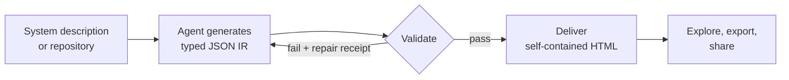

import Tabs from '@theme/Tabs';
import TabItem from '@theme/TabItem';
import Steps from '@site/src/components/Steps/Steps';
import Step from '@site/src/components/Steps/Step';

# Archify

[Archify](https://github.com/tt-a1i/archify) is an open-source agent skill for Claude Code, Cursor, Codex CLI, OpenCode, and Raven that turns a codebase or system description into a **polished, interactive system map** - directly in chat. Instead of producing static images or fragile markup, Archify generates typed JSON intermediate representation (IR), validates it atomically, and delivers a single self-contained HTML file you can open, present, and share.

What makes Archify different from a typical diagram generator is its emphasis on **verifiability**: every interaction in the output (searching nodes, tracing routes, comparing roles, playing guided stories) reuses authored nodes and relationships instead of inventing topology. Validation gates must pass before any artifact replaces the last known good diagram.

## Key Features & Advantages

- **Five diagram types**: Architecture, Workflow, Sequence, Data Flow, and Lifecycle - each with a schema and renderer.
- **Typed JSON IR**: Every diagram has a reproducible, schema-checked source file.
- **Atomic validation**: Schema, layout, HTML/SVG, route, and label-clearance checks all pass before delivery; failures return stable rule codes with machine-readable repair hints.
- **Interactive output**: Search, focus, upstream/downstream reach, exact route probing, semantic role lenses, guided stories, and dark/light themes.
- **Rich exports**: PNG, SVG, WebM, plus canonical 1200x630 share cards for READMEs and social posts.
- **Architecture Delta**: Compare two validated snapshots as Before / Delta / After with exact added, removed, changed, moved, and rerouted facts - ideal for PR review.

:::info
The result is always **one portable HTML file** with no hosted dependency, no viewer runtime injected, and exports free of temporary viewer state.
:::

## How It Works

Archify follows a generate-validate-deliver loop:



1. **Generate**: The agent creates typed JSON IR from your description.
2. **Validate**: Bundled validators check schema, layout, routes, and labels; failures identify the exact local repair in JSON.
3. **Preview (optional)**: A loopback-only desktop session watches one source file and reloads only verified revisions.
4. **Deliver**: Only a passing artifact atomically replaces the target HTML file.
5. **Iterate**: The agent updates the source while unrelated structure stays stable.

## Comparison: Archify vs Excalidraw vs Mermaid.js

Archify is not a general-purpose drawing editor or a Mermaid theme. Here is how it compares to the two most common alternatives:

| Aspect | Archify | Excalidraw | Mermaid.js |
| :--- | :--- | :--- | :--- |
| **Paradigm** | Agent skill generating validated IR | Manual whiteboard drawing | Text-to-diagram markup |
| **Authoring effort** | One prompt to your agent | Fully manual dragging | Hand-written DSL |
| **Validation** | Schema, layout, route, and label checks before delivery | None (free-form canvas) | Syntax parsing only |
| **Layout control** | Agent judgment: hierarchy, spacing, routes, emphasis | Fully manual | Generic auto-layout |
| **Interactivity** | Search, focus, reach, routes, lenses, stories | Static canvas | Static image (some click in docs) |
| **Output format** | Self-contained interactive HTML + PNG/SVG/WebM/share cards | PNG/SVG/excalidraw JSON | SVG/PNG via renderer |
| **Verifiability** | Typed JSON IR, deterministic checks, repair receipts | No source-of-truth checks | Text diff-able but unvalidated semantics |
| **Best for** | Architecture review, system maps, PR deltas | Sketches, brainstorming, quick mockups | Simple flows inside markdown docs |

:::tip
Use Mermaid for small diagrams embedded in documentation, Excalidraw for freeform ideation, and Archify when the diagram must be **accurate, presentable, and trustworthy** - such as reviewing an architecture change before merge.
:::

## Quickstart

Archify's CLI runs on Node.js, so make sure your machine has Node available before installing.

Installation is one command via the `skills` CLI:

```bash
npx skills add tt-a1i/archify -g
```

Depending on your agent, the exact invocation differs. Pick yours below:

<Tabs groupId="agent">
  <TabItem value="cursor" label="Cursor" default>
    ```bash
    npx -y skills add tt-a1i/archify --skill archify --agent cursor --global --copy --yes
    ```

    Installs to the Cursor global skills directory.
  </TabItem>
  <TabItem value="claude" label="Claude Code">
    ```bash
    npx skills add tt-a1i/archify -g
    ```

    Installs to `~/.claude/skills/` (or `.claude/skills/` for project scope).
  </TabItem>
  <TabItem value="opencode" label="OpenCode">
    ```bash
    npx skills add tt-a1i/archify -g
    ```

    Installs to `~/.config/opencode/skills/` (also accepts `.opencode/skills/` or `.agents/skills/`).
  </TabItem>
  <TabItem value="codex" label="Codex CLI">
    ```bash
    npx skills use tt-a1i/archify@archify --agent codex
    ```

    Runs the skill without installing it permanently.
  </TabItem>
  <TabItem value="raven" label="Raven">
    ```bash
    curl -LO https://github.com/tt-a1i/archify/raw/main/archify.zip
    unzip archify.zip -d ~/.raven/workspace/skills
    ```

    Raven is not a switcher target, so install the ZIP manually. This yields `~/.raven/workspace/skills/archify`.
  </TabItem>
</Tabs>

Then ask your agent for one bounded view:

```text
Use archify to map this repository's runtime architecture.
Show 8-12 core components, one primary path, external dependencies,
and trust boundaries. Put supporting detail in cards instead of
adding more edges.
```

Refine in chat with focused requests like `add Redis`, `move auth to the left`, or `highlight the rollback path`. The typed source stays available for targeted iteration.

## Full-Featured Example

A complete production review workflow, from install to shareable artifact:

<Steps>
  <Step title="Install globally">
    ```bash
    npx skills add tt-a1i/archify -g
    ```
  </Step>
  <Step title="Check your environment">
    From inside a clone of the Archify repository:

    ```bash
    cd archify
    node bin/archify.mjs doctor
    ```
  </Step>
  <Step title="Ask the agent for a bounded architecture view">
    ```text
    Analyze this repository, then use archify to create a high-level
    runtime architecture diagram. Show core components, one primary
    path, external dependencies, and trust boundaries.
    ```
  </Step>
  <Step title="Validate at showcase quality">
    ```bash
    node bin/archify.mjs validate workflow examples/agent-tool-call.workflow.json \
      --quality showcase --json
    ```
  </Step>
  <Step title="Preview with the last-good live loop">
    ```bash
    node bin/archify.mjs preview workflow examples/agent-tool-call.workflow.json \
      tmp/workflow.html --quality showcase
    ```
  </Step>
  <Step title="Deliver and open">
    ```bash
    node bin/archify.mjs deliver workflow examples/agent-tool-call.workflow.json \
      tmp/workflow.html --quality showcase --open --json
    ```
  </Step>
</Steps>

### Choosing the right diagram type

| Type | Best for | Include in your prompt |
| :--- | :--- | :--- |
| **Architecture** | Components, services, storage, boundaries | Scope, core components, primary path |
| **Workflow** | CI/CD, approvals, tool calls, runbooks | Participants, order, branches, exceptions |
| **Sequence** | API calls, cache fallback, auth, async traces | Callers, callees, returns, timing |
| **Data Flow** | Pipelines, lineage, PII, consumers | Sources, transforms, stores, boundaries |
| **Lifecycle** | States, retries, waits, terminal outcomes | States, events, retry and cancellation paths |

Not sure which fits? Ask the zero-dependency CLI:

```bash
node bin/archify.mjs guide "Show an API request with Redis cache miss"
```

### Comparing two snapshots (PR review)

For design or code review, Architecture Delta compares validated Before / Delta / After snapshots with a machine receipt of exactly what changed:

```bash
node bin/archify.mjs compare architecture base.json head.json architecture-delta.html --json
```

### Exploring the delivered artifact

In the generated HTML you can use the following keyboard controls:

| Key | Action |
| :--- | :--- |
| `?` | Open the diagram guide |
| `/` | Search and focus nodes |
| `R` | Probe a directed route between two nodes |
| `L` | Compare semantic roles |
| `P` | Play a guided story |

Stable links can restore state via fragments like `#focus=<id>` and `#route=&lt;source&gt;~&lt;target&gt;`, so you can deep-link a specific reading directly in a pull request or document.

## References

- [GitHub Repository](https://github.com/tt-a1i/archify)
- [Project Page](https://tt-a1i.github.io/archify/)
- [Scenario Guide](https://tt-a1i.github.io/archify/guide.html)
- [Proof Lab Gallery](https://tt-a1i.github.io/archify/gallery.html)
- [Schema Reference](https://github.com/tt-a1i/archify/blob/main/archify/schemas/README.md)
