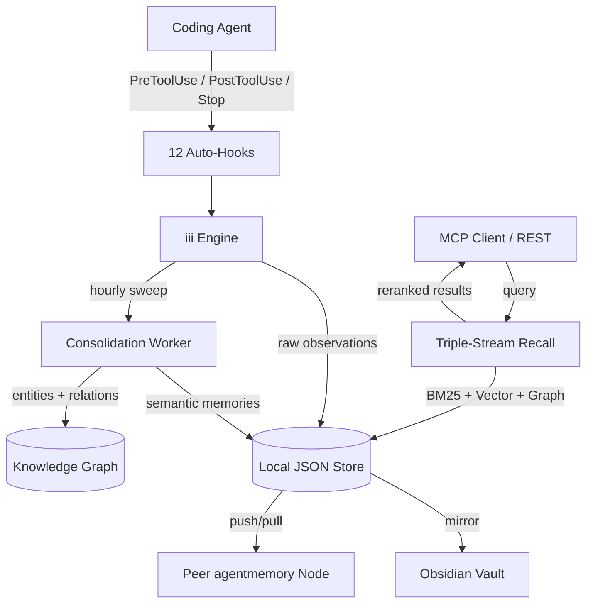

import Tabs from '@theme/Tabs';
import TabItem from '@theme/TabItem';
import Card from '@site/src/components/Card/Card';
import CardGroup from '@site/src/components/Card/CardGroup';
import Steps from '@site/src/components/Steps/Steps';
import Step from '@site/src/components/Steps/Step';
import Accordion from '@site/src/components/Accordion/Accordion';
import AccordionGroup from '@site/src/components/Accordion/AccordionGroup';
import FreshnessBadge from '@site/src/components/FreshnessBadge/FreshnessBadge';

# agentmemory

<FreshnessBadge lastUpdated={frontMatter.last_updated} />

**agentmemory** is a complete memory runtime for AI coding agents. It automatically captures every tool call, prompt, and session event, compresses them into semantic memories, and surfaces the right context in milliseconds — without any external databases, without Redis, without Postgres, without Qdrant. Everything runs as a single Node.js process on your machine.

## Summary

Every time you start a new coding session, your agent forgets everything it learned last time. It re-reads the same files, re-traces the same logic, re-resolves the same dependencies — burning tokens and time on work it already did.

agentmemory solves this with a three-primitive architecture: **Hooks** that auto-capture every agent event, **Recall** that retrieves the most relevant memories in under 20ms using triple-stream retrieval (BM25 + vector + knowledge graph), and **Consolidation** that runs hourly sweeps to compress raw observations into semantic memories, merging duplicates and decaying stale data.

:::info
**Benchmarks on LongMemEval-S**: **95.2% Retrieval R@5**, **92% fewer input tokens per session**, and **0 external databases** required.
:::

## The Three Primitives

agentmemory is built on the **iii engine** — every memory operation is a worker, a function, or a trigger. No framework tax.

<CardGroup cols={3}>
  <Card title="01 · Hooks" icon="mdi:hook">
    12 auto-capture hooks piped into every coding agent. Every tool call, every prompt, every stop becomes a compressed observation.
  </Card>
  <Card title="02 · Recall" icon="mdi:magnify">
    Triple-stream retrieval — BM25 + Vector + Knowledge Graph. Reranked on-device. P50 under 20ms on a laptop.
  </Card>
  <Card title="03 · Consolidate" icon="mdi:compress">
    Hourly sweeps compress raw observations into semantic memories. Duplicates merged. Stale rows decayed. Audit row emitted every delete.
  </Card>
</CardGroup>

## Key Features

<AccordionGroup>
  <Accordion title="12 Auto-Hooks — Capture Everything">
    Every `PreToolUse`, `PostToolUse`, `SessionStart`, `Stop`, and the rest fire into the memory pipeline without a line of glue code. Install the plugin, done.

    These hooks cover the full agent lifecycle, ensuring no relevant event is ever missed.
  </Accordion>
  <Accordion title="53 MCP Tools — Native MCP Surface">
    `memory_save`, `memory_recall`, `memory_smart_search`, `memory_sessions`, governance, audit, export — the full surface behind a single MCP server.

    Every MCP tool also has a REST twin under `/agentmemory/*`, so you can `curl` it, fetch it from the browser, or proxy it from your own agent.
  </Accordion>
  <Accordion title="Triple-Stream Recall — BM25 + Vector + Graph">
    Hybrid retrieval pipes **lexical** (BM25), **semantic** (vector), and **relational** (knowledge graph) scores through an on-device reranker.

    Result: 95.2% R@5 on the LongMemEval-S benchmark — the highest in its class.
  </Accordion>
  <Accordion title="Auto-Consolidation — Raw → Semantic">
    Hourly sweep compresses observations into semantic memories, merges duplicates, decays stale rows with retention scoring, and emits a batched audit row. The memory store stays lean without manual intervention.
  </Accordion>
  <Accordion title="Knowledge Graph — Entity & Relation Extraction">
    Entities and relations are extracted on compress. Query with `/agentmemory/graph`. Visualize in the viewer. Temporal edges are supported.
  </Accordion>
  <Accordion title="JSONL Session Import — Infinite Replay">
    Point agentmemory at a Claude Code JSONL transcript and it rehydrates the full session — observations, tool uses, timeline — into the store. Backfill months of past agent sessions retroactively.
  </Accordion>
  <Accordion title="Mesh Federation — Peer-to-Peer Sync">
    Register another agentmemory node, push/pull memories over authenticated HTTPS. Bearer-token required; no silent syncs.
  </Accordion>
  <Accordion title="Obsidian Export — Your Notes, Hydrated">
    Mirror memories to a sandboxed vault directory. Frontmatter-tagged markdown, ready for Obsidian's graph view.
  </Accordion>
  <Accordion title="OpenTelemetry — Full Observability">
    OTEL observability worker on by default. Exporter: memory for local, OTLP for Jaeger / Honeycomb / Tempo. Every operation produces a span.
  </Accordion>
</AccordionGroup>

## Installation & Setup

<Steps>
  <Step title="Run the installer">
    One command installs agentmemory and auto-wires it to your coding agent:
    ```bash
    npx @agentmemory/agentmemory
    ```
    The CLI detects installed agents (Claude Code, Cursor, Codex CLI, etc.) and registers the MCP server automatically.
  </Step>
  <Step title="Connect to your agent">
    For Claude Code, the plugin registers via the hook system:
    ```bash
    agentmemory connect claude-code
    ```
    For any other MCP-compatible agent, add the server manually:
    ```json
    {
      "mcpServers": {
        "agentmemory": {
          "command": "npx",
          "args": ["@agentmemory/agentmemory", "serve"]
        }
      }
    }
    ```
  </Step>
  <Step title="Open the viewer">
    The viewer starts automatically on port 3113. No extra config needed:
    ```bash
    open http://localhost:3113
    ```
    The viewer shows your live observation stream, session explorer, memory browser, and knowledge graph visualization.
  </Step>
</Steps>

:::tip
agentmemory supports **5 LLM providers** detected from your environment: Claude (default, zero config), Anthropic API, Gemini, MiniMax, and OpenRouter. No extra setup is needed if you already use Claude Code.
:::

## Agent Compatibility

agentmemory ships **6 first-party plugins** and supports every MCP-native agent via the standard server protocol.

<Tabs groupId="agent-compat">
  <TabItem value="claude" label="Claude Code" default>
    The deepest integration — 12 hooks, full MCP surface, and custom skills.
    ```bash
    agentmemory connect claude-code
    ```
    Every `PreToolUse`, `PostToolUse`, `SessionStart`, and `Stop` event is automatically captured.
  </TabItem>
  <TabItem value="codex" label="Codex CLI">
    Native plugin with 6 hooks and full MCP access.
    ```bash
    agentmemory connect codex
    ```
  </TabItem>
  <TabItem value="cursor" label="Cursor">
    Works via the MCP server protocol. Add to your Cursor MCP settings:
    ```json
    {
      "mcpServers": {
        "agentmemory": {
          "command": "npx",
          "args": ["@agentmemory/agentmemory", "serve"]
        }
      }
    }
    ```
  </TabItem>
  <TabItem value="other" label="Gemini CLI / Cline / Roo Code / others">
    All MCP-native agents work without extra configuration. Any agent that can consume an MCP server gets the full 53-tool surface automatically.
    ```bash
    agentmemory connect <agent-name>
    ```
  </TabItem>
</Tabs>

## Benchmark Comparison

Numbers straight from the LongMemEval-S benchmark and each project's own documentation.

| Feature | **agentmemory** | Mem0 | Letta | Cognee |
|:---|:---:|:---:|:---:|:---:|
| **Retrieval R@5** | **95.2%** | 81.4% | 73.8% | 78.1% |
| **External deps** | **0** | 2 (Qdrant, Neo4j) | 1 (Postgres) | 1 (Neo4j) |
| **MCP tools** | **53** | 12 | 18 | 9 |
| **Auto-hooks** | **12** | 0 | 0 | 0 |
| **REST endpoints** | **121** | — | — | — |
| **Native plugins** | **6** | — | — | — |
| **Open source** | ✅ Apache-2.0 | ✅ | ✅ | ✅ |

:::info
agentmemory is ranked **#1 on real-world benchmarks** (LongMemEval-S) and was featured in AlphaSignal (180K technical subscribers) and backed by the Agentic AI Foundation (Linux Foundation).
:::

## Command Center

agentmemory ships two UIs installed inline by the CLI on first run:

<CardGroup cols={2}>
  <Card title="Memory Viewer · Port 3113" icon="mdi:monitor-eye" href="https://github.com/rohitg00/agentmemory">
    Real-time observation stream, session explorer, memory browser (filter by project/type/confidence), knowledge graph visualization (force-directed), and health dashboard (heap, RSS, event loop lag).
  </Card>
  <Card title="iii Console · Port 3114" icon="mdi:console" href="https://github.com/rohitg00/agentmemory">
    Engine-level dashboard for every worker function, trigger, and OTEL span. Includes raw KV browser, JSON editor, and OTEL waterfall + flame trace view.
  </Card>
</CardGroup>

## Architecture Overview



## References

- [Official Website — agent-memory.dev](https://www.agent-memory.dev)
- [GitHub Repository — rohitg00/agentmemory](https://github.com/rohitg00/agentmemory)
- [npm Package — @agentmemory/agentmemory](https://www.npmjs.com/package/@agentmemory/agentmemory)
- [LongMemEval-S Benchmark](https://arxiv.org/abs/2410.10813)
- [Model Context Protocol (MCP)](https://modelcontextprotocol.io)
