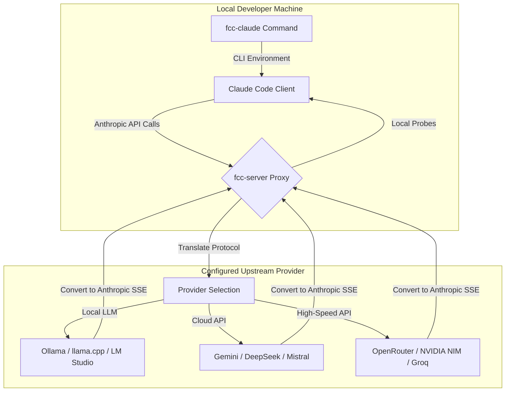

import Tabs from '@theme/Tabs';
import TabItem from '@theme/TabItem';
import Card from '@site/src/components/Card/Card';
import CardGroup from '@site/src/components/Card/CardGroup';
import Accordion from '@site/src/components/Accordion/Accordion';
import AccordionGroup from '@site/src/components/Accordion/AccordionGroup';
import Steps from '@site/src/components/Steps/Steps';
import Step from '@site/src/components/Steps/Step';
import CodeGroup from '@site/src/components/CodeGroup/CodeGroup';

# Free Claude Code Proxy

Anthropic's **Claude Code** is a revolutionary terminal-first agentic CLI tool, but it is locked to the official Anthropic API and costs. 

**Free Claude Code (free-claude-code)** is an open-source, high-performance drop-in proxy server that routes Anthropic Messages API traffic from Claude Code (and compatible IDE integrations) to any provider. It keeps Claude Code's stable client-side tool-use protocols fully intact while letting you leverage free, paid, or local models (like Gemini, DeepSeek, or Ollama) with near-zero latency overhead.

---

## Core Advantages & Efficiency

By decoupling the Claude Code interface from Anthropic's billing, the proxy server unlocks premium agentic workflows on your terms.

:::info
By leveraging free tiers like Google AI Studio (Gemini 2.5/3.1 Flash) or local models, developers can run hours of complex, tool-using agent sessions for **$0**.
:::

- **17+ Backend Providers**: Support for local engines (Ollama, llama.cpp, LM Studio), cloud APIs (Google Gemini, DeepSeek, Mistral), and high-speed routers (NVIDIA NIM, OpenRouter, Cerebras, Groq, Fireworks AI).
- **Per-Tier Model Routing**: Set different models for Opus, Sonnet, and Haiku tiers, or direct all fallback traffic to a single high-efficiency model.
- **Protocol Normalization**: Seamlessly translates thinking/reasoning blocks, complex tool calls, token usage metadata, and provider errors into the exact shape Claude Code expects.
- **Local Optimization**: Intercepts and locally answers trivial model-probing requests to save tokens, API quotas, and network latency.
- **Auto-Compaction Tuning**: Automatically injects a 190k-token `CLAUDE_CODE_AUTO_COMPACT_WINDOW` to compress large context windows and avoid token overflow.

---

## Architectural Workflow

The proxy server acts as an intelligent intermediary. It registers endpoints like `/v1/messages` and `/v1/models` to emulate the official Anthropic API locally, while mapping requests dynamically.



---

## Advanced Capabilities

Beyond proxying, Free Claude Code incorporates remote and modal integrations that make it highly adaptable.

<CardGroup cols={2}>
  <Card title="Local Admin Console" icon="mdi:web" href="https://github.com/Alishahryar1/free-claude-code#3-open-the-admin-ui-and-configure-nvidia-nim">
    Edit configurations, validate backend keys, check provider status, and update route mappings via a loopback Admin UI at `/admin`.
  </Card>
  <Card title="Discord & Telegram Bots" icon="mdi:robot" href="https://github.com/Alishahryar1/free-claude-code#1-discord-and-telegram-bots">
    Control agentic CLI sessions remotely, manage conversation branches, track status with `/stats`, and trigger runs from any chat client.
  </Card>
  <Card title="Voice Notes Speeches" icon="mdi:microphone" href="https://github.com/Alishahryar1/free-claude-code#2-voice-notes">
    Optionally transcribe speech-to-text using local Whisper or NVIDIA NIM Riva gRPC for true voice-enabled agentic coding.
  </Card>
  <Card title="IDE Integration" icon="mdi:microsoft-visual-studio-code" href="https://github.com/Alishahryar1/free-claude-code#2-vs-code-extension">
    Extend proxy benefits to editor interfaces, including VS Code and JetBrains AI Assistant (ACP).
  </Card>
</CardGroup>

---

## Step-by-Step Installation & Setup

<Steps>
  <Step title="Install Free Claude Code">
    Install the Claude Code CLI if missing, install `uv`, then fetch and run the installer.
    
    <Tabs groupId="os">
      <TabItem value="mac" label="macOS / Linux" default>
        ```bash
        curl -fsSL "https://github.com/Alishahryar1/free-claude-code/blob/main/scripts/install.sh?raw=1" | sh
        ```
      </TabItem>
      <TabItem value="win" label="Windows (PowerShell)">
        ```powershell
        irm "https://github.com/Alishahryar1/free-claude-code/blob/main/scripts/install.ps1?raw=1" | iex
        ```
      </TabItem>
    </Tabs>
  </Step>

  <Step title="Launch the Proxy Server">
    Start the local server. It binds to port `8082` by default and prints configuration details.
    ```bash
    fcc-server
    ```
    Keep this process running in a dedicated terminal pane while using your agent.
  </Step>

  <Step title="Configure in Admin UI">
    Open the local Admin UI in your browser:
    ```
    http://127.0.0.1:8082/admin
    ```
    Here you can paste your provider API keys, pick fallback models, assign models to specific tiers (Opus/Sonnet/Haiku), and click **Validate and Apply**.
  </Step>

  <Step title="Run Agent Session">
    Launch Claude Code routed through your proxy by using the helper command:
    ```bash
    fcc-claude
    ```
    This script reads your active server port and authentication token, sets up env overrides, and invokes the underlying `claude` agent.
  </Step>
</Steps>

---

## Provider Setup Configuration

Choose your preferred backend engine and input the configuration inside the Admin UI.

<AccordionGroup>
  <Accordion title="Google AI Studio (Gemini)" icon="mdi:google">
    Google offers a generous free tier for developer keys.
    1. Obtain a Gemini API Key from [Google AI Studio](https://aistudio.google.com/apikey).
    2. Enter it into `GEMINI_API_KEY` in the Admin UI.
    3. Set `MODEL` to:
       - `gemini/gemini-2.5-flash` (balanced reasoning and speed)
       - `gemini/gemini-3.1-flash-lite` (extremely low latency)
  </Accordion>

  <Accordion title="Local LLMs (Ollama / llama.cpp / LM Studio)" icon="mdi:server-network">
    Run full coding agents locally for offline security and zero API dependencies.
    
    <Tabs groupId="local-engine">
      <TabItem value="ollama" label="Ollama" default>
        Ensure Ollama is running and download a coding model:
        ```bash
        ollama pull qwen2.5-coder:14b
        ```
        In the Admin UI, specify `OLLAMA_BASE_URL` (usually `http://localhost:11434`) and set `MODEL` to `ollama/qwen2.5-coder:14b`.
      </TabItem>
      <TabItem value="llamacpp" label="llama.cpp">
        Start your `llama-server` specifying an Anthropic-compatible messages path and a generous context size:
        ```bash
        llama-server --model qwen-coder.gguf --ctx-size 32768
        ```
        In the UI, set `LLAMACPP_BASE_URL` and route with `llamacpp/` prefix.
      </TabItem>
      <TabItem value="lmstudio" label="LM Studio">
        Turn on the local server in LM Studio. Set `LM_STUDIO_BASE_URL` and choose your model with an `lmstudio/` prefix in the Admin UI.
      </TabItem>
    </Tabs>
    :::tip
    When utilizing local models, ensure you run highly capable coding variants (like `Qwen 2.5 Coder` or `Llama 3.1/3.3 Instruct`) that support reliable tool calling, which is essential for Claude Code's shell execution flow.
    :::
  </Accordion>

  <Accordion title="OpenRouter" icon="mdi:router-wireless">
    Access dozens of commercial and free hosted models via a unified key.
    1. Obtain a key from [OpenRouter](https://openrouter.ai/keys).
    2. Enter it into `OPENROUTER_API_KEY` in the Admin UI.
    3. Route models using `open_router/` prefix, such as:
       - `open_router/deepseek/deepseek-chat` (DeepSeek V3)
       - `open_router/stepfun/step-3.5-flash:free` (Free Flash tier)
  </Accordion>

  <Accordion title="DeepSeek & Mistral" icon="mdi:cloud-sync">
    Run dedicated developer models directly through official API routes.
    - **DeepSeek**: Put your key in `DEEPSEEK_API_KEY` and set `MODEL` to `deepseek/deepseek-chat`.
    - **Mistral**: Set `MISTRAL_API_KEY` and set `MODEL` to `mistral/devstral-small-latest` or `mistral/mistral-small-latest`.
  </Accordion>
</AccordionGroup>

---

## Editor Integration

Use your free proxy server directly inside your favorite IDE settings.

### VS Code Extension

1. Open your global `settings.json` in VS Code.
2. Search or add the `claudeCode.environmentVariables` array to point to the local proxy:

```json
"claudeCode.environmentVariables": [
  {
    "name": "ANTHROPIC_BASE_URL",
    "value": "http://localhost:8082"
  },
  {
    "name": "ANTHROPIC_AUTH_TOKEN",
    "value": "freecc"
  },
  {
    "name": "CLAUDE_CODE_ENABLE_GATEWAY_MODEL_DISCOVERY",
    "value": "1"
  },
  {
    "name": "CLAUDE_CODE_AUTO_COMPACT_WINDOW",
    "value": "190000"
  }
]
```
3. Restart or reload the Claude Code extension to activate.

### JetBrains ACP agent

Edit the local config file for your JetBrains agent:
- **macOS / Linux**: `~/.jetbrains/acp.json`
- **Windows**: `C:\Users\%USERNAME%\AppData\Roaming\JetBrains\acp-agents\installed.json`

Append the proxy environment variables under the `acp.registry.claude-acp` configuration key:

```json
"env": {
  "ANTHROPIC_BASE_URL": "http://localhost:8082",
  "ANTHROPIC_AUTH_TOKEN": "freecc",
  "CLAUDE_CODE_ENABLE_GATEWAY_MODEL_DISCOVERY": "1",
  "CLAUDE_CODE_AUTO_COMPACT_WINDOW": "190000"
}
```

---

## References

- [Free Claude Code GitHub Repository](https://github.com/Alishahryar1/free-claude-code) — Source code, updates, and voice setup scripts.
- [Anthropic Claude Code CLI Documentation](https://anthropic.com/claude/code) — Standard client controls and slash commands.
- [RTK (Rust Token Killer)](./rtk.md) — Optimize context window size by filtering CLI output before sending it to the proxy.
- [Graphify Knowledge Graph](./graphify.md) — Map out complex directory structures for token-efficient agent referencing.
