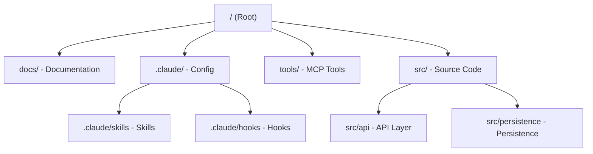

# Claude Code

Claude Code is a command-line interface (CLI) and terminal agent developed by Anthropic. It allows you to interact with Claude directly from your terminal, enabling agentic coding workflows, system-level interactions, and seamless integration with your development environment.

Unlike traditional chat interfaces, Claude Code has direct access to your local files, terminal, and git state, allowing it to perform complex tasks like refactoring, debugging, and running tests autonomously.

## Project Overview

When working with Claude Code, it is recommended to follow a structured approach to organize your documentation, reusable skills, automated development workflowsand tools. Below is a typical project structure for a Claude Code-enabled repository:



* Sample:
```bash
claude_code_project/
├── CLAUDE.md
├── README.md
├── docs/
│   ├── architecture.md
│   ├── decisions/
│   └── runboooks/
├── .claude/
│   ├── settings.json
│   ├── hooks/
│   │   ├── pre-commit.md
│   │   └── ...
│   └─── skills/
│       ├── code-review/
│       │   └── SKILL.md
│       ├── refactor/
│       │   └── SKILL.md
│       ├── release/
│       │   └── SKILL.md
│       └── ...
├── tools/
│   ├── scripts/
│   └── prompts/
├── src/
    ├── api/
    │   └── CLAUDE.md
    └── persistence/
        └── CLAUDE.md
```

### Core Key Components
- **`CLAUDE.md`**: Project memory and instructions for Claude.
  Repo Memory (Keep it Short). This file is the north start for Claude. Not amassive docuemnt. Just three things:
  - **Purpose**: why the system exists.
  - **Repo map**: how the project is structured
  - **Rules + command**: how Claude should operatate

  If `CLAUDE.md` becomes too long, he model starts missing critical signals.

- **`.claude/`**: The root configuration directory for Claude Code.
  - **`.claude/skills`**: Directory for defining reusable skills (AI Workflow) for coding tasks and capabilities.
  Stop repeatint instruction in prompts.
  Turn common workflow into reusable skills.

  Examples:
    - Code reiew checklist
    - Refactoring playbook
    - Debugging worklfow
    - Release procedures

  Now Claude can switch into specialized modes instantly.
  Result: more consistent outputs across sessions and teammates.

  - **`.claude/hooks`**: Guardrails and automatic checks. Contains lifecycle hooks. These are scripts that Claude can trigger at specific points (e.g., before or after a command) to automate repetitive tasks or enforce project rules.
  Models forget, Hooks don't.
  Use hooks for things that must always happen automatically.
  Examples
    - Run formatters after edits
    - Trigger tests after ore changes
    - Block sensitive diretories (auth, billing, migraitons).

  Hooks turn AI workflow into reliable engineering systems.

- **`docs/`**: Contains project documentation, architectural decisions, runbooks, and guides. This is a primary source of context for Claude.
  Don't overload prompts with information.
  Instead, let Claude navigate your documentation.

  Examples:
    - Architecture overview
    - ADRs (engineering decisions)
    - Operational runbooks
    - API documentation

  Claude doesn't need everything in memory.

  It just needs to know where truth lives.

- **`tools/`**: A dedicated space for custom tools, often implemented using the **Model Context Protocol (MCP)**. These tools allow Claude to interact with external APIs, databases, or local services that are not part of its default toolset.

### Source Code Organization
Core application modules.
Some arreas of your system have hidden complexity.
Add local context files there.

With that Claude undestand the danger zones exactly when it works in them.

This dramatically reduce mistakes.

- **`src/api/CLAUDE.md`**: Houses the logic for interacting with external services, defining API clients, and managing network requests.
- **`src/auth/CLAUDE.md`**: Houses the logic for authentication and authorization.
- **`src/persistence/CLAUDE.md`**: Responsible for data storage, database interactions, and state management. Segregating persistence logic helps Claude understand how data flows and is stored within the application.

## Key Features

- **Terminal Integration**: Run commands, interpret output, and fix errors directly in your shell.
- **File System Access**: Read from and write to your codebase with full context of the project structure.
- **Git Awareness**: Understand branch state, commit history, and staged changes.
- **Skill Discovery**: Automatically detects and utilizes skills defined in the `.claude/skills` directory.
- **MCP Compatibility**: Supports Model Context Protocol for easy integration of third-party tools.

## See Also

- [ClaudeKit Workflow](../Workflows/ClaudeKit-Workflow.md): Spec-driven AI development methodology.
- [OpenCode](./opencode.md): A structured AI coding CLI with plugin support.
- [OpenSandbox](./OpenSandbox.md): Secure infrastructure for running AI agents.
- [Model Context Protocol](https://modelcontextprotocol.io): Learn more about the protocol for sharing tools.
- [Anatomy of the .claude/ folder](https://x.com/akshay_pachaar/status/2035341800739877091): A complete guide to CLAUDE.md, commands, skills, agents and permission.
