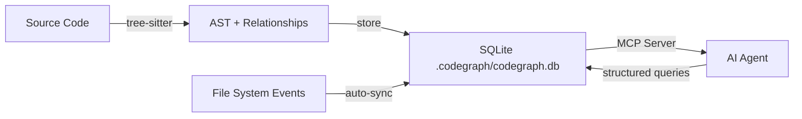

import Tabs from '@theme/Tabs';
import TabItem from '@theme/TabItem';
import Card from '@site/src/components/Card/Card';
import CardGroup from '@site/src/components/Card/CardGroup';
import Steps from '@site/src/components/Steps/Steps';
import Step from '@site/src/components/Steps/Step';
import Accordion from '@site/src/components/Accordion/Accordion';
import AccordionGroup from '@site/src/components/Accordion/AccordionGroup';

# Codegraph

Codegraph is a local, open-source tool that pre-indexes your codebase into a semantic knowledge graph. Instead of forcing your AI agent to blindly `grep`, `glob`, and read dozens of files to understand a project, Codegraph exposes that knowledge as a queryable **MCP (Model Context Protocol) server** — so agents get the answers they need in a fraction of the tool calls.

## Summary

When an AI coding agent encounters a new codebase, it typically goes through a costly "discovery phase": it reads file trees, searches for function definitions, and traces import chains one file at a time. This brute-force exploration burns tokens and slows down every session.

Codegraph solves this by doing the exploration once — locally, offline, and ahead of time — and storing the result in a structured SQLite database. Your agent queries the graph instead of the filesystem.

:::info
Benchmarks across real-world codebases show an average reduction of **~92% in tool calls** and **~71% faster** code exploration when using Codegraph.
:::

## Core Advantages

- **Zero cloud**: All indexing and processing happen on your machine. No code or metadata leaves your environment.
- **Auto-sync**: Uses native OS file events to keep the index up-to-date as you code — no manual rebuilds.
- **Broad language support**: Parses **19+ programming languages** via tree-sitter.
- **Framework awareness**: Detects route patterns for **13 common web frameworks**, mapping URLs to controllers.
- **Universal agent support**: Works with Claude Code, Cursor, Codex CLI, OpenCode, and Hermes Agent.

## How It Works

Codegraph is built on two key technologies:

1. **Tree-sitter** — a fast, incremental code parser that builds an Abstract Syntax Tree (AST) for your source files. It extracts functions, classes, methods, imports, and inheritance relationships with high precision.
2. **SQLite** — the extracted structure is stored locally in `.codegraph/codegraph.db`. The schema captures nodes (symbols) and edges (calls, imports, inheritance).

The MCP server layer sits on top of this database and exposes tools that agents can call directly — e.g., "find all callers of function X" or "what does class Y depend on?".



## Installation & Setup

<Steps>
  <Step title="Install via npx">
    Run the interactive installer. It auto-configures supported AI agents.
    ```bash
    npx @colbymchenry/codegraph
    ```
  </Step>
  <Step title="Index your project">
    Navigate to your project root and trigger the initial index build.
    ```bash
    cd my-project
    npx @colbymchenry/codegraph build
    ```
    The index is stored in `.codegraph/codegraph.db`.
  </Step>
  <Step title="Verify agent integration">
    Open your AI agent (e.g., Claude Code or Cursor). Codegraph is automatically registered as an MCP server. The agent will use it whenever a `.codegraph/` directory is detected.
  </Step>
</Steps>

:::tip
Add `.codegraph/` to your `.gitignore` to avoid committing the generated database. Each developer runs their own local index.
:::

## Agent Integration

<Tabs groupId="agent-integration">
  <TabItem value="claude" label="Claude Code" default>
    The MCP server is registered automatically by the installer.
    ```bash
    npx @colbymchenry/codegraph
    # Follow the interactive prompt to configure Claude Code
    ```
    Claude will automatically use codegraph tools when `.codegraph/` is present.
  </TabItem>
  <TabItem value="cursor" label="Cursor">
    Add the MCP server to your Cursor MCP settings file:
    ```json
    {
      "mcpServers": {
        "codegraph": {
          "command": "npx",
          "args": ["@colbymchenry/codegraph", "serve"]
        }
      }
    }
    ```
  </TabItem>
  <TabItem value="codex" label="Codex CLI">
    Register codegraph as an MCP server in your Codex configuration:
    ```bash
    npx @colbymchenry/codegraph --install codex
    ```
  </TabItem>
  <TabItem value="opencode" label="OpenCode">
    Use the interactive installer and select OpenCode from the agent list:
    ```bash
    npx @colbymchenry/codegraph
    # Select "OpenCode" during setup
    ```
  </TabItem>
</Tabs>

## Codegraph vs. Graphify

Both tools aim to reduce the overhead of AI agents exploring a codebase, but they take different approaches and target different use cases.

<CardGroup cols={2}>
  <Card title="Codegraph" icon="mdi:graph" href="https://github.com/colbymchenry/codegraph">
    **Structural, code-first.** Built for high-precision navigation of pure source code. Best for backend services, refactoring, and call-graph analysis.
  </Card>
  <Card title="Graphify" icon="mdi:graph-outline" href="https://github.com/safishamsi/graphify">
    **Multi-modal, docs-aware.** Built for mixed-media repos combining code, PDFs, images, and design documents. Best for understanding architectural intent.
  </Card>
</CardGroup>

| Feature | Codegraph | Graphify |
|:---|:---|:---|
| **Primary focus** | Structural code analysis (AST, call graphs) | Multi-modal knowledge graph (code + docs + media) |
| **Parsing method** | Tree-sitter (language-specific AST) | Tree-sitter + LLM-driven semantic extraction |
| **Storage** | SQLite (`.codegraph/codegraph.db`) | JSON + HTML (`.graphify/graph.json`) |
| **Token efficiency** | ~92% fewer tool calls | 71.5× fewer tokens per query |
| **Language support** | 19+ languages | 13+ languages |
| **Framework detection** | ✅ 13 frameworks (routes → controllers) | ❌ Not applicable |
| **Docs/PDF/image support** | ❌ Code only | ✅ Via Claude Vision |
| **Obsidian vault output** | ❌ | ✅ |
| **Git merge driver** | ❌ | ✅ |
| **Installation** | `npx` (Node.js) | `pip` (Python) |
| **Privacy** | 100% local, no LLM calls during index | Requires LLM API for doc ingestion |

### When to choose Codegraph

- Your project is **pure source code** (Go, Python, TypeScript, Rust, etc.)
- You need **precise impact analysis** — "what breaks if I rename this function?"
- You want **zero LLM dependency** during indexing (fully offline)
- You're working with **backend services** or **data pipelines** where call-graph accuracy is critical

### When to choose Graphify

- Your repo mixes **code with documentation, PDFs, or design files**
- You need to understand **architectural intent** beyond just code structure
- You want to **browse your project as an Obsidian wiki**
- You're working in a **team** that benefits from a committed `graph.json` in Git

:::tip
The two tools are not mutually exclusive. Because both integrate via MCP, you can run both simultaneously — use Codegraph for structural navigation and Graphify for high-level architectural reasoning.
:::

## Supported Languages

<AccordionGroup>
  <Accordion title="Languages with full AST support">
    Codegraph uses tree-sitter grammars for these languages, providing function-level, class-level, and import-level indexing:

    TypeScript, JavaScript, Python, Go, Rust, Java, C, C++, C#, Ruby, PHP, Swift, Kotlin, Scala, Elixir, Haskell, Lua, R, and more (19+ total).
  </Accordion>
  <Accordion title="Framework-aware route detection">
    Codegraph maps URL routes directly to their handler functions for these frameworks:

    Express, FastAPI, Django, Flask, Rails, Laravel, Spring Boot, NestJS, Gin, Echo, Fiber, Chi, and Axum.
  </Accordion>
</AccordionGroup>

## References

- [GitHub Repository — colbymchenry/codegraph](https://github.com/colbymchenry/codegraph)
- [Model Context Protocol (MCP)](https://modelcontextprotocol.io)
- [Graphify — Multi-modal Knowledge Graph](../graphify)
- [Tree-sitter — Incremental Code Parser](https://tree-sitter.github.io/tree-sitter/)
