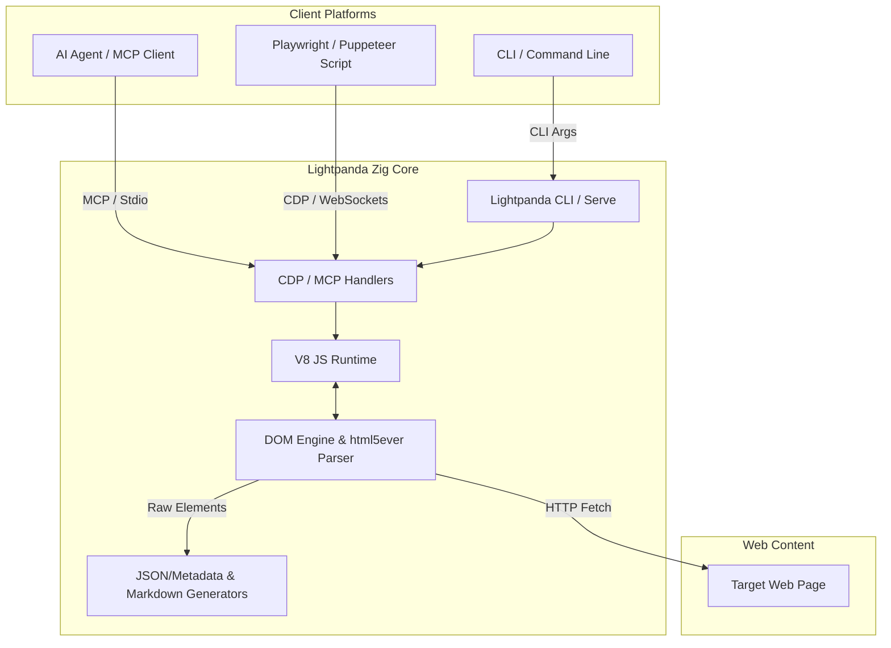

import Tabs from '@theme/Tabs';
import TabItem from '@theme/TabItem';
import Card from '@site/src/components/Card/Card';
import CardGroup from '@site/src/components/Card/CardGroup';
import Accordion from '@site/src/components/Accordion/Accordion';
import AccordionGroup from '@site/src/components/Accordion/AccordionGroup';
import Steps from '@site/src/components/Steps/Steps';
import Step from '@site/src/components/Steps/Step';

# Lightpanda: High-Concurrency Zig Headless Browser

When scale and raw concurrency are the primary requirements for web automation or AI web-browsing tasks, traditional browsers like Chrome fall short due to their massive resource footprints. Even custom lightweight frameworks often retain standard parsing structures that create unnecessary memory abstractions.

**Lightpanda** is an open-source, ultra-fast headless browser engine written from scratch in **Zig**. Designed specifically for machine-driven processes like web scraping and AI agent automation, Lightpanda operates with a "surgical omission" architecture. By stripping away visual layouts, CSS rendering trees, and image decoders, it leaves a streamlined engine optimized purely for parsing HTML, constructing the DOM, and executing JavaScript via the **V8 JavaScript engine**.

## Core Advantages & Efficiency

Lightpanda is engineered specifically to run multiple parallel browser instances with minimal system resources. By managing memory manually through Zig and omitting the entire visual painting pipeline, it redefines the efficiency limits of headless browsing.

:::info
Lightpanda launches in under **50ms** and consumes only **~24MB of RAM** per page instance, enabling developers to run up to 15x more concurrent browsing sessions on standard server hardware compared to Headless Chrome.
:::

- **Surgical Omission Architecture**: Omits image decoding, CSS visual rendering, layout painting, and accessibility trees, leaving only the network fetch, HTML parser (`html5ever`), DOM model, and V8 engine.
- **Ultra-Low Memory Profile**: Requires only ~24MB of RAM per instance, outperforming all other headless engines on the market.
- **Lightning Cold Startup**: Prepares a fresh browser context and executes modern JS in under 50ms.
- **Agent-Optimized DOM Extraction**: Natively extracts a highly pruned "Semantic Tree" and clean markdown to save agent context tokens.
- **CDP drop-in compatibility**: Acts as a drop-in replacement for headless Chrome in standard Puppeteer, Playwright, or Go `chromedp` scripts.
- **Native MCP Command & SSE Cloud**: Provides native stdio MCP tools for local developer setups and supports managed Cloud integration over Server-Sent Events (SSE).

### Concurrency & Performance

By eliminating layout trees and visual rendering pipelines, Lightpanda avoids the standard garbage collection cycles and memory bloat of Chromium. Under high-concurrency scraping or multi-agent environments, this translates to predictable memory scaling:
- **Low Memory Baseline**: Running 100 concurrent browsing threads consumes under 2.5GB of RAM in total.
- **Rapid Loop Iterations**: Without visual layout calculations, pages execute Javascript immediately, allowing LLM agents to execute parallel searches and page navigations in milliseconds.

## Advanced Capabilities

<CardGroup cols={2}>
  <Card title="Pruned Semantic Tree" icon="mdi:tree" href="lightpanda#pruned-semantic-tree">
    Extract clean, simplified DOM hierarchies omitting non-interactive elements, dramatically reducing token consumption for LLMs.
  </Card>
  <Card title="Ultra-High Concurrency" icon="mdi:server-network" href="lightpanda#concurrency--performance">
    Scale to thousands of parallel tasks on basic VPS configurations without running into standard out-of-memory crashes.
  </Card>
</CardGroup>

## Architecture & Workflow

Lightpanda operates as a highly optimized DOM engine and JS evaluator. It intercepts standard automation protocols and routes them directly to a custom, non-rendering parsing loop.



## Native MCP Integration

Lightpanda features a native Model Context Protocol (MCP) server built directly into its core binary, exposing specialized web interaction tools to your AI agents.

<Tabs groupId="agent-integration">
  <TabItem value="claude" label="Claude Desktop Config" default>
    Add Lightpanda to your `claude_desktop_config.json`:
    ```json
    {
      "mcpServers": {
        "lightpanda": {
          "command": "/usr/local/bin/lightpanda",
          "args": ["mcp"]
        }
      }
    }
    ```
    This registers the following optimized browsing tools:
    - `goto`: Navigate to a URL.
    - `markdown`: Extract page content as token-efficient markdown.
    - `semantic_tree`: Get a highly pruned, interactive DOM representation designed for LLMs.
    - `interactiveElements`: Collect buttons, inputs, and clickable elements.
    - `links`: Extract all page links.
    - `structuredData`: Extract JSON-LD and OpenGraph metadata.
    - `evaluate`: Run custom JavaScript in the page context.
  </TabItem>
  <TabItem value="cursor" label="Cursor AI Agent">
    Add Lightpanda as an MCP tool in Cursor:
    1. Navigate to **Cursor Settings** > **Features** > **MCP**.
    2. Click **+ Add New MCP Tool**.
    3. Configure as:
       - **Name**: `lightpanda`
       - **Type**: `command`
       - **Command**: `lightpanda mcp`
  </TabItem>
</Tabs>

### Pruned Semantic Tree

Traditional headless browsers pass the entire, bloated HTML DOM structure to LLMs, wasting thousands of tokens on nested `div` containers and formatting elements. Lightpanda's native `semantic_tree` tool addresses this by generating a pruned, interactive DOM representation. It removes non-functional structural boilerplate, returning only interactive fields (such as inputs, textareas, and buttons) along with semantic tags and link endpoints. This filters out up to 95% of HTML noise, leading to massive token savings and faster agent reasoning.

## Lightpanda vs. Obscura

For a detailed, head-to-head architectural comparison between **Lightpanda** (Zig) and **Obscura** (Rust), including memory footprints, cold startup speeds, anti-bot capabilities, and native MCP features, see the central [Headless Browsers for AI](../headless-browser.md#head-to-head-obscura-vs-lightpanda) overview.

## Setup & Configuration

<AccordionGroup>
  <Accordion title="Installation" icon="mdi:download">
    Lightpanda is distributed as a single static binary with no external runtimes required (no Node.js or Chromium dependency):
    
    <Tabs groupId="os">
      <TabItem value="macos" label="macOS (Apple Silicon)" default>
        ```bash
        curl -L -o lightpanda https://github.com/lightpanda-io/browser/releases/download/nightly/lightpanda-aarch64-macos
        chmod a+x ./lightpanda
        sudo mv ./lightpanda /usr/local/bin/
        ```
      </TabItem>
      <TabItem value="linux" label="Linux (x86_64)">
        ```bash
        curl -L -o lightpanda https://github.com/lightpanda-io/browser/releases/download/nightly/lightpanda-x86_64-linux
        chmod a+x ./lightpanda
        sudo mv ./lightpanda /usr/local/bin/
        ```
      </TabItem>
      <TabItem value="npm" label="Node.js Package">
        If you are working in a JavaScript/TypeScript project, you can install it directly:
        ```bash
        npm install @lightpanda/browser
        ```
        This downloads the correct platform binary automatically.
      </TabItem>
    </Tabs>
  </Accordion>
  <Accordion title="Docker Container Execution" icon="mdi:docker">
    Run Lightpanda inside Docker to host a shared CDP browser pool in your cloud environment:
    ```bash
    docker run -d \
      --name lightpanda \
      -p 127.0.0.1:9222:9222 \
      lightpanda/browser:nightly
    ```
  </Accordion>
</AccordionGroup>

## Step-by-Step Usage

<Steps>
  <Step title="CLI Markdown Dump">
    Extract clean, ready-to-ingest markdown directly from a target website using single-shot CLI mode:
    ```bash
    lightpanda fetch --dump markdown https://example.com
    ```
  </Step>
  <Step title="Start the CDP Server">
    Launch a local WebSocket endpoint compatible with Chromium libraries (e.g. Puppeteer/Playwright):
    ```bash
    lightpanda serve --host 127.0.0.1 --port 9222
    ```
  </Step>
  <Step title="Connect Playwright Script">
    Hook your Python or Node.js automation script directly into the Lightpanda execution engine:
    ```javascript
    import { chromium } from 'playwright';

    (async () => {
      // Connect to the running Lightpanda CDP socket
      const browser = await chromium.connectOverCDP('http://127.0.0.1:9222');
      const context = await browser.newContext();
      const page = await context.newPage();

      await page.goto('https://example.com');
      const text = await page.innerText('body');
      console.log(text);

      await browser.close();
    })();
    ```
  </Step>
</Steps>

## References

- [Official Site: Lightpanda](https://lightpanda.io/) — Project details and benchmarks.
- [GitHub Repository: Lightpanda Browser](https://github.com/lightpanda-io/browser) — Main source repository and issue tracker.
- [GitHub Repository: Lightpanda Agent Skill](https://github.com/lightpanda-io/agent-skill) — Integration packages for AI systems.
- [Obscura Headless Browser](./obscura.md) — Rust-based lightweight browser with advanced stealth.
- [RTK (Rust Token Killer)](./rtk.md) — Token optimization proxy for terminal commands.
- [Claude Code](./claude-code.md) — Anthropic's agentic CLI tool.
