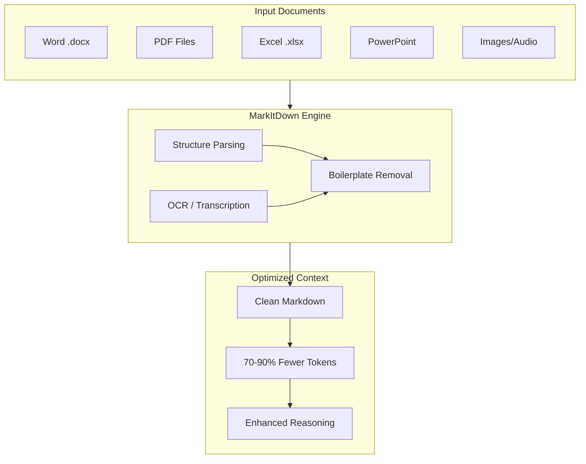

import { Icon } from '@iconify/react';
import Tabs from '@theme/Tabs';
import TabItem from '@theme/TabItem';

# MarkItDown: Document-to-Markdown Converter

**MarkItDown** is an open-source Python utility by Microsoft that converts a wide range of file formats into clean, structured Markdown. By stripping away binary overhead and XML noise, it ensures your LLM receives high-density information, minimizing token counts and maximizing reasoning capabilities.

<Icon icon="simple-icons:markdown" width="4em" height="4em" />

:::important Note on Version 0.1.0+
Since version 0.1.0, MarkItDown has transition to **optional feature groups**. To ensure all converters (PDF, Office, OCR) work as expected, it is recommended to install using `pip install 'markitdown[all]'`.
:::

## Summary

[MarkItDown](https://github.com/microsoft/markitdown) solves a critical problem in AI development: **Context Pollution**. Traditional documents (PDF, DOCX, XLSX) are designed for human eyes, not LLM tokenizers. They contain massive amounts of metadata, styling information, and legacy XML structure that "clog" the context window.

MarkItDown runs locally on your machine, requiring no cloud access or API keys. It extracts the semantic essence of a document—headings, lists, tables, and links—and presents it in the format LLMs understand natively: **Markdown**.



## Why Markdown?

Markdown is the *lingua franca* of LLMs. Modern models like GPT-4o, Claude 3.5, and Gemini 1.5 are trained extensively on Markdown-rich datasets (documentation, GitHub, technical blogs). 

1. **Native Understanding:** Models can "reason" better through Markdown hierarchy than they can through raw strings or messy HTML.
2. **Token Efficiency:** Markdown uses minimal syntax to express structure. For example, a heading in Word XML might take 50 tokens; in Markdown, it's just `# ` (1 token).
3. **Local-First:** Unlike many "PDF to Text" APIs, MarkItDown is a lightweight utility you can integrate directly into your local CLI pipelines or RAG ingestion scripts.

## Before & After: Token Optimization

Compare how a simple formatted snippet is viewed by an LLM when using raw Word XML vs. MarkItDown output.

<Tabs>
  <TabItem value="raw" label="Raw Source (Word XML)" default>

```xml title="Raw Source (Word XML)"
<w:p>
  <w:pPr><w:pStyle w:val="Heading1"/></w:pPr>
  <w:r><w:t>Q3 Project Goals</w:t></w:r>
</w:p>
<w:p>
  <w:r><w:t>Complete the </w:t></w:r>
  <w:r><w:rPr><w:b/></w:rPr><w:t>migration</w:t></w:r>
  <w:r><w:t> by September.</w:t></w:r>
</w:p>
```

*Complexity: High. Tokens wasted on style tags and properties.*

  </TabItem>
  <TabItem value="optimized" label="Optimized (MarkItDown)">

```markdown title="Optimized (MarkItDown)"
# Q3 Project Goals
Complete the **migration** by September.
```

*Complexity: Minimal. 100% of tokens are semantic content.*

  </TabItem>
</Tabs>

## Supported Formats

| Category | Formats |
|---|---|
| **Office Documents** | Word (.docx), PowerPoint (.pptx), Excel (.xlsx, .xls), Outlook messages (.msg) |
| **Portable Documents** | PDF |
| **Media** | Images (EXIF + OCR), Audio (EXIF + Speech-to-Text) |
| **Web & Markup** | HTML, RSS, YouTube URLs (transcripts) |
| **Text-based** | CSV, JSON, XML, EPub |

## Installation

MarkItDown requires **Python 3.10+**.

<Tabs>
  <TabItem value="pip-all" label="pip (Full)" default>

```bash
# Recommended for all-round conversion
pip install 'markitdown[all]'
```

  </TabItem>
  <TabItem value="pip-selective" label="pip (Selective)">

```bash
# Avoid heavy dependencies if you only need core formats
pip install 'markitdown[pdf,docx]'
```

  </TabItem>
  <TabItem value="source" label="From Source">

```bash
git clone https://github.com/microsoft/markitdown.git
cd markitdown
pip install -e 'packages/markitdown[all]'
```

  </TabItem>
</Tabs>

### Dependency Groups
If you prefer a minimal installation, you can install specific groups:
- `[pdf, docx, pptx]`: Core documents
- `[xlsx, xls, outlook]`: Data and email
- `[audio-transcription, youtube-transcription]`: Media
- `[az-doc-intel]`: Azure Document Intelligence

## Comparison: MarkItDown vs. Alternatives

| Feature | MarkItDown | Pandoc | BeautifulSoup |
|---|---|---|---|
| **Goal** | LLM Token Optimization | Universal Doc Conversion | Web Scraping/Parsing |
| **Preservation** | Semantic structure | Pixel-accurate layout | HTML tags |
| **Media Support** | Native OCR & Transcription | Limited | None |
| **Local-First** | Yes (Lightweight) | Yes (Heavyweight) | Yes |
| **AI Ready** | Native Prompt Injection | No | Formatting Noise |

### CLI Reference

| Flag | Description |
|---|---|
| `-o`, `--output` | Specify the output Markdown file path. |
| `-d`, `--doc-intel` | Use Azure Document Intelligence for primary parsing. |
| `-e`, `--endpoint` | Azure Document Intelligence endpoint. |
| `--list-plugins` | List all installed and discovered plugins. |
| `--use-plugins` | Enable plugin execution during conversion. |

### Python API integration

#### Basic File Conversion
```python
from markitdown import MarkItDown

md = MarkItDown()
result = md.convert("whitepaper.pdf")
print(result.text_content)
```

#### Working with Streams
Useful for FastAPI/Flask backends or cloud functions where files are held in memory:
```python
import io
from markitdown import MarkItDown

md = MarkItDown()
stream = io.BytesIO(b"Data from memory...")
# Note: convert_stream requires a binary file-like object
result = md.convert_stream(stream, file_extension=".docx") 
```

## Advanced OCR & Vision

While MarkItDown has basic text extraction, the **`markitdown-ocr`** plugin significantly enhances its ability to handle complex PDFs and images by leveraging LLM Vision.

### 1. Setup
```bash
pip install markitdown-ocr
pip install openai  # Or any OpenAI-compatible client
```

### 2. Configuration
Pass an OpenAI client (or compatible) to the `MarkItDown` constructor. The plugin will automatically use it for high-fidelity OCR.

```python title="OCR with LLM Vision"
from markitdown import MarkItDown
from openai import OpenAI

md = MarkItDown(
    enable_plugins=True, # Critical: plugins are OFF by default
    llm_client=OpenAI(),
    llm_model="gpt-4o",
)

result = md.convert("photo_of_whiteboard.jpg")
print(result.text_content)
```

## Enterprise Integration (Azure)

For high-volume processing or extremely complex layouts (tables within tables, multi-column financial reports), MarkItDown integrates natively with **Azure Document Intelligence**.

### CLI Usage
```bash
markitdown sample.pdf -d -e "https://YOUR_RESOURCE.cognitiveservices.azure.com/"
```

### Python Implementation
```python title="Azure Document Intelligence"
from markitdown import MarkItDown

md = MarkItDown(docintel_endpoint="https://YOUR_RESOURCE.cognitiveservices.azure.com/")
result = md.convert("complex_report.pdf")
```

:::tip Hybrid Workflows
You can combine Azure for layout detection with local LLM Vision for specific image descriptions by providing both the `docintel_endpoint` and an `llm_client`.
:::

## Developer Pro-Tips

- **The "Billion Token" Fix:** Markdown tables are the single greatest "token killer" for RAG. Converting a 5MB Excel sheet (.xlsx) to its Markdown equivalent typically reduces its context window footprint by 80-90%.
- **Plugin Discovery:** Search GitHub for the `#markitdown-plugin` tag to find community-developed parsers.
- **Selective OCR:** If you don't provide an `llm_client`, MarkItDown reverts to standard extraction, silently skipping OCR. This is useful for saving costs on "text-only" batches.

## Use Cases

- **Retrieval-Augmented Generation (RAG):** The primary use case. Feeding clean Markdown to your vector database improves retrieval accuracy.
- **Agentic Knowledge Gathering:** Allow your agents to browse a local folder and ingest diverse documents without breaking the context window.
- **CI/CD for Docs:** Automatically convert project documentation in various formats to a unified Markdown site.

## References

- **GitHub Repository:** [https://github.com/microsoft/markitdown](https://github.com/microsoft/markitdown)
- **Official MCP Server:** [markitdown-mcp](https://github.com/microsoft/markitdown/tree/main/packages/markitdown-mcp)
- **Xeynergy Blog:** [Why MarkItDown Matters](https://blog.xeynergy.com/what-is-microsoft-markitdown-and-why-it-matters-da775f74bdaa)
- **Threads Discussion:** [Parsing Pipelines](https://www.threads.com/@matt_dancho/post/DW1d4EWkY2q)
