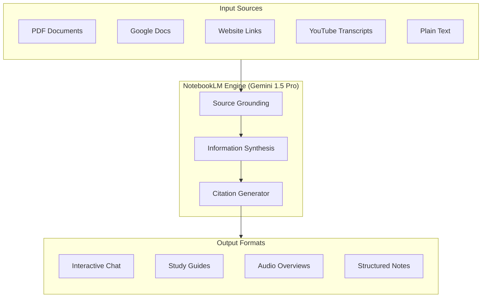

import { Icon } from '@iconify/react';

# NotebookLM - AI-Powered Research and Writing Assistant

**NotebookLM** is Google's experimental AI-powered research and writing tool designed to help you synthesize information from your own sources. Unlike generic AI chatbots, NotebookLM is "grounded" in the specific documents, PDFs, and URLs you provide, ensuring more accurate and context-aware responses.

<Icon icon="simple-icons:notebooklm" width="4em" height="4em" />

## What is NotebookLM?

At its core, NotebookLM is a **personalized AI collaborator**. It uses the power of Gemini 1.5 Pro to process multiple sources of information simultaneously. By grounding its knowledge in your provided materials, it minimizes "hallucinations" and provides direct citations for every claim it makes.

## Best Features

NotebookLM stands out from other AI tools due to several unique capabilities:

### 1. Source-Grounded Interaction
The AI only answers based on the material you've uploaded. If you ask a question not covered by your sources, it will explicitly state that the information is missing rather than guessing.

### 2. Audio Overview (AI Deep Dive)
Perhaps the most viral feature, Audio Overview generates a **lively, two-person podcast-style conversation** between AI hosts. They discuss your sources, call out interesting themes, and simplify complex concepts, making it perfect for auditory learners.

### 3. Inline Citations
Every time NotebookLM generates a response, it includes **numerical citations**. Clicking a citation takes you directly to the specific passage in your source document, allowing for instant verification.

### 4. Notebook Workspace
The interface is split into sources and a workspace. You can save AI responses as notes, write your own thoughts, and reorganize them into a structured outline or a final draft.

### 5. Multi-Source Synthesis
You can upload up to **50 sources** (up to 500,000 words each) into a single notebook. The AI can then find connections across these disparate documents, identifying patterns that a human might miss.

## Primary Use Cases

| Use Case | Description | Best For |
|----------|-------------|----------|
| **Deep Research** | Synthesizing hundreds of pages of research papers or reports. | Academics, Analysts, Journalists |
| **Learning & Study** | Generating study guides, FAQs, and quizzes from textbooks. | Students, Lifelong Learners |
| **Business Strategy** | Cross-referencing internal wikis, meeting notes, and market data. | Founders, Product Managers |
| **Content Creation**| Brainstorming ideas based on your own past writings or references. | Writers, Creators, Researchers |
| **Legal/Compliance**| Analyzing long-form legal documents or policy handbooks. | Lawyers, Compliance Officers |

## How to Get Started

1. **Visit [notebooklm.google.com](https://notebooklm.google.com/)**: Sign in with your Google account.
2. **Create a New Notebook**: Give it a descriptive name (e.g., "AI Strategy 2026").
3. **Add Sources**: Upload PDFs, paste website URLs, or select files from Google Drive.
4. **Interact**: Use the "Notebook guide" to get an automatic summary or start asking specific questions in the chat.
5. **Generate Audio**: In the Notebook guide, click "Deep Dive" to create your Audio Overview.

## Pro Tips for Maximum Efficiency

- **Use Descriptive File Names**: NotebookLM uses the file titles to help you organize.
- **Specific Prompting**: Instead of "Summarize this," try "List the top 5 risks mentioned in Source A and how they contradict Source B."
- **Note-Taking**: Don't just chat; use the "Save to Note" feature to build your final document incrementally in the right-hand panel.

## Ecosystem & Extensions

The official NotebookLM experience can be enhanced using community-developed [Chrome Extensions](https://chromewebstore.google.com/). These utilities streamline source ingestion, improve data portability, and add missing organizational features.

### 1. Data Ingestion & Integration
- **YouTube to NotebookLM**: [Install Extension](https://chromewebstore.google.com/detail/youtube-to-notebooklm/kobncfkmjelbefaoohoblamnbackjggk). 
  Automates the process of converting individual videos, search results, or entire channels into queryable knowledge bases within your notebooks.
- **NotebookLM Tools**: [Install Extension](https://chromewebstore.google.com/detail/notebooklm-tools/hiibkpjljigehlnnecbgehkhfibmahjn). 
  Simplifies importing web content. It can extract text, images, and tables from active tabs and supports bulk-sending multiple open tabs to a notebook.

### 2. Organization & Management
- **FolderLLM (Create Folders)**: [Install Extension](https://chromewebstore.google.com/detail/folderllm-create-folders/nknkgcmodkaiffdnlpmlnegmeamnbioe). 
  Addresses the lack of native organization by adding a folder and subfolder hierarchy. Includes support for custom colors and icons for better visual categorization.

### 3. Export & Interoperability
- **NotebookLM Ultraexporter**: [Install Extension](https://chromewebstore.google.com/detail/notebooklm-ultra-exporter/afchokljnhhggkhedfbmkcmdagjmjchj). 
  Enhances export capabilities by supporting additional formats and allowing users to extract specific assets like slides or images without downloading the entire notebook.
- **NotebookLM to Obsidian Sync**: [Install Extension](https://chromewebstore.google.com/detail/notebooklm-to-obsidian-sy/mkdbepkddolffpinmhbjeginkfpinojb). 
  Integrates your NotebookLM workflow with Obsidian for long-term shard-knowledge management.
- **NotebookLM Markdown Exporter**: [Install Extension](https://chromewebstore.google.com/detail/notebooklm-markdown-expor/oielaelencilkmceoanecfnpkjlbjijk). 
  A dedicated utility for converting notebook content into clean Markdown format.

## References

- [NotebookLM Official Help Center](https://support.google.com/notebooklm)
- [Gemini AI Models](../Models-LLMs/Qwen3.5-Small-Series.md): Understanding the underlying tech
- [AI Workflows](../index.mdx): Integrated knowledge management
