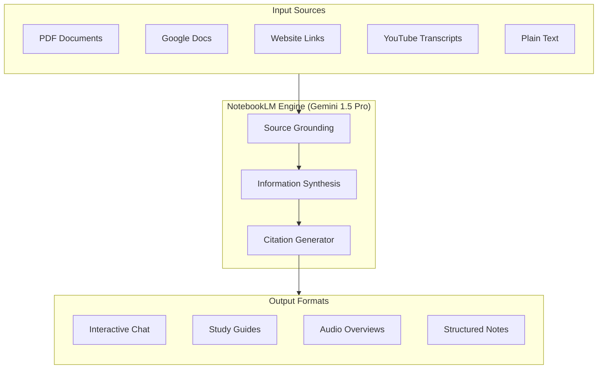

import Card from '@site/src/components/Card/Card';
import CardGroup from '@site/src/components/Card/CardGroup';
import Accordion from '@site/src/components/Accordion/Accordion';
import AccordionGroup from '@site/src/components/Accordion/AccordionGroup';
import Steps from '@site/src/components/Steps/Steps';
import Step from '@site/src/components/Steps/Step';

# NotebookLM: AI-Powered Research Assistant

**NotebookLM** is Google's experimental AI-powered research and writing tool designed to help you synthesize information from your own sources. Unlike generic AI chatbots, NotebookLM is "grounded" in the specific documents, PDFs, and URLs you provide, ensuring more accurate and context-aware responses.

## Core Advantages & Efficiency

At its core, NotebookLM is a **personalized AI collaborator**. It uses the power of Gemini 1.5 Pro to process multiple sources of information simultaneously. By grounding its knowledge in your provided materials, it minimizes "hallucinations" and provides direct citations for every claim it makes.

:::info
**Grounding Efficiency**: Uses a massive 2M token context window (Gemini 1.5 Pro) to ingest up to 50 sources (500k words each) per notebook.
:::

- **Source-Grounded Reasoning**: Only answers based on provided material.
- **Fact Verification**: Direct numerical citations for every claim.
- **Multimodal Ingestion**: Supports PDFs, Google Docs, URLs, and YouTube transcripts.

## Advanced Capabilities

<CardGroup cols={2}>
  <Card title="Audio Overview" icon="mdi:microphone" href="notebooklm#audio-deep-dive">
    Generates a lively, two-person podcast-style conversation discussing your sources.
  </Card>
  <Card title="Notebook Workspace" icon="mdi:notebook-edit" href="notebooklm#workspace-management">
    Save AI responses as notes, write thoughts, and organize them into structured outlines.
  </Card>
</CardGroup>

## Audio Deep Dive

The **Audio Overview** is NotebookLM's most distinctive feature. It utilizes Gemini to generate a realistic, two-person podcast conversation that summarizes, debates, and simplifies the core themes found in your uploaded sources.

- **Auditory Synthesis**: Ideal for grasping complex topics while commuting or away from the screen.
- **Pattern Recognition**: The AI hosts often call out contradictions or surprising connections between different documents.
- **Customization**: You can provide specific instructions to the "hosts" to focus on certain topics or target a specific audience.

## Workspace Management

The **Notebook Workspace** transforms NotebookLM from a simple research tool into a complete writing assistant. It allows you to transition seamlessly from information gathering to content creation.

- **Persistent Notes**: Save any AI-generated response or source summary directly into your workspace as a permanent note.
- **Contextual Drafting**: Write your own thoughts alongside your sources, and use the AI to help reorganize them into structured outlines or final drafts.
- **Citations in Workspace**: Even within your saved notes, NotebookLM maintains the link back to the original source passage for easy verification.

## Architecture & Workflow

## Primary Use Cases

| Use Case | Description | Best For |
|----------|-------------|----------|
| **Deep Research** | Synthesizing hundreds of pages of research papers or reports. | Academics, Analysts, Journalists |
| **Learning & Study** | Generating study guides, FAQs, and quizzes from textbooks. | Students, Lifelong Learners |
| **Business Strategy** | Cross-referencing internal wikis, meeting notes, and market data. | Founders, Product Managers |
| **Content Creation**| Brainstorming ideas based on your own past writings or references. | Writers, Creators, Researchers |

## Setup & Getting Started

<Steps>
  <Step title="Initialize">
    Visit [notebooklm.google.com](https://notebooklm.google.com/) and sign in with your Google account.
  </Step>
  <Step title="Create Notebook">
    Click "New Notebook" and give it a descriptive name (e.g., "AI Strategy 2026").
  </Step>
  <Step title="Add Sources">
    Upload PDFs, paste website URLs, or select files from Google Drive. You can add up to 50 sources.
  </Step>
  <Step title="Interact & Synthesis">
    Use the chat to ask questions or the "Notebook guide" to generate automatic summaries and Audio Overviews.
  </Step>
</Steps>

## Ecosystem & Extensions

Enhance the official NotebookLM experience using community-developed extensions for better ingestion and portability.

<AccordionGroup>
  <Accordion title="Data Ingestion" icon="mdi:import">
    - **YouTube to NotebookLM**: Automates converting individual videos or channels into knowledge bases.
    - **NotebookLM Tools**: Simplifies extracting text and tables from active web tabs.
  </Accordion>
  <Accordion title="Organization" icon="mdi:folder">
    - **FolderLLM**: Adds a folder hierarchy and subfolder support for better visual categorization.
  </Accordion>
  <Accordion title="Export & Interoperability" icon="mdi:export">
    - **Ultraexporter**: Supports additional formats and asset extraction.
    - **Obsidian Sync**: Integrates NotebookLM workflows with Obsidian for long-term knowledge management.
    - **Markdown Exporter**: Converts notebook content into clean Markdown.
  </Accordion>
</AccordionGroup>

## Pro Tips for Maximum Efficiency

- **Use Descriptive File Names**: NotebookLM uses file titles for organization and cross-referencing.
- **Specific Prompting**: Instead of "Summarize this," try "Compare the methodology of Source A with the findings in Source B."
- **Note-Taking**: Use the "Save to Note" feature to build your final document incrementally in the right-hand panel.

## References

- [NotebookLM Official Help Center](https://support.google.com/notebooklm)
- [Gemini AI Models](../Models-LLMs/Qwen3.5-Small-Series.md): Understanding the underlying tech
- [AI Workflows](../index.mdx): Integrated knowledge management

