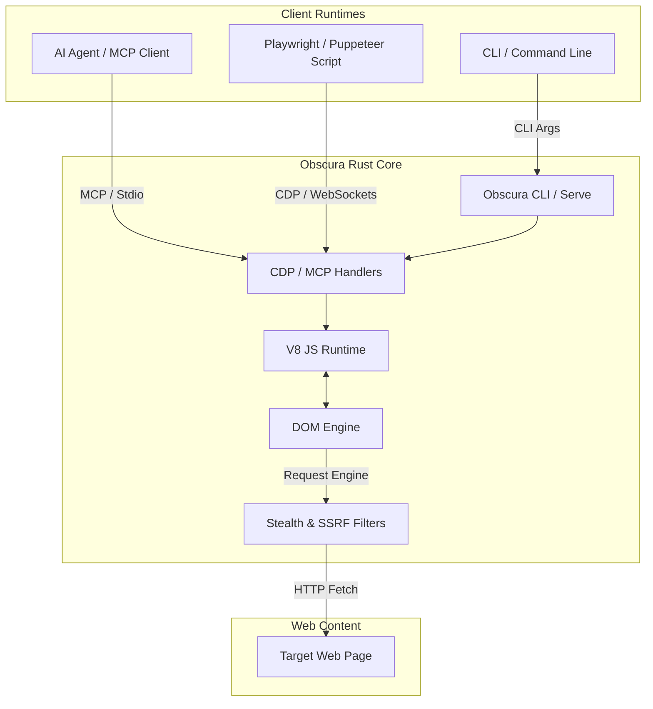

import Tabs from '@theme/Tabs';
import TabItem from '@theme/TabItem';
import Card from '@site/src/components/Card/Card';
import CardGroup from '@site/src/components/Card/CardGroup';
import Accordion from '@site/src/components/Accordion/Accordion';
import AccordionGroup from '@site/src/components/Accordion/AccordionGroup';
import Steps from '@site/src/components/Steps/Steps';
import Step from '@site/src/components/Steps/Step';

# Obscura: Lightweight Rust Headless Browser

When AI coding agents or scrapers need to navigate the modern web, spinning up a full Headless Chrome instance is a massive resource drain. Traditional headless browsers consume upwards of 200MB RAM, take hundreds of milliseconds to start, and easily get blocked by automated bot detection systems.

**Obscura** is an open-source, ultra-lightweight headless browser engine written in **Rust** and powered by the **V8 JavaScript engine**. Built from the ground up for machine-driven automation rather than human rendering, it acts as a high-performance, drop-in replacement for Chromium, supporting the **Chrome DevTools Protocol (CDP)** and exposing a native **Model Context Protocol (MCP)** server.

## Core Advantages & Efficiency

By omitting visual layout computation, image decoding, GPU acceleration, and font rasterization, Obscura channels all system resources into executing JavaScript and building the DOM tree.

:::info
Obscura starts in under **80ms** and consumes only **~30MB of RAM** per page session, allowing you to run over 10x more parallel web-browsing tasks on the same hardware compared to Headless Chrome.
:::

- **Resource Efficiency**: Shrinks typical RAM consumption from ~200MB to ~30MB per instance.
- **CDP Compatibility**: Works as a drop-in replacement for Puppeteer and Playwright by exposing a standard Chrome DevTools Protocol port.
- **Built-in Stealth**: Spoofs canvas fingerprints, battery API, GPU signatures, and hides `navigator.webdriver` transparently.
- **Tracker & Malware Blocking**: Includes a pre-compiled blocklist of over 3,500 tracking and analytical domains to save bandwidth.
- **SSRF Hardening**: Native security safeguards that automatically block requests to private IP ranges (`127.0.0.1`, `192.168.x.x`), keeping server environments safe.

## Advanced Capabilities

<CardGroup cols={2}>
  <Card title="Model Context Protocol (MCP)" icon="mdi:connection" href="obscura#native-mcp-integration">
    Control the browser directly from AI agent runtimes (like Claude Desktop, Cursor, or Aider) via native stdio MCP tools.
  </Card>
  <Card title="Anti-Bot Stealth Suite" icon="mdi:shield-check" href="obscura#setup--configuration">
    Evade bot mitigations (Cloudflare, Akamai) using low-level fingerprint spoofing and native JS-shim rewriting.
  </Card>
</CardGroup>

## Architecture & Workflow

Obscura acts as a middleware execution layer, allowing local CLI commands, traditional automation scripts, and LLM-based AI agents to interact with web contents with minimal memory overhead.



## Native MCP Integration

Obscura contains a built-in MCP server, enabling AI agents to browse, read, and interact with web pages directly without writing any custom Playwright wrapper scripts.

<Tabs groupId="agent-integration">
  <TabItem value="claude" label="Claude Desktop Config" default>
    Add the following server configuration to your `claude_desktop_config.json`:
    ```json
    {
      "mcpServers": {
        "obscura": {
          "command": "/usr/local/bin/obscura",
          "args": ["mcp"]
        }
      }
    }
    ```
    This registers standard browsing tools such as `browser_navigate`, `browser_click`, `browser_fill`, and `browser_snapshot` for Claude's direct use.
  </TabItem>
  <TabItem value="cursor" label="Cursor AI Agent">
    For Cursor, add Obscura as an MCP tool in your settings:
    1. Open **Cursor Settings** > **Features** > **MCP**.
    2. Click **+ Add New MCP Tool**.
    3. Configure as:
       - **Name**: `obscura`
       - **Type**: `command`
       - **Command**: `obscura mcp`
  </TabItem>
</Tabs>

## Head-to-Head: Obscura vs. Lightpanda

For a detailed, head-to-head architectural comparison between **Obscura** (Rust) and **Lightpanda** (Zig), including memory footprints, cold startup speeds, anti-bot capabilities, and native MCP features, see the central [Headless Browsers for AI](../comparatives/headless-browser.md#head-to-head-obscura-vs-lightpanda) overview.

## Setup & Configuration

<AccordionGroup>
  <Accordion title="Installation" icon="mdi:download">
    Obscura is distributed as a single static binary with no external dependencies:
    
    <Tabs groupId="os">
      <TabItem value="macos" label="macOS (Apple Silicon)" default>
        ```bash
        curl -LO https://github.com/h4ckf0r0day/obscura/releases/latest/download/obscura-aarch64-macos.tar.gz
        tar -xzf obscura-aarch64-macos.tar.gz
        chmod +x obscura
        sudo mv obscura /usr/local/bin/
        ```
      </TabItem>
      <TabItem value="linux" label="Linux (x86_64)">
        ```bash
        curl -LO https://github.com/h4ckf0r0day/obscura/releases/latest/download/obscura-x86_64-linux.tar.gz
        tar -xzf obscura-x86_64-linux.tar.gz
        chmod +x obscura
        sudo mv obscura /usr/local/bin/
        ```
      </TabItem>
      <TabItem value="aur" label="Arch Linux">
        ```bash
        yay -S obscura-browser
        ```
      </TabItem>
    </Tabs>
  </Accordion>
  <Accordion title="Compiling with Stealth Features" icon="mdi:shield-key">
    To compile Obscura from source with built-in stealth fingerprinters:
    ```bash
    git clone https://github.com/h4ckf0r0day/obscura.git
    cd obscura
    cargo build --release --features stealth
    ```
    The output binary will be located at `target/release/obscura`.
  </Accordion>
</AccordionGroup>

## Step-by-Step Usage

<Steps>
  <Step title="Run a Single Page Fetch">
    Retrieve page title or text content using JavaScript evaluation in single-shot CLI mode:
    ```bash
    obscura fetch https://example.com --eval "document.title"
    ```
  </Step>
  <Step title="Start a CDP server for Playwright">
    Start a standard Chrome DevTools Protocol server to transparently drop Obscura into your existing Node.js or Python automation pipelines:
    ```bash
    obscura serve --port 9222 --stealth --workers 4
    ```
  </Step>
  <Step title="Interact with Puppeteer">
    Connect your existing automation scripts directly to the Obscura WebSocket endpoint:
    ```javascript
    const puppeteer = require('puppeteer-core');

    (async () => {
      const browser = await puppeteer.connect({
        browserWSEndpoint: 'ws://127.0.0.1:9222'
      });
      const page = await browser.newPage();
      await page.goto('https://news.ycombinator.com');
      console.log(await page.title());
      await browser.disconnect();
    })();
    ```
  </Step>
</Steps>

## References

- [GitHub Repository: Obscura](https://github.com/h4ckf0r0day/obscura) — Source code, issue tracker, and release binaries.
- [Official Site: Lightpanda](https://lightpanda.io/) — Performance-focused headless browser in Zig.
- [GitHub Repository: Lightpanda](https://github.com/lightpanda-io/lightpanda) — Main Zig codebase and native MCP features.
- [RTK (Rust Token Killer)](./rtk.md) — Middleware for reducing LLM token footprint from CLI tools.
- [Claude Code](../Skills-and-Agents/claude-code.md) — Anthropic's agentic CLI terminal tool.
- [OpenSandbox](../Skills-and-Agents/opensandbox.md) — Secure execution sandboxes for AI agents.
