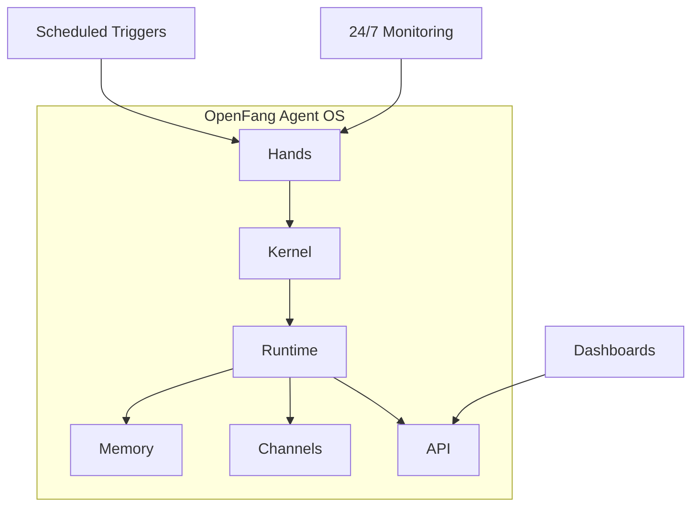
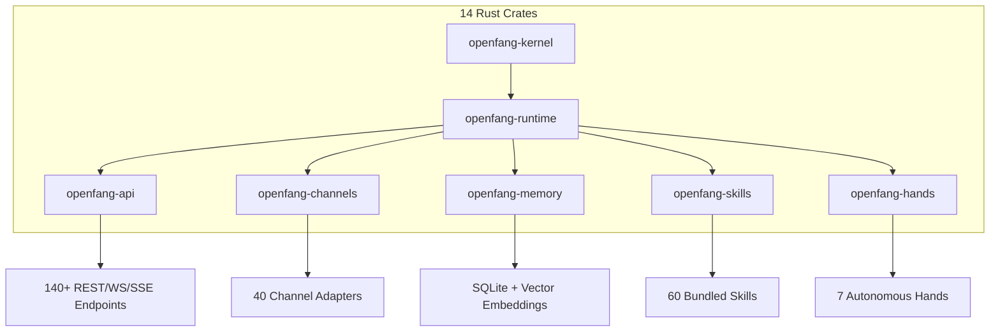

# OpenFang - Production-Grade Agent OS in Pure Rust

OpenFang is an **open-source Agent Operating System** — not a chatbot framework, not a Python wrapper around an LLM, not a generic multi-agent orchestrator. It is a full operating system for autonomous agents, built from scratch in Rust.

Traditional agent frameworks wait for you to type something. OpenFang runs **autonomous agents that work for you** — on schedules, 24/7, building knowledge graphs, monitoring targets, generating leads, managing your social media, and reporting results to your dashboard.



## Key Specifications

| Metric | Value |
|--------|-------|
| **Lines of Code** | 137,728 |
| **Rust Crates** | 14 |
| **Test Suite** | 1,767+ passing tests |
| **Code Quality** | Zero clippy warnings |
| **Binary Size** | ~32 MB (single binary) |
| **License** | MIT |

## Architecture



### Core Crates

| Crate | Purpose |
|-------|---------|
| `openfang-kernel` | Orchestration, workflows, metering, RBAC, scheduler |
| `openfang-runtime` | Agent loop, 3 LLM drivers, 53 tools, WASM sandbox |
| `openfang-api` | 140+ REST/WS/SSE endpoints, OpenAI-compatible API |
| `openfang-channels` | 40 messaging adapters with rate limiting |
| `openfang-memory` | SQLite persistence, vector embeddings, canonical sessions |
| `openfang-skills` | 60 bundled skills, SKILL.md parser, FangHub marketplace |
| `openfang-hands` | 7 autonomous Hands, HAND.toml parser |
| `openfang-desktop` | Tauri 2.0 native app (system tray, notifications) |

## Hands: Autonomous Capability Packages

*"Traditional agents wait for you to type. Hands work **for** you."*

**Hands** are OpenFang's core innovation — pre-built autonomous capability packages that run independently, on schedules, without you having to prompt them.

### 7 Bundled Hands

| Hand | What It Does |
|------|--------------|
| **Clip** | YouTube URL → download → identify best moments → cut into vertical shorts with captions → publish to Telegram/WhatsApp |
| **Lead** | Daily discovery of prospects matching ICP, enrichment, scoring 0-100, deduplication, CSV/JSON/Markdown delivery |
| **Collector** | OSINT-grade intelligence, continuous monitoring, change detection, knowledge graph construction |
| **Predictor** | Superforecasting engine with calibrated reasoning, Brier score tracking, contrarian mode |
| **Researcher** | Deep autonomous cross-referencing, CRAAP evaluation, APA-formatted reports, multi-language |
| **Twitter** | Autonomous account manager, 7 rotating content formats, scheduling, approval queue |
| **Browser** | Web automation, multi-step workflows, mandatory purchase approval gate |

```bash title="Terminal"
# Activate the Researcher Hand — it starts working immediately
openfang hand activate researcher

# Check its progress
openfang hand status researcher

# Activate lead generation on a daily schedule
openfang hand activate lead

# List all available Hands
openfang hand list
```

## Performance Benchmarks

### Cold Start Time (lower is better)

```
ZeroClaw   ██░░░░░░░░░░░░░░░░░░░░░░░░░░░░░░░░░░░░░░   10 ms
OpenFang   ██████░░░░░░░░░░░░░░░░░░░░░░░░░░░░░░░░░░░  180 ms
LangGraph  █████████████████░░░░░░░░░░░░░░░░░░░░░░░░░  2.5 sec
CrewAI     ████████████████████░░░░░░░░░░░░░░░░░░░░░░  3.0 sec
AutoGen    ██████████████████████████░░░░░░░░░░░░░░░░░░  4.0 sec
OpenClaw   █████████████████████████████████████████░░  5.98 sec
```

### Idle Memory Usage (lower is better)

```
ZeroClaw   █░░░░░░░░░░░░░░░░░░░░░░░░░░░░░░░░░░░░░░░░    5 MB
OpenFang   ████░░░░░░░░░░░░░░░░░░░░░░░░░░░░░░░░░░░░░░   40 MB
LangGraph  ██████████████████░░░░░░░░░░░░░░░░░░░░░░░░░  180 MB
CrewAI     ████████████████████░░░░░░░░░░░░░░░░░░░░░░░  200 MB
AutoGen    █████████████████████████░░░░░░░░░░░░░░░░░░  250 MB
OpenClaw   ████████████████████████████████████████░░░░  394 MB
```

### Install Size (lower is better)

```
ZeroClaw   █░░░░░░░░░░░░░░░░░░░░░░░░░░░░░░░░░░░░░░░░  8.8 MB
OpenFang   ███░░░░░░░░░░░░░░░░░░░░░░░░░░░░░░░░░░░░░░░   32 MB
CrewAI     ████████░░░░░░░░░░░░░░░░░░░░░░░░░░░░░░░░░░  100 MB
LangGraph  ████████████░░░░░░░░░░░░░░░░░░░░░░░░░░░░░  150 MB
AutoGen    ████████████████░░░░░░░░░░░░░░░░░░░░░░░░░  200 MB
OpenClaw   ████████████████████████████████████████░░░░  500 MB
```

## 16 Security Systems — Defense in Depth

| # | System | Description |
|---|--------|-------------|
| 1 | **WASM Dual-Metered Sandbox** | Tool code runs in WebAssembly with fuel metering + epoch interruption |
| 2 | **Merkle Hash-Chain Audit Trail** | Cryptographically linked audit trail, tamper-evident |
| 3 | **Information Flow Taint Tracking** | Secrets tracked from source to sink |
| 4 | **Ed25519 Signed Agent Manifests** | Cryptographically signed agent identities |
| 5 | **SSRF Protection** | Blocks private IPs, cloud metadata, DNS rebinding |
| 6 | **Secret Zeroization** | Auto-wipes API keys from memory instantly |
| 7 | **OFP Mutual Authentication** | HMAC-SHA256 nonce-based P2P verification |
| 8 | **Capability Gates** | Role-based access control enforcement |
| 9 | **Security Headers** | CSP, X-Frame-Options, HSTS on every response |
| 10 | **Prompt Injection Scanner** | Detects override attempts and exfiltration patterns |
| 11 | **Loop Guard** | SHA256-based tool call loop detection |
| 12 | **Session Repair** | 7-phase message history validation |
| 13 | **Path Traversal Prevention** | Canonicalization with symlink escape prevention |
| 14 | **GCRA Rate Limiter** | Token bucket rate limiting per-IP |
| 15 | **Subprocess Sandbox** | Process tree isolation with cross-platform kill |
| 16 | **Health Endpoint Redaction** | Minimal public health info, auth required for diagnostics |

## Channel Adapters

40 messaging platform integrations:

| Category | Platforms |
|----------|-----------|
| **Core** | Telegram, Discord, Slack, WhatsApp, Signal, Matrix, Email |
| **Enterprise** | Microsoft Teams, Mattermost, Google Chat, Webex, Feishu, Zulip |
| **Social** | LINE, Viber, Facebook Messenger, Mastodon, Bluesky, Reddit, LinkedIn |
| **Privacy** | Threema, Nostr, Rocket.Chat, Ntfy, Gotify |
| **Workplace** | Pumble, Flock, Twist, DingTalk, Zalo, Webhooks |

## LLM Providers

27 providers, 123+ models:

| Provider | Models |
|----------|--------|
| Anthropic | Claude family |
| Gemini | Gemini family |
| OpenAI | GPT family |
| Groq | Llama, Mixtral |
| DeepSeek | DeepSeek family |
| OpenRouter | 200+ models |
| Mistral | Mistral family |
| Fireworks | Llama, Mixtral |
| Cohere | Command family |
| Perplexity | Online models |
| xAI | Grok |
| HuggingFace | 1000s of models |
| Ollama | Local models |
| vLLM | Local serving |
| And more... | |

## Getting Started

### Installation

```bash title="Terminal"
# macOS/Linux
curl -fsSL https://openfang.sh/install | sh

# Windows (PowerShell)
irm https://openfang.sh/install.ps1 | iex
```

### Quick Start

```bash title="Terminal"
# Initialize — walks you through provider setup
openfang init

# Start the daemon
openfang start

# Dashboard is live at http://localhost:4200

# Activate a Hand — it starts working for you
openfang hand activate researcher

# Chat with an agent
openfang chat researcher
> "What are the emerging trends in AI agent frameworks?"

# Spawn a pre-built agent
openfang agent spawn coder
```

### OpenAI-Compatible API

```bash title="Terminal"
curl -X POST localhost:4200/v1/chat/completions \
  -H "Content-Type: application/json" \
  -d '{
    "model": "researcher",
    "messages": [{"role": "user", "content": "Analyze Q4 market trends"}],
    "stream": true
  }'
```

## Migration from OpenClaw

```bash title="Terminal"
# Migrate everything — agents, memory, skills, configs
openfang migrate --from openclaw

# Dry run first
openfang migrate --from openclaw --dry-run
```

## Feature Comparison

| Feature | OpenFang | OpenClaw | ZeroClaw | CrewAI | AutoGen | LangGraph |
|---------|----------|----------|----------|--------|---------|-----------|
| **Language** | Rust | Rust | Rust | Python | Python | Python |
| **Autonomous Hands** | 7 built-in | None | None | None | None | None |
| **Security Layers** | 16 | 3 | 6 | 1 | 1 | 2 |
| **Channel Adapters** | 40 | 13 | 15 | 0 | 0 | 0 |
| **Cold Start** | `<200ms` | ~6s | ~10ms | ~3s | ~4s | ~2.5s |
| **Idle Memory** | 40 MB | 394 MB | 5 MB | 200 MB | 250 MB | 180 MB |
| **Install Size** | 32 MB | 500 MB | 8.8 MB | 100 MB | 200 MB | 150 MB |

## When to Use

- ✅ Production deployments requiring low latency
- ✅ High-performance agent infrastructure
- ✅ Rust ecosystems
- ✅ Memory-efficient deployments (40 MB idle)
- ✅ 24/7 autonomous agents running on schedules
- ✅ Multi-channel deployments (40+ platforms)
- ✅ Security-sensitive environments (16 security layers)
- ✅ Self-hosted AI agent platforms

## Alternatives (Self-Hosted, 10000+ Stars Combined)

| Project | Stars | Language | Description | Best For |
|---------|-------|----------|-------------|----------|
| [LangGraph](https://github.com/langchain-ai/langgraph) | 6500+ | Python | Graph-based agent orchestration with cycles | Complex workflows |
| [CrewAI](https://github.com/crewAIInc/crewAI) | 32000+ | Python | Multi-agent framework with role-based agents | Multi-agent teams |
| [AutoGen](https://github.com/microsoft/autogen) | 38000+ | Python | Microsoft multi-agent conversation framework | Enterprise deployments |
| [OpenAGI](https://github.com/agiresearch/OpenAGI) | 7000+ | Python | Open-source AGI research platform | Research projects |
| [AgentVerse](https://github.com/agents-ai/agentverse) | 6000+ | Python | Flexible multi-agent framework | Dynamic collaboration |

## Community

| Metric | Value |
|--------|-------|
| **GitHub Stars** | 11.5k+ |
| **Forks** | 1.2k+ |
| **License** | MIT |
| **Repository** | [github.com/RightNow-AI/openfang](https://github.com/RightNow-AI/openfang) |

## Links

- [Website](https://openfang.sh)
- [Documentation](https://openfang.sh/docs)
- [Quick Start](https://openfang.sh/docs/getting-started)
- [GitHub](https://github.com/RightNow-AI/openfang)
- [Discord](https://discord.gg/sSJqgNnq6X)
- [Twitter](https://x.com/openfangg)

## References

- [OpenFang GitHub](https://github.com/RightNow-AI/openfang)
- [OpenSandbox](./OpenSandbox.md): Production-grade agent sandbox
- [ClaudeKit Workflow](../Workflows/ClaudeKit-Workflow.md): Spec-driven AI development
- [Claude 4.6 Prompts](../Prompt-Library/Claude-4.6-Prompts-Anatomy.md): 8-step prompt structure
- [OpenCode](./opencode.md): AI coding CLI tool
