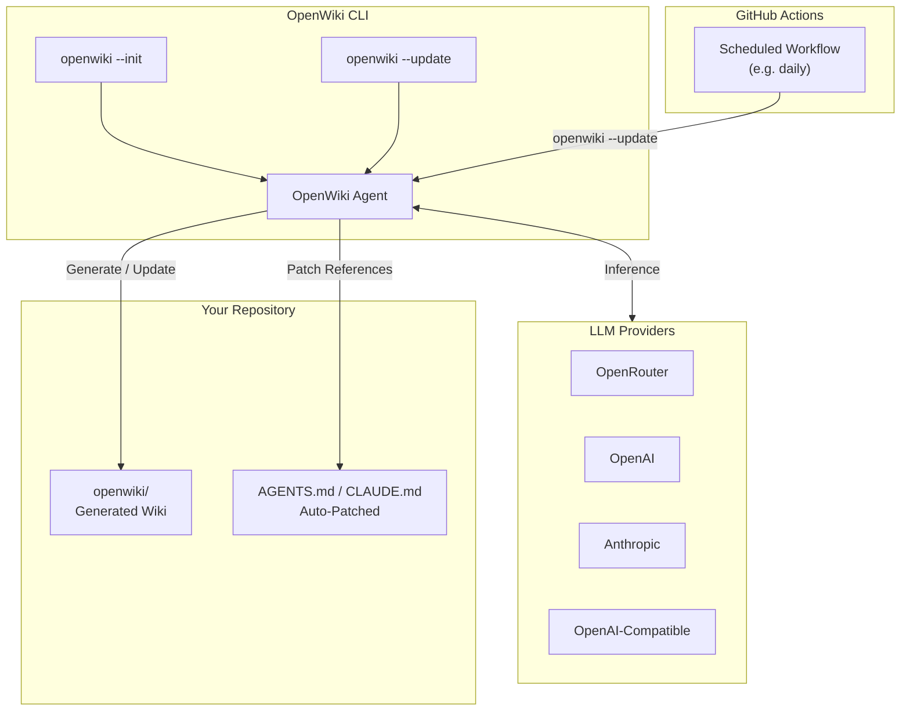

import Tabs from '@theme/Tabs';
import TabItem from '@theme/TabItem';
import Card from '@site/src/components/Card/Card';
import CardGroup from '@site/src/components/Card/CardGroup';
import Steps from '@site/src/components/Steps/Steps';
import Step from '@site/src/components/Steps/Step';

# OpenWiki: Agent-Powered Repo Documentation

Coding agents write better code when they understand the repo they're working in. They need to know where key logic lives, how files connect, and which patterns the codebase expects. The problem is that documentation is hard to keep current — writing the initial docs takes time, and updating them every time the code changes is even harder.

**OpenWiki** is an open-source CLI from LangChain that solves this. It generates a structured wiki for your codebase, connects that wiki to your coding agent via instruction file references, and keeps it updated automatically through a GitHub Action. Instead of stuffing hundreds of pages of repo documentation into a single `AGENTS.md`, OpenWiki creates a separate wiki directory and points your agent to it — letting the agent discover and retrieve context on demand.

## Core Advantages & Efficiency

By decoupling documentation from static instruction files, OpenWiki keeps agent context both comprehensive and token-efficient.

:::info
Most coding agents already read `AGENTS.md` or `CLAUDE.md` for instructions. Those files are useful, but they're not the right place for hundreds of pages of repo docs. OpenWiki adds a short reference to the wiki, letting agents pull context on demand without bloating every run.
:::

- **Multi-Provider LLM Support**: Works with OpenRouter, OpenAI, Anthropic, Fireworks, Baseten, and any OpenAI-compatible endpoint. Defaults to OpenRouter with an open model.
- **Auto-Patches Agent Files**: Automatically updates `AGENTS.md` and/or `CLAUDE.md` with a reference to the generated wiki — no manual editing required.
- **GitHub Action Sync**: A scheduled workflow runs `openwiki --update` to detect git diffs and refresh documentation as your codebase evolves.
- **Built on DeepAgents**: Leverages LangChain's DeepAgents framework for the underlying agentic orchestration.
- **LangSmith Tracing**: Optional tracing to LangSmith lets you inspect exactly what the agent did while generating or updating docs.

## Architectural Workflow

OpenWiki operates as both a local CLI and a background GitHub Action. On init, it scans your repo, generates a structured wiki, and patches your agent instruction files. On subsequent runs, it detects what changed via git diffs and updates the relevant documentation.



## Advanced Capabilities

Beyond basic doc generation, OpenWiki integrates deeply with your existing agent workflows and CI pipeline.

<CardGroup cols={2}>
  <Card title="Multi-Provider LLM Support" icon="mdi:brain" href="https://github.com/langchain-ai/openwiki#customizing">
    Choose from OpenRouter, OpenAI, Anthropic, Fireworks, Baseten, or any OpenAI-compatible endpoint. Use open or closed models based on your setup.
  </Card>
  <Card title="GitHub Action Auto-Updates" icon="mdi:github" href="https://github.com/langchain-ai/openwiki/blob/main/examples/openwiki-update.yml">
    Copy a single workflow file to schedule daily doc refreshes. OpenWiki detects git diffs and updates only what changed.
  </Card>
  <Card title="Agent Instruction Patching" icon="mdi:file-document-edit" href="https://github.com/langchain-ai/openwiki#how-openwiki-connects-to-your-coding-agent">
    Automatically appends wiki references to AGENTS.md or CLAUDE.md. No manual editing — your agent finds the wiki on its own.
  </Card>
  <Card title="LangSmith Observability" icon="mdi:eye" href="https://langsmith.com/">
    Optionally trace every OpenWiki run to a LangSmith project. Inspect exactly what the agent did during doc generation and updates.
  </Card>
</CardGroup>

## Installation & Setup

<Steps>
  <Step title="Install OpenWiki">
    Install the CLI globally via npm:
    ```bash
    npm install -g openwiki
    ```
  </Step>

  <Step title="Initialize Your Wiki">
    Run the interactive init command. OpenWiki will prompt you for a model provider, API key, and preferred LLM:
    ```bash
    openwiki --init
    ```
    During initialization, configure your inference provider. OpenWiki supports several options out of the box:

    <Tabs groupId="provider">
      <TabItem value="openrouter" label="OpenRouter (Default)" default>
        OpenRouter provides access to dozens of models through a single key. OpenWiki defaults to this provider with an open model.
        ```bash
        OPENWIKI_PROVIDER=openrouter
        OPENROUTER_API_KEY=your-key
        OPENWIKI_MODEL_ID=z-ai/glm-5.2
        ```
      </TabItem>
      <TabItem value="openai" label="OpenAI">
        Use OpenAI's hosted models directly.
        ```bash
        OPENWIKI_PROVIDER=openai
        OPENAI_API_KEY=your-key
        OPENWIKI_MODEL_ID=gpt-4o
        ```
      </TabItem>
      <TabItem value="anthropic" label="Anthropic">
        Route through Anthropic's API. Supports custom base URLs for proxied or self-hosted gateways.
        ```bash
        OPENWIKI_PROVIDER=anthropic
        ANTHROPIC_API_KEY=your-key
        OPENWIKI_MODEL_ID=claude-sonnet-5-20250514
        # Optional: custom base URL for proxied endpoints
        # ANTHROPIC_BASE_URL=https://your-gateway.example.com/anthropic
        ```
      </TabItem>
      <TabItem value="openai-compat" label="OpenAI-Compatible">
        Target any OpenAI-compatible chat-completions endpoint, such as a LiteLLM gateway or self-hosted inference server.
        ```bash
        OPENWIKI_PROVIDER=openai-compatible
        OPENAI_COMPATIBLE_API_KEY=your-gateway-key
        OPENAI_COMPATIBLE_BASE_URL=https://your-gateway.example.com/v1
        OPENWIKI_MODEL_ID=your-gateway-model-name
        ```
      </TabItem>
    </Tabs>

    :::tip
    Configuration and secrets are saved to `~/.openwiki/.env` on your local machine. You can also set these via environment variables or a `.env` file in your project root.
    :::
  </Step>

  <Step title="Add the GitHub Action">
    Copy the OpenWiki update workflow into your repository to keep docs in sync automatically:
    ```bash
    mkdir -p .github/workflows
    curl -o .github/workflows/openwiki-update.yml \
      https://raw.githubusercontent.com/langchain-ai/openwiki/main/examples/openwiki-update.yml
    ```
    Add your provider API key as a repository secret (e.g. `OPENROUTER_API_KEY`) and configure the model ID in the workflow file.
  </Step>
</Steps>

## Keeping Docs Updated

Generating documentation once is useful, but keeping it current is where OpenWiki becomes more valuable. The `openwiki --update` command detects which commits landed since the last run, uses git diffs to understand what changed, and updates the wiki with relevant context.

The recommended approach is a scheduled GitHub Action that runs daily. Here is the full workflow file:

```yaml
name: OpenWiki Update

on:
  workflow_dispatch:
  schedule:
    # GitHub schedules use UTC; 08:00 UTC is midnight PST.
    - cron: "0 8 * * *"

permissions:
  contents: write

jobs:
  update:
    runs-on: ubuntu-latest
    steps:
      - name: Check out repository
        uses: actions/checkout@v4
        with:
          persist-credentials: true

      - name: Set up Node.js
        uses: actions/setup-node@v4
        with:
          node-version: "22"

      - name: Install OpenWiki
        run: npm install --global openwiki

      - name: Run OpenWiki
        run: openwiki --update --print
        env:
          # Replace with your preferred inference provider and model
          OPENROUTER_API_KEY: ${{ secrets.OPENROUTER_API_KEY }}
          OPENWIKI_MODEL_ID: z-ai/glm-5.2
          LANGSMITH_API_KEY: ${{ secrets.LANGSMITH_API_KEY }}
          LANGCHAIN_PROJECT: openwiki
          LANGCHAIN_TRACING_V2: "true"

      - name: Create OpenWiki update pull request
        uses: peter-evans/create-pull-request@v7
        with:
          add-paths: openwiki
          branch: openwiki/update
          commit-message: "docs: update OpenWiki"
          title: "docs: update OpenWiki"
          body: |
            Automated OpenWiki documentation update.

            This PR was generated by the scheduled OpenWiki workflow.
```

The workflow runs on a cron schedule (daily at midnight PST) and creates a pull request with any documentation updates. You can also trigger it manually via `workflow_dispatch`.

For GitLab CI users, an equivalent `.gitlab-ci.yml` configuration is available in the [examples directory](https://github.com/langchain-ai/openwiki/blob/main/examples/openwiki-update.gitlab-ci.yml).

## References

- [LangChain Blog: Introducing OpenWiki](https://www.langchain.com/blog/introducing-openwiki-an-open-source-agent-for-repo-documentation) — Official announcement and motivation behind OpenWiki.
- [OpenWiki GitHub Repository](https://github.com/langchain-ai/openwiki) — Source code, CLI usage, and configuration options.
- [Claude Code](../Skills-and-Agents/claude-code.md) — Anthropic's agentic CLI tool that reads AGENTS.md for repo context.
- [OpenCode](../Skills-and-Agents/opencode.md) — Interactive CLI tool for software engineering tasks with agent instruction support.
