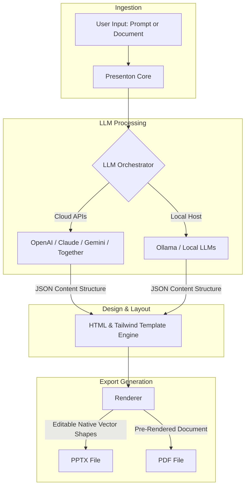

import Tabs from '@theme/Tabs';
import TabItem from '@theme/TabItem';
import Card from '@site/src/components/Card/Card';
import CardGroup from '@site/src/components/Card/CardGroup';
import Accordion from '@site/src/components/Accordion/Accordion';
import AccordionGroup from '@site/src/components/Accordion/AccordionGroup';
import Steps from '@site/src/components/Steps/Steps';
import Step from '@site/src/components/Steps/Step';

# Presenton: Open-Source AI Presentation Generator

Standard presentation SaaS platforms trap your slides inside proprietary web editors and lock you into expensive monthly subscriptions. **Presenton** is a powerful, open-source, and self-hosted alternative that turns natural language prompts and document files into fully editable, industry-standard **PPTX** and **PDF** presentation decks in seconds.

With over 5,000 stars on GitHub, Presenton introduces a true "Bring Your Own Key" (BYOK) model. Instead of paying for a redundant AI slide subscription, you can sign in using your existing ChatGPT Plus credentials, OpenAI API, Anthropic Claude keys, Google Gemini keys, or run completely locally via Ollama. 

## Core Advantages & Efficiency

By decoupling AI generation from proprietary slide editors, Presenton delivers full design autonomy and absolute data privacy.

:::info
Bypass costly monthly subscriptions. By using your own developer API keys or running open-source local models, you pay only for raw token usage—generating high-quality presentations for pennies or entirely for free.
:::

- **Dual-Input Modalities**: Generate cohesive slide decks using either high-level prompts (Prompt-to-Presentation) or by uploading extensive reference documents (Document-to-Presentation) such as PDFs, Markdown files, or TXT notes.
- **Genuine, Native PPTX Export**: Unlike many SaaS alternatives that export low-resolution vector graphics or basic images embedded in slides, Presenton generates fully native, layered, and editable PPTX slide objects.
- **BYOK (Bring Your Own Key) Freedom**: Integrate directly with top commercial AI providers (OpenAI, Anthropic Claude, Google Gemini, Azure OpenAI, Amazon Bedrock) or standard LLM routing endpoints.
- **100% Privacy via Ollama**: Run Presenton entirely offline and within your local area network by routing generation requests to a locally hosted Ollama instance running Qwen, Llama, or Gemma models.
- **Custom HTML & Tailwind Templates**: Create bespoke template layouts using standard web technologies. The built-in converter lets you transform pre-existing PPTX/PDF slide layouts into reusable HTML blueprints.

## Advanced Capabilities

Presenton's flexible architecture makes it highly suitable for personal use, agency workflows, enterprise reporting, and automated dashboard generation.

<CardGroup cols={2}>
  <Card title="Self-Hosted Autonomy" icon="mdi:docker" href="https://github.com/presenton/presenton#option-1-docker-recommended-for-most-users">
    Deploy on any local machine, VPS, or homelab infrastructure using lightweight Docker containers.
  </Card>
  <Card title="Tailwind Template Engine" icon="mdi:tailwind" href="https://github.com/presenton/presenton">
    Customize color palettes, typographic hierarchies, and layouts using standard Tailwind CSS classes.
  </Card>
  <Card title="API-First Access" icon="mdi:api" href="https://github.com/presenton/presenton">
    Programmatically generate decks from external internal reports, CRM updates, or system alerts via simple REST API calls.
  </Card>
  <Card title="Native Desktop Apps" icon="mdi:desktop-mac" href="https://github.com/presenton/presenton#option-2-electron-desktop-app">
    Prefer a standard desktop wrapper? Download native Electron installers for macOS, Windows, or Linux.
  </Card>
</CardGroup>

## Architectural Workflow

Presenton coordinates the presentation lifecycle from text ingestion to editable presentation output.



## Step-by-Step Installation & Setup

Choose your preferred deployment method. Docker is recommended for quick, self-contained setups.

<Steps>
  <Step title="Run with Docker">
    Start a standard container in a single command. This downloads the latest image from the GitHub Container Registry (GHCR) and maps a local volume to persist user templates and data.
    
    <Tabs groupId="os">
      <TabItem value="mac" label="macOS / Linux" default>
        ```bash
        docker run -it --name presenton -p 5000:80 -v "./user_data:/app/user_data" ghcr.io/presenton/presenton:latest
        ```
      </TabItem>
      <TabItem value="win" label="Windows (PowerShell)">
        ```powershell
        docker run -it --name presenton -p 5000:80 -v "${PWD}\user_data:/app/user_data" ghcr.io/presenton/presenton:latest
        ```
      </TabItem>
    </Tabs>
  </Step>

  <Step title="Access the Web Interface">
    Open your web browser and navigate to:
    ```
    http://localhost:5000
    ```
    You will be greeted by Presenton's workspace dashboard.
  </Step>

  <Step title="Set Up Your API Credentials">
    Go to settings and input your model backend choice. Presenton is a pure client/local service; your API keys are stored securely in your local environment.
  </Step>

  <Step title="Generate and Export">
    Enter a detailed prompt or drag-and-drop a PDF/Markdown document, pick a presentation style template, and click **Generate**. Once complete, click **Export** and choose **PPTX** for Microsoft PowerPoint/Apple Keynote editing, or **PDF** for immediate distribution.
  </Step>
</Steps>

## Model & Integration Configuration

Presenton supports both high-speed cloud providers and fully private local backends.

<AccordionGroup>
  <Accordion title="Cloud AI Providers (BYOK)" icon="mdi:cloud-sync">
    Enter your developer key directly into the Presenton UI settings panel to leverage powerful commercial models.
    - **OpenAI (ChatGPT)**: Enter your `OPENAI_API_KEY` and select `gpt-4o` or `gpt-4o-mini` for highly refined, structured layouts and visual hierarchy.
    - **Anthropic Claude**: Set up your Anthropic API Key and select `claude-3-5-sonnet` for incredible textual flow, copy writing, and concise summarizing.
    - **Google Gemini**: Paste your Gemini Key (freely available for developers via Google AI Studio) and use `gemini-2.5-flash` or `gemini-1.5-pro`.
  </Accordion>

  <Accordion title="Local Execution (Ollama)" icon="mdi:server-network">
    For complete offline privacy, direct all text generation to a local Ollama server running on your system.
    
    1. Ensure Ollama is running locally and download a capable instruction/coder model:
       ```bash
       ollama pull qwen2.5:7b
       ```
    2. In the Presenton Settings, point the API endpoint to your Ollama host (usually `http://localhost:11434` or your LAN IP).
    3. Choose `qwen2.5:7b` or `llama3.1:8b` as the active generation model.
    
    :::tip
    While smaller 3B models (like `phi3`) can run comfortably on CPU-only machines, 7B+ parameter models running with GPU acceleration (such as `Qwen 2.5 7B` or `Llama 3.1 8B`) deliver vastly superior conceptual layout structures and fewer markdown parsing errors.
    :::
  </Accordion>

  <Accordion title="Desktop App and Development Setup" icon="mdi:cog">
    To set up a local development repository for template hacking or running from source:
    
    1. Clone the repository and navigate inside:
       ```bash
       git clone https://github.com/presenton/presenton.git
       cd presenton
       ```
    2. Initialize the environment script to install Node.js dependencies and generate local configurations:
       ```bash
       npm run setup:env
       ```
    3. Spin up the application stack using Docker Compose:
       - **Standard CPU/Dev Node**: `docker compose up development --build`
       - **CUDA GPU-Accelerated Node**: `docker compose up development-gpu --build`
  </Accordion>
</AccordionGroup>

## References

- [Presenton Official Site](https://presenton.ai/)
- [Presenton GitHub Repository](https://github.com/presenton/presenton)
- [Free Claude Code Proxy](./claude-code-proxy.md)
- [MarkItDown](./mark-it-down.md)
