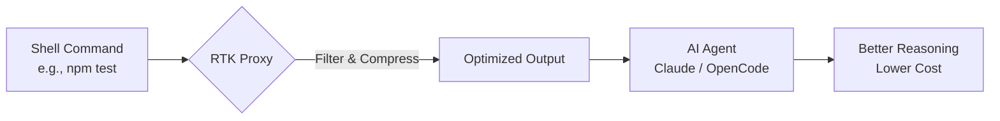

import Tabs from '@theme/Tabs';
import TabItem from '@theme/TabItem';
import Card from '@site/src/components/Card/Card';
import CardGroup from '@site/src/components/Card/CardGroup';
import Accordion from '@site/src/components/Accordion/Accordion';
import AccordionGroup from '@site/src/components/Accordion/AccordionGroup';
import Steps from '@site/src/components/Steps/Steps';
import { Step } from '@site/src/components/Steps/Steps';

# RTK: Rust Token Killer

When working with AI coding agents like Claude Code, Cursor, or OpenCode, passing raw command-line outputs directly to the Large Language Model (LLM) severely inflates your context window with noise.

**RTK (Rust Token Killer)** is an open-source, high-performance CLI proxy written in Rust that acts as middleware between your shell and your AI agent. It intercepts commands and compresses their output before they hit the context window, resulting in better reasoning, longer chat sessions, and significantly lower API costs.

## Core Advantages & Efficiency

RTK intercepts standard developer commands (like `git status`, `ls`, `cargo test`, `npm test`) and filters out verbose boilerplate, redundant whitespace, and irrelevant comments.

:::info
Using RTK typically reduces token consumption for AI agents by **60% to 90%**, significantly extending the effective life of your context window.
:::

- **Smart Filtering**: Strips comments, ASCII art, and repetitive whitespace.
- **Output Grouping**: Aggregates error types and collapses file outputs by directory.
- **Context Preservation**: Truncates noise while keeping crucial signals for AI reasoning.
- **Deduplication**: Groups repeated log lines and appends count summaries.

## Advanced Capabilities

<CardGroup cols={2}>
  <Card title="Token Analytics" icon="mdi:chart-bar" href="rtk#token-saving-statistics">
    Visualize your gains with `rtk gain --graph` to see historical token savings and performance.
  </Card>
  <Card title="Opportunity Discovery" icon="mdi:magnify" href="rtk#token-saving-statistics">
    Use `rtk discover` to analyze past projects and identify commands where noise reduction would be most effective.
  </Card>
</CardGroup>

## Architecture & Workflow

RTK sits between the execution of a command and the AI's consumption of its output, ensuring only high-density information reaches the model.



## Integration with AI Agents

RTK uses an initialization command to set up hooks for your preferred platform. This interceptor rewrites native shell commands automatically.

<Tabs groupId="agent-integration">
  <TabItem value="claude" label="Claude Code" default>
    Sets up global `PreToolUse` hooks suitable for Claude Code.
    ```bash
    rtk init -g
    ```
    :::tip
    If your agent uses internal built-in functions (e.g., internal `Read`) rather than the Bash shell, those run unmodified. Instruct the AI to use shell versions (`cat`, `rg`) or use RTK explicitly (`rtk read`).
    :::
  </TabItem>
  <TabItem value="opencode" label="OpenCode">
    Initializes platform-specific agent hooks for OpenCode and other CLI-based AI tools:
    ```bash
    rtk init -g --opencode
    ```
  </TabItem>
</Tabs>

## Token Saving Statistics

RTK includes built-in analytics to prove the gains and visualize avoided context pollution.

- `rtk gain`: Displays summary statistics of total tokens saved.
- `rtk gain --graph`: Shows an ASCII graph of savings over the last 30 days.
- `rtk gain --history`: Lists recent commands and individual reduction performance.
- `rtk discover`: Finds missed saving opportunities in project history.

## Setup & Configuration

<AccordionGroup>
  <Accordion title="Installation" icon="mdi:download">
    <Tabs>
      <TabItem value="mac" label="Homebrew (macOS/Linux)" default>
        ```bash
        brew install rtk
        ```
      </TabItem>
      <TabItem value="script" label="Install Script">
        ```bash
        curl -fsSL https://raw.githubusercontent.com/rtk-ai/rtk/refs/heads/master/install.sh | sh
        ```
        *(Ensure `~/.local/bin` is in your environment `PATH`.)*
      </TabItem>
    </Tabs>
  </Accordion>
  <Accordion title="Global Hooks" icon="mdi:hook">
    To enable automatic interception across all projects:
    ```bash
    rtk init -g
    ```
    This ensures that when an AI agent runs `git status`, it transparently receives the output of `rtk git status`.
  </Accordion>
</AccordionGroup>

## References

- [RTK Official Site](https://www.rtk-ai.app) — Documentation and showcase.
- [GitHub Repository](https://github.com/rtk-ai/rtk) — Source code and issues.
- [OpenCode CLI](./opencode.md) — Terminal-first AI agent with native RTK support.
- [Claude Code](./claude-code.md) — Anthropic's agentic CLI tool.

