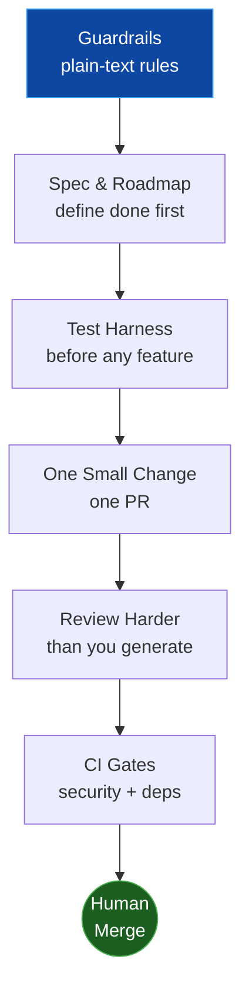
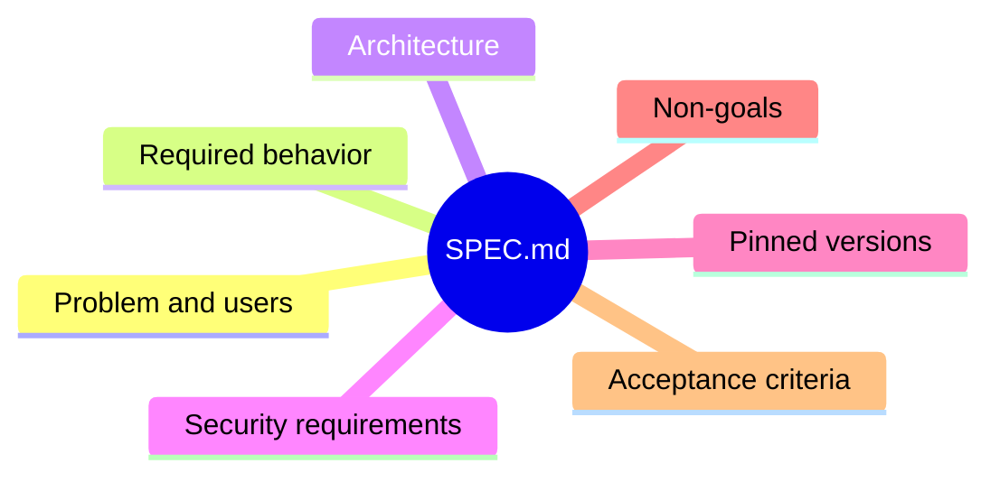
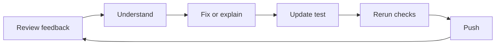

import Card from '@site/src/components/Card/Card';
import CardGroup from '@site/src/components/Card/CardGroup';

# Chris Titus AI Workflow: Slow Is Smooth, Smooth Is Fast

[Chris Titus Tech](https://christitus.com/my-ai-workflow/) uses AI to ship real software, not demos. His workflow flips the usual approach: instead of one giant looping prompt, it spends **more compute on review than on generation**.

The whole workflow in one diagram:

## 1. Plain-Text Guardrails

Everything lives in the [titus-ai repository](https://github.com/ChrisTitusTech/titus-ai) as plain text files:

| File | Purpose |
|------|---------|
| `AGENTS.md` | How the agent works |
| `SPEC.md` | What the project must do |
| `ROADMAP.md` | Phases with exit criteria |
| `TASKS.md` | Small jobs in current phase |

Rules are cheap: dislike one? Delete it. Agent repeats a mistake? Add a sharper rule. The files serve you, not the other way around.

## 2. Define Done Before Writing Code

The spec lists everything that must be true before the phase counts as finished:

:::warning[Pinned Versions]
Pin dependency versions in the spec. LLMs install whatever appeared most often in their training data - usually years old.
:::

## 3. Tests Before Features

Before any implementation, scaffold how the project will be tested: unit tests, linting, production build, smoke tests. If the agent cannot tell whether a change worked, writing more code only adds uncertainty.

## 4. One Small PR

Each pull request implements exactly one small change. Small PRs are faster to understand, cheaper to review, easier to revert. If reviewing takes twenty minutes, split the work earlier.

## 5. Review More Than You Generate

Repeat until no actionable findings remain.

Two rules make this work:

- **Fresh context**: the reviewer (CodeRabbit, another agent, or a human) never grades its own work
- **Human decides**: fix the root cause or explain why not - never blindly accept AI suggestions

## 6. CI Gates + Human Merge

CI runs Dependabot, CodeQL, and dependency review on **every** PR update - an old green check proves nothing.

Before merging, verify by hand:

- Diff contains only the intended change
- Tests pass on the latest commit
- Docs match behavior
- It works in the real environment

## Why It Works

- **Spec first**: acceptance criteria tell the agent when to stop
- **Small PRs win**: fast reviews, easy reverts
- **Humans merge**: automation gates, humans decide
- **Tools are replaceable, gates are not** - plain text files mean any agent can pick up the same process

<CardGroup cols={3}>
  <Card title="Source Article" icon="mdi:newspaper" href="https://christitus.com/my-ai-workflow/">
    Full write-up with all details
  </Card>
  <Card title="Video Walkthrough" icon="mdi:play-circle" href="https://www.youtube.com/watch?v=wcRR5P0S2">
    Chris walks through the entire workflow
  </Card>
  <Card title="titus-ai Repository" icon="mdi:github" href="https://github.com/ChrisTitusTech/titus-ai">
    Ready-to-copy guardrail files
  </Card>
</CardGroup>
