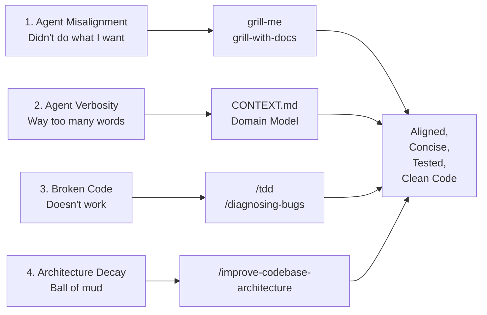
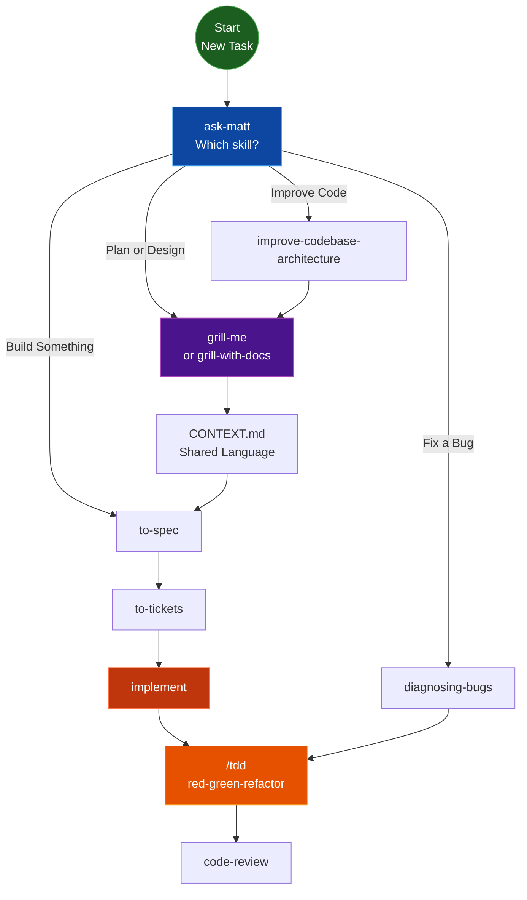
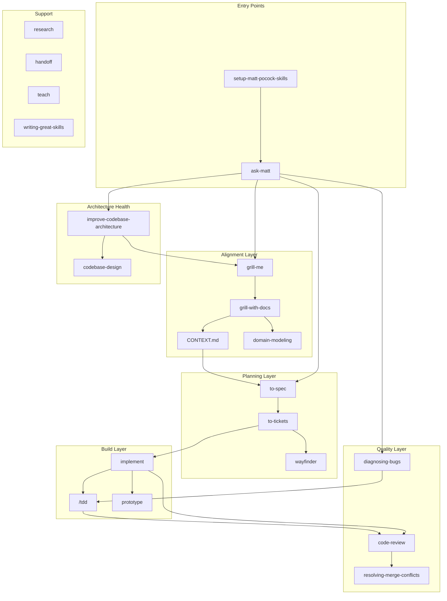

import Steps from '@site/src/components/Steps/Steps';
import Step from '@site/src/components/Steps/Step';
import Card from '@site/src/components/Card/Card';
import CardGroup from '@site/src/components/Card/CardGroup';

# Matt Pocock Skills: A Complete AI Coding Workflow

Matt Pocock's [skills repository](https://github.com/mattpocock/skills) (189k+ stars) provides a composable set of agent skills that address the four most common failure modes in AI-assisted development. Unlike monolithic workflows like GSD or BMAD, these skills are small, adaptable, and model-agnostic — designed for real engineering, not vibe coding.

## The Four Core Problems

Every AI coding session faces the same failure modes. Matt Pocock's skills target each one explicitly:



### Problem 1: The Agent Didn't Do What You Want

The most common failure mode is misalignment — you think the agent understands, then it builds the wrong thing. The fix is a **grilling session**: the agent asks you detailed questions before writing any code.

### Problem 2: The Agent Is Way Too Verbose

Agents dropped into a project figure out jargon as they go, using 20 words where 1 will do. The fix is a **shared language** — a `CONTEXT.md` document that decodes project-specific terminology, paying off session after session.

### Problem 3: The Code Doesn't Work

Without feedback loops, the agent flies blind. The fix is **red-green-refactor TDD** — the agent writes a failing test first, then makes it pass. This gives consistent feedback that produces far better code.

### Problem 4: We Built a Ball of Mud

Agents accelerate software entropy. Codebases grow complex at an unprecedented rate. The fix is **caring about design** — running architecture health checks regularly and building deep modules with clean interfaces.

## Skill Reference

<CardGroup cols={2}>
  <Card title="Grilling & Alignment" icon="mdi:hammer-wrench" href="https://github.com/mattpocock/skills/tree/main/skills/productivity/grill-me">
    grill-me, grill-with-docs — Relentless interviews that sharpen plans and build domain models
  </Card>
  <Card title="Specification" icon="mdi:file-document" href="https://github.com/mattpocock/skills/tree/main/skills/engineering/to-spec">
    to-spec, to-tickets — Turn conversations into specs and tracer-bullet tickets
  </Card>
  <Card title="Implementation" icon="mdi:code-braces" href="https://github.com/mattpocock/skills/tree/main/skills/engineering/implement">
    implement, tdd, code-review — Build with red-green-refactor and two-axis review
  </Card>
  <Card title="Architecture" icon="mdi:graph" href="https://github.com/mattpocock/skills/tree/main/skills/engineering/improve-codebase-architecture">
    improve-codebase-architecture, codebase-design — Keep codebases deep and clean
  </Card>
</CardGroup>

### User-Invoked Skills

| Skill | Purpose |
|-------|---------|
| `ask-matt` | Router — asks which skill fits your situation |
| `grill-me` | Non-code grilling session |
| `grill-with-docs` | Grilling + domain model + ADRs |
| `setup-matt-pocock-skills` | One-time repo configuration |
| `to-spec` | Conversation → spec on issue tracker |
| `to-tickets` | Spec → tracer-bullet tickets |
| `implement` | Build work from spec/tickets |
| `wayfinder` | Multi-session project planning |
| `triage` | Issue state machine |

### Model-Invoked Skills

| Skill | Purpose |
|-------|---------|
| `tdd` | Red-green-refactor loop |
| `diagnosing-bugs` | Disciplined debug loop |
| `code-review` | Two-axis diff review |
| `research` | Primary-source investigation |
| `prototype` | Throwaway design exploration |
| `domain-modeling` | Sharpen project terminology |
| `codebase-design` | Deep module discipline |

## Starting Workflow: Where to Begin

This diagram shows the recommended entry point. Start with `ask-matt` to route to the right skill, then follow the chain:



## Standard Development Workflow

<Steps>
  <Step title="Route with ask-matt">
    Start every task by running `/ask-matt`. It analyzes your situation and routes you to the right skill — whether that's grilling, spec creation, bug diagnosis, or architecture improvement.
  </Step>
  <Step title="Grill the Plan">
    Run `/grill-me` (non-code) or `/grill-with-docs` (with domain modeling). The agent relentlessly interviews you about your plan until every branch of the decision tree is resolved. This builds alignment before any code is written.
  </Step>
  <Step title="Build Shared Language">
    If using `/grill-with-docs`, a `CONTEXT.md` is automatically created with project-specific terminology. This document decodes jargon for the agent, reducing token waste and improving variable/function naming across the codebase.
  </Step>
  <Step title="Create Specification">
    Run `/to-spec` to turn the conversation into a formal specification on your issue tracker. No additional interview — it synthesizes everything discussed during grilling.
  </Step>
  <Step title="Break into Tickets">
    Run `/to-tickets` to decompose the spec into tracer-bullet tickets. Each ticket declares its blocking edges, giving the agent clear implementation boundaries.
  </Step>
  <Step title="Implement with TDD">
    Run `/implement` to build the work. It drives `/tdd` at pre-agreed seams — writing failing tests first, then making them pass, then refactoring. Each vertical slice is built independently.
  </Step>
  <Step title="Review and Iterate">
    Run `/code-review` before committing. It performs a two-axis review: **Standards** (does the code follow repo conventions?) and **Spec** (does it match the originating issue?). Both run as parallel sub-agents.
  </Step>
</Steps>

## Full Skill Ecosystem



## Installation

<Steps>
  <Step title="Install via skills.sh">
    Run the installer to pick which skills to add and which agents to install them on:

    ```bash
    npx skills@latest add mattpocock/skills
    ```

    Make sure to select `/setup-matt-pocock-skills`.
  </Step>
  <Step title="Run Setup">
    Execute the setup skill in your agent. It configures your issue tracker, triage labels, and documentation layout:

    ```bash
    /setup-matt-pocock-skills
    ```
  </Step>
  <Step title="Start Grilling">
    Begin your first task with a grilling session:

    ```bash
    /grill-with-docs
    ```
  </Step>
</Steps>

:::tip
Prefer a managed install? The skills also ship as a [Claude Code plugin](https://code.claude.com/docs/en/plugins) — install with `/plugin marketplace add mattpocock/skills` and `/plugin install mattpocock-skills@mattpocock`.
:::

## Key Insights

- **Composable over monolithic**: Each skill is small and focused. Combine them as needed rather than following a rigid process.
- **Shared language is a superpower**: `CONTEXT.md` reduces token waste, improves naming consistency, and makes the codebase easier for both humans and agents to navigate.
- **TDD is non-negotiable**: Red-green-refactor gives the agent consistent feedback. Without it, the agent produces unreliable code.
- **Architecture health requires maintenance**: Run `/improve-codebase-architecture` every few days to catch design decay before it becomes a ball of mud.

## References

- [GitHub Repository](https://github.com/mattpocock/skills) — Full source with 189k+ stars
- [skills.sh Installer](https://skills.sh/mattpocock/skills) — One-command setup
- [Video: A Complete AI Coding Workflow, End-to-End](https://www.youtube.com/watch?v=M6mYodf0dJM) — Walkthrough of the entire system
- [AI Hero Newsletter](https://www.aihero.dev/s/skills-newsletter) — Updates on new skills and changes
