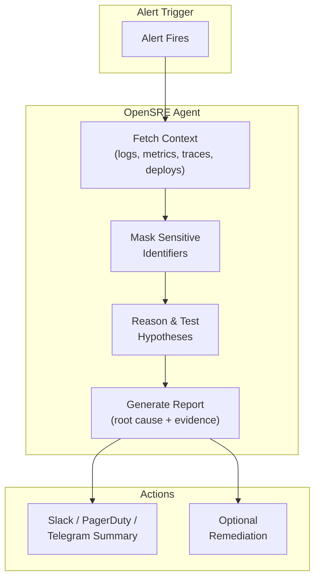

import Card from '@site/src/components/Card/Card';
import CardGroup from '@site/src/components/Card/CardGroup';
import Accordion from '@site/src/components/Accordion/Accordion';
import AccordionGroup from '@site/src/components/Accordion/AccordionGroup';
import Steps from '@site/src/components/Steps/Steps';
import Step from '@site/src/components/Steps/Step';
import Tabs from '@theme/Tabs';
import TabItem from '@theme/TabItem';

# OpenSRE

**OpenSRE** is an open-source framework for building AI SRE agents that investigate and resolve production incidents. It connects to 60+ tools you already run — observability platforms, cloud infrastructure, databases, and incident management — and runs investigations on your own infrastructure.

When something breaks in production, evidence is scattered across logs, metrics, traces, runbooks, and Slack threads. OpenSRE gathers that context automatically and reasons across your systems to find root causes.

## How It Works

When an alert fires, OpenSRE runs a structured investigation pipeline:

1. **Fetches** the alert context and correlated logs, metrics, traces, and recent deploys
2. **Masks** sensitive identifiers (pods, clusters, account IDs) before sending to external LLMs
3. **Reasons** across your connected systems, testing hypotheses in a tool-calling loop
4. **Generates** a structured investigation report with probable root cause and linked evidence
5. **Suggests** next steps and optionally executes remediation actions
6. **Posts** a summary to Slack, PagerDuty, or Telegram



## When To Use It

OpenSRE is useful when you need automated, evidence-backed incident investigation across complex distributed systems.

- **Multi-service incidents** — failures that span Kubernetes, Lambda, databases, and queues
- **Runbook automation** — OpenSRE reads your runbooks and applies them during investigation
- **After-hours response** — automated triage and Slack/PagerDuty summaries without human intervention
- **Compliance and auditing** — structured reports with linked evidence for every conclusion
- **Cost control** — reversible identifier masking keeps sensitive data out of external LLM calls

:::info
OpenSRE supports Anthropic, OpenAI, Codex, Ollama, Gemini, OpenRouter, NVIDIA NIM, and Bedrock. Bring your own model.
:::

## Getting Started

<Steps>
  <Step title="Install OpenSRE">
    Run the installer for your platform. No sudo required on macOS/Linux.

    <Tabs groupId="os">
      <TabItem value="mac" label="macOS / Linux" default>
        ```bash
        curl -fsSL https://install.opensre.com | bash
        ```
      </TabItem>
      <TabItem value="win" label="Windows (PowerShell)">
        ```powershell
        irm https://install.opensre.com | iex
        ```
      </TabItem>
    </Tabs>
  </Step>

  <Step title="Run Onboarding">
    Configure your LLM provider and integrations:
    ```bash
    opensre onboard
    ```
  </Step>

  <Step title="Run an Investigation">
    Feed an alert file to the agent:
    ```bash
    opensre investigate -i tests/e2e/kubernetes/fixtures/datadog_k8s_alert.json
    ```
  </Step>
</Steps>

## Explore Further

<CardGroup cols={2}>
  <Card title="Interactive Shell" icon="mdi:console" href="https://www.opensre.com/docs/interactive-shell-commands">
    Start a REPL session with slash commands for session control, integrations, and cost tracking.
  </Card>
  <Card title="Remote Runtime RCA" icon="mdi:cloud" href="https://github.com/Tracer-Cloud/opensre#quick-start">
    Investigate a deployed service by name with live health probes and recent logs.
  </Card>
  <Card title="Deployment Options" icon="mdi:server" href="https://github.com/Tracer-Cloud/opensre/blob/main/DEPLOYMENT.md">
    Deploy via Docker/ECR, a baked AMI with systemd, or hosted platforms like Railway and ECS.
  </Card>
  <Card title="Full Integration List" icon="mdi:plug" href="https://www.opensre.com/docs">
    Browse the 60+ integrations across LLMs, observability, infrastructure, and incident management.
  </Card>
</CardGroup>

<AccordionGroup>
  <Accordion title="Interactive Shell Commands" icon="mdi:console">
    The REPL supports these slash commands for session management:
    - `/help` — show available commands
    - `/status` — current session status
    - `/cost` — per-session token usage
    - `/sessions` — list and manage sessions
    - `/resume` — resume a previous session
    - `/compact` — compress context window
    - `/effort` — set reasoning depth (low through max)
    - `/integrations list` — show configured integrations
    - `/integrations verify` — test integration connectivity
    - `/agents` — monitor local coding agent fleet
  </Accordion>

  <Accordion title="One-Shot vs Interactive Mode" icon="mdi:swap-horizontal">
    - **Interactive** (`opensre`): Start a REPL, describe incidents in plain language, stream investigations, and use Ctrl+C to cancel without losing state.
    - **One-shot** (`opensre investigate -i <file>`): Run the agent once against an alert JSON file and exit.
    - **Remote** (`opensre investigate --service <name>`): Investigate a live deployed service by name.
  </Accordion>
</AccordionGroup>

## References

- [OpenSRE GitHub Repository](https://github.com/Tracer-Cloud/opensre) — Source code, installation scripts, and deployment docs.
- [OpenSRE Documentation](https://www.opensre.com/docs) — Full integration matrix, quickstart guide, and FAQ.
- [DEPLOYMENT.md](https://github.com/Tracer-Cloud/opensre/blob/main/DEPLOYMENT.md) — EC2, AMI, and hosted deployment steps.
