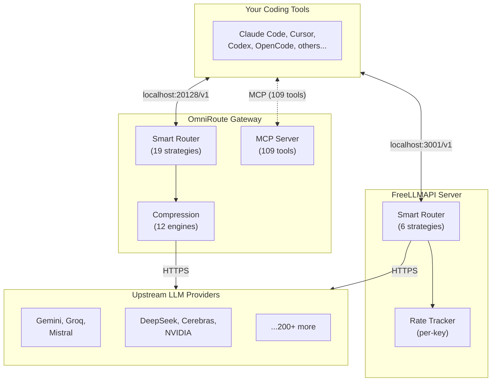

import Accordion from '@site/src/components/Accordion/Accordion';
import AccordionGroup from '@site/src/components/Accordion/AccordionGroup';

# OmniRoute vs FreeLLMAPI

Both OmniRoute and FreeLLMAPI solve the same core problem: stack free tiers of multiple LLM providers behind one OpenAI-compatible endpoint so you never hit a single provider's rate limit. They differ significantly in scope, compression capabilities, routing intelligence, and deployment philosophy.

:::tip
For full details on each tool, see the individual articles: [OmniRoute](../Proxy/omniroute.md) | [FreeLLMAPI](../Proxy/freellmapi.md)
:::

## At a Glance

| Feature | OmniRoute | FreeLLMAPI |
|---|---|---|
| **Providers** | 340+ (90+ free) | 29 (free-tier focused) |
| **Free Tokens/Month** | ~1.51B | ~4B |
| **Routing Strategies** | 19 | 6 |
| **Token Compression** | 12 engines, 78-95% savings | None |
| **MCP Server** | 109 tools | No |
| **A2A Protocol** | Yes | No |
| **CLI Tools** | 80+ commands, 33+ CLIs | Setup commands for 6 CLIs |
| **License** | MIT | Not specified in repo |
| **GitHub Stars** | 52.5k+ | ~1k |
| **Deployment** | npm, Docker, Electron, Termux, PWA | Docker-first (curl install) |
| **Node.js Required** | v22.22.2+ or v24+ | v20+ |
| **Dashboard** | Full analytics, live quota, savings | Basic key management UI |

## Architecture Comparison

Both tools act as local proxy servers between your coding tools and upstream LLM providers. The key difference: OmniRoute is a full gateway platform with compression, agent protocols, and a rich CLI, while FreeLLMAPI is a focused router with a clean UI.



## Routing Intelligence

### OmniRoute: 19 Strategies

OmniRoute offers the most comprehensive routing surface of any open-source gateway. The `auto` combo scores every candidate on 14 live factors (health, quota, cost, latency, success rate, freshness) and picks the best provider per request with zero configuration.

Key strategies include:

- **auto** - 14-factor live scoring, zero-config smart routing
- **auto/coding** - Quality-first weights optimized for code generation
- **auto/cheap** - Cheapest per token first
- **context-relay** - Hand off context across providers for long conversations
- **cache-optimized** - Pin reusable prompt prefixes to the same account for cache hits
- **fusion** - Fan out to multiple models, a judge synthesizes one answer
- **pipeline** - Chain steps, each provider's output feeds the next

### FreeLLMAPI: 6 Strategies

FreeLLMAPI provides six routing strategies covering the most common patterns:

- **round-robin** - Cyclic distribution across providers
- **capability-based** - Rank by model capability tier
- **speed-optimized** - Prefer lowest latency providers
- **reliability-based** - Prefer providers with highest success rates
- **balanced** - Weighted mix of speed and capability
- **cost-optimized** - Minimize cost across free tiers

:::tip
Context handoff between providers during long conversations and prompt-cache optimization are only available in OmniRoute. FreeLLMAPI does not support these routing patterns.
:::

## Token Compression

OmniRoute ships a 12-engine compression pipeline that runs transparently on every request, saving 78-95% of tokens on repetitive tool output, shell logs, and test results. FreeLLMAPI has no compression.

### OmniRoute Compression Presets

| Mode | Savings | Best for |
|---|---|---|
| Lite | ~15% | Always-on safe default |
| Standard (Caveman) | ~30% | Daily coding |
| Aggressive | ~50% | Long tool-heavy sessions |
| Ultra | ~75% | Maximum savings |
| RTK | 60-90% | Shell/test/build/git output |
| **Stacked (RTK + Caveman)** | **78-95%** | **Mixed prompts + tool logs** |

:::info
The default stacked combo saves an average of **89%** on tokens. Code blocks, URLs, JSON, and structured data are always preserved byte-perfect by the preservation engine.
:::

### What FreeLLMAPI Offers Instead

FreeLLMAPI relies on its per-key rate tracking to manage token budgets. There is no request-level compression, deduplication, or truncation, so every request sends the full token count to the provider.

## Resilience & Fallback

### OmniRoute: 3-Layer Self-Healing

OmniRoute has three independent resilience layers that handle failures at different scopes:

1. **Provider Circuit Breaker** - Trips on 408/5xx errors, reroutes to the next provider while the circuit is open (recovery probed after 60s/30s/15s)
2. **Connection Cooldown** - Exponential backoff per key/account, skips cooling keys while siblings serve
3. **Model Lockout** - Per-model 429 or 404 locks just that model, never the whole connection

### FreeLLMAPI: Automatic Fallback

FreeLLMAPI retries the next model in the fallback chain on 429/5xx with cooldowns and key rotation. It tracks per-key RPM/RPD/TPM/TPD to stay under every provider's cap. It does not have per-model lockout or circuit breaker layers.

## Agent & Tool Integration

### OmniRoute: Full Agent Platform

- **MCP Server** with 109 tools covering routing, providers, combos, cache, compression, memory
- **A2A Protocol** for agent-to-agent communication
- **80+ CLI commands** for providers, keys, combos, health, resilience, telemetry, logs, audit
- **One-command CLI launch**: `omniroute run claude`, `omniroute run codex`, etc.
- **33+ compatible CLIs**: Claude Code, Codex, Cursor, Cline, Kilo Code, OpenCode, Aider, Goose, Continue, and more

### FreeLLMAPI: Focused CLI Setup

- **Setup commands** for 6 CLIs: Claude Code, OpenCode, Codex, Cursor, Aider, Cline
- **Zero-persistence launcher** that keeps credentials out of config
- **No MCP or A2A** agent protocols

## Deployment & Platform Support

### OmniRoute: Runs Everywhere

| Platform | Install Command |
|---|---|
| npm (global) | `npm install -g omniroute` |
| Docker | `docker run ... diegosouzapw/omniroute` |
| Desktop (Electron) | Native window + system tray |
| ARM (Raspberry Pi) | Native arm64 |
| Android (Termux) | `pkg install nodejs && npx -y omniroute` |
| PWA | "Add to Home Screen" |
| From source | `npm install && npm run dev` |

### FreeLLMAPI: Docker-First

The primary install method is a one-liner curl script that sets up Docker. Local development requires Node.js 20+. There are no Electron, Termux, or PWA builds available.

```bash
# FreeLLMAPI install
curl -fsSL https://freellmapi.co/install.sh | bash
```

## Dashboard & Observability

### OmniRoute Dashboard

- Live provider status and quota tracking
- Token savings analytics per compression engine
- Per-key USD spend tracking
- Cost telemetry with `X-OmniRoute-*` headers on every response
- Real-time routing decisions via `X-OmniRoute-Decision` header

### FreeLLMAPI Dashboard

- Key management UI for adding provider keys
- Per-key rate tracking (RPM/RPD/TPM/TPD)
- Fallback chain reordering
- Model catalog browser

## When to Choose Which

<AccordionGroup>
  <Accordion title="Choose OmniRoute if..." icon="mdi:rocket-launch">
    - You want maximum provider coverage (340+ vs 29)
    - Token compression is important (saves 78-95% on tool output)
    - You need MCP/A2A agent protocols
    - You want a full CLI with 80+ commands
    - You deploy on non-Docker platforms (Termux, Electron, PWA)
    - You need context-relay or cache-optimized routing
  </Accordion>

  <Accordion title="Choose FreeLLMAPI if..." icon="mdi:route">
    - You want a simpler setup with fewer decisions
    - Docker-first deployment fits your workflow
    - You prefer a minimalist key management UI
    - You only need basic round-robin or speed-based routing
    - You want a self-updating model catalog
    - You need declarative startup configs for repeatable installs
  </Accordion>
</AccordionGroup>

## References

- [OmniRoute GitHub Repository](https://github.com/diegosouzapw/OmniRoute)
- [FreeLLMAPI GitHub Repository](https://github.com/tashfeenahmed/freellmapi)
- [OmniRoute Documentation](https://github.com/diegosouzapw/OmniRoute#-documentation)
- [FreeLLMAPI Documentation](https://github.com/tashfeenahmed/freellmapi/blob/main/docs/install.md)
- [OmniRoute Article](../Proxy/omniroute.md)
- [FreeLLMAPI Article](../Proxy/freellmapi.md)
