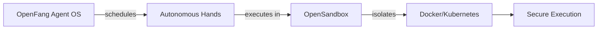

import Card from '@site/src/components/Card/Card';
import CardGroup from '@site/src/components/Card/CardGroup';
import Tabs from '@theme/Tabs';
import TabItem from '@theme/TabItem';

# Autonomous Agents 🤖

Autonomous agents are AI systems designed to operate independently, performing tasks on schedules or in response to triggers without requiring continuous human input. Unlike interactive coding assistants that need a human present to direct their work, autonomous agents run in the background — building knowledge graphs, monitoring targets, generating leads, managing social media, and reporting results to dashboards.

## What Makes an Agent Autonomous?

The key distinction between autonomous and interactive agents is **user presence**:

| Aspect | Interactive Agents | Autonomous Agents |
|---|---|---|
| **User Presence** | Required (human-in-the-loop) | Optional (background operation) |
| **Execution Model** | Prompt → Response → Review | Scheduled triggers, continuous monitoring |
| **Memory** | Session-level or project-level | Persistent, structured, self-improving |
| **Interfaces** | Terminal, IDE, Chat | Messaging platforms, APIs, dashboards |
| **Best For** | Real-time coding, debugging | 24/7 operations, team workflows, personal automation |

## OpenFang: Agent Operating System in Rust

OpenFang is a production-grade Agent Operating System built entirely in Rust. It introduces the concept of **"Hands"** — pre-built autonomous capability packages that run independently on schedules without user prompts.

### Key Capabilities

- **7 Autonomous Hands**: Clip (video shorts), Lead (prospecting), Collector (OSINT), Predictor (forecasting), Researcher, Twitter (social media), Browser (web automation)
- **Performance**: &lt;200ms cold start, 40 MB idle memory, single 32 MB binary
- **Security**: 16 layers including WASM sandboxing, Merle audit trails, SSRF protection
- **Channels**: 40 messaging platform adapters (Telegram, Slack, Discord, WhatsApp, etc.)
- **LLM Support**: 27 providers, 123+ models

### When to Use OpenFang

- Production deployments requiring low latency and high security
- 24/7 autonomous agents running on schedules
- Multi-channel deployments across messaging platforms
- Rust ecosystems and memory-efficient environments
- Security-sensitive operations requiring defense in depth

## OpenSandbox: Secure Execution Layer by Alibaba

OpenSandbox is not an agent framework itself but a **secure execution environment** purpose-built for AI agents. It provides standardized, isolated environments using Docker or Kubernetes, enabling autonomous agents to safely run code, browse the web, or train models.

### Key Features

- **Unified APIs**: Multi-language SDKs (Python, Go, Node.js) with consistent interfaces
- **Docker & Kubernetes**: Purpose-built container execution with native K8s operator support
- **Browser Automation**: Headless browser control for web agents
- **VS Code Desktop**: Integrated IDE for coding agents
- **Network Isolation**: Secure sandbox with controlled network access

### When to Use OpenSandbox

- Running untrusted agent code safely
- Building coding agent platforms
- Evaluation benchmark pipelines
- GUI automation at scale
- Multi-agent orchestration with security requirements

## Comparison: OpenFang vs OpenSandbox

| Aspect | OpenFang | OpenSandbox |
|---|---|---|
| **Primary Role** | Agent Operating System (runtime) | Secure Execution Layer (sandbox) |
| **Language** | Rust | Multi-language SDKs |
| **Autonomous Agents** | 7 built-in "Hands" | Provides environment for any agent |
| **Security** | 16 security layers (WASM, Merkle, SSRF) | Container isolation, network policies |
| **Deployment** | Single binary, no Docker required | Docker/Kubernetes-based |
| **Best For** | Agent orchestration & scheduling | Safe code execution & isolation |

### How They Work Together

The most effective architecture often combines both: **OpenFang** as the agent runtime that schedules and orchestrates autonomous tasks, running inside **OpenSandbox** for secure, isolated execution. This provides the best of both worlds — autonomous capability with production-grade security.

## Related Tools

<CardGroup cols={2}>
  <Card title="OpenFang" icon="mdi:robot" href="../../Skills-and-Agents/openfang">
    Production-grade Agent OS in Rust with autonomous "Hands" for 24/7 operation.
  </Card>
  <Card title="OpenSandbox" icon="mdi:shield-check" href="../../Skills-and-Agents/opensandbox">
    Secure execution environment by Alibaba for running untrusted agent code.
  </Card>
</CardGroup>

## References

- [OpenFang Website](https://openfang.sh)
- [OpenFang GitHub](https://github.com/RightNow-AI/openfang)
- [OpenSandbox GitHub](https://github.com/alibaba/OpenSandbox)
- [ClaudeKit Workflow](../Workflows/ClaudeKit-Workflow.md): Spec-driven AI development methodology.
- [Interactive Agents](./interactive-agents.md): Claude Code and OpenCode for real-time coding.
