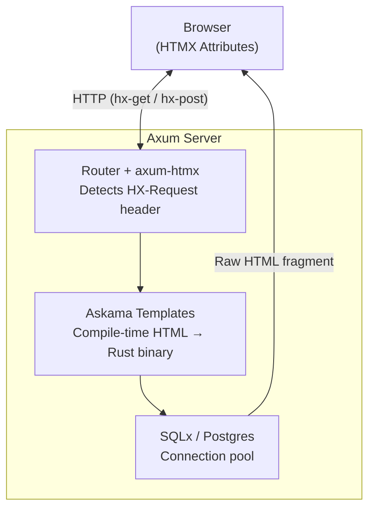

# Micro-Frameworks & Thin Fullstack

When lightweight HTML-first libraries like htmx pair with a performant server framework, you get a pattern best described as **"micro-JavaScript + thin fullstack"** — minimal client-side code, all rendering on the server. This isn't a single framework but a composition philosophy: small client library + fast backend + compile-time templating.

## The HTMX + Axum Stack (Rust)

A representative implementation: **HTMX (~14KB)** on the client, **Axum** (Tokio ecosystem) on the server, **Askama** for compile-time templates, and **SQLx** for database access.

**How it works:** HTMX attributes (`hx-get`, `hx-post`, `hx-target`) on HTML tags trigger HTTP requests. The `axum-htmx` crate inspects the `HX-Request` header, letting a single route serve either a full page layout or an isolated HTML snippet. Askama compiles templates into Rust source code at build time — rendering small HTML blocks in ~109 nanoseconds, removing template rendering as a bottleneck entirely.

:::info
**TechEmpower Round 23 — Position 7:** HTMX + Axum achieves extreme raw throughput on database-backed HTML responses. Real-world performance with standard database drivers (SQLx) lands around **38,700 req/sec** — a theoretical ceiling of ~3.3 billion page views/day on a single server, assuming no static assets, auth overhead, or connection pool exhaustion.
:::

**Key advantages:**
- **No client hydration:** The browser renders C++-tuned raw HTML fragments directly — no parsing heavy JS bundles
- **Significant code reduction:** ~66% fewer total lines of code compared to equivalent React/Next.js apps
- **No GC pauses:** Multi-threaded work-stealing execution without garbage collector overhead

## The Three Walls

| Wall | Limitation |
| :--- | :--- |
| **Interdependent state** | Apps where one input recalculates dozens of UI elements in real-time (e.g., spreadsheets) suffer from HTTP round-trip overhead |
| **Frame-rate interactions** | High-frequency updates (60fps animations, canvas drawing, map dragging) require local client-side execution |
| **Hiring & ecosystem** | Most web developers and component libraries target React; Rust + HTMX requires team buy-in outside the mainstream JS ecosystem |

:::tip
For localized client state (dropdown toggles, modal dialogs), combine **Alpine.js** alongside HTMX without needing a full SPA setup.
:::

**HTMX v4 (Beta):** Moves request handling to the native `fetch` API, replaces DOM swapping with **Idiomorph**, and introduces status-based selectors for HTTP error handling. See [HTMX v4 Migration](https://youtu.be/qhfgXVVNYL0) for details.

**Rust compile times** remain a friction point — over 55% of surveyed Rust developers report waiting more than 10 seconds for incremental rebuilds. Streaming SSR is supported in Axum via the `IntoResponse` trait for custom error types. **Offline/PWA is not supported** by HTMX.

## Comparison to Mature Stacks

The server-rendered HTML fragment pattern is not new. **Rails + Hotwire/Turbo** and **Laravel + Livewire** implement the same philosophy with more mature ecosystems. HTMX + Axum is not meaningfully different in approach — it's the same pattern with a lighter client (~14KB) and a Rust backend instead of Ruby/PHP.

## When to Use

**Best for:** CRUD apps, admin dashboards, internal tools, form-heavy interfaces.

**Avoid:** Complex client-side interactions requiring high frame rates or offline capabilities.

## References

- [HTMX + Axum Example](https://github.com/jeremyckahn/htmx-axum-template)
- [Askama Template Benchmarks](https://askama-rs.github.io/template-benchmark/)
- [TechEmpower Benchmarks Round 23](https://www.techempower.com/benchmarks/#section=data-r23)
- [HTMX + Axum Deep Dive](https://youtu.be/vag9njGMb_4)
- [HTMX v4 Migration](https://youtu.be/qhfgXVVNYL0)
