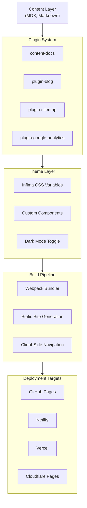

import Tabs from '@theme/Tabs';
import TabItem from '@theme/TabItem';
import Steps from '@site/src/components/Steps/Steps';
import Step from '@site/src/components/Steps/Step';
import Card from '@site/src/components/Card/Card';
import CardGroup from '@site/src/components/Card/CardGroup';
import Accordion from '@site/src/components/Accordion/Accordion';

# Docusaurus

[Docusaurus](https://docusaurus.io) is a static-site generator created by [Meta Open Source](https://opensource.facebook.com/) that produces fast, optimized documentation websites. It builds a single-page application (SPA) with client-side navigation, leveraging the full power of React and MDX. First released in 2017, it is one of the most widely used documentation frameworks — powers sites for React, React Native, Prettier, Supabase, and hundreds of other projects.

## Why Docusaurus?

Building a custom documentation stack from scratch is expensive. Docusaurus gives you a battle-tested foundation so you can focus on content rather than infrastructure.

- **React-powered:** Full control over layout and interactivity via React components and MDX.
- **MDX support:** Write Markdown with embedded JSX — embed live code editors, custom components, or interactive examples directly in your docs.
- **SEO-friendly:** Every page is statically generated as a fully renderable HTML file, ensuring search engines can index your content without JavaScript execution.
- **Versioning:** Keep documentation in sync with project releases using built-in document versioning.
- **i18n:** Out-of-the-box internationalization with support for git-based or Crowdin-based translation workflows.
- **Search:** First-class integration with Algolia DocSearch for full-text search across your site.
- **Pluggable architecture:** Extend functionality with a rich plugin ecosystem — analytics, sitemaps, RSS feeds, and more.

<Accordion title="How does Docusaurus achieve fast page loads?">
Docusaurus follows the PRPL Pattern for performance: **P**ush critical resources, **R**ender the initial route, **P**re-cache remaining routes, and **L**azy-load other routes on demand. This results in near-instant page transitions after the initial load.
</Accordion>

## Getting Started

### Prerequisites

- [Node.js](https://nodejs.org/en/download/) version 20.0 or above
- A package manager: npm, yarn, pnpm, or Bun

<Steps>
<Step title="Scaffold a Project">

```bash
npx create-docusaurus@latest my-website classic
```

The `classic` template includes the standard preset with documentation, blog, custom pages, and dark mode support. For TypeScript, add the `--typescript` flag.

</Step>
<Step title="Start the Dev Server">

```bash
cd my-website
npm run start
```

Open [http://localhost:3000](http://localhost:3000) to preview your site. Changes hot-reload instantly.

</Step>
<Step title="Build for Production">

```bash
npm run build
```

Static files are generated in the `./build` directory, ready to deploy to GitHub Pages, Netlify, Vercel, or any static host.

</Step>
</Steps>

## Project Structure

A standard Docusaurus project follows this layout:

```
my-website
├── docs/           # Markdown/MDX documentation files
├── blog/           # Blog posts
├── src/
│   ├── components/ # Custom React components
│   ├── pages/      # Custom pages (JSX/MDX)
│   └── css/        # Stylesheets
├── static/         # Static assets (images, fonts)
├── docusaurus.config.js   # Site configuration
└── sidebars.js     # Sidebar navigation order
```

- **`docs/`** — Your documentation content. Files here are automatically rendered as pages.
- **`blog/`** — Blog posts with support for RSS, tags, and authors.
- **`src/components/`** — Reusable React components you can embed in MDX files.
- **`docusaurus.config.js`** — The central configuration file for site metadata, themes, plugins, and presets.

## Key Features

### MDX Integration

MDX lets you write Markdown with JSX. This means you can import and render React components directly within your documentation:

```mdx
import MyComponent from './MyComponent';

# My Page

Here is a custom component:

<MyComponent prop="value" />
```

### Versioning

Docusaurus supports documentation versioning out of the box. When you release a new version of your software, you can snapshot the current docs and continue editing the next version independently.

### Plugin System

The plugin architecture lets you add features without modifying core code. Common plugins include:

- `@docusaurus/plugin-sitemap` — Generate sitemaps for SEO
- `@docusaurus/plugin-content-docs` — Enhanced documentation features
- `@docusaurus/plugin-google-analytics` — Track visitor analytics
- `@docusaurus/theme-live-codeblock` — Interactive code editors

### Dark Mode

Built-in dark mode toggle with automatic detection of system preferences. Theme colors are customizable via Infima CSS variables.

### Deployment

Docusaurus builds to a static `./build` directory. Deploy to any hosting provider:

| Platform | Notes |
| :--- | :--- |
| GitHub Pages | Add `organizationName`, `projectName`, and `deploymentBranch` to config |
| Netlify | Set base directory to your Docusaurus root |
| Vercel | Zero-config with the Vercel CLI |
| Cloudflare Pages | Framework preset auto-detected |

## Design Principles

Docusaurus follows a few core principles that shape its architecture:

1. **Minimal API surface** — Easy to learn; most things are achievable even without deep framework knowledge.
2. **Sensible defaults** — Common optimizations are built in but fully overridable.
3. **No vendor lock-in** — You are not forced into specific CSS frameworks, Markdown engines, or plugin ecosystems.
4. **Layered architecture** — Clear separation between content, theming, and styling layers.



## Docusaurus vs Starlight

[Starlight](https://starlight.astro.build) is a documentation theme built on the [Astro](https://astro.build) framework. It has gained rapid popularity since its launch in 2023. Here is how the two compare:

<Tabs>
<TabItem value="overview" label="Overview">

| Aspect | Docusaurus | Starlight |
| :--- | :--- | :--- |
| **Framework** | React | Astro |
| **Current Version** | 3.10.x | 1.x (stable) |
| **Maintained By** | Meta Open Source | Astro team |
| **Content Format** | MDX | Markdown, MDX, Markdoc |
| **UI Framework** | React components | Framework-agnostic (React, Vue, Svelte, Solid supported) |
| **Architecture** | Single-page application (SPA) | Static site with partial hydration |
| **Maturity** | Since 2017, battle-tested at scale | Since 2023, rapidly growing |

</TabItem>
<TabItem value="features" label="Feature Comparison">

| Feature | Docusaurus | Starlight |
| :--- | :--- | :--- |
| **Document Versioning** | Built-in | Not built-in (plugin-based) |
| **i18n** | Built-in with git/Crowdin | Built-in with Astro i18n |
| **Search** | Algolia DocSearch | built-in, Algolia, Pagefind |
| **Dark Mode** | Built-in | Built-in |
| **Sidebar Navigation** | Configurable via `sidebars.js` | Configurable via `sidebar` config |
| **Blog** | Built-in blog plugin | Manual setup via Astro content collections |
| **Plugin Ecosystem** | Mature, npm-based | Growing, Astro integration-based |
| **Custom Components** | React (JSX in MDX) | Any framework (React, Vue, Svelte, etc.) |
| **TypeScript Config** | Supported via `--typescript` flag | Native TypeScript config |

</TabItem>
<TabItem value="when" label="When to Choose Which">

**Choose Docusaurus if:**

- You need document versioning for versioned software releases
- You want a mature, battle-tested solution with a large ecosystem
- Your team is already familiar with React
- You need a built-in blog alongside documentation
- You are building documentation for a large open-source project

**Choose Starlight if:**

- You want the smallest possible bundle size and fastest cold starts
- You prefer Astro's island architecture over a full SPA
- You want to use non-React frameworks (Vue, Svelte, Solid) for custom components
- You prefer Markdown/Markdoc over MDX
- You are starting a new project and want modern tooling with Astro

</TabItem>
</Tabs>

:::tip
Both tools produce excellent documentation sites. The best choice depends on your team's existing expertise and whether you value React's ecosystem maturity (Docusaurus) or Astro's lightweight architecture (Starlight).
:::

## References

<CardGroup cols={2}>
<Card title="Docusaurus Docs" icon="mdi:book-open-variant" href="https://docusaurus.io/docs">
Official documentation with guides, API reference, and tutorials.
</Card>
<Card title="GitHub Repository" icon="mdi:github" href="https://github.com/facebook/docusaurus">
Source code, issues, and contributions.
</Card>
<Card title="Docusaurus Blog" icon="mdi:post" href="https://docusaurus.io/blog">
Release notes, feature announcements, and case studies.
</Card>
<Card title="Docusaurus Showcase" icon="mdi:monitor-dashboard" href="https://docusaurus.io/showcase">
Gallery of sites built with Docusaurus.
</Card>
<Card title="Starlight Docs" icon="mdi:book-open-variant" href="https://starlight.astro.build">
Official Starlight documentation for comparison.
</Card>
<Card title="Starlight GitHub" icon="mdi:github" href="https://github.com/withastro/starlight">
Starlight source code and issue tracker.
</Card>
</CardGroup>
