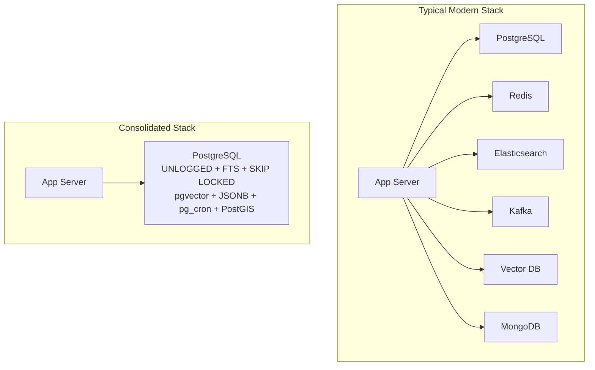

# Replace Your Tech Stack with PostgreSQL

There is a growing consolidation trend in software architecture: instead of wiring together Redis, Elasticsearch, Kafka, a vector database, a document store and a cron scheduler, many teams are discovering that a single PostgreSQL instance - plus its extension ecosystem - covers all of those use cases for the vast majority of applications.

The reasoning is simple: most software never reaches enterprise scale. The "boring" relational database that has been battle-tested for over 30 years supports advanced indexing, full-text search, pub/sub, queues, JSON documents, vectors, geospatial queries and scheduled jobs out of the box. Fewer moving parts means fewer failure modes, less operational overhead, lower cost, transactions across all your data, and only one thing to back up, monitor and secure.

:::info
Every feature you consolidate into Postgres removes at least one network hop, one client library, one deployment target and one set of credentials from your system.
:::

## The Consolidation Map

| Specialized Tool | Postgres Replacement | Key Feature |
| :--- | :--- | :--- |
| Redis / Memcached | UNLOGGED tables, LISTEN/NOTIFY | Fast ephemeral storage, pub/sub |
| Elasticsearch | tsvector + GIN indexes, pg_trgm | Full-text search, fuzzy matching |
| Kafka / RabbitMQ | SKIP LOCKED, SELECT FOR UPDATE | Durable job queues |
| Pinecone / vector DBs | pgvector | Embeddings + similarity search |
| MongoDB | JSONB columns | Schemaless documents |
| Crontab / scheduler | pg_cron | SQL-scheduled jobs |
| PostGIS-free geo tools | PostGIS | Geospatial queries |
| ClickHouse (small scale) | Materialized views, window functions | Analytics and rollups |

## Caching: Replacing Redis

For cache workloads that fit in memory and tolerate occasional loss, `UNLOGGED` tables skip write-ahead logging for much faster writes. Combined with `LISTEN/NOTIFY` you also get lightweight pub/sub without a message broker.

```sql
CREATE UNLOGGED TABLE cache (
    key TEXT PRIMARY KEY,
    value JSONB NOT NULL,
    expires_at TIMESTAMPTZ NOT NULL
);

-- Read-through pattern
SELECT value FROM cache
WHERE key = 'user:42' AND expires_at > now();

-- Pub/sub channel
LISTEN user_events;
NOTIFY user_events, '{"type": "updated", "id": 42}';
```

:::tip
If your cache is written far more often than it is read, or survives node restarts matter, keep Redis. For read-heavy session and computed-value caches, Postgres is often fast enough.
:::

## Full-Text Search: Replacing Elasticsearch

Postgres ships with a mature text search engine: `tsvector` for normalized documents, `tsquery` for matching, and GIN indexes to keep lookups fast even on millions of rows.

```sql
ALTER TABLE articles ADD COLUMN search tsvector
    GENERATED ALWAYS AS (
        setweight(to_tsvector('english', title), 'A') ||
        setweight(to_tsvector('english', body), 'B')
    ) STORED;

CREATE INDEX idx_articles_search ON articles USING GIN (search);

SELECT title FROM articles
WHERE search @@ websearch_to_tsquery('english', 'postgres queue')
ORDER BY ts_rank(search, websearch_to_tsquery('english', 'postgres queue')) DESC;
```

For typo-tolerant, "Google-like" fuzzy matching, add `pg_trgm` trigram indexes:

```sql
CREATE EXTENSION IF NOT EXISTS pg_trgm;

CREATE INDEX idx_products_name_trgm ON products USING GIN (name gin_trgm_ops);

SELECT name, similarity(name, 'ipod') AS score
FROM products WHERE name % 'ipod'
ORDER BY score DESC LIMIT 10;
```

## Job Queues: Replacing Kafka and RabbitMQ

You do not need a distributed log to process background jobs reliably. The classic pattern uses row locking so multiple workers can safely pull jobs concurrently:

```sql
CREATE TABLE jobs (
    id BIGSERIAL PRIMARY KEY,
    payload JSONB NOT NULL,
    status TEXT NOT NULL DEFAULT 'pending',
    run_at TIMESTAMPTZ DEFAULT now(),
    locked_by TEXT,
    locked_at TIMESTAMPTZ
);

-- Each worker atomically claims one job; SKIP LOCKED avoids contention
WITH next_job AS (
    SELECT id FROM jobs
    WHERE status = 'pending' AND run_at <= now()
    ORDER BY run_at
    FOR UPDATE SKIP LOCKED
    LIMIT 1
)
UPDATE jobs j
SET status = 'processing', locked_by = 'worker-1', locked_at = now()
FROM next_job WHERE j.id = next_job.id
RETURNING j.*;
```

`SKIP LOCKED` guarantees each job goes to exactly one worker, and because the queue lives in the same database as your data, enqueueing a job and writing related rows happen in one atomic transaction - something Kafka cannot give you.

## Vector Search: Replacing Dedicated Vector Databases

With `pgvector`, embeddings live next to the data they describe, enabling hybrid search that combines semantic similarity with regular SQL filters.

```sql
CREATE EXTENSION IF NOT EXISTS vector;

CREATE TABLE documents (
    id BIGSERIAL PRIMARY KEY,
    content TEXT,
    embedding vector(1536)
);

CREATE INDEX ON documents USING hnsw (embedding vector_cosine_ops);

-- Nearest neighbors, filtered by ordinary SQL predicates
SELECT id, content FROM documents
WHERE team_id = 7 AND created_at > now() - interval '30 days'
ORDER BY embedding <=> $1  -- query embedding
LIMIT 5;
```

## Documents: Replacing MongoDB

`JSONB` stores schemaless documents with binary indexing support. You get flexible structures when you want them, plus constraints, joins and transactions when you need them.

```sql
CREATE TABLE events (
    id BIGSERIAL PRIMARY KEY,
    doc JSONB NOT NULL
);
CREATE INDEX idx_events_doc ON events USING GIN (doc);

SELECT * FROM events
WHERE doc @> '{"user": {"country": "ES"}}';

-- Index into specific paths
SELECT doc->>'email' FROM events
WHERE (doc->'meta'->>'version')::int >= 2;
```

## Scheduled Jobs: Replacing Cron and Schedulers

`pg_cron` runs periodic SQL directly inside the database - no external scheduler, no SSH access, no extra container.

```sql
SELECT cron.schedule(
    'nightly-cleanup',
    '0 3 * * *',
    $$DELETE FROM sessions WHERE expires_at < now()$$
);

-- Chain jobs with the queue pattern above
SELECT cron.schedule(
    'enqueue-reports',
    '0 * * * *',
    $$INSERT INTO jobs (payload) VALUES ('{"task": "daily_report"}')$$
);
```

## Geospatial: PostGIS

PostGIS turns Postgres into a full spatial database supporting geometries, spatial indexes, and distance/containment queries.

```sql
CREATE EXTENSION IF NOT EXISTS postgis;

CREATE TABLE places (
    id BIGSERIAL PRIMARY KEY,
    name TEXT,
    location GEOGRAPHY(POINT, 4326)
);
CREATE INDEX idx_places_location ON places USING GIST (location);

-- Everything within 5 km of a point
SELECT name FROM places
WHERE ST_DWithin(location, ST_MakePoint(-3.7038, 40.4168)::geography, 5000);
```

## Architecture Before and After



## When NOT to Consolidate

Postgres consolidation is not a religion. There are real trade-offs at genuine enterprise scale:

- **Very high write throughput**: Postgres is single-writer per primary. If you need millions of writes per second, Kafka-class systems exist for a reason.
- **Massive search corpora**: Elasticsearch's distributed sharding and relevance tuning win once indexes no longer fit comfortably on one beefy node.
- **Cache-heavy hot paths**: Redis serves hundreds of thousands of ops/sec with sub-millisecond latency; Postgres round-trips are slower by design.
- **Independent scaling and availability**: Separate services fail and scale independently. One database is a shared fate - a runaway analytical query can stall your queues.
- **Operational maturity requirements**: Specialized tools often have richer ecosystem tooling for replication topologies, multi-region setups and compliance workflows.

:::warning
The honest rule of thumb: start with just Postgres, and extract a specialized service only when you measure a concrete limit - not because a conference talk said microservices are modern.
:::

## References

- [Video: Replacing your tech stack with Postgres](https://www.youtube.com/watch?v=TdondBmyNXc)
- [Replace Modern Tech Stack with PostgreSQL - whyboobo.com](https://whyboobo.com/abstract/replace-modern-tech-stack-with-postgresql/)
- [I replaced most of my tech stack with PostgreSQL - Medium](https://medium.com/@sovannaro/i-replaced-most-of-my-tech-stack-with-postgresql-f275511b914d)
