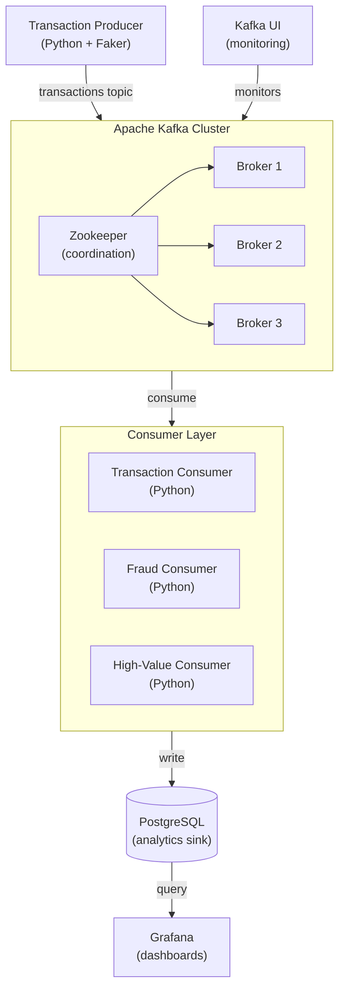

# Real-Time Banking System with Apache Kafka

Traditional banking systems rely on batch processing — transactions captured during the day are analysed overnight for fraud detection, risk assessment, and reconciliation. This model breaks down when fraudsters operate in microseconds and customers expect instant feedback. An event-driven architecture built on Apache Kafka shifts the paradigm: every transaction is an immutable event, streamed in real-time from producer to consumer, with PostgreSQL as the persistence layer and Grafana for live dashboards.

This article documents the architecture of a real-time banking transaction monitoring system using Kafka, Python, PostgreSQL, and Grafana, based on a workshop by Luciano Galvão (Escola Jornada de Dados).

## Architecture Overview



### Data Flow

1. **Producer** generates synthetic financial transactions using Python's `Faker` library and publishes them to a Kafka topic
2. **Kafka Cluster** (Zookeeper + 3 brokers) stores and distributes messages with configurable partitioning and replication
3. **Consumers** subscribe to topics, process transactions (classifying as valid, fraudulent, or high-value), and write results to PostgreSQL
4. **Kafka UI** provides real-time visibility into topic state, consumer lag, and broker health
5. **Grafana** queries PostgreSQL to render live dashboards — transaction volume, fraud ratios, and anomaly trends

## Component Breakdown

### Producer Layer

Python scripts using the `kafka-python` library generate realistic transaction data: amount, location, device ID, timestamp, and customer identifiers. Each message is serialised as JSON and published with a key for partition affinity. The producer runs in a continuous loop, simulating a constant stream of card-present and card-not-present transactions.

```python
from kafka import KafkaProducer
from faker import Faker
import json

producer = KafkaProducer(
    bootstrap_servers=['localhost:9092'],
    value_serializer=lambda v: json.dumps(v).encode('utf-8')
)

while True:
    transaction = {
        'amount': fake.random_int(1, 10000),
        'location': fake.city(),
        'device_id': fake.uuid4(),
        'timestamp': fake.date_time_this_year().isoformat(),
        'customer_id': fake.uuid4()
    }
    producer.send('bank-transactions', value=transaction)
```

### Messaging Layer (Apache Kafka)

The cluster runs three brokers coordinated by Zookeeper, providing fault tolerance through replication. Key configuration decisions:

- **Partitions**: Topics are split into multiple partitions for parallel consumption. A `bank-transactions` topic with 6 partitions allows up to 6 concurrent consumers
- **Replication Factor**: 3 ensures no data loss if a broker fails
- **Retention**: Configurable by time or size — critical for compliance with financial regulations that mandate audit trails
- **Consumer Groups**: Consumers in the same group share partition assignment, enabling horizontal scaling

Kafka UI (running on port 8087) exposes cluster health, per-topic message rates, consumer lag, and partition distribution.

### Consumer Layer

Multiple consumer groups process the same stream for different purposes:

| Consumer | Topic | Purpose |
| :--- | :--- | :--- |
| `transaction-consumer` | `bank-transactions` | Writes all transactions to PostgreSQL for analytics |
| `fraud-consumer` | `bank-transactions` | Filters suspicious transactions for fraud scoring |
| `high-value-consumer` | `high-value-transactions` | Processes transactions above configurable thresholds |

Consumers write to PostgreSQL using `psycopg2` or SQLAlchemy, performing lightweight transformations before persisting.

### Storage Layer (PostgreSQL)

PostgreSQL acts as the analytics sink. Two table schemas illustrate the pattern:

```sql
CREATE TABLE shop.transactions (
    id SERIAL PRIMARY KEY,
    amount DECIMAL(10,2),
    location VARCHAR(100),
    device_id UUID,
    customer_id UUID,
    transaction_ts TIMESTAMP,
    ingested_at TIMESTAMP DEFAULT NOW()
);

CREATE TABLE shop.fraud_transactions (
    id SERIAL PRIMARY KEY,
    transaction_id INTEGER REFERENCES shop.transactions(id),
    fraud_score DECIMAL(5,2),
    flagged_at TIMESTAMP DEFAULT NOW()
);
```

### Visualisation Layer (Grafana)

Grafana connects to PostgreSQL and renders:
- **Transaction volume over time** — line chart with 1-minute granularity
- **Fraud vs non-fraud ratio** — pie chart or stacked bar
- **Top fraud locations** — table sorted by frequency
- **Consumer lag alerts** — threshold-based notifications when Kafka consumers fall behind

## Event-Driven Patterns

### Change Data Capture (CDC) with Debezium

CDC captures row-level changes in PostgreSQL and publishes them to Kafka topics without custom producer code. Debezium reads the PostgreSQL write-ahead log (WAL) and emits insert, update, and delete events as Kafka messages.

```json
{
  "name": "postgres-connector",
  "config": {
    "connector.class": "io.debezium.connector.postgresql.PostgresConnector",
    "database.hostname": "postgres",
    "database.port": "5432",
    "database.dbname": "banking",
    "topic.prefix": "cdc-banking"
  }
}
```

Downstream consumers react to these events — for example, a fraud detection service receives new-transaction events without polling.

### Transactional Outbox Pattern

When a service must write to its database and publish a Kafka event atomically, the outbox pattern prevents the dual-write problem. Instead of publishing directly, the service writes the event to an `outbox` table within the same database transaction. A background poller (`OutboxPoller`) reads from `outbox` and publishes to Kafka. This guarantees at-least-once delivery without distributed transactions (XA).

```sql
CREATE TABLE outbox_messages (
    id UUID PRIMARY KEY,
    topic VARCHAR(255) NOT NULL,
    key VARCHAR(255),
    payload JSONB NOT NULL,
    created_at TIMESTAMP DEFAULT NOW(),
    processed_at TIMESTAMP
);
```

### Saga Pattern for Distributed Transactions

A banking transfer involves debiting one account and crediting another — operations that span services. The Saga pattern coordinates this as a sequence of local transactions, each publishing an event. If a step fails, compensating transactions undo the previous steps. The orchestrator (or choreography via Kafka topics) ensures eventual consistency.

```
Transfer Start → Debit Source (event) → Credit Target (event) → Complete
                                        ↓ (on failure)
                                    Compensate Debit (rollback)
```

### Kafka Streams for Stateful Processing

For operations requiring state — computing a user's real-time balance, detecting velocity checks (more than X transactions in Y seconds) — Kafka Streams provides exactly-once, stateful stream processing with local state stores (RocksDB-backed).

```java
KStream<String, Transaction> transactions = builder.stream("bank-transactions");

transactions
    .groupByKey()
    .windowedBy(TimeWindows.of(Duration.ofSeconds(30)))
    .count()
    .toStream()
    .filter((key, count) -> count > 5)
    .to("alert-velocity");
```

The velocity check above alerts when a single customer exceeds 5 transactions in 30 seconds — a common fraud signal.

## NATS as an Alternative

[**NATS**](https://nats.io/) is a lightweight event streaming platform optimised for pub-sub topologies where message ordering and reliable delivery are non-issues. It excels at:

- **Simplicity**: Single binary, no Zookeeper dependency, minimal configuration
- **Performance**: Sub-millisecond latencies for at-most-once delivery
- **Edge/IoT**: Small footprint, ideal for constrained environments

Choose **Kafka** when you need message ordering within partitions, replayability (consumer offsets), long-term retention, and strong durability guarantees. Choose **NATS** when you need a fast, simple pub-sub backbone and can tolerate occasional message loss (or use NATS JetStream for persistence).

## References

- [Workshop: Kafka desde cero: sistema bancario en tiempo real con Python, PostgreSQL y Grafana](https://youtu.be/yRG0AHE6xCM) — Original workshop by Luciano Galvão (Escola Jornada de Dados)
- [Apache Kafka Homepage](https://kafka.apache.org/)
- [NATS Homepage](https://nats.io/)
- [Debezium CDC for PostgreSQL](https://debezium.io/documentation/reference/stable/connectors/postgresql.html)
- [Transactional Outbox Pattern](https://microservices.io/patterns/data/transactional-outbox.html) — microservices.io
- [Saga Pattern](https://microservices.io/patterns/data/saga.html) — microservices.io
- [Kafka Streams Documentation](https://kafka.apache.org/documentation/streams/)
- [Confluent Schema Registry](https://docs.confluent.io/platform/current/schema-registry/index.html)
