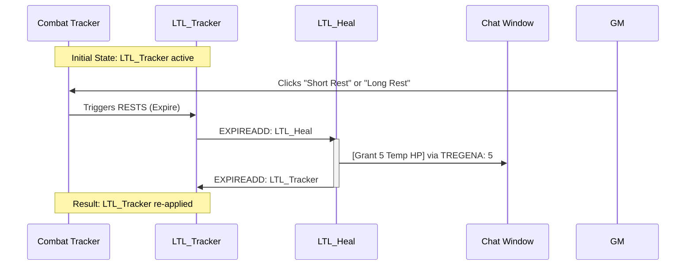

# Fantasy Grounds Effects

## BCE Gold

import { Icon } from '@iconify/react';

[Better Combat Effects (BCE) Gold Readme (PDF) <Icon icon="material-symbols:download" width="1.25em" />](https://www.fantasygrounds.com/forums/attachment.php?attachmentid=63813&d=1742242097)

In the **Better Combat Effects (BCE) Gold** extension for Fantasy Grounds, you can use the `EXPIREADD`, `RESTS` and `TREGENA` tags to create a *"looping"* effect that re-applies itself and triggers a *"pulse"* of temporary hit points every time a rest occurs.

### Important Tips

- **Spelling Matters**: Ensure the name in `EXPIREADD` matches the name of the other effect in your Custom Effects list **exactly**.

- **Non-Stacking**: Note that `TREGENA` follows standard 5e rules; it will not add 5 to existing Temp HP. It will set them to 5 (or keep them higher if the character already had more than 5).

- **Visibility**: If you don't want the effect text to clutter the tracker, you can set the  effect to *"GM Only"* or *"Hidden"* in the Custom Effects settings.

## Larger Than Life Feat

To set up **Larger Than Life** (LTL), you will need to create two separate entries in your **Custom Effects** list (the star icon in the upper right of the desktop) and then apply the first one to the character.

### Step 1: Create the Custom Effects

Open your **Custom Effects** window and add these two exact lines:

|Effect Name|Effect String|
|---|---|
|**LTL_Tracker**|`LTL_Tracker; EXPIREADD: LTL_Heal; RESTS`|
|**LTL_Heal**|`LTL_Heal; TREGENA: 5; EXPIREADD: LTL_Tracker`|

:::note Effect Naming
The "Effect Name" (how it appears in the Combat Tracker) is defined by the **first segment** of the string (the text before the first `;`). For example, in the first line above, the effect name is `LTL_Tracker`.
:::

### Step 2: Application

Once you have defined these in your Custom Effects:

1. Drag **LTL_Tracker** onto the character in the Combat Tracker.

2. Leave it there permanently.

3. Whenever the DM clicks *"Short Rest"* or *"Long Rest"* in the Combat Tracker menu, the character will see a message in the chat and their Temp HP will update to 5.

### How it Works

Click to expand

1. **LTL_Tracker**: This sits on the character's Combat Tracker entry. The `RESTS` tag tells Fantasy Grounds to expire this effect immediately when a Short or Long rest is taken.

2. **EXPIREADD: LTL_Heal**: When the tracker expires (due to the rest), it automatically "fires" the second effect, `LTL_Heal`.

3. **TREGENA: 5**: It stands for **T**emp **REGEN** **A**dd (instant). It immediately grants 5 temporary hit points to the character the moment the effect is added.

4. **EXPIREADD: LTL_Tracker**: Since `LTL_Heal` doesn't have a duration, it applies its 5 THP and then immediately expires, which triggers the original `LTL_Tracker` to be put back on the character, resetting the loop for the next rest.

