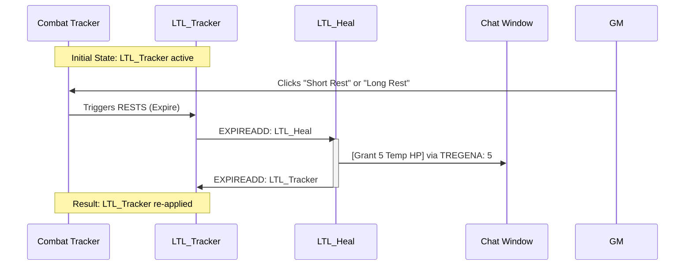

# Fantasy Grounds Effects

## Larger Than Life Feat

In the **Better Combat Effects (BCE) Gold** extension for Fantasy Grounds, you can use the `EXPIREADD`, `RESTS` and `TREGENA` tags to create a *"looping"* effect that re-applies itself and triggers a *"pulse"* of temporary hit points every time a rest occurs.

To set up **Larger Than Life** (LTL), you will need to create two separate entries in your **Custom Effects** list (the star icon in the upper right of the desktop) and then apply the first one to the character.

### Step 1: Create the Custom Effects

Open your **Custom Effects** window and add these two exact lines:

|Effect Name|Effect String|
|---|---|
|**LTL_Tracker**|`Larger Than Life; EXPIREADD: LTL_Heal; RESTS`|
|**LTL_Heal**|`LTL Pulse; TREGENA: 5; EXPIREADD: LTL_Tracker`|

### Step 2: How it Works

1. **LTL_Tracker**: This sits on the character's Combat Tracker entry. The `RESTS` tag tells Fantasy Grounds to expire this effect immediately when a Short or Long rest is taken.

2. **EXPIREADD: LTL_Heal**: When the tracker expires (due to the rest), it automatically "fires" the second effect, `LTL_Heal`.

3. **TREGENA: 5**: It stands for **T**emp **REGEN** **A**dd (instant). It immediately grants 5 temporary hit points to the character the moment the effect is added.

4. **EXPIREADD: LTL_Tracker**: Since `LTL_Heal` doesn't have a duration, it applies its 5 THP and then immediately expires, which triggers the original `LTL_Tracker` to be put back on the character, resetting the loop for the next rest.

### Step 3: Application

Once you have defined these in your Custom Effects:

1. Drag **LTL_Tracker** onto the character in the Combat Tracker.

2. Leave it there permanently.

3. Whenever the DM clicks *"Short Rest"* or *"Long Rest"* in the Combat Tracker menu, the character will see a message in the chat and their Temp HP will update to 5.

### Important Tips

- **Spelling Matters**: Ensure the name in `EXPIREADD` matches the name of the other effect in your Custom Effects list **exactly**.

- **Non-Stacking**: Note that `TREGENA` follows standard 5e rules; it will not add 5 to existing Temp HP. It will set them to 5 (or keep them higher if the character already had more than 5).

- **Visibility**: If you don't want the "Pulse" text to clutter the tracker, you can set the `LTL_Heal` effect to *"GM Only"* or *"Hidden"* in the Custom Effects settings.

## Daily Prep Buff

The "Daily Prep" Buff (e.g., Guidance or Inspiration)

If a character has a feat that gives them a bonus on their **first** roll after a rest (or just a generic "Prepared" buff), use this:

- **Effect 1 (The Trigger):** `Rest Buff Tracker; EXPIREADD: Rest_Buff_Apply; RESTS`

- **Effect 2 (The Buff):** `Prepared; ATK: 1; CHECK: 1; SAVE: 1; DISP: ALWAYS`

**Why this is cool:** The `DISP: ALWAYS` (or leaving it as a standard effect) means the character carries a +1 to their next d20 roll. Once they make a roll, the effect expires. Because it's gone, it won't trigger again until the next **RESTS** event kicks off the loop again.

### Resource Recovery (Custom "Points")

If you are tracking a custom resource (like "Grit," "Resolve," or "Luck") that isn't a standard Class Feature, you can use a "Chat Pulse" to remind the player to reset their counters.

- **Effect 1:** `Resource Tracker; EXPIREADD: Resource_Reset; RESTS`

- **Effect 2:** `Resource Pulse; (C); [RECOVERED 3 RESOLVE POINTS]; EXPIREADD: Resource_Tracker`

**Why this is cool:** The `(C)` tag in BCE Gold sends the text in brackets `[...]` directly to the **Chat Window**.

- When they rest, the chat will literally say: **"[Character Name]: [RECOVERED 3 RESOLVE POINTS]"**.

- It then loops back to the tracker so it's ready for the next rest.

### Pro-Tip: The "Once Per Long Rest" Filter

If an effect should **only** happen on a **Long Rest** (and ignore Short Rests), change the tag from `RESTS` to `LREST`.

- **Short Rest Trigger:** `RESTS`

- **Long Rest Only:** `LREST`
