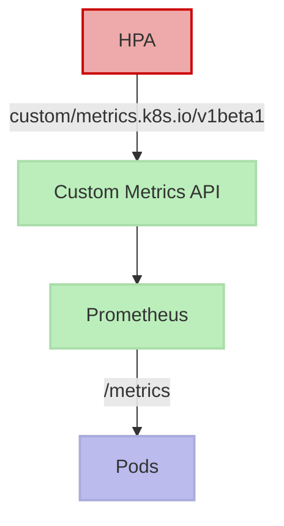

# HPA autoscalers

## Autoscale using Prometheus

### Architecture Overview



### Requirements

  * External metrics provider (k8s 1.10+)
  * Prometheus
  * Prometheus adapter
#### Deployment

Make sure Deployment gathers prometheus metrics:

```
  template:
    metadata:
      annotations:
        prometheus.io/path: "/metrics"
        prometheus.io/scrape: "true"
        prometheus.io/port: "8000"
```

#### Prometheus Adapter

Add a [custom rule](https://github.com/prometheus-community/helm-charts/blob/cd5c69a2ef0a3d5f3478374ba495d27a57b444d4/charts/prometheus-adapter/values.yaml#L85-L87) on prometheus or a Configmap for the adapter config and mount it as volume on the prometheus adapter deployment:

* configmap

```yaml
apiVersion: v1
kind: ConfigMap
metadata:
  name: adapter-config
  namespace: monitoring
data:
  config.yaml: |
    rules:
    - seriesQuery: 'nginx_vts_server_requests_total'
      resources:
        overrides:
          kubernetes_namespace:
            resource: namespace
          kubernetes_pod_name:
            resource: pod
      name:
        matches: "^(.*)_total"
        as: "${1}_per_second"
      metricsQuery: (sum(rate([<.Series>>{<<.LabelMatchers>>}[1m])) by (<<.GroupBy>](<.Series>>{<<.LabelMatchers>>}[1m])) by (<<.GroupBy>)))
```

* prometheus adapter deployment

```yaml
        volumeMounts:
        - mountPath: /etc/adapter/
          name: config
          readOnly: true
      volumes:
      - name: config
        configMap:
          name: adapter-config
```

### References

  * [https://pet2cattle.com/2022/04/prometheus-hpa-external-metrics](https://pet2cattle.com/2022/04/prometheus-hpa-external-metrics)
  * [https://medium.com/the-metricfire-blog/prometheus-metrics-based-autoscaling-in-kubernetes-3f4388501c8e](https://medium.com/the-metricfire-blog/prometheus-metrics-based-autoscaling-in-kubernetes-3f4388501c8e)
  * [https://www.metricfire.com/blog/prometheus-metrics-based-autoscaling-in-kubernetes/](https://www.metricfire.com/blog/prometheus-metrics-based-autoscaling-in-kubernetes/)

