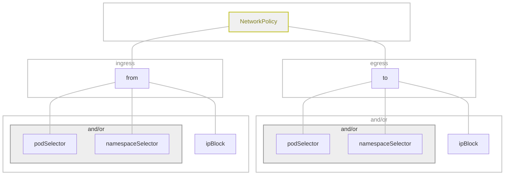

# k8s Network Policies

It allows you to control the flow of the traffic to specify how the Pod is allowed to communicate (IP address and port).

You can communicate with:

1. Other allowed pods.
2. Alowed Namespaces.
3. IP Blocks

By default no traffic is filtered until a pod gets a policy, then, only the specified [`NetworkPolicy`](https://kubernetes.io/docs/concepts/services-networking/network-policies/) connections are allowed.

* NetworkPolicy 
  * `ingress[from]`: Traffic allowed to go **into** the pod.
    * selector
  * `egress[to]`: Traffic allowed to go **out** of pod.
    * selector

* selectors
Just as in the deployments, we can use labels to determine which Pods or namespaces the NetworkPolicy applies:
  * `podSelector:`
    * `matchLabels:`
      * key: value
  * `namespaceSelector:`
    * `matchLabels`
      * key: value
  * `ipBlock:`
    * `cidr:`
    * `except:` list of cidrs

