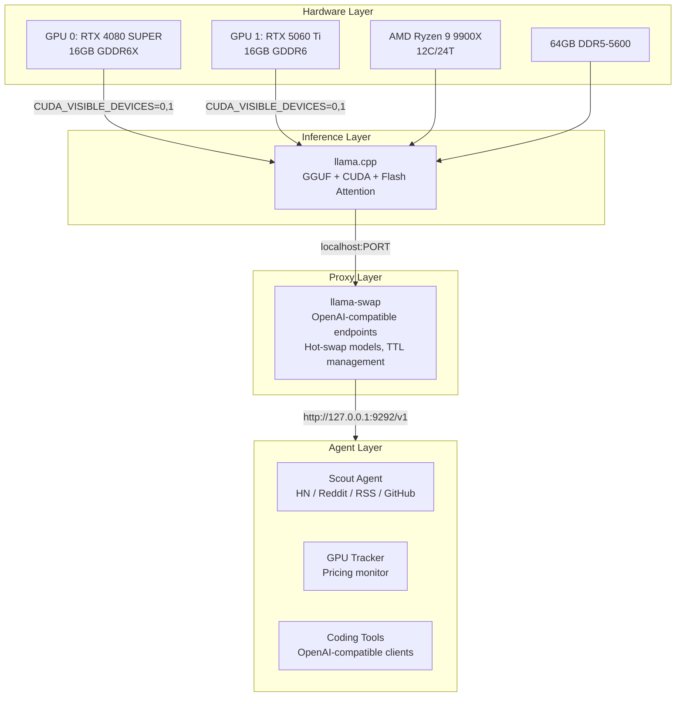
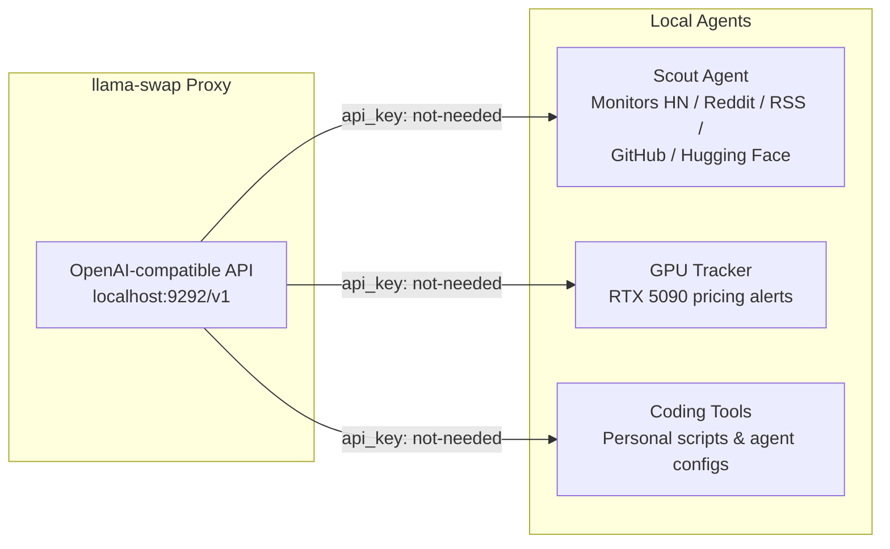

import Steps from '@site/src/components/Steps/Steps';
import Step from '@site/src/components/Steps/Step';
import CardGroup from '@site/src/components/Card/CardGroup';
import Card from '@site/src/components/Card/Card';

# 2-GPU Setup for Local LLMs

Researcher and engineer **leopardracer** runs a dual-GPU local AI lab from his desktop — not to avoid API bills, but to experiment without rate limits, swap models freely, and keep every prompt on his own machine.

His desktop is personal infrastructure: two NVIDIA GPUs providing 32GB of combined VRAM, running Qwen 3.6 locally through llama.cpp and llama-swap, with agents that talk to `localhost` instead of a hosted API.

## Hardware Specifications

| Component | Model | Specs | Role | Notes |
| :--- | :--- | :--- | :--- | :--- |
| **GPU 0** | RTX 4080 SUPER | 16GB GDDR6X | Primary card | Daily driver for inference |
| **GPU 1** | RTX 5060 Ti | 16GB GDDR6 | Experiment card | Secondary GPU for parallel workloads |
| **Combined** | — | **32GB VRAM** | — | Enough for 30B-class models at Q4 with useful context |
| **Alternative** | Used RTX 3090 | 24GB GDDR6X | Single-card option | Most practical local LLM card for most people |
| **CPU** | AMD Ryzen 9 9900X | 12 cores / 24 threads | System processor | Ample headroom for concurrent tasks |
| **RAM** | 64 GB DDR5-5600 | System memory | — | Essential for long context and multi-model setups |

Two 16GB cards create more flexibility than a single larger card: split a large model across both, run different models in parallel (coding vs. comparison), or dedicate one GPU to text and keep the other for vision, embeddings, or experiments.

## Architecture



## Why Qwen 3.6

leopardracer's daily driver is **Qwen3.6-27B** (the dense model). He also keeps **Qwen3.6-35B-A3B** for experiments, but consistently reaches for the 27B dense model first.

From the Qwen technical report and his own tracking:

| Benchmark | Qwen3.6-27B | Qwen3.6-35B-A3B | Claude Opus 4.7 |
| :--- | :--- | :--- | :--- |
| SWE-bench Verified | 77.2% | 73.4% | 87.6% |
| SWE-bench Pro | 53.5% | 49.5% | 64.3% |
| Terminal-Bench 2.0 | 59.3% | 51.5% | 69.4% |
| SkillsBench avg | 48.2% | — | — |
| QwenClawBench | — | 52.6% | — |

Local Qwen trails Claude Opus 4.7 on every benchmark, but is good enough to experiment with — and the trade-off is being able to abuse long context locally without watching a meter.

## Software Stack

| Layer | Component | Role |
| :--- | :--- | :--- |
| **Inference** | llama.cpp | CUDA, GGUF files, quantization, KV cache, Flash Attention, token generation |
| **Proxy** | llama-swap | OpenAI-compatible endpoints, hot-swap models on demand, TTL management |
| **Agents** | Local tools & scripts | Talk to `localhost` instead of a hosted API, no API keys needed |



Three pieces make the setup usable:

**llama.cpp** handles CUDA, GGUF files, quantization, KV cache settings, Flash Attention, and token generation.

**llama-swap** sits in front of llama.cpp. It exposes OpenAI-compatible endpoints and hot-swaps models on demand. Requests can be routed to different models, and unused models unload after a short TTL.

**Local agents and coding tools** call those endpoints. Some are personal scripts, some are agent configs — the key is they talk to `localhost` instead of a hosted API.

## llama-swap Configuration

Here is the actual llama-swap configuration used for larger local models:

```yaml
# yaml-language-server: $schema=https://raw.githubusercontent.com/mostlygeek/llama-swap/refs/heads/main/config-schema.json

healthCheckTimeout: 300
logLevel: info
logToStdout: "proxy"
startPort: 10001
sendLoadingState: true
globalTTL: 0

macros:
  llama_server: /home/tyler/llama.cpp/build/bin/llama-server
  models_dir: /home/tyler/models
  common_args: "--host 127.0.0.1 --port ${PORT} --flash-attn on --threads 16 --kv-offload --prio 2 --no-warmup --jinja"
  kv_quant_big: "--cache-type-k q8_0 --cache-type-v q4_0"

models:
  "gemma-4-26B":
    cmd: |
      ${llama_server}
      --model ${models_dir}/gemma-4-26B-A4B-it-UD-Q4_K_M.gguf
      --ctx-size 65536
      -ngl 99
      ${kv_quant_big}
      ${common_args}
    name: "Gemma 4 26B"
    ttl: 300
    aliases:
      - "local/gemma-26b"
    env:
      - "CUDA_VISIBLE_DEVICES=0,1"

  "qwen3.6-35B-A3B":
    cmd: |
      ${llama_server}
      --model ${models_dir}/Qwen3.6-35B-A3B-UD-Q4_K_XL.gguf
      --mmproj ${models_dir}/mmproj-F16.gguf
      --ctx-size 131072
      -ngl 99
      --temp 1.0
      --top-p 0.95
      --top-k 20
      --min-p 0.0
      --presence-penalty 1.5
      --chat-template-kwargs '{"enable_thinking":true}'
      ${kv_quant_big}
      ${common_args}
    name: "Qwen3.6 35B A3B"
    ttl: 300
    aliases:
      - "local/qwen-35b"
    env:
      - "CUDA_VISIBLE_DEVICES=0,1"
```

### Key Settings

**`CUDA_VISIBLE_DEVICES=0,1`** tells llama.cpp to use both GPUs. With two 16GB cards, this is the difference between a working setup and constant out-of-memory errors.

**`-ngl 99`** offloads as many model layers to GPU as possible. The goal is for the GPUs to do the heavy lifting.

**`--cache-type-k q8_0 --cache-type-v q4_0`** quantizes the KV cache. Model weights use VRAM, but the context cache also grows as more tokens are fed in. Quantizing the cache is how 131K context becomes practical on 32GB.

**`--flash-attn on`** enables Flash Attention. On modern NVIDIA hardware, this flag provides substantial performance gains with minimal downside.

**`--chat-template-kwargs '{"enable_thinking":true}'`** enables Qwen's thinking mode. This is useful for local agents because it exposes the model's reasoning process, not just the final answer.

## Local Agents

Running a local chat model is nice. Running local agents is better.

leopardracer runs a **Scout agent** that monitors Hacker News, Reddit, Twitter, GitHub Trending, Hugging Face, and RSS feeds. It scores items, extracts the interesting ones, and drops drafts into a content folder. The LLM config is intentionally minimal:

```yaml
llm:
  base_url: "http://127.0.0.1:9292/v1"
  model: "qwen3.6-27B-fast"
  api_key: "not-needed"
```

A **GPU tracker** watches RTX 5090 pricing and emails when cards hit target thresholds:

```yaml
llm:
  base_url: "http://localhost:9000/v1"
  model: "llama-swap/qwen3.5-9B"
  api_key: "not-needed"
```

The `api_key: "not-needed"` line captures the philosophy. When an agent runs locally, the cost of experimentation drops to zero. Over-sample, retry, log everything, test terrible prompts against real workflows. If Scout decides every article is important, fix the rubric. If the GPU tracker writes a bad summary, change the prompt. The failure mode is learning, not a bigger invoice.

## What 32GB VRAM Unlocks

32GB of VRAM does not make local AI effortless — it makes it flexible. With this setup:

- **Qwen3.6-27B dense** as the daily driver
- **Qwen3.6-35B-A3B** for experiments
- **Gemma 4 26B** for comparison
- Context sizes that would feel annoying through an API
- Agents running repeatedly without checking a dashboard

The best part is trying things that would feel too wasteful to pay for: feed 100K tokens of messy notes and ask for contradictions, score 30 Hacker News posts with a stricter rubric, or ask the model to inspect a repo and generate five competing refactor plans. Some experiments work. Some are garbage. Local inference makes garbage cheap.

## Privacy

The fun part is experimentation. The serious part is data ownership.

Every prompt stays on the machine. Every response is generated locally. Code, notes, health logs, and half-formed ideas do not have to leave the desktop just because an AI assistant is needed.

If the model runs locally, there is no need to trust a vendor with that prompt. The privacy benefit is quiet: you stop thinking "should I send this?" because the answer is no. It never leaves.

## Setup Guide

<Steps>
<Step title="Build llama.cpp with CUDA">
```bash
git clone https://github.com/ggerganov/llama.cpp.git
cd llama.cpp
mkdir build
cd build
cmake .. -DGGML_CUDA=ON
make -j$(nproc)
```
</Step>
<Step title="Download a GGUF model">
Download a GGUF quantization for the model you want. Unsloth's UD quantizations are recommended for larger models.
</Step>
<Step title="Install llama-swap">
```bash
go install github.com/mostlygeek/llama-swap@latest
llama-swap -config config.yaml
```
</Step>
<Step title="Test the endpoint">
```bash
curl http://localhost:9292/v1/chat/completions \
  -H "Content-Type: application/json" \
  -d '{
    "model": "local/qwen-35b",
    "messages": [
      {"role": "user", "content": "Are you running locally?"}
    ]
  }'
```
</Step>
<Step title="Point your clients">
Once you get a response, point any OpenAI-compatible client at that base URL.
</Step>
</Steps>

### Hardware Requirements

For smaller setups:

- **7B to 14B models**: 12GB to 16GB VRAM is sufficient
- **27B to 35B models**: 24GB is comfortable; two 16GB cards work if splitting across both
- **Long context**: 64GB system RAM recommended. VRAM gets the attention, but system RAM matters when juggling models, agents, browsers, and a desktop environment

## Troubleshooting

| Symptom | Likely Cause | Fix |
| :--- | :--- | :--- |
| CUDA out of memory | Context too large | Reduce context size first, then use more aggressive KV cache quantization |
| Only one GPU active | Missing `CUDA_VISIBLE_DEVICES` | Check `CUDA_VISIBLE_DEVICES=0,1` and watch `nvidia-smi` during model load — you want memory allocated on both cards |
| Slow generation | Layers running on CPU | Confirm `-ngl` is set high enough and CUDA built correctly |
| Model won't load | Outdated llama.cpp | Update llama.cpp and rebuild — newer GGUFs and chat templates need recent changes |
| Weird answers | Wrong chat template | Check the template before blaming the model. A wrong template can make a good model look broken |

## Limitations

This setup cannot replace every hosted model. For hard reasoning tasks, frontier APIs (Claude, GPT) are still better when quality matters more than locality. The setup also has no built-in live web search (tools are needed), no image generation (use ComfyUI or a separate stack), and two GPUs under load produce noticeable fan noise.

## References

- [Original Twitter/X post by @leopardracer](https://x.com/leopardracer/status/2055341758523883631)
- [llama.cpp - GitHub](https://github.com/ggerganov/llama.cpp)
- [llama-swap - GitHub](https://github.com/mostlygeek/llama-swap)
- [Qwen 3.6 technical report](https://github.com/QwenLM/Qwen)
- [Unsloth GGUF quantizations](https://huggingface.co/unsloth)
