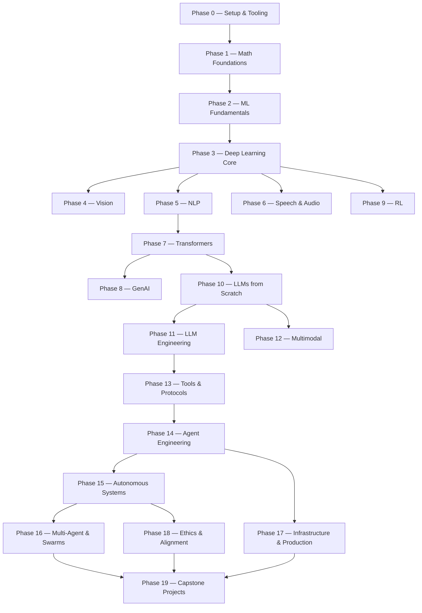

# AI Engineering from Scratch

import Card from '@site/src/components/Card/Card';
import CardGroup from '@site/src/components/Card/CardGroup';
import Accordion from '@site/src/components/Accordion/Accordion';
import AccordionGroup from '@site/src/components/Accordion/AccordionGroup';
import Steps from '@site/src/components/Steps/Steps';
import Step from '@site/src/components/Steps/Step';

## Summary

[AI Engineering from Scratch](https://github.com/rohitg00/ai-engineering-from-scratch) is an open-source curriculum that teaches AI engineering from first principles. Rather than just calling APIs, it builds every algorithm from raw math first — backpropagation, tokenizers, attention, agent loops — before reaching for frameworks. By the time PyTorch shows up, you already know what it's doing under the hood.

The result is **503 lessons across 20 phases**, approximately 320 hours of study, with implementations in Python, TypeScript, Rust, and Julia. Every lesson ships a reusable artifact: a prompt, a skill, an agent, or an MCP server.

:::info
[**84% of students already use AI tools. Only 18% feel prepared to use them professionally.**](https://github.com/rohitg00/ai-engineering-from-scratch) This curriculum closes that gap — learn it, build it, ship it.
:::

## How It Works

Most AI material teaches in scattered pieces: a paper here, a fine-tuning post there, a flashy agent demo somewhere else. The pieces rarely line up. This curriculum is the spine. Math is the floor. Agents and production are the roof.

Each lesson runs the same loop:

1. **Motto** — one-line core idea
2. **Problem** — concrete pain point
3. **Concept** — diagrams and intuition
4. **Build It** — raw math, no frameworks
5. **Use It** — same thing in PyTorch / sklearn
6. **Ship It** — prompt, skill, agent, or MCP server

## The 20 Phases



## Phase Breakdown

<AccordionGroup>
<Accordion title="Phase 0: Setup & Tooling — 12 lessons" icon="hammer-wrench">
Dev environment, Git, GPU/cloud setup, APIs, Jupyter, Python environments, Docker, editor config, data management, Linux, debugging and profiling.
</Accordion>

<Accordion title="Phase 1: Math Foundations — 22 lessons" icon="calculator">
Linear algebra, vectors, matrices, calculus, chain rule, probability, Bayes' theorem, gradient descent, information theory, PCA/t-SNE/UMAP, SVD, tensors, numerical stability, statistics, sampling, convex optimization, complex numbers, Fourier transform, graph theory.
</Accordion>

<Accordion title="Phase 2: ML Fundamentals — 18 lessons" icon="brain">
Machine learning basics, linear/logistic regression, decision trees, SVMs, KNN, unsupervised learning, feature engineering, model evaluation, bias-variance, ensemble methods, hyperparameter tuning, pipelines, time series, anomaly detection.
</Accordion>

<Accordion title="Phase 3: Deep Learning Core — 13 lessons" icon="cpu-64-bit">
Perceptrons, multi-layer networks, backpropagation from scratch, activation functions, loss functions, optimizers (SGD, Adam), regularization, weight initialization, learning rate schedules, mini framework, PyTorch, JAX.
</Accordion>

<Accordion title="Phases 4-6: Vision, NLP, Speech — 74 lessons" icon="eye">
Computer vision (CNNs, YOLO, U-Net, diffusion, ViT, CLIP, SAM), NLP (tokenization, embeddings, attention, transformers, RAG, evaluation), and speech/audio (ASR, Whisper, TTS, voice cloning, music generation).
</Accordion>

<Accordion title="Phases 7-10: Transformers, GenAI, LLMs — 60+ lessons" icon="robot">
The transformer architecture, generative AI, building LLMs from scratch (tokenization, pretraining, fine-tuning, RLHF, quantization), and LLM engineering (prompting, RAG, evaluation).
</Accordion>

<Accordion title="Phases 11-19: Agents & Production — 180+ lessons" icon="server-network">
Multimodal models, MCP protocol, tool use, agent engineering (ReAct, tool calling, memory), autonomous systems, multi-agent swarms, infrastructure (serving, observability, cost), ethics/alignment, and capstone projects.
</Accordion>
</AccordionGroup>

## What You Ship

<AccordionGroup>
<Accordion title="Reusable Artifacts" icon="package-variant">
Every lesson produces something you can actually use: prompts for AI assistants, skills that drop into agent frameworks, autonomous agent workers, or MCP servers for tool integration.
</Accordion>

<Accordion title="Six-Volume Book Series" icon="book-open-page-variant">
The entire curriculum compiles into EPUB and PDF volumes, built from the same lesson sources and attached to every GitHub release. Each volume covers a logical slice: foundations, deep learning, language, LLMs, agents, and production.
</Accordion>

<Accordion title="Built-in Agent Skills" icon="puzzle">
The curriculum includes interactive skills for AI coding assistants:
- **/find-your-level** — Ten-question placement quiz that maps your knowledge to a starting phase
- **/check-understanding** — Per-phase quiz with feedback and review suggestions
</Accordion>
</AccordionGroup>

## Getting Started

<Steps>
<Step title="Read">
Open any completed lesson on [aiengineeringfromscratch.com](https://aiengineeringfromscratch.com) — no setup required.
</Step>

<Step title="Clone and Run">
Clone the repo and run individual lessons directly:

```bash
git clone https://github.com/rohitg00/ai-engineering-from-scratch.git
cd ai-engineering-from-scratch
python phases/01-math-foundations/01-linear-algebra-intuition/code/vectors.py
```
</Step>

<Step title="Find Your Level">
Use the built-in placement quiz in any supported AI assistant to get a personalized learning path with hour estimates.
</Step>
</Steps>

:::tip
Install all skills at once with `python3 scripts/install_skills.py`. By the end of the curriculum, you have a portfolio of artifacts you actually understand because you built them.
:::

## Example: The Agent Loop

A worked example from Phase 14, lesson 1 — the core agent loop in ~120 lines of pure Python. `llm()` calls the model, `tools` is a map of function names to callables, and `StepLimitExceeded` is a safety bound on loop iterations:

```python
def run(query, tools):
    history = [user(query)]
    for step in range(MAX_STEPS):
        msg = llm(history)
        if msg.tool_calls:
            for call in msg.tool_calls:
                result = tools[call.name](**call.args)
                history.append(tool_result(call.id, result))
            continue
        return msg.content
    raise StepLimitExceeded
```

This same loop becomes a deployable skill, a reusable prompt, and a debugging agent — all from one lesson.

## References

<CardGroup cols={2}>
<Card title="GitHub Repository" href="https://github.com/rohitg00/ai-engineering-from-scratch">
Source code, lesson files, and book builds. MIT licensed, 43k+ stars.
</Card>

<Card title="Course Website" href="https://aiengineeringfromscratch.com">
Read completed lessons online — no setup required.
</Card>

<Card title="Roadmap" href="https://github.com/rohitg00/ai-engineering-from-scratch/blob/main/ROADMAP.md">
Full breakdown of all 503 lessons across 20 phases.
</Card>

<Card title="Book Downloads" href="https://github.com/rohitg00/ai-engineering-from-scratch/releases">
Six-volume EPUB/PDF series built from lesson sources, updated with each release.
</Card>
</CardGroup>
